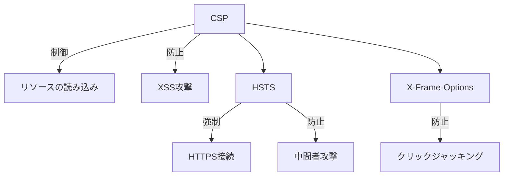
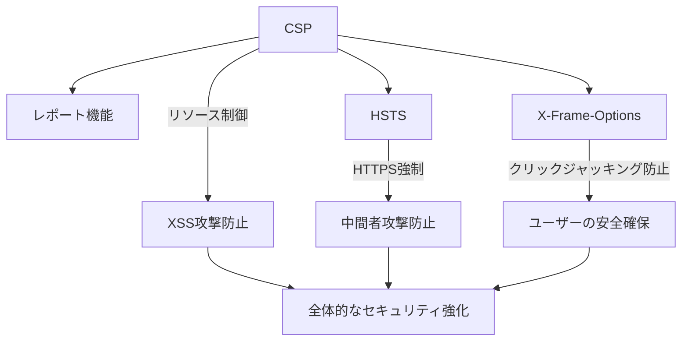

# CSP、HSTS、X-Frame-Options...現代Webに不可欠なセキュリティヘッダーを完全理解

## はじめに

現代のWebアプリケーションは、ユーザーのデータを保護し、悪意のある攻撃から防御するために、さまざまなセキュリティ対策を講じる必要があります。特に、HTTPヘッダーは非常に重要な役割を果たします。特に、Content Security Policy (CSP)、HTTP Strict Transport Security (HSTS)、X-Frame-Optionsなどのセキュリティヘッダーは、Webアプリケーションのセキュリティを強化するための基本的な手段です。本記事では、これらのセキュリティヘッダーの機能、設定方法、実践的な例、そしてそれぞれの利点と欠点について詳しく解説します。

以下のダイアグラムは、CSP、HSTS、X-Frame-Optionsの関係性を示しています。これにより、各ヘッダーがどのように相互作用し、全体的なセキュリティを強化するかを視覚的に理解できます。



このダイアグラムは、CSPがリソースの読み込みを制御し、XSS攻撃を防ぐ役割を果たすことを示しています。また、HSTSはHTTPS接続を強制し、中間者攻撃を防ぎ、X-Frame-Optionsはクリックジャッキングを防ぐために使用されることを示しています。

## 1. Content Security Policy (CSP)

### 1.1 CSPの概要

Content Security Policy (CSP)は、Webページがどのリソースを読み込むことができるかを制御するためのセキュリティ機能です。CSPを使用することで、クロスサイトスクリプティング（XSS）やデータインジェクション攻撃を防ぐことができます。CSPは、HTTPレスポンスヘッダーとして設定され、ブラウザに対してリソースの読み込みを制限する指示を与えます。

CSPは、特に動的に生成されるコンテンツを持つWebアプリケーションにおいて、非常に重要です。悪意のあるスクリプトがページに埋め込まれることを防ぐため、CSPは開発者にとって強力なツールとなります。CSPは、特定のリソースの読み込みを許可または拒否することで、攻撃者が悪意のあるコードを実行するリスクを大幅に減少させます。

### 1.2 CSPの基本的な構文

CSPは、ポリシーを定義するためのディレクティブの集合で構成されています。以下は、CSPの基本的な構文の例です。

```http
Content-Security-Policy: default-src 'self'; img-src https://example.com; script-src 'self' 'unsafe-inline'
```

この例では、以下のポリシーが設定されています：

- `default-src 'self'`: デフォルトでは、同一オリジンからのリソースのみを許可します。これにより、外部のリソースが読み込まれることを防ぎます。
- `img-src https://example.com`: 画像は、`https://example.com`からのみ読み込むことができます。これにより、信頼できるソースからの画像のみが表示されます。
- `script-src 'self' 'unsafe-inline'`: スクリプトは、同一オリジンからのものとインラインスクリプトを許可します。インラインスクリプトを許可することはセキュリティリスクを伴うため、可能であれば外部スクリプトを使用することが推奨されます。

### 1.3 CSPの利点と欠点

#### 利点

- **XSS攻撃の防止**: CSPは、悪意のあるスクリプトの実行を防ぐため、XSS攻撃に対する強力な防御手段となります。特に、ユーザーが入力したデータを表示する場合、CSPを適用することで、悪意のあるコードが実行されるリスクを大幅に減少させることができます。

- **リソースの制御**: 開発者は、どのリソースが読み込まれるかを細かく制御できるため、セキュリティが向上します。これにより、信頼できない外部リソースからの攻撃を防ぐことができます。

- **レポート機能**: CSPには、ポリシー違反が発生した場合にレポートを送信する機能があります。これにより、開発者は潜在的な攻撃を特定し、対策を講じることができます。レポートは、指定されたエンドポイントに送信され、開発者はこれを分析してセキュリティを強化できます。

#### 欠点

- **設定の複雑さ**: CSPの設定は複雑であり、誤った設定がリソースの読み込みを妨げる可能性があります。特に、動的に生成されるコンテンツを持つアプリケーションでは、適切なポリシーを設定することが難しい場合があります。

- **互換性の問題**: 一部の古いブラウザではCSPがサポートされていないため、全てのユーザーに対して同じセキュリティを提供できない場合があります。特に、企業環境では古いブラウザが使用されることが多いため、注意が必要です。

### 1.4 実践的な例

以下は、CSPを設定するための実践的な例です。HTMLの`<head>`セクションにCSPを追加する方法を示します。

```html
<head>
    <meta http-equiv="Content-Security-Policy" content="default-src 'self'; img-src https://example.com; script-src 'self' 'unsafe-inline'">
</head>
```

この設定により、指定されたポリシーに従ってリソースが読み込まれます。特に、`'unsafe-inline'`を使用する場合は、インラインスクリプトが許可されるため、注意が必要です。可能であれば、インラインスクリプトを避け、外部スクリプトを使用することが推奨されます。

## 2. HTTP Strict Transport Security (HSTS)

### 2.1 HSTSの概要

HTTP Strict Transport Security (HSTS)は、WebサイトがHTTPSを使用することを強制するためのセキュリティ機能です。HSTSを有効にすると、ブラウザはそのサイトへのすべてのリクエストをHTTPSにリダイレクトします。これにより、中間者攻撃（MITM）を防ぎ、通信の安全性を確保します。

HSTSは、特にセキュリティが重要なWebサイト（例えば、オンラインバンキングやEコマースサイト）において、必須のセキュリティ対策とされています。HSTSを適用することで、ユーザーは常に安全な接続を確保でき、データの盗聴や改ざんを防ぐことができます。

### 2.2 HSTSの基本的な構文

HSTSは、HTTPレスポンスヘッダーとして設定されます。以下は、HSTSの基本的な構文の例です。

```http
Strict-Transport-Security: max-age=31536000; includeSubDomains
```

この例では、以下のポリシーが設定されています：

- `max-age=31536000`: HSTSの有効期限を31536000秒（1年）に設定します。この期間中、ブラウザはHTTPSを強制します。ユーザーが一度でもHTTPSでアクセスした場合、その後のすべてのリクエストはHTTPSにリダイレクトされます。
- `includeSubDomains`: サイトのすべてのサブドメインにもHSTSを適用します。これにより、サブドメインに対する攻撃も防ぐことができます。

### 2.3 HSTSの利点と欠点

#### 利点

- **通信の安全性**: HSTSを使用することで、すべての通信がHTTPSで行われるため、データの盗聴や改ざんを防ぐことができます。特に、公共のWi-Fiネットワークを使用する際には、HSTSが重要です。

- **中間者攻撃の防止**: HSTSは、中間者攻撃を防ぐための強力な手段です。攻撃者がHTTPトラフィックを傍受しても、HSTSが有効であれば、HTTPSにリダイレクトされるため、攻撃が成功する可能性が低くなります。

#### 欠点

- **設定の誤り**: HSTSを誤って設定すると、サイトがHTTPSにアクセスできなくなる可能性があります。特に、テスト環境でHSTSを有効にすると、問題が発生することがあります。

- **キャッシュの影響**: HSTSの設定がキャッシュされるため、設定を変更する際には注意が必要です。特に、`max-age`の値を短く設定することが推奨されます。設定を変更した場合、ブラウザのキャッシュをクリアする必要があるかもしれません。

### 2.4 実践的な例

以下は、HSTSを設定するための実践的な例です。Webサーバーの設定ファイルにHSTSを追加する方法を示します。

```apache
# Apacheの設定例
Header always set Strict-Transport-Security "max-age=31536000; includeSubDomains"
```

この設定により、指定されたポリシーに従ってHSTSが適用されます。Nginxの場合は、以下のように設定します。

```nginx
# Nginxの設定例
add_header Strict-Transport-Security "max-age=31536000; includeSubDomains" always;
```

## 3. X-Frame-Options

### 3.1 X-Frame-Optionsの概要

X-Frame-Optionsは、Webページが他のページに埋め込まれることを制御するためのHTTPレスポンスヘッダーです。このヘッダーを使用することで、クリックジャッキング攻撃を防ぐことができます。クリックジャッキングとは、ユーザーが意図しない操作を行うように誘導する攻撃手法です。

X-Frame-Optionsは、特にログインページや重要な操作を行うページにおいて、ユーザーの安全を守るために重要です。攻撃者は、正規のWebサイトを偽装したページを作成し、ユーザーにそのページをクリックさせることで、意図しない操作を行わせることができます。

### 3.2 X-Frame-Optionsの基本的な構文

X-Frame-Optionsは、以下の3つの値を持つことができます：

- `DENY`: ページは他のページに埋め込むことができません。
- `SAMEORIGIN`: 同一オリジンからのリクエストのみが許可されます。これにより、同じドメイン内のページからの埋め込みは許可されますが、外部サイトからの埋め込みは拒否されます。
- `ALLOW-FROM uri`: 指定されたURIからのリクエストのみが許可されます（ただし、現在のブラウザではサポートされていない場合があります）。

以下は、X-Frame-Optionsの基本的な構文の例です。

```http
X-Frame-Options: DENY
```

### 3.3 X-Frame-Optionsの利点と欠点

#### 利点

- **クリックジャッキングの防止**: X-Frame-Optionsを使用することで、クリックジャッキング攻撃を効果的に防ぐことができます。特に、ユーザーが重要な操作を行うページでは、X-Frame-Optionsを設定することが推奨されます。

- **簡単な設定**: X-Frame-Optionsは、簡単に設定できるため、すぐに導入できます。特に、既存のWebアプリケーションに対しても簡単に追加できます。

#### 欠点

- **柔軟性の欠如**: X-Frame-Optionsは、細かい制御ができないため、特定のケースでの柔軟性が欠けることがあります。特に、特定のドメインからの埋め込みを許可したい場合には、他の手段を検討する必要があります。

- **古いブラウザのサポート**: 一部の古いブラウザではX-Frame-Optionsがサポートされていないため、全てのユーザーに対して同じセキュリティを提供できない場合があります。

### 3.4 実践的な例

以下は、X-Frame-Optionsを設定するための実践的な例です。Webサーバーの設定ファイルにX-Frame-Optionsを追加する方法を示します。

```apache
# Apacheの設定例
Header always set X-Frame-Options "DENY"
```

この設定により、指定されたポリシーに従ってX-Frame-Optionsが適用されます。Nginxの場合は、以下のように設定します。

```nginx
# Nginxの設定例
add_header X-Frame-Options "DENY";
```

## 4. これらのヘッダーの組み合わせ

### 4.1 セキュリティの強化

CSP、HSTS、X-Frame-Optionsを組み合わせて使用することで、Webアプリケーションのセキュリティを大幅に強化できます。これらのヘッダーは、異なる攻撃ベクトルに対する防御手段を提供するため、併用することでより堅牢なセキュリティを実現できます。

以下のダイアグラムは、CSP、HSTS、X-Frame-Optionsの組み合わせによるセキュリティ強化の流れを示しています。



このダイアグラムは、CSPがリソースの制御を行い、XSS攻撃を防ぐこと、HSTSがHTTPS接続を強制し中間者攻撃を防ぐこと、X-Frame-Optionsがクリックジャッキングを防ぐことを示しています。これらの要素が組み合わさることで、全体的なセキュリティが強化されることが視覚的に表現されています。

### 4.2 実践的な設定例

以下は、CSP、HSTS、X-Frame-Optionsを同時に設定するための実践的な例です。

```http
Content-Security-Policy: default-src 'self'; img-src https://example.com; script-src 'self' 'unsafe-inline'
Strict-Transport-Security: max-age=31536000; includeSubDomains
X-Frame-Options: DENY
```

この設定により、すべてのポリシーが同時に適用され、Webアプリケーションのセキュリティが強化されます。

## 5. まとめ

現代のWebアプリケーションにおいて、CSP、HSTS、X-Frame-Optionsは不可欠なセキュリティヘッダーです。これらのヘッダーを適切に設定することで、XSS攻撃、MITM攻撃、クリックジャッキング攻撃などの脅威からユーザーを保護することができます。セキュリティは常に進化しているため、最新の情報を常に把握し、適切な対策を講じることが重要です。

これらのヘッダーを実装する際には、設定の複雑さや互換性の問題に注意し、テストを行うことが推奨されます。最終的には、これらのセキュリティヘッダーを組み合わせて使用することで、より強固なセキュリティを実現することができます。

## 参考文献

- [Content Security Policy (CSP) - MDN Web Docs](https://developer.mozilla.org/en-US/docs/Web/HTTP/CSP)
- [HTTP Strict Transport Security (HSTS) - MDN Web Docs](https://developer.mozilla.org/en-US/docs/Web/HTTP/Headers/Strict-Transport-Security)
- [X-Frame-Options - MDN Web Docs](https://developer.mozilla.org/en-US/docs/Web/HTTP/Headers/X-Frame-Options)

-----

※本記事は生成AIを使用して作成されました。正確かつ最新の情報については、信頼できる専門的な情報源や公式ドキュメントをご確認ください。
AI言語モデル: gpt-4o-mini