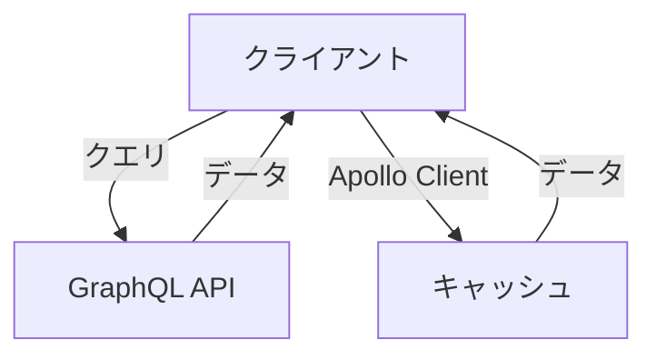
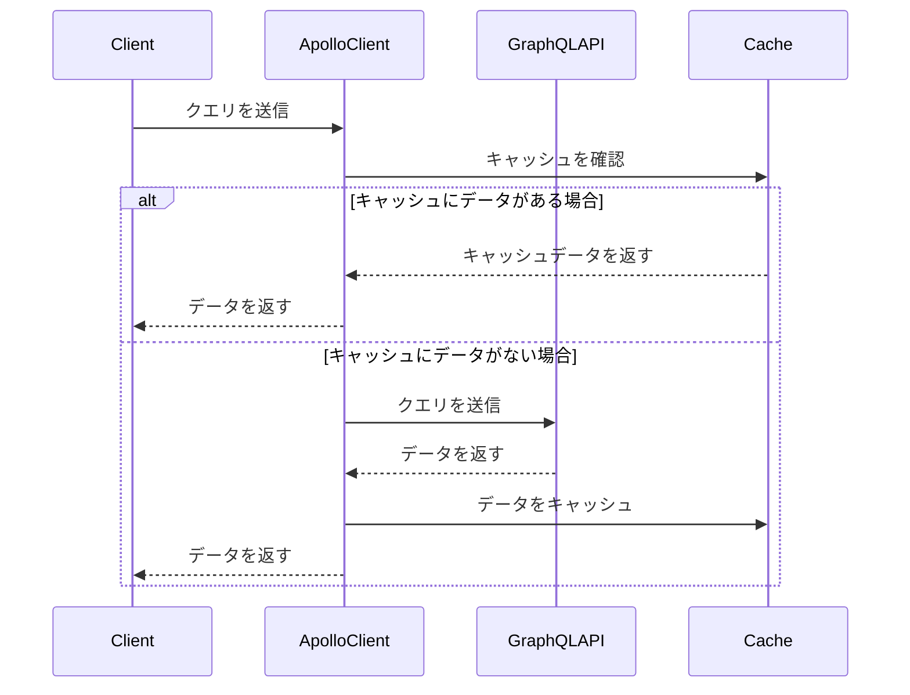

# Apollo Clientで挑むGraphQL実装：初心者でもわかる0から100までのガイド

## はじめに

GraphQLは、APIのデータ取得において非常に強力なツールです。従来のREST APIと比較して、クライアントが必要なデータを正確に要求できるため、効率的なデータ取得が可能です。Apollo Clientは、GraphQLを使用するための人気のあるライブラリであり、ReactやVueなどのフロントエンドフレームワークと簡単に統合できます。本記事では、Apollo Clientを使用してGraphQLを実装する方法を、初心者向けに詳しく解説します。

以下のダイアグラムは、GraphQLとApollo Clientの基本的な関係を示しています。GraphQLがどのようにデータを取得し、Apollo Clientがそのデータをどのように管理するかを視覚的に表現しています。



このダイアグラムは、クライアントがGraphQL APIにクエリを送信し、データを取得する流れを示しています。また、Apollo Clientがキャッシュを使用してデータを管理する様子も表現しています。

## 1. GraphQLとは？

### 1.1 GraphQLの基本概念

GraphQLは、Facebookによって開発されたクエリ言語であり、APIのデータ取得を効率化するための仕様です。GraphQLの主な特徴は以下の通りです。

- **クライアント主導のデータ取得**: クライアントは必要なデータを正確に指定できるため、過剰なデータ取得を防ぎます。これにより、ネットワークの負荷が軽減され、アプリケーションのパフォーマンスが向上します。
- **単一エンドポイント**: REST APIのように複数のエンドポイントを持つのではなく、単一のエンドポイントで全てのデータを取得できます。これにより、APIの設計がシンプルになり、メンテナンスが容易になります。
- **型システム**: GraphQLは強い型システムを持ち、スキーマを定義することで、データの構造を明確にします。これにより、開発者はデータの整合性を保ちながら、APIを利用することができます。

### 1.2 GraphQLの利点

GraphQLを使用することには多くの利点があります。

- **効率的なデータ取得**: 必要なデータだけを取得できるため、ネットワークの負荷が軽減されます。これにより、特にモバイルアプリケーションや低帯域幅の環境でのパフォーマンスが向上します。
- **柔軟性**: クライアントが必要なデータを自由に要求できるため、フロントエンドの要件に応じた柔軟なデータ取得が可能です。これにより、開発者は新しい機能を迅速に実装できます。
- **開発の迅速化**: フロントエンドとバックエンドの開発が独立して行えるため、開発のスピードが向上します。これにより、チームはより迅速に市場に製品を投入できます。

## 2. Apollo Clientとは？

### 2.1 Apollo Clientの概要

Apollo Clientは、GraphQLを使用するための強力なライブラリで、React、Vue、Angularなどのフロントエンドフレームワークと簡単に統合できます。Apollo Clientは、データの取得、キャッシング、更新を簡単に行うための機能を提供します。

### 2.2 Apollo Clientの主な機能

- **データフェッチング**: GraphQLクエリを使用してデータを取得します。Apollo Clientは、クエリの実行を簡素化し、結果をコンポーネントにバインドするためのフックを提供します。
- **キャッシング**: 取得したデータをキャッシュし、再利用することでパフォーマンスを向上させます。Apollo Clientは、デフォルトでInMemoryCacheを使用し、クエリの結果を自動的にキャッシュします。
- **状態管理**: Apollo Clientは、アプリケーションの状態を管理するための機能も提供します。これにより、ReduxやMobXなどの外部ライブラリを使用せずに、アプリケーションの状態を管理できます。

## 3. Apollo Clientのセットアップ

### 3.1 プロジェクトの作成

まず、Reactプロジェクトを作成します。以下のコマンドを実行して、Create React Appを使用して新しいプロジェクトを作成します。

```bash
npx create-react-app my-apollo-app
cd my-apollo-app
```

### 3.2 Apollo Clientのインストール

次に、Apollo ClientとGraphQLをインストールします。以下のコマンドを実行します。

```bash
npm install @apollo/client graphql
```

### 3.3 Apollo Clientの初期設定

Apollo Clientを初期化するために、`src/index.js`ファイルを以下のように編集します。

```javascript
import React from 'react';
import ReactDOM from 'react-dom';
import { ApolloClient, InMemoryCache, ApolloProvider } from '@apollo/client';
import App from './App';

const client = new ApolloClient({
  uri: 'https://your-graphql-endpoint.com/graphql',
  cache: new InMemoryCache(),
});

ReactDOM.render(
  <ApolloProvider client={client}>
    <App />
  </ApolloProvider>,
  document.getElementById('root')
);
```

ここで、`uri`にはGraphQLエンドポイントのURLを指定します。この設定により、Apollo Clientは指定されたエンドポイントに対してクエリを送信できるようになります。

## 4. GraphQLクエリの作成

### 4.1 クエリの定義

GraphQLクエリを定義するために、`src/queries.js`というファイルを作成し、以下のように記述します。

```javascript
import { gql } from '@apollo/client';

export const GET_ITEMS = gql`
  query GetItems {
    items {
      id
      name
      description
    }
  }
`;
```

このクエリは、`items`というフィールドから`id`、`name`、`description`を取得します。GraphQLのクエリは、必要なデータの構造を明確に定義するため、APIの利用が直感的になります。

### 4.2 クエリの実行

次に、クエリを実行するために、`src/App.js`を以下のように編集します。

```javascript
import React from 'react';
import { useQuery } from '@apollo/client';
import { GET_ITEMS } from './queries';

function App() {
  const { loading, error, data } = useQuery(GET_ITEMS);

  if (loading) return <p>Loading...</p>;
  if (error) return <p>Error: {error.message}</p>;

  return (
    <div>
      <h1>Items</h1>
      <ul>
        {data.items.map(item => (
          <li key={item.id}>
            <h2>{item.name}</h2>
            <p>{item.description}</p>
          </li>
        ))}
      </ul>
    </div>
  );
}

export default App;
```

このコードでは、`useQuery`フックを使用して、`GET_ITEMS`クエリを実行し、取得したデータを表示しています。`loading`、`error`、`data`の状態を管理することで、ユーザーに対して適切なフィードバックを提供します。

## 5. Apollo Clientのキャッシング

### 5.1 キャッシュの基本

Apollo Clientは、デフォルトでInMemoryCacheを使用してデータをキャッシュします。これにより、同じクエリを再度実行した際に、ネットワークを介さずにキャッシュからデータを取得できます。キャッシュは、アプリケーションのパフォーマンスを向上させるための重要な要素です。

### 5.2 キャッシュの更新

データを更新する場合、Apollo Clientはキャッシュを自動的に更新しますが、手動で更新することも可能です。以下のように、`useMutation`フックを使用してデータを更新することができます。

```javascript
import { useMutation } from '@apollo/client';
import { ADD_ITEM } from './mutations';

function AddItem() {
  const [addItem] = useMutation(ADD_ITEM, {
    update(cache, { data: { addItem } }) {
      const { items } = cache.readQuery({ query: GET_ITEMS });
      cache.writeQuery({
        query: GET_ITEMS,
        data: { items: items.concat([addItem]) },
      });
    },
  });

  // 追加のロジック...
}
```

このコードでは、`ADD_ITEM`ミューテーションを実行した後、キャッシュを手動で更新しています。これにより、最新のデータが表示されるようになります。

## 6. Apollo Clientの状態管理

### 6.1 状態管理の必要性

Apollo Clientは、データの取得だけでなく、アプリケーションの状態管理にも利用できます。これにより、状態管理ライブラリ（Reduxなど）を使用せずに、アプリケーションの状態を管理できます。特に、GraphQLを使用する場合、データの取得と状態管理を統一することができ、開発が効率化されます。

### 6.2 状態管理の実装

Apollo Clientを使用して状態を管理するためには、`useReactiveVar`フックを使用します。以下のように、状態を定義し、管理することができます。

```javascript
import { makeVar, useReactiveVar } from '@apollo/client';

const cartItemsVar = makeVar([]);

function Cart() {
  const cartItems = useReactiveVar(cartItemsVar);

  const addToCart = (item) => {
    cartItemsVar([...cartItems, item]);
  };

  return (
    <div>
      <h1>Cart</h1>
      <ul>
        {cartItems.map(item => (
          <li key={item.id}>{item.name}</li>
        ))}
      </ul>
    </div>
  );
}
```

このコードでは、`cartItemsVar`というリアクティブ変数を定義し、カートのアイテムを管理しています。`useReactiveVar`フックを使用することで、状態が変更されるたびにコンポーネントが再レンダリングされます。

## 7. Apollo Clientのエラーハンドリング

### 7.1 エラーハンドリングの重要性

APIとの通信において、エラーハンドリングは非常に重要です。Apollo Clientでは、エラーを簡単にキャッチし、適切に処理することができます。エラーハンドリングを適切に行うことで、ユーザーに対して良好な体験を提供できます。

### 7.2 エラーハンドリングの実装

以下のように、`useQuery`フックを使用してエラーを処理することができます。

```javascript
const { loading, error, data } = useQuery(GET_ITEMS);

if (error) {
  console.error("Error fetching data:", error);
  return <p>Error: {error.message}</p>;
}
```

このコードでは、エラーが発生した場合にエラーメッセージを表示しています。エラーの詳細をコンソールに出力することで、デバッグが容易になります。

## 8. Apollo Clientの最適化

### 8.1 パフォーマンスの最適化

Apollo Clientを使用する際には、パフォーマンスを最適化するためのいくつかのテクニックがあります。

- **クエリの最適化**: 不要なデータを取得しないように、クエリを最適化します。必要なフィールドだけを指定することで、データの転送量を削減できます。
- **キャッシュの利用**: キャッシュを適切に利用し、再度同じデータを取得する際にはキャッシュから取得します。これにより、ネットワークの負荷が軽減され、アプリケーションの応答性が向上します。

### 8.2 バッチリクエスト

Apollo Clientでは、複数のクエリをバッチリクエストとして送信することができます。これにより、ネットワークの負荷を軽減できます。バッチリクエストを使用することで、複数のクエリを一度に送信し、応答を一度に受け取ることができます。

```javascript
import { useLazyQuery } from '@apollo/client';

const [fetchItems, { loading, data }] = useLazyQuery(GET_ITEMS);
```

このコードでは、`useLazyQuery`フックを使用して、必要なときにクエリを実行することができます。これにより、初期ロード時のパフォーマンスが向上します。

## 9. Apollo Clientのテスト

### 9.1 テストの重要性

アプリケーションの品質を保つためには、テストが不可欠です。Apollo Clientを使用したアプリケーションも、適切にテストを行う必要があります。テストを行うことで、バグを早期に発見し、アプリケーションの信頼性を向上させることができます。

### 9.2 テストの実装

Apollo Clientを使用したコンポーネントのテストは、`@apollo/client/testing`パッケージを使用して行います。以下のように、テストを実装します。

```javascript
import { MockedProvider } from '@apollo/client/testing';
import { render, screen } from '@testing-library/react';
import App from './App';
import { GET_ITEMS } from './queries';

const mocks = [
  {
    request: {
      query: GET_ITEMS,
    },
    result: {
      data: {
        items: [{ id: '1', name: 'Item 1', description: 'Description 1' }],
      },
    },
  },
];

test('renders items', async () => {
  render(
    <MockedProvider mocks={mocks} addTypename={false}>
      <App />
    </MockedProvider>
  );

  expect(await screen.findByText('Item 1')).toBeInTheDocument();
});
```

このテストでは、`MockedProvider`を使用して、Apollo Clientのモックを作成し、`GET_ITEMS`クエリの結果をシミュレートしています。これにより、実際のAPIに依存せずにコンポーネントのテストを行うことができます。

## 10. まとめ

本記事では、Apollo Clientを使用してGraphQLを実装する方法を初心者向けに解説しました。GraphQLの基本概念から始まり、Apollo Clientのセットアップ、クエリの実行、キャッシング、状態管理、エラーハンドリング、最適化、テストまで、幅広いトピックをカバーしました。これらの知識を活用して、効率的で柔軟なデータ取得を実現するアプリケーションを構築してみてください。

以下のダイアグラムは、Apollo Clientの全体的なフローを示しています。クライアントがどのようにデータを取得し、キャッシュを利用し、エラーハンドリングを行うかを視覚的に表現しています。



このシーケンス図は、クライアントがApollo Clientを介してGraphQL APIにクエリを送信し、キャッシュを利用してデータを取得する流れを示しています。キャッシュにデータがある場合は、APIにリクエストを送信せずにキャッシュからデータを取得します。キャッシュにデータがない場合は、APIにリクエストを送信し、取得したデータをキャッシュに保存します。

さらに学習を進めるためのリソースとして、以下のリンクを参考にしてください。

- [Apollo Client Documentation](https://www.apollographql.com/docs/react/)
- [GraphQL Official Documentation](https://graphql.org/learn/)

-----

※本記事は生成AIを使用して作成されました。正確かつ最新の情報については、信頼できる専門的な情報源や公式ドキュメントをご確認ください。
AI言語モデル: gpt-4o-mini