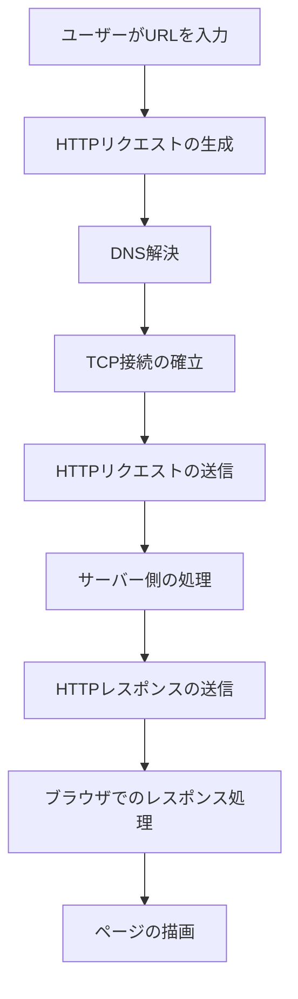
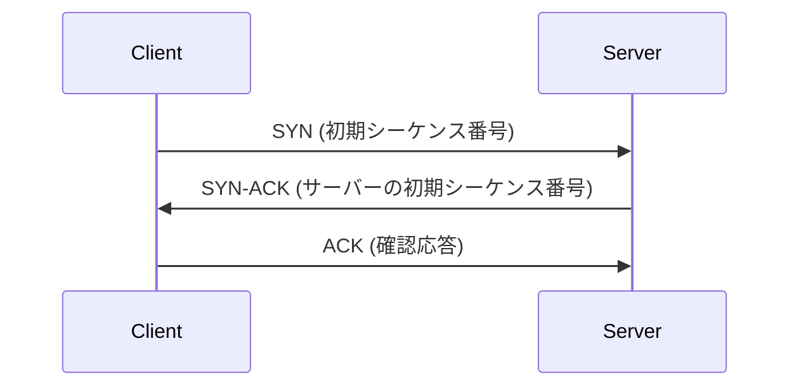
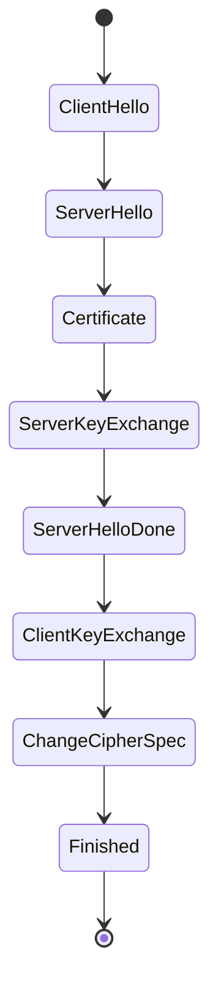

# Webブラウザからリクエストを送ってWebサーバーに到達して再びWebブラウザで描画されるまで裏側で行われている全て

## はじめに

インターネットの普及に伴い、Webブラウザは私たちの日常生活に欠かせないツールとなりました。Webブラウザは、ユーザーがWebページを閲覧するためのインターフェースを提供するだけでなく、背後で複雑なプロセスを実行しています。本記事では、Webブラウザからリクエストを送信し、Webサーバーに到達し、再びWebブラウザで描画されるまでの一連の流れを詳細に解説します。このプロセスを理解することで、Web技術の基礎を深め、より効果的にWeb開発やトラブルシューティングを行うことができるようになります。

以下のダイアグラムは、Webブラウザからリクエストが送信され、サーバーに到達し、レスポンスが返されるまでの全体的な流れを示しています。



このフローチャートは、Webブラウザがどのようにしてユーザーのリクエストを処理し、最終的にWebページを描画するかの全体的な流れを視覚的に表現しています。

## 1. Webブラウザの役割

Webブラウザは、ユーザーがインターネット上の情報にアクセスするためのアプリケーションです。主な役割は、HTML、CSS、JavaScriptなどのWeb技術を解釈し、ユーザーに視覚的に表示することです。代表的なWebブラウザには、Google Chrome、Mozilla Firefox、Microsoft Edge、Safariなどがあります。

### 1.1 Webブラウザの基本機能

- **URLの入力**: ユーザーがアドレスバーにURLを入力することで、特定のWebページにアクセスします。URLは、Uniform Resource Locatorの略で、インターネット上のリソースの位置を示すための標準的な形式です。URLの構成要素には、スキーム、ホスト名、ポート番号、パス、クエリ文字列が含まれます。

- **リクエストの送信**: ブラウザは、指定されたURLに基づいてHTTPリクエストを生成し、Webサーバーに送信します。このリクエストには、リクエストメソッド、ヘッダー、ボディが含まれます。リクエストメソッドには、GET、POST、PUT、DELETEなどがあり、それぞれ異なる目的で使用されます。

- **レスポンスの受信**: サーバーからのHTTPレスポンスを受け取り、内容を解析します。レスポンスには、ステータスコード、ヘッダー、ボディが含まれ、これによりブラウザはリクエストが成功したかどうかを判断します。例えば、ステータスコード200は成功を示し、404はリソースが見つからないことを示します。

- **描画**: 受け取ったデータをもとにWebページを描画し、ユーザーに表示します。描画プロセスには、DOMの構築、CSSの適用、JavaScriptの実行が含まれます。これにより、ユーザーはインタラクティブなWeb体験を享受できます。

## 2. HTTPリクエストの生成

WebブラウザがURLを入力された際、最初に行うのはHTTPリクエストの生成です。HTTP（Hypertext Transfer Protocol）は、Web上でデータを送受信するためのプロトコルです。

### 2.1 URLの解析

URLは、リソースの位置を示すための文字列で、以下の構成要素から成り立っています。

- **スキーム**: 通常は「http」または「https」で、通信プロトコルを示します。HTTPSは、HTTPにSSL/TLSを組み合わせたもので、データの暗号化を提供します。これにより、ユーザーのプライバシーが保護されます。

- **ホスト名**: サーバーのドメイン名またはIPアドレスです。ドメイン名は、ユーザーが覚えやすい形式でリソースにアクセスするための名前です。例えば、`www.example.com`がホスト名です。

- **ポート番号**: 通常は省略されますが、特定のポートを指定することもできます（例: `:80`はHTTP、`:443`はHTTPS）。ポート番号は、サーバー上で実行されている特定のサービスを識別するために使用されます。

- **パス**: サーバー上のリソースの位置を示します。例えば、`/path/to/resource`は、特定のリソースへのパスを示します。

- **クエリ文字列**: リソースに渡すパラメータを含むことができます。クエリ文字列は、`?`の後に続く部分で、複数のパラメータは`&`で区切られます。例えば、`?query=parameter`は、`query`というパラメータに`parameter`という値を渡すことを示します。

例: `https://www.example.com:443/path/to/resource?query=parameter`

### 2.2 HTTPメソッド

HTTPリクエストは、特定のメソッドを使用して送信されます。主なHTTPメソッドには以下があります。

- **GET**: リソースの取得を要求します。URLにデータを含めることができ、主にデータの取得に使用されます。GETリクエストは、サーバーの状態を変更しないため、安全なメソッドと見なされます。

- **POST**: サーバーにデータを送信します。フォームデータやファイルのアップロードに使用され、リクエストボディにデータを含めます。POSTリクエストは、サーバーの状態を変更する可能性があるため、安全ではありません。

- **PUT**: リソースの更新を要求します。指定されたリソースを新しいデータで置き換えます。PUTリクエストは、リソースの作成にも使用されることがあります。

- **DELETE**: リソースの削除を要求します。指定されたリソースをサーバーから削除します。DELETEリクエストも、サーバーの状態を変更するため、安全ではありません。

### 2.3 ヘッダーの設定

HTTPリクエストには、リクエストヘッダーが含まれます。これにより、ブラウザやクライアントの情報、受け入れ可能なコンテンツタイプ、キャッシュ制御などがサーバーに伝えられます。

```http
GET /path/to/resource HTTP/1.1
Host: www.example.com
User-Agent: Mozilla/5.0 (Windows NT 10.0; Win64; x64) AppleWebKit/537.36 (KHTML, like Gecko) Chrome/91.0.4472.124 Safari/537.36
Accept: text/html,application/xhtml+xml,application/xml;q=0.9,image/webp,*/*;q=0.8
```

- **User-Agent**: ブラウザやオペレーティングシステムの情報を示します。サーバーはこれを使用して、適切なコンテンツを返すことができます。例えば、モバイルデバイス向けのコンテンツを提供するために、User-Agentを解析することがあります。

- **Accept**: クライアントが受け入れ可能なコンテンツタイプを示します。これにより、サーバーは適切な形式でレスポンスを返すことができます。例えば、`text/html`はHTML形式、`application/json`はJSON形式を示します。

## 3. DNS解決

HTTPリクエストが生成された後、次に行われるのはDNS（Domain Name System）解決です。DNSは、ドメイン名をIPアドレスに変換する役割を果たします。

### 3.1 DNSの仕組み

1. **リクエストの送信**: ブラウザは、指定されたホスト名に対してDNSリクエストを送信します。このリクエストは、通常、DNSサーバーに送信されます。DNSサーバーは、インターネット上のドメイン名とIPアドレスのマッピングを管理しています。

2. **DNSサーバーの応答**: DNSサーバーは、ホスト名に対応するIPアドレスを返します。これにより、ブラウザはサーバーの位置を特定できます。DNSサーバーは、階層的に構成されており、ルートDNSサーバーから始まり、各ドメインの権威DNSサーバーに至ります。

3. **キャッシュの利用**: ブラウザやOSは、以前に解決したDNS情報をキャッシュしており、再度同じリクエストがあった場合はキャッシュを利用します。これにより、DNS解決の時間を短縮できます。キャッシュの有効期限は、DNSレコードのTTL（Time to Live）によって決まります。

### 3.2 DNSの種類

- **Aレコード**: ドメイン名をIPv4アドレスにマッピングします。例えば、`example.com`が`192.0.2.1`にマッピングされる場合です。

- **AAAAレコード**: ドメイン名をIPv6アドレスにマッピングします。IPv6は、より多くのアドレスを提供するために設計された新しいプロトコルです。

- **CNAMEレコード**: 別のドメイン名にエイリアスを作成します。これにより、複数のドメイン名が同じIPアドレスにマッピングされることが可能になります。例えば、`www.example.com`が`example.com`にリダイレクトされる場合です。

## 4. TCP接続の確立

DNS解決が完了した後、ブラウザはWebサーバーとのTCP接続を確立します。TCP（Transmission Control Protocol）は、信頼性の高いデータ転送を提供するためのプロトコルです。

### 4.1 TCPの3ウェイハンドシェイク

TCP接続は、以下の3つのステップで確立されます。

1. **SYN**: クライアントがサーバーに接続要求を送信します。このパケットには、初期シーケンス番号が含まれます。これにより、データの順序を管理することができます。

2. **SYN-ACK**: サーバーが接続要求を受け入れ、応答を返します。この応答には、サーバーの初期シーケンス番号と、クライアントの接続要求に対する確認応答が含まれます。

3. **ACK**: クライアントがサーバーの応答を確認し、接続が確立されます。この時点で、データの送受信が可能になります。TCPは、データの信頼性を確保するために、確認応答を使用してデータの受信を確認します。

以下のシーケンス図は、TCP接続の3ウェイハンドシェイクの流れを示しています。



このシーケンス図は、クライアントとサーバー間でのTCP接続の確立プロセスを視覚的に表現しています。

### 4.2 ポート番号

Webサーバーは通常、HTTPの場合はポート80、HTTPSの場合はポート443を使用します。これにより、ブラウザは正しいサービスに接続できます。ポート番号は、サーバー上で実行されている特定のサービスを識別するために使用されます。ポート番号は、サーバーの設定によって変更されることもあります。

## 5. HTTPリクエストの送信

TCP接続が確立された後、ブラウザはHTTPリクエストをサーバーに送信します。このリクエストには、先に説明したヘッダー情報やリクエストボディが含まれます。

### 5.1 リクエストの送信プロセス

1. **データの分割**: 大きなリクエストは、TCPセグメントに分割されます。TCPは、データを小さなパケットに分割し、順序を保持して送信します。これにより、ネットワークの効率が向上します。

2. **送信**: 各セグメントがサーバーに送信されます。TCPは、送信したデータが正しく受信されたかどうかを確認するための確認応答を使用します。これにより、データの損失を防ぎます。

3. **確認応答**: サーバーは受信したセグメントに対して確認応答を返します。これにより、クライアントはデータが正しく送信されたことを確認できます。確認応答が受信されない場合、TCPは再送信を行います。

## 6. サーバー側の処理

サーバーは、受信したHTTPリクエストを処理し、適切なレスポンスを生成します。

### 6.1 リクエストの解析

サーバーは、リクエストメソッド、パス、ヘッダーを解析し、どのリソースを返すべきかを判断します。リクエストメソッドによって、サーバーはどのようなアクションを実行するかを決定します。例えば、GETメソッドの場合はリソースの取得、POSTメソッドの場合はデータの保存を行います。

### 6.2 リソースの取得

リクエストされたリソースがデータベースやファイルシステムに存在する場合、サーバーはそれを取得します。動的なコンテンツの場合、サーバーはアプリケーションロジックを実行してレスポンスを生成します。例えば、PHPやNode.jsなどのサーバーサイドスクリプトが実行されることがあります。

### 6.3 レスポンスの生成

サーバーは、HTTPレスポンスを生成します。これには、ステータスコード、ヘッダー、ボディが含まれます。ステータスコードは、リクエストの結果を示す重要な情報です。

```http
HTTP/1.1 200 OK
Content-Type: text/html; charset=UTF-8
Content-Length: 1234

<!DOCTYPE html>
<html>
<head>
    <title>Example Page</title>
</head>
<body>
    <h1>Hello, World!</h1>
</body>
</html>
```

- **ステータスコード**: `200 OK`は、リクエストが成功したことを示します。他の一般的なステータスコードには、`404 Not Found`（リソースが見つからない）、`500 Internal Server Error`（サーバー内部エラー）などがあります。

- **Content-Type**: レスポンスのボディのデータ形式を示します。HTMLの場合は`text/html`、JSONの場合は`application/json`などがあります。これにより、ブラウザは受信したデータを適切に処理できます。

## 7. HTTPレスポンスの送信

サーバーがレスポンスを生成した後、TCP接続を通じてブラウザに送信します。

### 7.1 レスポンスの送信プロセス

1. **データの分割**: レスポンスが大きい場合、TCPセグメントに分割されます。これにより、データが効率的に送信されます。

2. **送信**: 各セグメントがブラウザに送信されます。TCPは、データが正しく受信されたかどうかを確認するための確認応答を使用します。

3. **確認応答**: ブラウザは受信したセグメントに対して確認応答を返します。これにより、サーバーはデータが正しく送信されたことを確認できます。

## 8. ブラウザでのレスポンス処理

ブラウザは、受信したHTTPレスポンスを処理し、Webページを描画します。

### 8.1 レスポンスの解析

ブラウザは、レスポンスのステータスコードを確認し、成功した場合はボディを解析します。HTML、CSS、JavaScriptなどのリソースが含まれている場合、それらを適切に処理します。レスポンスの解析は、ブラウザがWebページを正しく表示するために重要です。

### 8.2 DOMの構築

HTMLを解析し、DOM（Document Object Model）を構築します。DOMは、Webページの構造を表すオブジェクトのツリーです。各HTML要素は、DOMツリーのノードとして表現されます。DOMの構築は、ブラウザがWebページを描画するための基盤となります。

### 8.3 CSSの適用

CSSを解析し、スタイルをDOMに適用します。これにより、Webページの見た目が決まります。CSSは、要素の色、フォント、レイアウトなどを指定するために使用されます。CSSの適用は、ユーザーがWebページを視覚的に理解するために重要です。

### 8.4 JavaScriptの実行

JavaScriptが含まれている場合、ブラウザはそれを実行します。これにより、動的なコンテンツやインタラクションが可能になります。JavaScriptは、ユーザーの操作に応じてDOMを変更したり、AJAXリクエストを送信したりするために使用されます。JavaScriptの実行は、Webページのインタラクティブ性を向上させます。

## 9. ページの描画

最終的に、ブラウザは構築したDOMとスタイルをもとにWebページを描画します。

### 9.1 レンダリングプロセス

1. **レイアウト**: DOM要素の位置とサイズを計算します。これにより、各要素が画面上でどのように配置されるかが決まります。レイアウトは、ブラウザがWebページを正しく表示するために必要なプロセスです。

2. **ペイント**: 計算された情報をもとに、画面に描画します。ペイントは、要素の色や画像を画面に表示するプロセスです。ペイントは、ユーザーがWebページを視覚的に体験するために重要です。

### 9.2 再描画と再レイアウト

ユーザーの操作やJavaScriptの実行により、DOMやスタイルが変更された場合、ブラウザは再描画や再レイアウトを行います。これにより、Webページが動的に更新されます。再描画や再レイアウトは、ユーザーのインタラクションに応じてWebページを適切に表示するために必要です。

## 10. キャッシュの利用

Webブラウザは、パフォーマンスを向上させるためにキャッシュを利用します。キャッシュは、以前に取得したリソースを保存し、再度同じリソースを要求する際に再利用します。

### 10.1 キャッシュの種類

- **ブラウザキャッシュ**: ユーザーのブラウザに保存されるリソース。これにより、同じリソースを再度取得する際の時間を短縮できます。ブラウザキャッシュは、ユーザーの体験を向上させるために重要です。

- **プロキシキャッシュ**: ネットワーク上のプロキシサーバーに保存されるリソース。これにより、複数のユーザーが同じリソースを効率的に共有できます。プロキシキャッシュは、ネットワークの帯域幅を節約するために役立ちます。

### 10.2 キャッシュ制御

HTTPヘッダーを使用して、キャッシュの動作を制御できます。主なヘッダーには以下があります。

- **Cache-Control**: キャッシュの有効期限や動作を指定します。例えば、`no-cache`はキャッシュを使用せず、常にサーバーから新しいデータを取得することを示します。

- **Expires**: リソースの有効期限を指定します。指定された日時を過ぎると、リソースはキャッシュから無効になります。これにより、古いデータが表示されるのを防ぎます。

## 11. セキュリティとHTTPS

WebブラウザとWebサーバー間の通信は、セキュリティの観点から重要です。HTTPS（HTTP Secure）は、HTTPにSSL/TLSを組み合わせたプロトコルで、データの暗号化を提供します。

### 11.1 SSL/TLSの仕組み

1. **ハンドシェイク**: クライアントとサーバーが暗号化方式を決定します。このプロセスでは、双方がサポートする暗号化アルゴリズムを交渉します。

2. **証明書の検証**: サーバーのSSL証明書がクライアントによって検証されます。これにより、サーバーが正当なものであることが確認されます。SSL証明書は、信頼できる認証機関によって発行されます。

3. **セッションキーの生成**: 双方が共通のセッションキーを生成し、通信を暗号化します。このセッションキーは、データの暗号化と復号化に使用されます。セッションキーは、通信のセキュリティを確保するために重要です。

以下の状態遷移図は、SSL/TLSのハンドシェイクプロセスを示しています。



この状態遷移図は、SSL/TLSのハンドシェイクプロセスにおける各ステップを視覚的に表現しています。

### 11.2 HTTPSの利点

- **データの暗号化**: 通信内容が第三者に盗聴されるリスクを軽減します。これにより、個人情報や機密データが保護されます。

- **データの整合性**: データが改ざんされていないことを保証します。これにより、ユーザーは受信したデータが信頼できるものであることを確認できます。

- **認証**: サーバーの正当性を確認します。これにより、フィッシング攻撃や中間者攻撃からユーザーを保護します。HTTPSは、Webサイトの信頼性を向上させるために重要です。

## 12. まとめ

Webブラウザからリクエストを送信し、Webサーバーに到達し、再びWebブラウザで描画されるまでのプロセスは、複雑で多くのステップから成り立っています。この記事では、HTTPリクエストの生成、DNS解決、TCP接続、サーバー側の処理、レスポンスの送信、ブラウザでの処理、ページの描画、キャッシュの利用、セキュリティについて詳しく解説しました。

このプロセスを理解することで、Web技術の基礎を深め、より効果的にWeb開発やトラブルシューティングを行うことができるようになります。今後もWeb技術は進化し続けるため、最新の情報を追い続けることが重要です。

## 参考文献

- [MDN Web Docs - HTTP](https://developer.mozilla.org/ja/docs/Web/HTTP)
- [MDN Web Docs - DNS](https://developer.mozilla.org/ja/docs/Web/HTTP/Overview#dns)
- [SSL/TLSの仕組み](https://www.ssl.com/article/what-is-ssl-tls/)

-----

※本記事は生成AIを使用して作成されました。正確かつ最新の情報については、信頼できる専門的な情報源や公式ドキュメントをご確認ください。
AI言語モデル: gpt-4o-mini