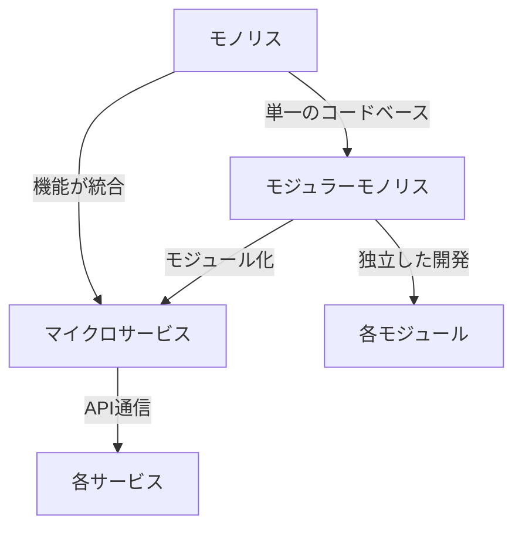
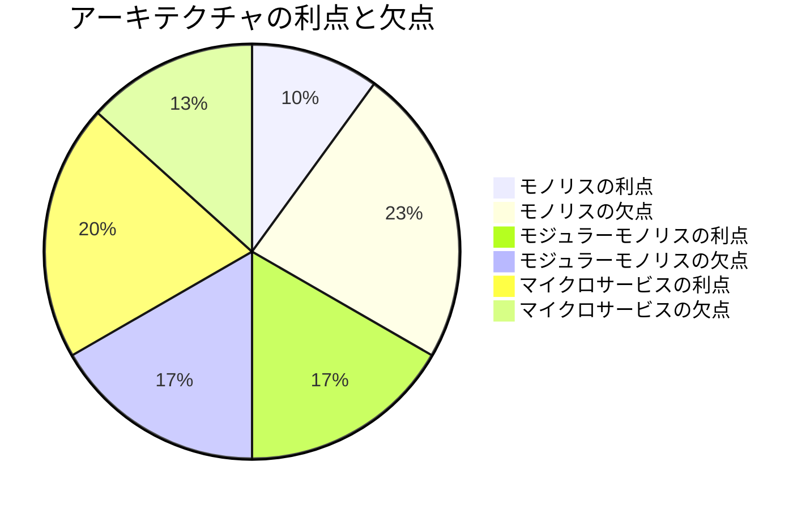

# モノリスとモジュラーモノリスとマイクロサービス：あなたのサービスに適しているのはどっち？

## はじめに

ソフトウェアアーキテクチャの選択は、開発プロセスや運用の効率に大きな影響を与えます。特に、モノリス、モジュラーモノリス、マイクロサービスといったアーキテクチャスタイルは、各々異なる利点と欠点を持ち、プロジェクトの要件に応じて適切な選択が求められます。本記事では、これらのアーキテクチャの特徴、利点、欠点、そしてどのような状況でそれぞれが適しているのかを詳しく解説します。

以下のダイアグラムは、モノリス、モジュラーモノリス、マイクロサービスの基本的な構造を示しています。これにより、各アーキテクチャの違いを視覚的に理解することができます。

このダイアグラムは、モノリスからモジュラーモノリス、マイクロサービスへの進化を示しています。モジュラーモノリスは、機能をモジュールに分割し、各モジュールが独立して開発できることを強調しています。一方、マイクロサービスは、各サービスがAPIを介して通信することを示しています。

## モノリスアーキテクチャ

### 概要

モノリスアーキテクチャは、アプリケーションが単一のコードベースで構成されているスタイルです。すべての機能が一つのプロジェクトに統合されており、デプロイやスケーリングも一括で行います。このアーキテクチャは、特に小規模なプロジェクトやスタートアップにおいて、迅速な開発とデプロイを可能にします。

### 利点

1. **シンプルなデプロイ**: モノリスは一つのアプリケーションとしてデプロイされるため、デプロイプロセスが簡単です。開発者は、全体を一度にテストし、デプロイすることができるため、リリースサイクルが短縮されます。これにより、開発チームは迅速に新機能をリリースし、ユーザーからのフィードバックを早期に得ることができます。

2. **パフォーマンス**: 同一プロセス内で動作するため、通信オーバーヘッドが少なく、パフォーマンスが向上します。特に、データベースとのやり取りが頻繁なアプリケーションでは、モノリスの方が効率的です。データの取得や処理が迅速に行えるため、ユーザー体験が向上します。

3. **開発の容易さ**: 小規模なチームやプロジェクトでは、全体を把握しやすく、開発がスムーズに進むことが多いです。新しいメンバーが参加した際も、全体の構造を理解しやすいという利点があります。これにより、チームの生産性が向上し、コミュニケーションが円滑になります。

### 欠点

1. **スケーラビリティの制限**: アプリケーション全体をスケールさせる必要があるため、リソースの無駄が生じることがあります。特定の機能だけが高負荷になる場合でも、全体をスケールさせる必要があるため、コストがかさむことがあります。これにより、ビジネスの成長に伴う柔軟性が失われる可能性があります。

2. **技術的負債**: コードが大きくなるにつれて、技術的負債が蓄積し、メンテナンスが困難になることがあります。特に、古いコードが新しい機能と統合される際に、整合性を保つのが難しくなります。これにより、将来的な機能追加や修正が困難になることがあります。

3. **障害の影響**: 一部の機能に障害が発生すると、全体のアプリケーションが影響を受ける可能性があります。これにより、ユーザー体験が損なわれ、信頼性が低下することがあります。特に、重要な機能がダウンすると、ビジネスに直接的な影響を与えることがあります。

## モジュラーモノリス

### 概要

モジュラーモノリスは、モノリスアーキテクチャの進化形で、機能をモジュールに分割し、各モジュールが独立して開発・テストできるように設計されています。これにより、モノリスの利点を保ちながら、柔軟性を向上させることができます。

### 利点

1. **モジュール性**: 各機能がモジュールとして分離されているため、開発チームは特定のモジュールに集中できます。これにより、開発の効率が向上し、特定の機能に対する専門知識を深めることができます。モジュール間の依存関係を明確にすることで、チーム間の協力が促進されます。

2. **テストの容易さ**: モジュールごとにテストが可能で、バグの特定が容易になります。各モジュールが独立しているため、問題が発生した際に影響を受ける範囲が限定されます。これにより、品質保証プロセスが効率化され、リリースの信頼性が向上します。

3. **スケーラビリティ**: 特定のモジュールだけをスケールさせることができ、リソースの効率的な使用が可能です。これにより、コストを抑えつつ、必要な機能を強化できます。特に、トラフィックが集中する機能に対して、リソースを集中させることができます。

### 欠点

1. **複雑さの増加**: モジュール間の依存関係が複雑になることがあり、全体の理解が難しくなることがあります。特に、モジュール間のインターフェースが不明確な場合、開発者が混乱することがあります。これにより、開発のスピードが低下する可能性があります。

2. **デプロイの複雑さ**: モジュールが増えると、デプロイプロセスが複雑になる可能性があります。特に、モジュール間の依存関係を考慮しなければならないため、デプロイの計画が重要になります。これにより、デプロイの失敗リスクが増加することがあります。

3. **技術的負債のリスク**: モジュール間のインターフェースが不適切に設計されると、技術的負債が蓄積するリスクがあります。これにより、将来的な変更が難しくなることがあります。特に、モジュールの再利用性が低下することがあります。

## マイクロサービスアーキテクチャ

### 概要

マイクロサービスアーキテクチャは、アプリケーションを小さな独立したサービスに分割するスタイルです。各サービスは特定の機能を持ち、APIを介して相互に通信します。このアーキテクチャは、特に大規模なアプリケーションや複雑なビジネスロジックを持つシステムに適しています。

### 利点

1. **独立したデプロイ**: 各サービスは独立してデプロイできるため、変更が他のサービスに影響を与えません。これにより、リリースサイクルが短縮され、迅速なフィードバックが得られます。特に、アジャイル開発手法を採用しているチームにとっては、非常に有利です。

2. **スケーラビリティ**: 特定のサービスだけをスケールさせることができ、リソースの効率的な使用が可能です。これにより、コストを抑えつつ、必要な機能を強化できます。特に、トラフィックが集中するサービスに対して、リソースを集中させることができます。

3. **技術の選択肢**: 各サービスは異なる技術スタックを使用できるため、最適な技術を選択できます。これにより、開発チームは最新の技術を活用しやすくなります。特に、特定のサービスに最適なデータベースやフレームワークを選択することができます。

### 欠点

1. **複雑な管理**: 多数のサービスを管理する必要があり、オーケストレーションや監視が複雑になります。特に、サービス間の通信やデータの整合性を保つための仕組みが必要です。これにより、運用コストが増加する可能性があります。

2. **通信オーバーヘッド**: サービス間の通信が必要なため、オーバーヘッドが発生し、パフォーマンスに影響を与えることがあります。特に、ネットワークの遅延が問題になることがあります。これにより、ユーザー体験が損なわれることがあります。

3. **データ管理の複雑さ**: 各サービスが独自のデータストレージを持つことが多く、データの整合性を保つのが難しくなります。これにより、データの一貫性を確保するための追加の努力が必要です。特に、トランザクション管理が複雑になることがあります。

## どのアーキテクチャが適しているのか？

### プロジェクトの規模と複雑さ

- **小規模プロジェクト**: モノリスが適していることが多いです。シンプルなデプロイと開発の容易さが利点です。特に、リソースが限られている場合、モノリスは迅速な開発を可能にします。

- **中規模プロジェクト**: モジュラーモノリスが良い選択肢です。モジュール性を持ちながら、モノリスの利点を享受できます。これにより、開発チームは特定の機能に集中しやすくなります。

- **大規模プロジェクト**: マイクロサービスが適しています。独立したデプロイとスケーラビリティが求められるためです。特に、複雑なビジネスロジックを持つ場合、マイクロサービスは柔軟性を提供します。

### チームのスキルセット

- **限られた経験**: モノリスやモジュラーモノリスが適しているかもしれません。これらは比較的シンプルで、チームが学びやすいです。特に、新しいメンバーが参加した際に、全体の構造を理解しやすいという利点があります。

- **豊富な経験**: マイクロサービスに挑戦することができますが、適切な管理とオーケストレーションのスキルが必要です。特に、サービス間の通信やデータの整合性を保つための知識が求められます。

### 運用の要件

- **高可用性が求められる場合**: マイクロサービスが適しています。障害が発生しても、他のサービスに影響を与えにくいです。これにより、システム全体の信頼性が向上します。

- **迅速なデプロイが求められる場合**: モジュラーモノリスやマイクロサービスが適しています。特にマイクロサービスは、独立したデプロイが可能です。これにより、開発チームは迅速にフィードバックを得ることができます。

## まとめ

モノリス、モジュラーモノリス、マイクロサービスは、それぞれ異なる利点と欠点を持つアーキテクチャスタイルです。プロジェクトの規模、チームのスキルセット、運用の要件に応じて、最適なアーキテクチャを選択することが重要です。小規模なプロジェクトにはモノリスが適していることが多く、中規模なプロジェクトにはモジュラーモノリス、大規模なプロジェクトにはマイクロサービスが適しています。最終的には、各アーキテクチャの特性を理解し、プロジェクトに最も適した選択を行うことが成功の鍵となります。

以下のダイアグラムは、モノリス、モジュラーモノリス、マイクロサービスの利点と欠点を比較したものです。これにより、各アーキテクチャの選択における考慮点を視覚的に理解することができます。

この円グラフは、各アーキテクチャの利点と欠点のバランスを示しています。モノリスは利点が少ない一方で、欠点が多いことがわかります。モジュラーモノリスとマイクロサービスは、利点と欠点が比較的バランスが取れていることが示されています。

-----

※本記事は生成AIを使用して作成されました。正確かつ最新の情報については、信頼できる専門的な情報源や公式ドキュメントをご確認ください。
AI言語モデル: gpt-4o-mini