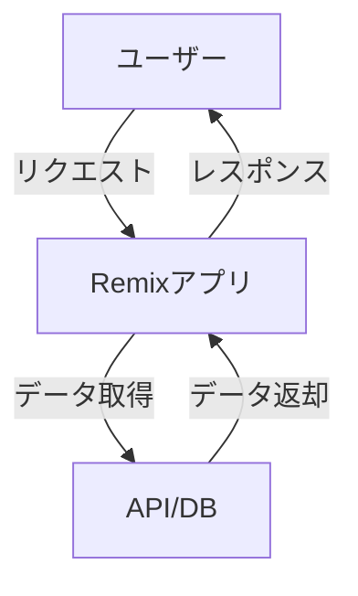
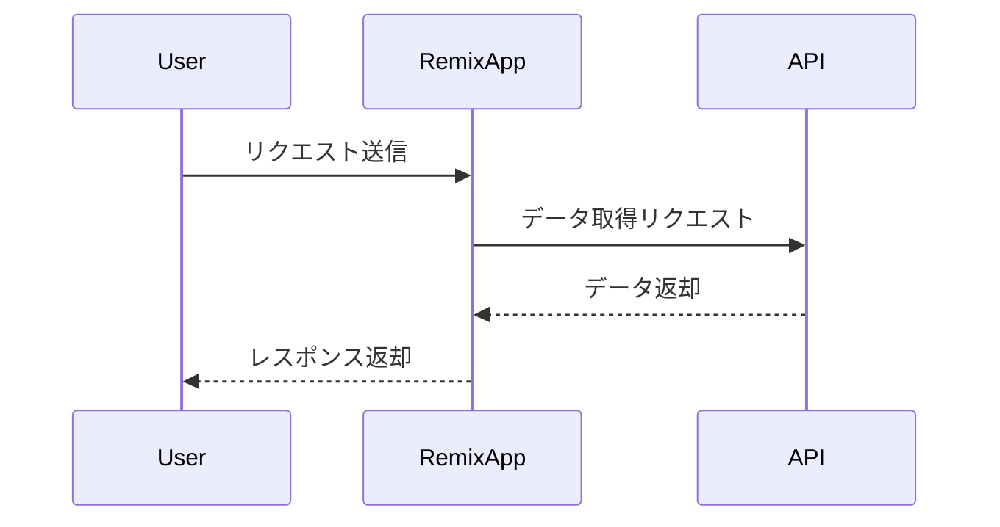
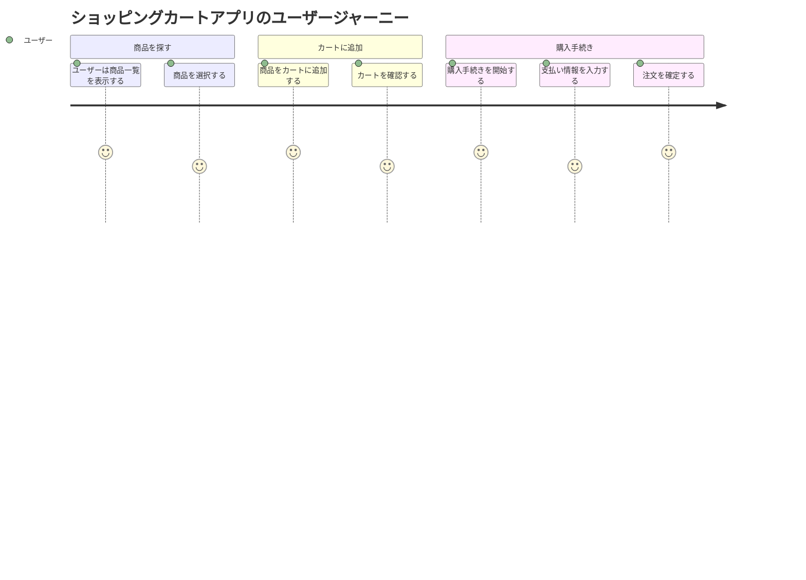

# Remix開発完全入門！現場で活躍できるレベルに到達するための総合ガイド

## はじめに

近年、Web開発の世界は急速に進化しており、さまざまなフレームワークやライブラリが登場しています。その中でも、Remixは特に注目を集めているフレームワークの一つです。Remixは、ReactをベースにしたフルスタックのWebアプリケーションフレームワークであり、開発者にとって効率的でパフォーマンスの高いアプリケーションを構築するための強力なツールです。

本記事では、Remixの基本から応用までを網羅し、現場で活躍できるレベルに到達するための総合ガイドを提供します。具体的には、Remixの特徴、インストール方法、基本的な使い方、ルーティング、データフェッチング、スタイリング、デプロイ方法、そして実践的なプロジェクトの例を通じて、Remixの魅力を深く理解していきます。

### Remixの全体像

以下のダイアグラムは、Remixの全体的なアーキテクチャを示しています。Remixは、クライアントサイドとサーバーサイドの両方で動作し、データの取得やルーティングを効率的に行います。



このダイアグラムは、ユーザーがRemixアプリにリクエストを送信し、アプリがAPIやデータベースからデータを取得してレスポンスを返す流れを示しています。これにより、Remixがどのようにデータを処理し、ユーザーに情報を提供するかが視覚的に理解できます。

## Remixとは？

### Remixの概要

Remixは、Reactを基盤としたフルスタックのWebアプリケーションフレームワークです。主な特徴として、以下の点が挙げられます。

- **サーバーサイドレンダリング（SSR）**: Remixは、サーバーサイドでコンテンツを生成し、クライアントに送信することで、初期表示速度を向上させます。これにより、ユーザーはページがすぐに表示されるため、より良い体験を得ることができます。SSRは、特にSEO対策においても重要で、検索エンジンがコンテンツを正しくインデックスできるようにします。

- **データフェッチングの最適化**: Remixは、データを効率的に取得するための仕組みを提供し、必要なデータを必要なタイミングで取得できます。これにより、無駄なリクエストを減らし、アプリケーションのパフォーマンスを向上させます。特に、`loader`関数を使用することで、ページがレンダリングされる前に必要なデータを取得し、ユーザーにスムーズな体験を提供します。

- **ルーティングの簡素化**: Remixは、ファイルベースのルーティングを採用しており、直感的にルートを定義できます。これにより、開発者はルーティングの設定にかかる時間を大幅に削減できます。ルートは、ファイルシステムの構造に基づいて自動的に生成されるため、URLとコンポーネントの関連付けが容易です。

- **SEO対策**: SSRにより、検索エンジンに対しても最適化されたコンテンツを提供できます。これにより、アプリケーションの可視性が向上し、トラフィックを増加させることが可能です。Remixは、メタデータの管理や、ページごとのSEO設定を簡単に行える機能も提供しています。

### Remixの歴史

Remixは、Reactのエコシステムの中で生まれたフレームワークであり、2021年に初めてリリースされました。開発者のRyan FlorenceとMichael Jacksonによって設計され、React Routerの開発者たちが関与しています。Remixは、Reactの利点を最大限に活かしつつ、開発者が直面する課題を解決するために設計されています。

Remixの開発は、オープンソースコミュニティによって支えられており、GitHub上で活発に開発が進められています。これにより、ユーザーからのフィードバックを受けて機能が追加され、バグが修正されるなど、常に進化し続けています。Remixは、特に開発者の生産性を向上させることを目指しており、シンプルで直感的なAPIを提供しています。

## Remixのインストール

### 環境の準備

Remixを使用するためには、Node.jsとnpm（またはyarn）が必要です。まず、以下のコマンドを使用して、Node.jsがインストールされているか確認します。

```bash
node -v
npm -v
```

Node.jsがインストールされていない場合は、[Node.jsの公式サイト](https://nodejs.org/)からインストールしてください。Node.jsのバージョンは、少なくとも14.x以上であることが推奨されています。Node.jsのインストール後、npmも自動的にインストールされます。

### Remixのインストール

Remixをインストールするには、以下のコマンドを実行します。

```bash
npx create-remix@latest
```

このコマンドを実行すると、プロジェクトのセットアップに関する質問が表示されます。プロジェクト名や使用するテンプレートを選択し、指示に従って進めてください。選択肢には、TypeScriptやJavaScript、デフォルトのスタイルシートの選択肢が含まれています。プロジェクトのセットアップが完了すると、必要な依存関係が自動的にインストールされます。

## 基本的な使い方

### プロジェクトの構成

Remixプロジェクトの基本的な構成は以下のようになります。

```
my-remix-app/
├── app/
│   ├── routes/
│   ├── styles/
│   └── entry.client.tsx
├── public/
├── remix.config.js
└── package.json
```

- `app/routes/`: アプリケーションのルートを定義するディレクトリです。ここにファイルを追加することで、URLパスに対応するコンポーネントを作成できます。ファイル名がそのままURLパスにマッピングされるため、非常に直感的です。

- `app/styles/`: スタイルシートを格納するディレクトリです。ここにCSSファイルを追加することで、アプリケーション全体のスタイルを管理できます。CSS Modulesを使用することも可能です。

- `remix.config.js`: Remixの設定ファイルです。ここで、ビルド設定やルーティングの設定を行います。特に、デプロイ先のプラットフォームに応じた設定を行うことができます。

### ルーティングの設定

Remixでは、ファイルベースのルーティングを使用します。`app/routes/`ディレクトリ内にファイルを作成することで、ルートを定義できます。例えば、`app/routes/index.tsx`を作成すると、ルートパス（`/`）に対応するコンポーネントが定義されます。

```tsx
// app/routes/index.tsx
import { Link } from "remix";

export default function Index() {
  return (
    <div>
      <h1>Welcome to Remix!</h1>
      <Link to="/about">About</Link>
    </div>
  );
}
```

このコードでは、`<Link>`コンポーネントを使用して、`/about`へのリンクを作成しています。Remixは、React Routerを基にしているため、ルーティングの設定が非常に直感的です。さらに、ネストされたルートを作成することも可能で、複雑なアプリケーションの構造を簡単に管理できます。

### データフェッチング

Remixでは、データを取得するための`loader`関数を使用します。`loader`関数は、ルートコンポーネントがレンダリングされる前にデータを取得し、コンポーネントに渡します。

```tsx
// app/routes/about.tsx
import { json, LoaderFunction } from "remix";

export let loader: LoaderFunction = async () => {
  const data = await fetch("https://api.example.com/data");
  return json(await data.json());
};

export default function About() {
  const data = useLoaderData();
  return <div>{data.title}</div>;
}
```

この例では、`loader`関数がAPIからデータを取得し、`useLoaderData`フックを使用してコンポーネント内でそのデータを利用しています。これにより、データの取得と表示がシームレスに行えます。`loader`関数は、非同期処理をサポートしており、Promiseを返すことができます。

### データフローの視覚化

以下のダイアグラムは、Remixにおけるデータフローを示しています。ユーザーのリクエストからデータの取得、レスポンスまでの流れを視覚化しています。



このシーケンス図は、ユーザーがRemixアプリにリクエストを送信し、アプリがAPIからデータを取得してレスポンスを返す流れを示しています。これにより、Remixがどのようにデータを処理し、ユーザーに情報を提供するかが視覚的に理解できます。

## スタイリング

### CSSの導入

Remixでは、CSSを簡単に導入できます。`app/styles/`ディレクトリにCSSファイルを作成し、`entry.client.tsx`でインポートします。

```css
/* app/styles/global.css */
body {
  font-family: Arial, sans-serif;
  margin: 0;
  padding: 0;
  background-color: #f0f0f0;
}
```

```tsx
// app/entry.client.tsx
import "./styles/global.css";
```

このように、グローバルスタイルを定義することで、アプリケーション全体に適用されるスタイルを簡単に管理できます。さらに、RemixはCSS Modulesをサポートしており、コンポーネントごとにスタイルを分離することができます。

### CSS Modulesの使用

RemixはCSS Modulesもサポートしています。CSS Modulesを使用することで、スタイルをコンポーネント単位で管理できます。

```css
/* app/styles/Button.module.css */
.button {
  background-color: blue;
  color: white;
  padding: 10px 20px;
  border: none;
  border-radius: 5px;
  cursor: pointer;
}
```

```tsx
// app/components/Button.tsx
import styles from "../styles/Button.module.css";

export default function Button() {
  return <button className={styles.button}>Click me</button>;
}
```

このように、CSS Modulesを使用することで、スタイルのスコープをコンポーネントに限定し、他のスタイルとの衝突を防ぐことができます。これにより、スタイルの管理が容易になり、大規模なアプリケーションでも整然としたコードを保つことができます。

## デプロイ方法

### Vercelへのデプロイ

RemixアプリケーションをVercelにデプロイするのは非常に簡単です。まず、Vercelのアカウントを作成し、CLIをインストールします。

```bash
npm i -g vercel
```

次に、プロジェクトのルートディレクトリで以下のコマンドを実行します。

```bash
vercel
```

指示に従ってデプロイを完了させます。Vercelは、GitHubやGitLabと連携して自動デプロイを行うこともできるため、CI/CDの設定が非常に簡単です。デプロイ後、Vercelが提供するURLでアプリケーションを確認できます。

### Netlifyへのデプロイ

NetlifyもRemixアプリケーションのデプロイに適したプラットフォームです。Netlifyのアカウントを作成し、GitHubリポジトリを接続することで、簡単にデプロイできます。Netlifyは、ビルドコマンドや公開ディレクトリを設定することで、Remixアプリケーションを自動的にビルドし、デプロイします。

## 実践的なプロジェクト例

### ショッピングカートアプリ

Remixを使用して、シンプルなショッピングカートアプリを作成することができます。このアプリでは、商品一覧の表示、カートへの追加、カートの確認などの機能を実装します。

#### 商品一覧の表示

まず、商品データを取得し、一覧を表示するコンポーネントを作成します。

```tsx
// app/routes/products.tsx
import { json, LoaderFunction } from "remix";

export let loader: LoaderFunction = async () => {
  const products = await fetch("https://api.example.com/products");
  return json(await products.json());
};

export default function Products() {
  const products = useLoaderData();
  return (
    <div>
      <h1>Products</h1>
      {products.map((product) => (
        <div key={product.id}>
          <h2>{product.name}</h2>
          <p>{product.description}</p>
          <button>Add to Cart</button>
        </div>
      ))}
    </div>
  );
}
```

このコードでは、APIから商品データを取得し、各商品を表示しています。ボタンをクリックすることで、カートに商品を追加する機能を実装することができます。

#### カート機能の実装

カート機能を実装するために、Reactのコンテキストを使用して、アプリ全体でカートの状態を管理します。

```tsx
// app/context/CartContext.tsx
import React, { createContext, useContext, useState } from "react";

const CartContext = createContext();

export const useCart = () => useContext(CartContext);

export const CartProvider = ({ children }) => {
  const [cart, setCart] = useState([]);

  const addToCart = (product) => {
    setCart((prev) => [...prev, product]);
  };

  return (
    <CartContext.Provider value={{ cart, addToCart }}>
      {children}
    </CartContext.Provider>
  );
};
```

このコンテキストを使用することで、アプリケーション内のどこからでもカートの状態にアクセスし、商品を追加することができます。カートの状態を管理することで、ユーザーが選択した商品を追跡し、最終的な購入手続きに進むことができます。

### ユーザージャーニーの視覚化

以下のダイアグラムは、ショッピングカートアプリにおけるユーザージャーニーを示しています。ユーザーがアプリを使用する際の主要なステップを視覚化しています。



このユーザージャーニーは、ユーザーがアプリを使用する際の主要なステップを示しています。各ステップの評価は、ユーザーの体験を反映しており、どの部分で改善が必要かを把握するのに役立ちます。

## まとめ

本記事では、Remixの基本から応用までを網羅し、現場で活躍できるレベルに到達するための総合ガイドを提供しました。Remixは、Reactを基盤としたフルスタックのWebアプリケーションフレームワークであり、サーバーサイドレンダリングやデータフェッチングの最適化、直感的なルーティングなど、多くの利点を持っています。

今後、Remixを使用してさまざまなプロジェクトに挑戦し、実践的なスキルを身につけていくことをお勧めします。さらに学習を進めるためのリソースとして、公式ドキュメントやコミュニティフォーラムを活用してください。

-----

※本記事は生成AIを使用して作成されました。正確かつ最新の情報については、信頼できる専門的な情報源や公式ドキュメントをご確認ください。
AI言語モデル: gpt-4o-mini