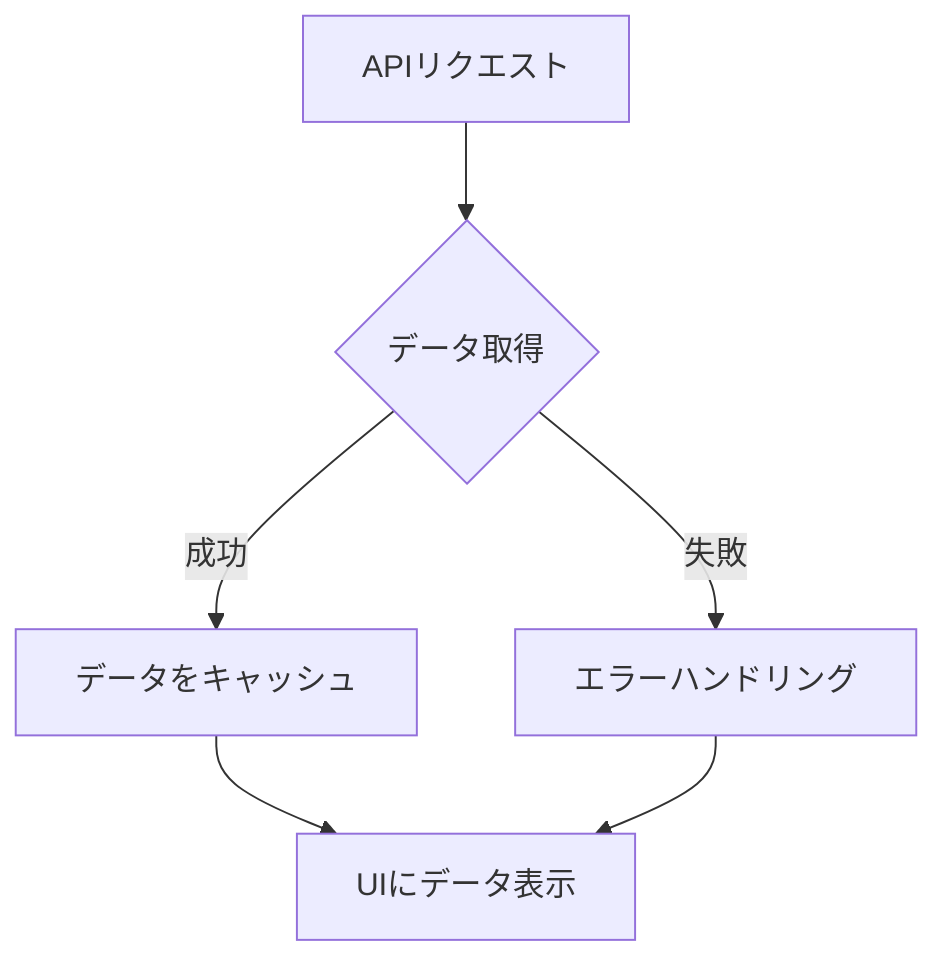

# TanStack Queryで始める宣言的なAPIクエリ実装

## はじめに

現代のウェブアプリケーション開発において、データの取得と管理は非常に重要な要素です。特に、APIからのデータ取得は、ユーザー体験を向上させるために不可欠です。TanStack Query（旧React Query）は、Reactアプリケーションにおけるデータフェッチングを簡素化し、効率的に管理するための強力なライブラリです。本記事では、TanStack Queryを使用して宣言的なAPIクエリを実装する方法について詳しく解説します。

TanStack Queryは、データの取得、キャッシング、更新、同期を簡単に行うためのツールを提供します。これにより、開発者はデータの状態管理に煩わされることなく、アプリケーションのロジックに集中できます。この記事では、TanStack Queryの基本的な使い方から、実践的な例を通じてその機能を深く掘り下げていきます。

### TanStack Queryの全体像

以下のダイアグラムは、TanStack Queryの基本的なフローを示しています。データの取得からキャッシング、エラーハンドリングまでの流れを視覚的に理解するのに役立ちます。



このダイアグラムでは、APIリクエストが行われ、データが取得される過程を示しています。データ取得が成功した場合はキャッシュされ、UIに表示されます。一方、失敗した場合はエラーハンドリングが行われ、適切なメッセージが表示されます。

## TanStack Queryの基本概念

### 1. TanStack Queryとは？

TanStack Queryは、Reactアプリケーションにおけるデータフェッチングのためのライブラリです。主な機能には以下が含まれます。

- **データの取得**: APIからデータを簡単に取得できます。これにより、開発者はHTTPリクエストの詳細を気にせず、データの取得に集中できます。TanStack Queryは、Promiseベースの関数を使用してデータを取得し、非同期処理を簡素化します。
  
- **キャッシング**: 取得したデータをキャッシュし、再利用することでパフォーマンスを向上させます。キャッシュは、同じデータを再度取得する際の待機時間を短縮し、ユーザー体験を向上させます。TanStack Queryは、デフォルトでデータをキャッシュし、必要に応じて自動的に再フェッチを行います。

- **自動再フェッチ**: データが変更された場合、自動的に再フェッチを行います。これにより、常に最新のデータを表示することができます。例えば、ユーザーがデータを更新した場合、他のユーザーにもその変更が即座に反映されます。

- **状態管理**: データの状態を簡単に管理できます。ローディング状態やエラー状態を簡単に扱うことができ、UIの状態を適切に反映させることができます。これにより、ユーザーはアプリケーションの状態を直感的に理解できるようになります。

### 2. 宣言的なAPIクエリ

TanStack Queryは、宣言的なアプローチを採用しています。これは、データの取得や管理をコンポーネントの状態として扱うことを意味します。開発者は、データの取得方法を明示的に指定するだけで、ライブラリが内部で最適な方法でデータを管理します。このアプローチにより、コードがシンプルになり、可読性が向上します。

宣言的なAPIクエリの利点は、アプリケーションの状態を明確に保つことができる点です。例えば、データの取得が成功した場合、ローディングインジケーターを非表示にし、データを表示することができます。これにより、ユーザーはアプリケーションの状態を直感的に理解できるようになります。

## TanStack Queryのインストールとセットアップ

### 1. インストール

TanStack Queryは、npmまたはyarnを使用して簡単にインストールできます。以下のコマンドを実行してください。

```bash
npm install @tanstack/react-query
```

または

```bash
yarn add @tanstack/react-query
```

このインストールにより、TanStack Queryのすべての機能を利用できるようになります。

### 2. セットアップ

インストールが完了したら、アプリケーションのエントリーポイントで`QueryClient`を作成し、`QueryClientProvider`でラップします。これにより、アプリケーション全体でTanStack Queryの機能を利用できるようになります。

```javascript
import React from 'react';
import ReactDOM from 'react-dom';
import { QueryClient, QueryClientProvider } from '@tanstack/react-query';
import App from './App';

const queryClient = new QueryClient();

ReactDOM.render(
  <QueryClientProvider client={queryClient}>
    <App />
  </QueryClientProvider>,
  document.getElementById('root')
);
```

このコードでは、`QueryClient`をインスタンス化し、`QueryClientProvider`でアプリケーションをラップしています。これにより、アプリケーション内のすべてのコンポーネントでTanStack Queryの機能を利用できるようになります。

## APIクエリの実装

### 1. データの取得

TanStack Queryを使用してAPIからデータを取得する基本的な方法を見ていきましょう。以下の例では、JSONPlaceholderというダミーAPIからユーザー情報を取得します。

```javascript
import React from 'react';
import { useQuery } from '@tanstack/react-query';

const fetchUsers = async () => {
  const response = await fetch('https://jsonplaceholder.typicode.com/users');
  if (!response.ok) {
    throw new Error('Network response was not ok');
  }
  return response.json();
};

const Users = () => {
  const { data, error, isLoading } = useQuery(['users'], fetchUsers);

  if (isLoading) return <div>Loading...</div>;
  if (error) return <div>Error: {error.message}</div>;

  return (
    <ul>
      {data.map(user => (
        <li key={user.id}>{user.name}</li>
      ))}
    </ul>
  );
};

export default Users;
```

このコードでは、`useQuery`フックを使用してデータを取得しています。`fetchUsers`関数はAPIからユーザー情報を取得し、`useQuery`はその結果を管理します。`useQuery`は、データの取得、ローディング状態、エラー状態を一元管理し、コンポーネントの状態を簡潔に保つことができます。

### 2. クエリのオプション

`useQuery`には、さまざまなオプションを指定できます。例えば、データのキャッシュ時間や再フェッチの条件を設定できます。以下の例では、キャッシュの保持時間を5分に設定し、ウィンドウがフォーカスされたときに再フェッチしないようにしています。

```javascript
const { data, error, isLoading } = useQuery(['users'], fetchUsers, {
  staleTime: 1000 * 60 * 5, // 5分間キャッシュを保持
  refetchOnWindowFocus: false, // ウィンドウがフォーカスされたときに再フェッチしない
});
```

このように、オプションを設定することで、アプリケーションの要件に応じたデータ管理が可能になります。特に、`staleTime`を設定することで、データが古くなるまでの時間を指定でき、パフォーマンスを最適化できます。

### 3. データの更新

TanStack Queryを使用すると、データの更新も簡単に行えます。以下の例では、ユーザー情報を更新するための`mutate`関数を使用します。

```javascript
import { useMutation, useQueryClient } from '@tanstack/react-query';

const updateUser = async (userId, userData) => {
  const response = await fetch(`https://jsonplaceholder.typicode.com/users/${userId}`, {
    method: 'PUT',
    body: JSON.stringify(userData),
    headers: {
      'Content-Type': 'application/json',
    },
  });
  if (!response.ok) {
    throw new Error('Network response was not ok');
  }
  return response.json();
};

const UpdateUser = ({ userId }) => {
  const queryClient = useQueryClient();
  const mutation = useMutation(updateUser, {
    onSuccess: () => {
      // ユーザー情報を再フェッチ
      queryClient.invalidateQueries(['users']);
    },
  });

  const handleUpdate = () => {
    mutation.mutate(userId, { name: 'Updated User' });
  };

  return <button onClick={handleUpdate}>Update User</button>;
};
```

この例では、`useMutation`を使用してユーザー情報を更新し、成功した場合に`invalidateQueries`を呼び出してキャッシュを無効化しています。これにより、最新のデータを取得することができます。`useMutation`は、データの更新や削除などの操作を簡単に行うためのフックで、エラーハンドリングやローディング状態の管理もサポートしています。

## TanStack Queryの高度な機能

### 1. ページネーション

TanStack Queryは、ページネーションを簡単に実装できます。以下の例では、ページネーションを使用してデータを取得します。

```javascript
const fetchUsers = async (page = 1) => {
  const response = await fetch(`https://jsonplaceholder.typicode.com/users?_page=${page}&_limit=10`);
  if (!response.ok) {
    throw new Error('Network response was not ok');
  }
  return response.json();
};

const Users = () => {
  const [page, setPage] = React.useState(1);
  const { data, error, isLoading } = useQuery(['users', page], () => fetchUsers(page));

  return (
    <div>
      {isLoading && <div>Loading...</div>}
      {error && <div>Error: {error.message}</div>}
      <ul>
        {data.map(user => (
          <li key={user.id}>{user.name}</li>
        ))}
      </ul>
      <button onClick={() => setPage(old => Math.max(old - 1, 1))}>Previous</button>
      <button onClick={() => setPage(old => old + 1)}>Next</button>
    </div>
  );
};
```

このコードでは、ページ番号を状態として管理し、`useQuery`のキーにページ番号を含めています。これにより、ページごとに異なるデータを取得できます。ページネーションを実装することで、ユーザーは大量のデータを効率的に閲覧できるようになります。特に、データが多い場合には、ページネーションを使用することで、ユーザーが必要な情報に迅速にアクセスできるようになります。

### 2. 無限スクロール

無限スクロールもTanStack Queryで簡単に実装できます。以下の例では、無限スクロールを使用してデータを取得します。

```javascript
import { useInfiniteQuery } from '@tanstack/react-query';

const fetchUsers = async ({ pageParam = 1 }) => {
  const response = await fetch(`https://jsonplaceholder.typicode.com/users?_page=${pageParam}&_limit=10`);
  if (!response.ok) {
    throw new Error('Network response was not ok');
  }
  return response.json();
};

const Users = () => {
  const {
    data,
    error,
    isLoading,
    fetchNextPage,
    hasNextPage,
  } = useInfiniteQuery(['users'], fetchUsers, {
    getNextPageParam: (lastPage, pages) => {
      return lastPage.length ? pages.length + 1 : undefined;
    },
  });

  return (
    <div>
      {isLoading && <div>Loading...</div>}
      {error && <div>Error: {error.message}</div>}
      <ul>
        {data.pages.map((page) =>
          page.map(user => <li key={user.id}>{user.name}</li>)
        )}
      </ul>
      {hasNextPage && <button onClick={fetchNextPage}>Load More</button>}
    </div>
  );
};
```

この例では、`useInfiniteQuery`を使用して無限スクロールを実装しています。`getNextPageParam`関数を使用して、次のページのパラメータを決定します。無限スクロールを実装することで、ユーザーはスクロールするだけで新しいデータを取得できるようになります。これにより、ユーザーはよりスムーズにデータを閲覧でき、アプリケーションの使い勝手が向上します。

## TanStack Queryのベストプラクティス

### 1. エラーハンドリング

APIからのデータ取得時にエラーが発生することがあります。TanStack Queryでは、エラーハンドリングを簡単に行うことができます。`useQuery`や`useMutation`の`error`プロパティを使用して、エラー情報を取得し、適切に表示します。エラーメッセージをユーザーにわかりやすく表示することで、ユーザー体験を向上させることができます。

エラーハンドリングの一例として、エラーが発生した場合にリトライ機能を実装することが考えられます。TanStack Queryでは、リトライの回数や間隔を設定することができ、ネットワークの不安定な状況でもユーザーにスムーズな体験を提供できます。

### 2. キャッシュの管理

TanStack Queryは、デフォルトでデータをキャッシュしますが、キャッシュの管理は重要です。`staleTime`や`cacheTime`を適切に設定することで、パフォーマンスを向上させることができます。特に、頻繁に更新されるデータの場合、キャッシュの設定を見直すことが重要です。

キャッシュの管理においては、データの更新頻度やユーザーの利用パターンを考慮することが重要です。例えば、リアルタイム性が求められるデータの場合、`staleTime`を短く設定することで、常に最新の情報を提供できます。

### 3. コンポーネントの分割

データ取得のロジックをコンポーネントから分離することで、再利用性を高めることができます。カスタムフックを作成し、データ取得のロジックをまとめると良いでしょう。これにより、コードの可読性が向上し、メンテナンスが容易になります。

カスタムフックを使用することで、同じデータ取得ロジックを複数のコンポーネントで再利用でき、コードの重複を避けることができます。例えば、ユーザー情報を取得するカスタムフックを作成し、異なるコンポーネントでそのフックを使用することで、コードの一貫性を保つことができます。

## まとめ

TanStack Queryは、Reactアプリケーションにおけるデータフェッチングを簡素化し、効率的に管理するための強力なライブラリです。宣言的なAPIクエリの実装を通じて、データの取得、更新、キャッシングを簡単に行うことができます。この記事では、TanStack Queryの基本的な使い方から高度な機能までを詳しく解説しました。

今後のプロジェクトでTanStack Queryを活用することで、データ管理の効率を大幅に向上させることができるでしょう。ぜひ、実際のアプリケーションに取り入れてみてください。

## 参考文献

- [TanStack Query Documentation](https://tanstack.com/query/latest/docs/overview)
- [React Documentation](https://reactjs.org/docs/getting-started.html)