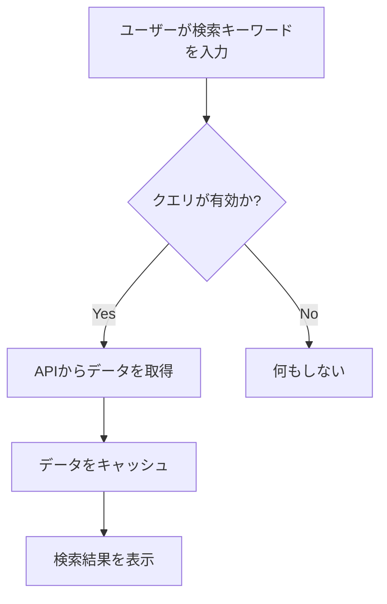

# TanStack Queryで作る検索フォーム

## はじめに

現代のウェブアプリケーションにおいて、データの取得と管理は非常に重要な要素です。特に、ユーザーが情報を検索するための検索フォームは、ユーザーエクスペリエンスを向上させるための重要なコンポーネントです。TanStack Query（旧React Query）は、Reactアプリケーションにおけるデータフェッチングとキャッシングを簡素化するための強力なライブラリです。本記事では、TanStack Queryを使用して検索フォームを構築する方法について詳しく解説します。

## TanStack Queryとは？

TanStack Queryは、Reactアプリケーションにおけるデータの取得、キャッシング、同期を管理するためのライブラリです。これにより、APIからのデータ取得が簡単になり、状態管理の複雑さを軽減します。TanStack Queryは、以下のような機能を提供します。

- **データのフェッチング**: APIからデータを取得するための簡単なインターフェースを提供します。これにより、開発者はHTTPリクエストを手動で管理する必要がなくなります。例えば、`fetch`や`axios`を使ったリクエストを簡潔に行うことができます。
  
- **キャッシング**: 取得したデータをキャッシュし、再利用することでパフォーマンスを向上させます。これにより、同じデータを再度取得する際の待機時間を短縮できます。TanStack Queryは、デフォルトでデータをキャッシュし、必要に応じて自動的に再取得します。

- **自動リフェッチ**: データが変更された場合に自動的に再取得します。これにより、ユーザーは常に最新の情報を得ることができます。例えば、データが更新された場合、ユーザーがページを再読み込みしなくても最新の情報が表示されます。

- **クエリの無効化**: 特定の条件に基づいてクエリを無効化する機能を提供します。これにより、不要なリクエストを防ぎ、アプリケーションのパフォーマンスを向上させます。例えば、ユーザーが入力を行っていない場合にクエリを無効化することができます。

これらの機能により、開発者はデータ管理にかかる時間を大幅に削減でき、より迅速にアプリケーションを開発することが可能になります。

### TanStack Queryのフロー

以下のフローチャートは、TanStack Queryを使用したデータフェッチングの流れを示しています。このフローは、ユーザーが検索を実行した際にどのようにデータが取得され、表示されるかを視覚的に表現しています。



このフローチャートは、ユーザーが検索を行った際の一連の流れを示しています。ユーザーが検索キーワードを入力すると、クエリが有効かどうかがチェックされ、有効であればAPIからデータが取得され、キャッシュされてから検索結果が表示されます。無効な場合は何も行われません。

## 検索フォームの基本構造

検索フォームは、ユーザーが特定の情報を検索するためのインターフェースです。基本的な構造は以下のようになります。

1. **入力フィールド**: ユーザーが検索キーワードを入力するためのフィールド。
2. **検索ボタン**: 検索を実行するためのボタン。
3. **結果表示エリア**: 検索結果を表示するためのエリア。

以下は、基本的な検索フォームのコード例です。

```jsx
import React, { useState } from 'react';

const SearchForm = ({ onSearch }) => {
  const [query, setQuery] = useState('');

  const handleSubmit = (e) => {
    e.preventDefault();
    onSearch(query);
  };

  return (
    <form onSubmit={handleSubmit}>
      <input
        type="text"
        value={query}
        onChange={(e) => setQuery(e.target.value)}
        placeholder="検索キーワードを入力"
      />
      <button type="submit">検索</button>
    </form>
  );
};

export default SearchForm;
```

このコードでは、`useState`フックを使用して検索キーワードを管理し、フォームが送信されると`onSearch`関数が呼び出されます。これにより、ユーザーが入力した検索キーワードを親コンポーネントに渡すことができます。

## TanStack Queryを使った検索機能の実装

### 1. TanStack Queryのインストール

まず、TanStack Queryをプロジェクトにインストールします。以下のコマンドを実行してください。

```bash
npm install @tanstack/react-query
```

このコマンドを実行することで、TanStack Queryの最新バージョンがプロジェクトに追加されます。これにより、データフェッチングやキャッシングの機能を簡単に利用できるようになります。

### 2. クエリの設定

次に、TanStack Queryを使用してAPIからデータを取得するためのクエリを設定します。以下は、検索機能を実装するための基本的なクエリの例です。

```jsx
import { useQuery } from '@tanstack/react-query';

const fetchSearchResults = async (query) => {
  const response = await fetch(`https://api.example.com/search?q=${query}`);
  if (!response.ok) {
    throw new Error('Network response was not ok');
  }
  return response.json();
};

const useSearchResults = (query) => {
  return useQuery(['searchResults', query], () => fetchSearchResults(query), {
    enabled: !!query, // queryが存在する場合のみ実行
  });
};
```

このコードでは、`fetchSearchResults`関数がAPIからデータを取得し、`useSearchResults`フックがクエリを管理します。`enabled`オプションを使用することで、クエリが空でない場合にのみ実行されるようにしています。これにより、無駄なリクエストを防ぎ、アプリケーションのパフォーマンスを向上させます。

### 3. 検索フォームと結果表示の統合

次に、検索フォームと検索結果を統合します。以下は、検索フォームと結果表示を組み合わせたコンポーネントの例です。

```jsx
import React, { useState } from 'react';
import { useQuery } from '@tanstack/react-query';

const fetchSearchResults = async (query) => {
  const response = await fetch(`https://api.example.com/search?q=${query}`);
  if (!response.ok) {
    throw new Error('Network response was not ok');
  }
  return response.json();
};

const useSearchResults = (query) => {
  return useQuery(['searchResults', query], () => fetchSearchResults(query), {
    enabled: !!query,
  });
};

const SearchForm = ({ onSearch }) => {
  const [query, setQuery] = useState('');

  const handleSubmit = (e) => {
    e.preventDefault();
    onSearch(query);
  };

  return (
    <form onSubmit={handleSubmit}>
      <input
        type="text"
        value={query}
        onChange={(e) => setQuery(e.target.value)}
        placeholder="検索キーワードを入力"
      />
      <button type="submit">検索</button>
    </form>
  );
};

const SearchResults = ({ query }) => {
  const { data, error, isLoading } = useSearchResults(query);

  if (isLoading) return <div>読み込み中...</div>;
  if (error) return <div>エラーが発生しました: {error.message}</div>;

  return (
    <ul>
      {data.results.map((result) => (
        <li key={result.id}>{result.title}</li>
      ))}
    </ul>
  );
};

const SearchComponent = () => {
  const [query, setQuery] = useState('');

  return (
    <div>
      <SearchForm onSearch={setQuery} />
      {query && <SearchResults query={query} />}
    </div>
  );
};

export default SearchComponent;
```

このコンポーネントでは、`SearchForm`が検索キーワードを受け取り、`SearchResults`がそのキーワードに基づいて検索結果を表示します。これにより、ユーザーは簡単に情報を検索し、結果を確認することができます。

## 検索機能の拡張

### 1. デバウンス機能の追加

ユーザーが入力するたびにAPIを呼び出すのではなく、デバウンス機能を追加することで、パフォーマンスを向上させることができます。デバウンスとは、一定の時間が経過するまで処理を遅延させる技術です。以下は、デバウンス機能を追加した例です。

```jsx
import { useEffect } from 'react';

const useDebounce = (value, delay) => {
  const [debouncedValue, setDebouncedValue] = useState(value);

  useEffect(() => {
    const handler = setTimeout(() => {
      setDebouncedValue(value);
    }, delay);

    return () => {
      clearTimeout(handler);
    };
  }, [value, delay]);

  return debouncedValue;
};

// SearchComponent内での使用
const SearchComponent = () => {
  const [query, setQuery] = useState('');
  const debouncedQuery = useDebounce(query, 300); // 300msのデバウンス

  return (
    <div>
      <SearchForm onSearch={setQuery} />
      {debouncedQuery && <SearchResults query={debouncedQuery} />}
    </div>
  );
};
```

このコードでは、`useDebounce`フックを使用して、ユーザーの入力が300ms間続いた後にのみ検索を実行します。これにより、APIへのリクエスト数を減らし、サーバーへの負荷を軽減します。

### 2. ページネーションの実装

検索結果が多い場合、ページネーションを実装することで、ユーザーが結果をより簡単にナビゲートできるようになります。ページネーションは、結果を複数のページに分割し、ユーザーが特定のページを選択できるようにする機能です。以下は、ページネーションを追加した例です。

```jsx
const SearchResults = ({ query }) => {
  const [page, setPage] = useState(1);
  const { data, error, isLoading } = useSearchResults(query, page);

  if (isLoading) return <div>読み込み中...</div>;
  if (error) return <div>エラーが発生しました: {error.message}</div>;

  return (
    <div>
      <ul>
        {data.results.map((result) => (
          <li key={result.id}>{result.title}</li>
        ))}
      </ul>
      <button onClick={() => setPage((prev) => Math.max(prev - 1, 1))}>前のページ</button>
      <button onClick={() => setPage((prev) => prev + 1)}>次のページ</button>
    </div>
  );
};
```

このコードでは、ページ番号を管理し、前のページと次のページに移動するためのボタンを追加しています。これにより、ユーザーは大量の検索結果を効率的に閲覧できるようになります。

## エラーハンドリングとローディング状態

検索機能を実装する際には、エラーハンドリングとローディング状態の管理が重要です。TanStack Queryは、これらの状態を簡単に管理できるように設計されています。以下は、エラーハンドリングとローディング状態を表示する方法の例です。

```jsx
const SearchResults = ({ query }) => {
  const { data, error, isLoading } = useSearchResults(query);

  if (isLoading) return <div>読み込み中...</div>;
  if (error) return <div>エラーが発生しました: {error.message}</div>;

  return (
    <ul>
      {data.results.map((result) => (
        <li key={result.id}>{result.title}</li>
      ))}
    </ul>
  );
};
```

このコードでは、`isLoading`と`error`の状態に基づいて適切なメッセージを表示しています。これにより、ユーザーは現在の状態を理解しやすくなります。

## スタイリングとユーザーエクスペリエンスの向上

検索フォームや結果表示のスタイリングは、ユーザーエクスペリエンスを向上させるために重要です。CSSフレームワークやスタイリングライブラリを使用して、見た目を改善することができます。以下は、簡単なスタイリングの例です。

```css
form {
  display: flex;
  margin-bottom: 20px;
}

input {
  flex: 1;
  padding: 10px;
  border: 1px solid #ccc;
  border-radius: 4px;
}

button {
  padding: 10px 15px;
  margin-left: 10px;
  background-color: #007bff;
  color: white;
  border: none;
  border-radius: 4px;
  cursor: pointer;
}

button:hover {
  background-color: #0056b3;
}
```

このCSSは、検索フォームの見た目を改善し、ユーザーが使いやすいインターフェースを提供します。スタイリングは、ユーザーがアプリケーションを使用する際の印象を大きく左右するため、注意深く設計することが重要です。

## さらなる機能の追加

### 1. フィルタリング機能の実装

検索結果をさらに絞り込むために、フィルタリング機能を追加することができます。例えば、特定のカテゴリや日付範囲で結果を絞り込むことができます。以下は、フィルタリング機能を追加した例です。

```jsx
const FilterForm = ({ onFilterChange }) => {
  const [category, setCategory] = useState('');

  const handleCategoryChange = (e) => {
    setCategory(e.target.value);
    onFilterChange(e.target.value);
  };

  return (
    <div>
      <label>
        カテゴリ:
        <select value={category} onChange={handleCategoryChange}>
          <option value="">すべて</option>
          <option value="news">ニュース</option>
          <option value="articles">記事</option>
        </select>
      </label>
    </div>
  );
};

const SearchComponent = () => {
  const [query, setQuery] = useState('');
  const [category, setCategory] = useState('');

  return (
    <div>
      <SearchForm onSearch={setQuery} />
      <FilterForm onFilterChange={setCategory} />
      {query && <SearchResults query={query} category={category} />}
    </div>
  );
};
```

このコードでは、`FilterForm`コンポーネントを追加し、ユーザーがカテゴリを選択できるようにしています。選択されたカテゴリは、検索結果にフィルタリングを適用するために使用されます。

### 2. 検索履歴の管理

ユーザーが過去に行った検索を記録し、再利用できるようにするために、検索履歴の管理機能を追加することができます。これにより、ユーザーは以前の検索を簡単に再実行できるようになります。

```jsx
const SearchHistory = ({ history, onSelect }) => {
  return (
    <ul>
      {history.map((item, index) => (
        <li key={index} onClick={() => onSelect(item)}>
          {item}
        </li>
      ))}
    </ul>
  );
};

const SearchComponent = () => {
  const [query, setQuery] = useState('');
  const [history, setHistory] = useState([]);

  const handleSearch = (newQuery) => {
    setQuery(newQuery);
    setHistory((prev) => [...new Set([newQuery, ...prev])]); // 重複を排除
  };

  return (
    <div>
      <SearchForm onSearch={handleSearch} />
      <SearchHistory history={history} onSelect={setQuery} />
      {query && <SearchResults query={query} />}
    </div>
  );
};
```

このコードでは、`SearchHistory`コンポーネントを追加し、ユーザーが過去の検索をクリックして再実行できるようにしています。これにより、ユーザーは効率的に情報を検索できるようになります。

## まとめ

本記事では、TanStack Queryを使用して検索フォームを構築する方法について詳しく解説しました。TanStack Queryの強力な機能を活用することで、データの取得や管理が簡素化され、ユーザーエクスペリエンスを向上させることができます。検索フォームの基本的な構造から始まり、デバウンス機能やページネーションの実装、エラーハンドリング、スタイリング、さらにはフィルタリング機能や検索履歴の管理まで、さまざまな要素を取り上げました。

今後のプロジェクトにおいて、TanStack Queryを活用して効果的な検索機能を実装する際の参考にしていただければ幸いです。さらに学習を進めるためのリソースとして、TanStack Queryの公式ドキュメントや、Reactのベストプラクティスに関する資料を参照することをお勧めします。