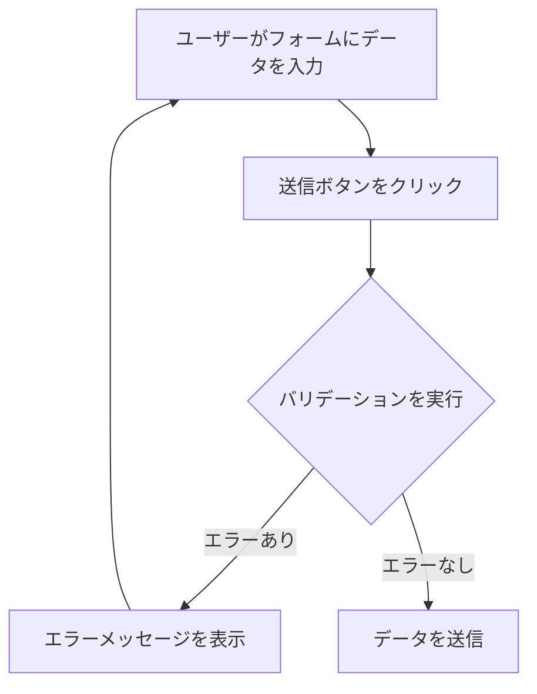

※本記事は生成AIを使用して作成されました。
AI言語モデル: gpt-4o-mini

-----

# React Hook FormとZodで始めるフォームバリデーション

## はじめに

Webアプリケーションにおいて、フォームはユーザーからのデータを収集する重要な要素です。ユーザーが入力したデータが正しい形式であるか、必須項目が入力されているかを確認することは、アプリケーションの信頼性を高めるために不可欠です。しかし、フォームのバリデーションはしばしば複雑で、開発者にとって頭を悩ませる課題となります。特に、ユーザーが誤った情報を入力した場合、適切なエラーメッセージを表示し、再入力を促すことが求められます。

Reactのエコシステムでは、`React Hook Form`と`Zod`という2つのライブラリが、フォームの管理とバリデーションを簡素化するための強力なツールとして注目されています。本記事では、これらのライブラリを使用して、効率的かつ効果的なフォームバリデーションを実現する方法を詳しく解説します。

### フォームバリデーションの流れ

以下のダイアグラムは、フォームバリデーションの基本的な流れを示しています。ユーザーがフォームにデータを入力し、送信ボタンをクリックすると、バリデーションが実行され、エラーがあれば表示されます。エラーがなければ、データが送信されます。



このダイアグラムは、フォームバリデーションのプロセスを視覚的に表現しており、読者が流れを理解しやすくなっています。

## React Hook Formとは？

`React Hook Form`は、Reactアプリケーションにおけるフォームの状態管理を簡素化するためのライブラリです。主な特徴は以下の通りです。

- **パフォーマンス**: React Hook Formは、フォームの状態を最小限の再レンダリングで管理します。これにより、パフォーマンスが向上します。特に、大規模なフォームや多くの入力フィールドを持つフォームでは、その効果が顕著に現れます。React Hook Formは、内部的に`useRef`を使用してフォームの状態を管理するため、再レンダリングの回数を減らすことができます。

- **簡単なAPI**: フォームの作成とバリデーションが簡単に行えるAPIを提供しています。これにより、開発者は迅速にフォームを構築し、必要なバリデーションを追加できます。例えば、`register`メソッドを使用することで、簡単に入力フィールドをフォームに登録できます。

- **柔軟性**: 他のライブラリやフレームワークと組み合わせて使用することができます。例えば、UIライブラリ（Material-UIやAnt Designなど）と組み合わせて、スタイリッシュなフォームを作成することが可能です。また、カスタムコンポーネントを使用する場合でも、React Hook Formは簡単に統合できます。

### 基本的な使い方

React Hook Formを使用するには、まずライブラリをインストールします。

```bash
npm install react-hook-form
```

次に、基本的なフォームを作成してみましょう。

```javascript
import React from 'react';
import { useForm } from 'react-hook-form';

const MyForm = () => {
  const { register, handleSubmit } = useForm();

  const onSubmit = (data) => {
    console.log(data);
  };

  return (
    <form onSubmit={handleSubmit(onSubmit)}>
      <input {...register('name')} placeholder="Name" />
      <input type="submit" />
    </form>
  );
};

export default MyForm;
```

このコードでは、`useForm`フックを使用してフォームの状態を管理し、`register`メソッドを使って入力フィールドを登録しています。`handleSubmit`メソッドは、フォームが送信されたときに呼び出される関数を指定します。

## Zodとは？

`Zod`は、TypeScriptでのスキーマバリデーションを簡素化するためのライブラリです。主な特徴は以下の通りです。

- **TypeScriptとの統合**: ZodはTypeScriptと密接に統合されており、型安全なバリデーションを提供します。これにより、開発者は型の不一致によるエラーを事前に防ぐことができます。Zodを使用することで、スキーマの定義と型の推論が自動的に行われるため、開発者は安心してコードを書くことができます。

- **シンプルなAPI**: スキーマを簡単に定義できるAPIを提供しています。Zodを使用することで、複雑なバリデーションロジックを簡潔に表現できます。例えば、オブジェクトのプロパティに対するバリデーションを簡単に設定できます。

- **カスタムバリデーション**: 独自のバリデーションロジックを簡単に追加できます。これにより、特定のビジネスロジックに基づいたバリデーションを実装することが可能です。Zodでは、`refine`メソッドを使用してカスタムバリデーションを定義できます。

### 基本的な使い方

Zodを使用するには、まずライブラリをインストールします。

```bash
npm install zod
```

次に、基本的なスキーマを作成してみましょう。

```javascript
import { z } from 'zod';

const schema = z.object({
  name: z.string().min(1, 'Name is required'),
  age: z.number().min(0, 'Age must be a positive number'),
});
```

このコードでは、`name`と`age`の2つのフィールドを持つオブジェクトスキーマを定義しています。`name`は必須で、`age`は0以上の数値である必要があります。

## React Hook FormとZodの統合

React Hook FormとZodを組み合わせることで、強力なフォームバリデーションを実現できます。以下にその方法を示します。

### スキーマの定義

まず、Zodを使用してスキーマを定義します。

```javascript
import { z } from 'zod';

const schema = z.object({
  name: z.string().min(1, 'Name is required'),
  age: z.number().min(0, 'Age must be a positive number'),
});
```

### フォームの作成

次に、React Hook Formを使用してフォームを作成し、Zodスキーマをバリデーションに使用します。

```javascript
import React from 'react';
import { useForm } from 'react-hook-form';
import { zodResolver } from '@hookform/resolvers/zod';
import { z } from 'zod';

const schema = z.object({
  name: z.string().min(1, 'Name is required'),
  age: z.number().min(0, 'Age must be a positive number'),
});

const MyForm = () => {
  const { register, handleSubmit, formState: { errors } } = useForm({
    resolver: zodResolver(schema),
  });

  const onSubmit = (data) => {
    console.log(data);
  };

  return (
    <form onSubmit={handleSubmit(onSubmit)}>
      <div>
        <input {...register('name')} placeholder="Name" />
        {errors.name && <p>{errors.name.message}</p>}
      </div>
      <div>
        <input type="number" {...register('age')} placeholder="Age" />
        {errors.age && <p>{errors.age.message}</p>}
      </div>
      <input type="submit" />
    </form>
  );
};

export default MyForm;
```

このコードでは、`zodResolver`を使用してZodスキーマをReact Hook Formに統合しています。バリデーションエラーが発生した場合、エラーメッセージを表示するためのロジックも追加しています。

## フォームバリデーションの詳細

### バリデーションの種類

フォームバリデーションには、以下のようなさまざまな種類があります。

- **必須バリデーション**: フィールドが必須であることを確認します。例えば、ユーザー名やパスワードなど、必ず入力が必要なフィールドに適用されます。これにより、ユーザーが重要な情報を入力し忘れることを防ぎます。

- **形式バリデーション**: メールアドレスや電話番号など、特定の形式に従っているかを確認します。これにより、ユーザーが正しい形式でデータを入力することを促します。例えば、メールアドレスの形式が正しいかどうかを確認するために、正規表現を使用することができます。

- **範囲バリデーション**: 数値が特定の範囲内にあるかを確認します。例えば、年齢が0から120の範囲内であることを確認することができます。これにより、ユーザーが不適切な値を入力することを防ぎます。

### カスタムバリデーション

Zodでは、カスタムバリデーションを簡単に追加できます。以下にその例を示します。

```javascript
const schema = z.object({
  name: z.string().min(1, 'Name is required'),
  age: z.number().min(0, 'Age must be a positive number').max(120, 'Age must be less than 120'),
  email: z.string().email('Invalid email address'),
});
```

このコードでは、`age`フィールドに最大値のバリデーションを追加し、`email`フィールドにメールアドレスの形式を確認するバリデーションを追加しています。

### エラーメッセージのカスタマイズ

エラーメッセージは、ユーザーにとって理解しやすいものである必要があります。Zodでは、エラーメッセージをカスタマイズすることができます。

```javascript
const schema = z.object({
  name: z.string().min(1, { message: 'Please enter your name' }),
  age: z.number().min(0, { message: 'Age must be a positive number' }),
});
```

このようにすることで、エラーメッセージをより具体的にすることができます。ユーザーが何を修正すべきかを明確に伝えることが重要です。

## 実践的な例

ここでは、React Hook FormとZodを使用した実践的なフォームの例を示します。このフォームでは、ユーザーの名前、年齢、メールアドレスを収集し、バリデーションを行います。

```javascript
import React from 'react';
import { useForm } from 'react-hook-form';
import { zodResolver } from '@hookform/resolvers/zod';
import { z } from 'zod';

const schema = z.object({
  name: z.string().min(1, 'Name is required'),
  age: z.number().min(0, 'Age must be a positive number').max(120, 'Age must be less than 120'),
  email: z.string().email('Invalid email address'),
});

const MyForm = () => {
  const { register, handleSubmit, formState: { errors } } = useForm({
    resolver: zodResolver(schema),
  });

  const onSubmit = (data) => {
    console.log(data);
  };

  return (
    <form onSubmit={handleSubmit(onSubmit)}>
      <div>
        <input {...register('name')} placeholder="Name" />
        {errors.name && <p>{errors.name.message}</p>}
      </div>
      <div>
        <input type="number" {...register('age')} placeholder="Age" />
        {errors.age && <p>{errors.age.message}</p>}
      </div>
      <div>
        <input {...register('email')} placeholder="Email" />
        {errors.email && <p>{errors.email.message}</p>}
      </div>
      <input type="submit" />
    </form>
  );
};

export default MyForm;
```

このフォームでは、ユーザーが名前、年齢、メールアドレスを入力し、送信ボタンをクリックすると、バリデーションが行われます。エラーがある場合は、適切なメッセージが表示されます。

## よくある課題と解決策

### 課題1: バリデーションエラーが表示されない

バリデーションエラーが表示されない場合、以下の点を確認してください。

- `register`メソッドが正しく呼び出されているか。
- `handleSubmit`メソッドが正しく設定されているか。
- `formState.errors`が正しく参照されているか。

これらの点を確認することで、エラーが表示されない原因を特定し、修正することができます。

### 課題2: 複雑なバリデーションロジック

複雑なバリデーションロジックが必要な場合、Zodのカスタムバリデーション機能を使用することができます。以下にその例を示します。

```javascript
const schema = z.object({
  password: z.string().min(6, 'Password must be at least 6 characters long'),
  confirmPassword: z.string().min(6, 'Confirm Password must be at least 6 characters long'),
}).refine(data => data.password === data.confirmPassword, {
  message: "Passwords don't match",
  path: ['confirmPassword'],
});
```

このコードでは、パスワードと確認用パスワードが一致するかを確認するカスタムバリデーションを追加しています。これにより、ユーザーがパスワードを正しく入力したかどうかを確認できます。

## まとめ

React Hook FormとZodを組み合わせることで、効率的かつ効果的なフォームバリデーションを実現できます。React Hook Formはフォームの状態管理を簡素化し、Zodは型安全なバリデーションを提供します。これにより、開発者は複雑なバリデーションロジックを簡単に実装でき、ユーザーにとって使いやすいフォームを提供することができます。

今後のプロジェクトでこれらのライブラリを活用し、より良いユーザー体験を提供していきましょう。さらに、React Hook FormやZodの公式ドキュメントを参照することで、より深い理解を得ることができるでしょう。

-----

※本記事は生成AIを使用して作成されました。
AI言語モデル: gpt-4o-mini