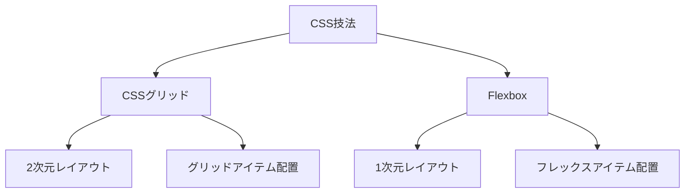

# モダンCSS技法：CSSグリッドとFlexboxの活用

## はじめに

ウェブデザインの世界は常に進化しており、特にCSS（Cascading Style Sheets）の技術は、デザインの可能性を大きく広げています。特に、CSSグリッドとFlexboxは、レイアウトを構築するための強力なツールとして注目されています。これらの技法は、レスポンシブデザインや複雑なレイアウトを簡単に実現するための手段を提供します。本記事では、CSSグリッドとFlexboxの基本概念、使用方法、実践的な例、そしてそれぞれの技法の利点と欠点について詳しく解説します。

### ダイアグラムの挿入

以下のダイアグラムは、CSSグリッドとFlexboxの基本的な構造を示しています。これにより、両者の違いや使用シーンを視覚的に理解する手助けとなります。



このダイアグラムは、CSS技法の中でCSSグリッドとFlexboxがどのように位置づけられているかを示しています。CSSグリッドは2次元レイアウトに特化しており、Flexboxは1次元レイアウトに特化しています。

## CSSグリッドとは

### CSSグリッドの基本概念

CSSグリッドは、2次元のレイアウトを作成するための強力なツールです。グリッドは、行と列の構造を持ち、要素をその中に配置することができます。これにより、複雑なレイアウトを簡単に実現できるようになります。CSSグリッドは、特に大規模なウェブアプリケーションやダッシュボードのデザインにおいて、その真価を発揮します。

#### グリッドコンテナとグリッドアイテム

CSSグリッドを使用する際、まず「グリッドコンテナ」を定義します。グリッドコンテナは、グリッドアイテムを含む要素であり、以下のように定義します。

```css
.container {
  display: grid;
  grid-template-columns: repeat(3, 1fr);
  grid-template-rows: auto;
  gap: 10px;
}
```

この例では、3つの等幅の列を持つグリッドを作成しています。`repeat(3, 1fr)`は、3つの列を1fr（フラクションユニット）で定義しています。これにより、グリッドは利用可能なスペースを均等に分配します。

### グリッドのプロパティ

CSSグリッドには、さまざまなプロパティがあります。以下にいくつかの重要なプロパティを示します。

- **`grid-template-columns`**: 列のサイズを定義します。例えば、`grid-template-columns: 100px 200px 1fr;`とすることで、1列目は100px、2列目は200px、3列目は残りのスペースを占めるように設定できます。
- **`grid-template-rows`**: 行のサイズを定義します。`grid-template-rows: auto 100px;`とすることで、1行目は自動的にサイズが決まり、2行目は100pxの高さになります。
- **`grid-area`**: グリッドアイテムの配置を指定します。`grid-area: 1 / 1 / 2 / 3;`は、1行目の1列目から2行目の3列目までの範囲を指定します。
- **`gap`**: グリッドアイテム間のスペースを設定します。`gap: 10px;`とすることで、アイテム間に10pxのスペースが設けられます。

### グリッドの応用

CSSグリッドは、特に複雑なレイアウトを簡単に実現できるため、さまざまな場面で活用されています。例えば、以下のようなレイアウトが可能です。

- **ダッシュボード**: 複数のウィジェットをグリッドで配置することで、情報を整理して表示できます。
- **ギャラリー**: 画像をグリッドで配置することで、視覚的に魅力的なレイアウトを作成できます。
- **フォーム**: 複数の入力フィールドを整然と配置するために、グリッドを使用することができます。

### 実践的な例

以下は、CSSグリッドを使用したシンプルなレイアウトの例です。

```html
<div class="container">
  <div class="item1">1</div>
  <div class="item2">2</div>
  <div class="item3">3</div>
  <div class="item4">4</div>
</div>
```

```css
.container {
  display: grid;
  grid-template-columns: repeat(3, 1fr);
  gap: 10px;
}

.item1 { grid-column: 1; grid-row: 1; }
.item2 { grid-column: 2; grid-row: 1; }
.item3 { grid-column: 3; grid-row: 1; }
.item4 { grid-column: 1 / span 3; grid-row: 2; }
```

この例では、4つのアイテムを持つグリッドを作成し、特定のアイテムを特定の位置に配置しています。`grid-column`や`grid-row`を使用することで、アイテムの配置を柔軟に調整できます。

## Flexboxとは

### Flexboxの基本概念

Flexbox（Flexible Box Layout）は、1次元のレイアウトを作成するための技法です。Flexboxは、要素を行または列に沿って配置し、スペースを効率的に利用するための柔軟な方法を提供します。特に、ナビゲーションバーやカードレイアウトなど、要素のサイズが異なる場合に非常に便利です。

#### フレックスコンテナとフレックスアイテム

Flexboxを使用する際、まず「フレックスコンテナ」を定義します。フレックスコンテナは、フレックスアイテムを含む要素であり、以下のように定義します。

```css
.container {
  display: flex;
  justify-content: space-between;
  align-items: center;
}
```

この例では、フレックスアイテムが水平方向に配置され、間隔が均等に分配されます。`justify-content`プロパティは、アイテムの水平方向の配置を制御し、`align-items`プロパティは、アイテムの垂直方向の配置を制御します。

### フレックスのプロパティ

Flexboxには、さまざまなプロパティがあります。以下にいくつかの重要なプロパティを示します。

- **`flex-direction`**: フレックスアイテムの配置方向を指定します。`row`（デフォルト）、`column`、`row-reverse`、`column-reverse`のいずれかを指定できます。
- **`justify-content`**: フレックスアイテムの水平方向の配置を指定します。`flex-start`、`flex-end`、`center`、`space-between`、`space-around`などの値を取ります。
- **`align-items`**: フレックスアイテムの垂直方向の配置を指定します。`flex-start`、`flex-end`、`center`、`baseline`、`stretch`などの値を取ります。
- **`flex-wrap`**: フレックスアイテムがコンテナの幅を超えた場合の動作を指定します。`nowrap`（デフォルト）、`wrap`、`wrap-reverse`のいずれかを指定できます。

### Flexboxの応用

Flexboxは、特に以下のようなシーンでの使用が推奨されます。

- **ナビゲーションバー**: メニューアイテムを水平方向に整列させるためにFlexboxを使用することで、レスポンシブなナビゲーションを実現できます。
- **カードレイアウト**: 異なるサイズのカードを整然と配置するために、Flexboxを使用することができます。
- **フォーム**: フォーム要素を整然と配置するために、Flexboxを使用することで、ユーザーにとって使いやすいインターフェースを提供できます。

### 実践的な例

以下は、Flexboxを使用したシンプルなレイアウトの例です。

```html
<div class="container">
  <div class="item">1</div>
  <div class="item">2</div>
  <div class="item">3</div>
</div>
```

```css
.container {
  display: flex;
  justify-content: space-around;
  align-items: center;
}

.item {
  flex: 1;
  margin: 10px;
}
```

この例では、3つのアイテムが水平方向に配置され、間隔が均等に分配されています。`flex: 1;`は、各アイテムが利用可能なスペースを均等に分配することを意味します。

## CSSグリッドとFlexboxの比較

### 使用シーンの違い

CSSグリッドとFlexboxは、それぞれ異なるシーンでの使用が推奨されます。CSSグリッドは、複雑な2次元レイアウトに最適であり、Flexboxは、1次元のレイアウトに適しています。例えば、ダッシュボードやギャラリーのような複雑なレイアウトにはCSSグリッドが適しており、ナビゲーションバーやカードレイアウトにはFlexboxが適しています。

### パフォーマンスの違い

CSSグリッドは、複雑なレイアウトを簡単に実現できるため、パフォーマンスが向上する場合があります。一方、Flexboxは、シンプルなレイアウトを効率的に作成するための手段として優れています。特に、Flexboxは、要素のサイズが異なる場合でも、スペースを均等に分配することができるため、デザインの柔軟性が高まります。

### 互換性

CSSグリッドとFlexboxは、主要なブラウザで広くサポートされていますが、古いブラウザでは互換性の問題が発生する可能性があります。特に、IE11以前のバージョンでは、CSSグリッドのサポートが不完全です。Flexboxは、IE10以降でサポートされていますが、古いブラウザでのフォールバックを考慮する必要があります。

## 実践的な応用

### レスポンシブデザイン

CSSグリッドとFlexboxは、レスポンシブデザインを実現するための強力なツールです。メディアクエリを使用して、異なる画面サイズに応じてレイアウトを調整することができます。以下は、CSSグリッドを使用したレスポンシブデザインの例です。

```css
.container {
  display: grid;
  grid-template-columns: repeat(3, 1fr);
  gap: 10px;
}

@media (max-width: 600px) {
  .container {
    grid-template-columns: 1fr;
  }
}
```

この例では、画面幅が600px以下の場合、グリッドを1列に変更しています。これにより、モバイルデバイスでも見やすいレイアウトが実現できます。

### アニメーションとトランジション

CSSグリッドとFlexboxは、アニメーションやトランジションと組み合わせることで、よりダイナミックなユーザーインターフェースを作成できます。以下は、Flexboxを使用したアニメーションの例です。

```css
.item {
  transition: transform 0.3s;
}

.item:hover {
  transform: scale(1.1);
}
```

この例では、アイテムにホバーした際に拡大するアニメーションを追加しています。アニメーションを使用することで、ユーザーのインタラクションをより魅力的にすることができます。

## よくある課題と解決策

### レイアウトの崩れ

CSSグリッドやFlexboxを使用する際、レイアウトが崩れることがあります。これを防ぐためには、適切なプロパティを使用し、要素のサイズを明示的に指定することが重要です。特に、`min-width`や`min-height`を使用して、要素が小さくなりすぎないようにすることが推奨されます。

### ブラウザの互換性

古いブラウザでの互換性の問題を解決するためには、CSSグリッドやFlexboxのフォールバックを用意することが推奨されます。例えば、フロートやポジションを使用して、古いブラウザでもレイアウトが崩れないようにすることができます。また、CSSのプレフィックスを使用して、異なるブラウザでの互換性を確保することも重要です。

## まとめ

CSSグリッドとFlexboxは、モダンなウェブデザインにおいて非常に重要な技術です。これらの技法を理解し、適切に活用することで、複雑なレイアウトを簡単に実現できるようになります。CSSグリッドは2次元のレイアウトに最適であり、Flexboxは1次元のレイアウトに適しています。どちらの技法も、レスポンシブデザインやアニメーションと組み合わせることで、より魅力的なユーザーインターフェースを作成することができます。

今後のウェブデザインにおいて、CSSグリッドとFlexboxの活用はますます重要になるでしょう。これらの技法をマスターすることで、より洗練されたデザインを実現できるようになります。さらに、これらの技術を学ぶためのリソースとして、MDN Web DocsやCSS-Tricksなどのオンラインリソースを活用することをお勧めします。

-----

※本記事は生成AIを使用して作成されました。
AI言語モデル: gpt-4o-mini