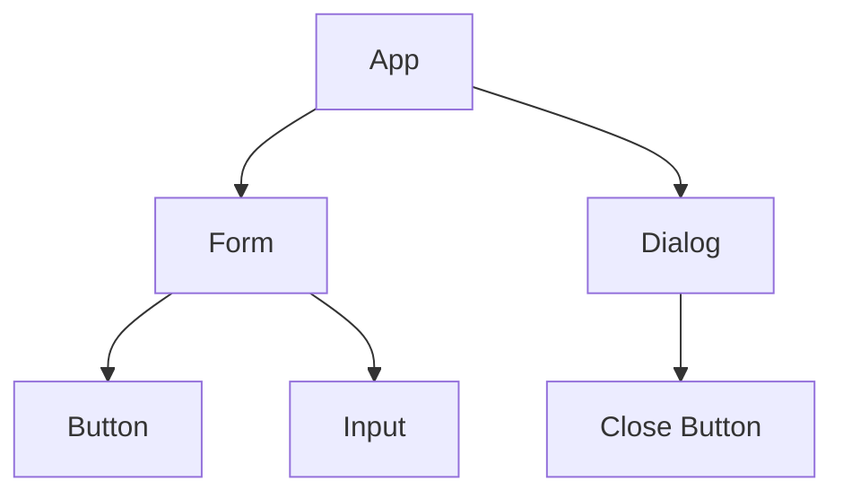

# shadcn/uiとReactで始めるTailwindを使ったフロントエンド開発

## はじめに

フロントエンド開発は、ウェブアプリケーションやウェブサイトのユーザーインターフェースを構築するための重要な分野です。近年、ReactやTailwind CSSといった技術が人気を集めており、開発者はこれらを組み合わせて効率的かつ美しいUIを作成しています。本記事では、shadcn/uiというライブラリを用いて、ReactとTailwind CSSを活用したフロントエンド開発の基本を解説します。

### shadcn/uiとは？

shadcn/uiは、ReactアプリケーションにおけるUIコンポーネントのライブラリです。このライブラリは、Tailwind CSSを基盤にしており、開発者が迅速に美しいUIを構築できるように設計されています。shadcn/uiは、再利用可能なコンポーネントを提供し、開発者が一貫したデザインを保ちながら、効率的に作業できるようにします。特に、shadcn/uiは、アクセシビリティやレスポンシブデザインを考慮した設計がされており、現代のウェブアプリケーションに求められる要件を満たしています。

shadcn/uiは、以下のような特徴を持っています：

- **再利用可能なコンポーネント**: 一度作成したコンポーネントは、他のプロジェクトでも再利用可能です。
- **カスタマイズ性**: Tailwind CSSのユーティリティクラスを使用することで、デザインを簡単にカスタマイズできます。
- **アクセシビリティ**: アクセシビリティを考慮した設計がされており、すべてのユーザーにとって使いやすいUIを提供します。

### Tailwind CSSの概要

Tailwind CSSは、ユーティリティファーストなCSSフレームワークで、開発者がスタイルを迅速に適用できるように設計されています。従来のCSSフレームワークとは異なり、Tailwindは事前に定義されたクラスを使用してスタイルを適用します。これにより、開発者はカスタムCSSを書くことなく、迅速にデザインを構築できます。Tailwind CSSは、カスタマイズ性が高く、プロジェクトのニーズに応じて簡単に拡張できます。また、JIT（Just-In-Time）モードを使用することで、必要なスタイルのみを生成し、パフォーマンスを向上させることができます。

Tailwind CSSの主な利点は以下の通りです：

- **迅速なスタイリング**: ユーティリティクラスを使用することで、スタイルを迅速に適用できます。
- **カスタマイズ性**: プロジェクトのニーズに応じて、テーマやスタイルを簡単にカスタマイズできます。
- **レスポンシブデザイン**: メディアクエリを簡単に適用でき、レスポンシブデザインを容易に実現できます。

## 環境構築

### 必要なツールのインストール

まず、Reactアプリケーションを作成するためにNode.jsとnpm（Node Package Manager）が必要です。これらがインストールされていない場合は、公式サイトからダウンロードしてインストールしてください。Node.jsはJavaScriptの実行環境であり、npmはNode.jsのパッケージ管理ツールです。

次に、以下のコマンドを使用して新しいReactアプリケーションを作成します。

```bash
npx create-react-app my-app
cd my-app
```

このコマンドは、`my-app`という名前の新しいディレクトリを作成し、Reactの基本的な構成を自動的にセットアップします。これにより、Reactの開発環境が整います。

### Tailwind CSSのセットアップ

Tailwind CSSをプロジェクトに追加するために、以下のコマンドを実行します。

```bash
npm install -D tailwindcss postcss autoprefixer
npx tailwindcss init -p
```

これにより、`tailwind.config.js`と`postcss.config.js`が作成されます。次に、`tailwind.config.js`を開き、以下のように設定します。

```javascript
/** @type {import('tailwindcss').Config} */
module.exports = {
  content: [
    "./src/**/*.{js,jsx,ts,tsx}",
  ],
  theme: {
    extend: {},
  },
  plugins: [],
}
```

この設定では、Tailwind CSSがどのファイルをスキャンしてスタイルを生成するかを指定しています。`content`配列には、Tailwind CSSを適用したいファイルのパスを指定します。

次に、`src/index.css`ファイルを開き、以下の内容を追加します。

```css
@tailwind base;
@tailwind components;
@tailwind utilities;
```

これで、Tailwind CSSがプロジェクトに組み込まれました。これにより、Tailwindのユーティリティクラスを使用してスタイルを適用できるようになります。

### shadcn/uiのインストール

shadcn/uiをプロジェクトに追加するために、以下のコマンドを実行します。

```bash
npm install shadcn/ui
```

これで、shadcn/uiのコンポーネントを使用する準備が整いました。shadcn/uiは、Reactのコンポーネントとして提供されており、簡単にインポートして使用することができます。

## shadcn/uiを使ったコンポーネントの作成

### ボタンコンポーネントの作成

shadcn/uiを使用して、シンプルなボタンコンポーネントを作成してみましょう。以下のコードを`src/components/Button.js`に追加します。

```javascript
import React from 'react';
import { Button as ShadcnButton } from 'shadcn/ui';

const Button = ({ children, onClick }) => {
  return (
    <ShadcnButton onClick={onClick} className="bg-blue-500 text-white p-2 rounded hover:bg-blue-600 transition duration-200">
      {children}
    </ShadcnButton>
  );
};

export default Button;
```

このボタンコンポーネントは、shadcn/uiのボタンをラップし、Tailwind CSSのクラスを使用してスタイルを適用しています。`hover:bg-blue-600`クラスを追加することで、ボタンにホバー効果を持たせ、ユーザーに視覚的なフィードバックを提供します。また、`transition duration-200`クラスを使用して、ホバー時の色の変化にアニメーションを追加しています。

### フォームコンポーネントの作成

次に、フォームコンポーネントを作成します。`src/components/Form.js`に以下のコードを追加します。

```javascript
import React, { useState } from 'react';
import Button from './Button';

const Form = () => {
  const [inputValue, setInputValue] = useState('');

  const handleSubmit = (e) => {
    e.preventDefault();
    alert(`Submitted: ${inputValue}`);
    setInputValue(''); // フォーム送信後に入力をクリア
  };

  return (
    <form onSubmit={handleSubmit} className="flex flex-col space-y-4">
      <input
        type="text"
        value={inputValue}
        onChange={(e) => setInputValue(e.target.value)}
        className="border border-gray-300 p-2 rounded focus:outline-none focus:ring-2 focus:ring-blue-500"
        placeholder="Enter something..."
      />
      <Button>Submit</Button>
    </form>
  );
};

export default Form;
```

このフォームコンポーネントは、テキスト入力とボタンを含んでおり、ユーザーが入力した内容をアラートで表示します。`focus:outline-none`と`focus:ring-2 focus:ring-blue-500`クラスを使用して、入力フィールドにフォーカスが当たったときに青いリングを表示し、ユーザーに視覚的なフィードバックを提供します。また、フォーム送信後に入力をクリアするために、`setInputValue('')`を追加しています。

## アプリケーションの統合

### App.jsの更新

作成したコンポーネントをアプリケーションに統合するために、`src/App.js`を以下のように更新します。

```javascript
import React from 'react';
import Form from './components/Form';

const App = () => {
  return (
    <div className="container mx-auto p-4">
      <h1 className="text-2xl font-bold mb-4">My Tailwind App</h1>
      <Form />
    </div>
  );
};

export default App;
```

このコードでは、`Form`コンポーネントをアプリケーションに追加し、Tailwind CSSを使用してスタイルを適用しています。`container mx-auto p-4`クラスを使用して、中央揃えのコンテナを作成し、パディングを追加しています。

## デザインのカスタマイズ

### Tailwind CSSのカスタマイズ

Tailwind CSSは、デフォルトの設定をカスタマイズすることができます。`tailwind.config.js`を編集して、カスタムカラーやフォントを追加することができます。例えば、以下のように設定を追加します。

```javascript
theme: {
  extend: {
    colors: {
      primary: '#1DA1F2',
      secondary: '#14171A',
    },
    fontFamily: {
      sans: ['Helvetica', 'Arial', 'sans-serif'],
    },
  },
},
```

これにより、`bg-primary`や`text-secondary`といったクラスを使用して、カスタムスタイルを適用できるようになります。また、フォントファミリーをカスタマイズすることで、アプリケーション全体のテキストスタイルを統一することができます。

### shadcn/uiのカスタマイズ

shadcn/uiのコンポーネントもカスタマイズ可能です。各コンポーネントには、`className`プロパティを使用してTailwind CSSのクラスを追加できます。これにより、デフォルトのスタイルを上書きしたり、独自のスタイルを適用したりできます。例えば、ボタンコンポーネントに特定のスタイルを追加する場合、以下のように記述します。

```javascript
<ShadcnButton onClick={onClick} className="bg-green-500 text-white p-2 rounded hover:bg-green-600 transition duration-200">
  {children}
</ShadcnButton>
```

このように、shadcn/uiのコンポーネントは、Tailwind CSSのユーティリティクラスを使用して簡単にカスタマイズできます。

## 実践的な例

### ダイアログコンポーネントの作成

shadcn/uiを使用して、ダイアログコンポーネントを作成してみましょう。以下のコードを`src/components/Dialog.js`に追加します。

```javascript
import React from 'react';
import { Dialog as ShadcnDialog } from 'shadcn/ui';

const Dialog = ({ isOpen, onClose, children }) => {
  return (
    <ShadcnDialog open={isOpen} onClose={onClose}>
      <div className="fixed inset-0 bg-black opacity-30" />
      <div className="fixed inset-0 flex items-center justify-center">
        <div className="bg-white p-4 rounded shadow-lg">
          <button onClick={onClose} className="text-red-500">Close</button>
          {children}
        </div>
      </div>
    </ShadcnDialog>
  );
};

export default Dialog;
```

このダイアログコンポーネントは、shadcn/uiのダイアログをラップし、Tailwind CSSを使用してスタイルを適用しています。ダイアログの背景には半透明の黒いオーバーレイを追加し、中央にコンテンツを配置しています。

### ダイアログの使用

ダイアログコンポーネントを使用するために、`Form`コンポーネントを更新します。

```javascript
import React, { useState } from 'react';
import Button from './Button';
import Dialog from './Dialog';

const Form = () => {
  const [inputValue, setInputValue] = useState('');
  const [isDialogOpen, setIsDialogOpen] = useState(false);

  const handleSubmit = (e) => {
    e.preventDefault();
    setIsDialogOpen(true);
  };

  return (
    <>
      <form onSubmit={handleSubmit} className="flex flex-col space-y-4">
        <input
          type="text"
          value={inputValue}
          onChange={(e) => setInputValue(e.target.value)}
          className="border border-gray-300 p-2 rounded focus:outline-none focus:ring-2 focus:ring-blue-500"
          placeholder="Enter something..."
        />
        <Button>Submit</Button>
      </form>
      <Dialog isOpen={isDialogOpen} onClose={() => setIsDialogOpen(false)}>
        <p>Submitted: {inputValue}</p>
      </Dialog>
    </>
  );
};

export default Form;
```

このコードでは、フォームが送信されるとダイアログが表示され、ユーザーが入力した内容が表示されます。ダイアログを閉じるためのボタンも追加されており、ユーザーが簡単にダイアログを閉じることができます。

## テストとデバッグ

### ユニットテストの導入

Reactアプリケーションでは、ユニットテストを使用してコンポーネントの動作を確認することが重要です。JestとReact Testing Libraryを使用して、コンポーネントのテストを行います。以下のコマンドで必要なパッケージをインストールします。

```bash
npm install --save-dev @testing-library/react @testing-library/jest-dom
```

次に、`src/components/Button.test.js`を作成し、ボタンコンポーネントのテストを追加します。

```javascript
import React from 'react';
import { render, screen } from '@testing-library/react';
import Button from './Button';

test('renders button with text', () => {
  render(<Button>Click Me</Button>);
  const buttonElement = screen.getByText(/Click Me/i);
  expect(buttonElement).toBeInTheDocument();
});
```

このテストでは、ボタンが正しくレンダリングされているかを確認します。`screen.getByText`を使用して、ボタンのテキストが正しく表示されているかを検証しています。

### デバッグのテクニック

Reactアプリケーションのデバッグには、ブラウザの開発者ツールを使用します。コンソールログを活用して、状態やプロパティの値を確認することができます。また、React Developer Toolsを使用すると、コンポーネントのツリーを視覚的に確認できます。これにより、コンポーネントの状態やプロパティを簡単に確認し、問題を特定することができます。

## ダイアグラムの挿入

以下のダイアグラムは、shadcn/uiとReactを使用したアプリケーションの基本的な構成を示しています。このダイアグラムは、アプリケーションの主要なコンポーネントとその関係を視覚的に表現しています。



このダイアグラムは、アプリケーションの主要なコンポーネント間の関係を示しています。`App`コンポーネントは、`Form`と`Dialog`コンポーネントを持ち、`Form`は`Button`と`Input`を含んでいます。また、`Dialog`には`Close Button`が含まれています。このように、コンポーネント間の関係を視覚化することで、アプリケーションの構造を理解しやすくなります。

## まとめ

本記事では、shadcn/uiとReactを使用してTailwind CSSを活用したフロントエンド開発の基本を解説しました。環境構築からコンポーネントの作成、カスタマイズ、テストまで、実践的な例を通じて学ぶことができました。これらの技術を組み合わせることで、効率的かつ美しいユーザーインターフェースを構築することが可能です。

今後の学習のために、以下のリソースを参考にしてください。

- [React公式ドキュメント](https://reactjs.org/docs/getting-started.html)
- [Tailwind CSS公式ドキュメント](https://tailwindcss.com/docs)
- [shadcn/ui GitHubリポジトリ](https://github.com/shadcn/ui)

これらのリソースを活用して、さらなるスキル向上を目指しましょう。

-----

※本記事は生成AIを使用して作成されました。
AI言語モデル: gpt-4o-mini