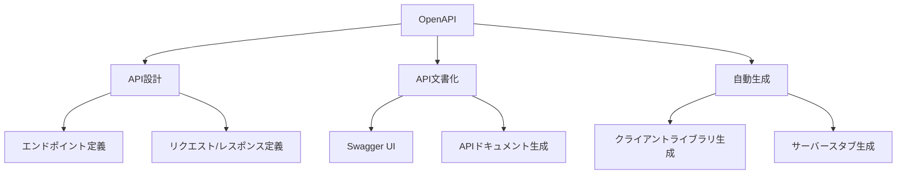

# OpenAPI（旧Swagger）入門：API設計から自動生成までの実践

## はじめに

API（Application Programming Interface）は、異なるソフトウェアシステム間の相互作用を可能にする重要な要素です。特に、Web APIは、インターネットを介してデータや機能を提供するための標準的な手段となっています。APIの設計と文書化は、開発者が他のシステムと効果的に連携するために不可欠です。ここで登場するのがOpenAPI（旧Swagger）です。OpenAPIは、APIの設計、文書化、テスト、そして自動生成を支援するための強力なツールです。

本記事では、OpenAPIの基本概念から始まり、API設計の実践、OpenAPI仕様の詳細、そして自動生成のプロセスまでを詳しく解説します。最終的には、OpenAPIを活用して、効率的かつ効果的なAPI開発を実現する方法を学びます。

### OpenAPIの全体像

以下のダイアグラムは、OpenAPIの主要なコンポーネントとその相互関係を示しています。この図を通じて、OpenAPIがどのようにAPIの設計、文書化、自動生成に寄与するかを理解できます。



このダイアグラムは、OpenAPIがAPI設計、文書化、自動生成の各プロセスにどのように関与しているかを示しています。OpenAPIを使用することで、開発者はエンドポイントやリクエスト/レスポンスを定義し、Swagger UIを通じて視覚的なドキュメントを生成し、さらにクライアントライブラリやサーバースタブを自動生成することができます。

## OpenAPIとは？

OpenAPIは、APIの仕様を記述するための標準フォーマットです。元々はSwaggerとして知られていましたが、2016年にOpenAPI Initiativeによってオープンソースプロジェクトとして発展しました。OpenAPIは、APIのエンドポイント、リクエストとレスポンスの形式、認証方法などを明確に定義することができます。

### OpenAPIの主な特徴

- **言語非依存性**: OpenAPIは、特定のプログラミング言語に依存せず、さまざまな環境で利用可能です。これにより、異なる技術スタックを持つチーム間での協力が容易になります。たとえば、Java、Python、JavaScriptなど、さまざまな言語でAPIを利用することができます。

- **自動生成**: OpenAPI仕様から、APIドキュメントやクライアントライブラリ、サーバースタブを自動生成できます。これにより、手動でのドキュメント作成やコードの記述にかかる時間を大幅に削減できます。自動生成されたコードは、APIの変更に応じて簡単に更新できるため、保守性も向上します。

- **視覚化**: Swagger UIなどのツールを使用して、APIのインタラクティブなドキュメントを生成できます。これにより、開発者や利用者はAPIの機能を直感的に理解しやすくなります。Swagger UIは、APIのエンドポイントを視覚的に表示し、リクエストを試すことができるインターフェースを提供します。

## OpenAPI仕様の基本

OpenAPI仕様は、YAMLまたはJSON形式で記述されます。以下は、基本的なOpenAPI仕様の例です。

```yaml
openapi: 3.0.0
info:
  title: Sample API
  description: APIの説明
  version: 1.0.0
servers:
  - url: https://api.example.com/v1
paths:
  /users:
    get:
      summary: ユーザーのリストを取得
      responses:
        '200':
          description: 正常なレスポンス
          content:
            application/json:
              schema:
                type: array
                items:
                  type: object
                  properties:
                    id:
                      type: integer
                    name:
                      type: string
```

### 主要な要素の説明

- **openapi**: OpenAPIのバージョンを指定します。これにより、仕様の互換性が保たれます。たとえば、`3.0.0`は最新の仕様であり、これに基づいて記述されたAPIは、最新の機能を利用できます。

- **info**: APIの基本情報（タイトル、説明、バージョン）を提供します。これにより、APIの目的や使用方法が明確になります。特に、APIのバージョン管理は重要で、変更履歴を追跡するために役立ちます。

- **servers**: APIがホストされるサーバーの情報を指定します。複数のサーバーを定義することも可能で、開発環境や本番環境を切り替える際に便利です。たとえば、開発用のサーバーと本番用のサーバーを分けて定義することができます。

- **paths**: APIのエンドポイントとその操作を定義します。各エンドポイントには、HTTPメソッド（GET、POST、PUT、DELETEなど）を指定し、それぞれの操作に対するリクエストとレスポンスの詳細を記述します。たとえば、ユーザー情報を取得するためのGETリクエストや、新しいユーザーを作成するためのPOSTリクエストを定義できます。

## OpenAPIを使ったAPI設計

OpenAPIを使用してAPIを設計する際のステップを以下に示します。

### ステップ1: 要件の定義

APIの目的や機能を明確にし、どのようなデータを提供するかを定義します。例えば、ユーザー情報を管理するAPIを設計する場合、ユーザーの作成、取得、更新、削除の機能が必要です。この段階では、ビジネス要件やユーザーのニーズを考慮し、APIの設計に反映させることが重要です。具体的には、どのようなデータが必要か、どのような操作が行われるかを詳細に洗い出します。

### ステップ2: OpenAPI仕様の作成

要件に基づいてOpenAPI仕様を作成します。上記の基本的な例を参考に、必要なエンドポイントやリクエスト/レスポンスの形式を追加していきます。例えば、ユーザーの作成エンドポイントを追加する場合、以下のように記述します。

```yaml
  /users:
    post:
      summary: ユーザーを作成
      requestBody:
        required: true
        content:
          application/json:
            schema:
              type: object
              properties:
                name:
                  type: string
                email:
                  type: string
      responses:
        '201':
          description: ユーザーが正常に作成された
```

このように、リクエストボディの形式や必要なフィールドを明確に定義することで、APIの利用者が正しいリクエストを送信できるようになります。

### ステップ3: ドキュメントの生成

OpenAPI仕様をもとに、Swagger UIなどのツールを使用してAPIドキュメントを生成します。これにより、開発者はAPIの使用方法を簡単に理解できます。Swagger UIは、APIのエンドポイントを視覚的に表示し、リクエストを試すことができるインターフェースを提供します。これにより、APIの利用者は、実際にリクエストを送信し、レスポンスを確認することができます。

### ステップ4: テストとフィードバック

APIを実装した後、実際に動作を確認し、必要に応じて仕様を修正します。APIの使用者からのフィードバックを受けて、改善を行うことも重要です。テストには、ユニットテストや統合テストを活用し、APIの信頼性を確保します。特に、APIの変更が他の機能に影響を与えないかを確認するために、回帰テストを行うことが推奨されます。

## OpenAPIの自動生成機能

OpenAPIの大きな利点の一つは、自動生成機能です。これにより、APIの仕様からさまざまなリソースを自動的に生成できます。

### クライアントライブラリの生成

OpenAPI仕様をもとに、さまざまなプログラミング言語用のクライアントライブラリを生成できます。これにより、開発者はAPIを簡単に利用できるようになります。以下は、OpenAPI Generatorを使用してJava用のクライアントライブラリを生成するコマンドです。

```bash
openapi-generator-cli generate -i api.yaml -g java -o /path/to/output
```

このコマンドを実行すると、指定した出力先にJava用のクライアントライブラリが生成されます。これにより、APIのエンドポイントに対するリクエストを簡単に行うことができます。生成されたライブラリは、APIの仕様に基づいているため、APIの変更に応じて自動的に更新できます。

### サーバースタブの生成

APIの実装を開始する前に、サーバースタブを生成することも可能です。これにより、APIのエンドポイントをすぐにテストできます。以下は、Springフレームワーク用のサーバースタブを生成するコマンドです。

```bash
openapi-generator-cli generate -i api.yaml -g spring -o /path/to/output
```

このコマンドを実行すると、Springフレームワークに基づいたサーバースタブが生成され、APIのエンドポイントを実装するための基本的な構造が提供されます。これにより、開発者はすぐにAPIの実装に取り掛かることができ、開発のスピードを向上させることができます。

## OpenAPIの活用事例

OpenAPIは、さまざまな業界で活用されています。以下にいくつかの具体例を示します。

### 事例1: eコマースプラットフォーム

eコマースプラットフォームでは、商品情報、ユーザー情報、注文処理など、複数のAPIが必要です。OpenAPIを使用して、これらのAPIを設計し、ドキュメントを生成することで、開発者は迅速に機能を追加できます。例えば、商品情報を取得するAPIや、カートに商品を追加するAPIなどをOpenAPIで定義し、Swagger UIで視覚化することで、開発者はAPIの使用方法を簡単に理解できます。

### 事例2: モバイルアプリケーション

モバイルアプリケーションでは、バックエンドAPIとの連携が不可欠です。OpenAPIを使用してAPIを設計し、クライアントライブラリを生成することで、開発者は効率的にアプリケーションを構築できます。例えば、ユーザー認証やデータの取得・送信を行うAPIをOpenAPIで定義し、モバイルアプリから簡単に呼び出せるようにします。これにより、アプリケーションの開発がスムーズに進み、ユーザー体験の向上につながります。

### 事例3: マイクロサービスアーキテクチャ

マイクロサービスアーキテクチャでは、各サービスが独立して動作します。OpenAPIを使用して各サービスのAPIを定義することで、サービス間の連携を明確にし、開発の効率を向上させることができます。例えば、ユーザーサービス、商品サービス、注文サービスなどをそれぞれOpenAPIで定義し、相互に連携させることで、全体のシステムを効率的に構築できます。これにより、各サービスの開発チームは独立して作業でき、全体の開発スピードが向上します。

## OpenAPIの最新動向

OpenAPIは、常に進化しています。最新のバージョンであるOpenAPI 3.0では、以下のような新機能が追加されました。

- **コンポーネントの再利用**: スキーマやレスポンスを再利用するためのコンポーネント機能が追加され、仕様の保守性が向上しました。これにより、同じスキーマを複数のエンドポイントで使用することができ、冗長な記述を避けることができます。

- **セキュリティの強化**: 認証や認可の方法をより詳細に定義できるようになり、APIのセキュリティが強化されました。OAuth2やAPIキーなど、さまざまな認証方式をサポートしています。これにより、APIの利用者は、必要なセキュリティ要件を満たすことができます。

- **非同期APIのサポート**: WebSocketやServer-Sent Eventsなどの非同期通信をサポートするための機能が追加されました。これにより、リアルタイムなデータ通信が必要なアプリケーションに対応できるようになりました。非同期APIは、特にチャットアプリやリアルタイムデータフィードなどでの利用が期待されています。

## OpenAPIを学ぶためのリソース

OpenAPIを学ぶためのリソースは豊富にあります。以下にいくつかのおすすめのリソースを紹介します。

- [OpenAPI Specification](https://swagger.io/specification/): OpenAPIの公式仕様書。最新の仕様や機能について詳しく解説されています。

- [Swagger UI](https://swagger.io/tools/swagger-ui/): APIドキュメントを視覚化するためのツール。インタラクティブなドキュメントを生成し、APIのテストも行えます。

- [OpenAPI Generator](https://openapi-generator.tech/): OpenAPI仕様からクライアントライブラリやサーバースタブを生成するためのツール。多くのプログラミング言語に対応しています。

- [Swagger Editor](https://editor.swagger.io/): OpenAPI仕様をオンラインで作成・編集できるエディタ。リアルタイムでのプレビュー機能も備えています。

- [YouTubeチュートリアル](https://www.youtube.com/results?search_query=openapi+tutorial): OpenAPIに関するビデオチュートリアルが多数公開されています。視覚的に学ぶことができるため、初心者にもおすすめです。

## まとめ

OpenAPIは、APIの設計、文書化、自動生成を効率的に行うための強力なツールです。APIの要件を明確にし、OpenAPI仕様を作成することで、開発者は迅速にAPIを構築し、他のシステムとの連携を容易にします。最新のOpenAPIの機能を活用することで、APIの保守性やセキュリティを向上させることができます。

本記事を通じて、OpenAPIの基本的な概念から実践的な活用方法までを学びました。今後のAPI開発において、OpenAPIを積極的に活用していくことをお勧めします。

-----

※本記事は生成AIを使用して作成されました。
AI言語モデル: gpt-4o-mini