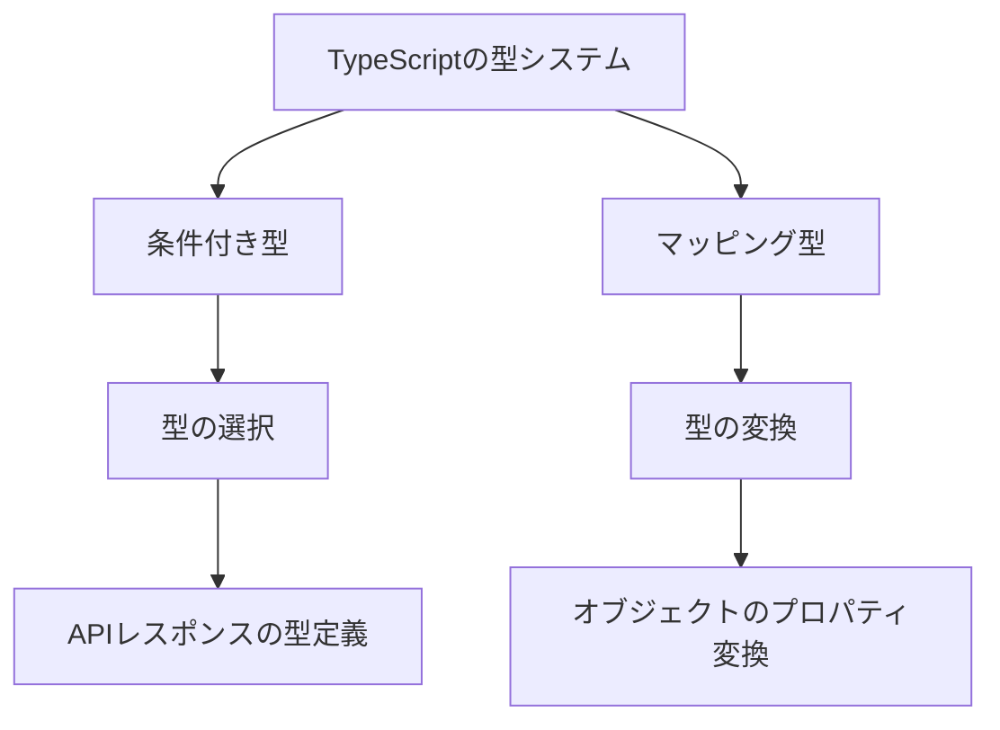

# TypeScriptの高度な型システム：条件付き型とマッピング型の活用法

## はじめに

TypeScriptは、JavaScriptに型安全性を追加するためのプログラミング言語であり、開発者がより堅牢で保守性の高いコードを書くことを可能にします。TypeScriptの型システムは非常に強力で、特に条件付き型とマッピング型は、型の柔軟性と再利用性を高めるための重要な機能です。本記事では、これらの高度な型システムの概念を深く掘り下げ、実践的な例を通じてその活用法を解説します。

## TypeScriptの型システムの概要

TypeScriptの型システムは、静的型付けを提供し、開発者がコードを書く際に型に関するエラーを早期に発見できるようにします。基本的な型（数値、文字列、ブール値など）から、オブジェクト型、配列型、タプル型、列挙型、ユニオン型、インターセクション型など、さまざまな型をサポートしています。

### 型の基本

TypeScriptでは、型を明示的に指定することができます。以下は、基本的な型の例です。

```typescript
let name: string = "Alice";
let age: number = 30;
let isStudent: boolean = false;
```

これにより、変数に不適切な型の値が代入されることを防ぎます。TypeScriptは、型推論もサポートしており、変数の初期値から型を自動的に推測することができます。

```typescript
let city = "Tokyo"; // 型は自動的にstringと推論される
```

このように、TypeScriptは開発者に対して柔軟性を提供しつつ、型安全性を確保します。さらに、TypeScriptはインターフェースや型エイリアスを使用して、複雑なデータ構造を定義することも可能です。

```typescript
interface User {
    id: number;
    name: string;
    email: string;
}

type UserType = {
    id: number;
    name: string;
    email: string;
};
```

このように、インターフェースや型エイリアスを使用することで、コードの可読性と保守性が向上します。

## 条件付き型

条件付き型は、TypeScriptの型システムにおける強力な機能で、型の条件に基づいて異なる型を選択することができます。条件付き型は、`T extends U ? X : Y`という構文で表現されます。ここで、`T`が`U`のサブタイプであれば`X`が選択され、そうでなければ`Y`が選択されます。

### 条件付き型の基本的な例

以下は、条件付き型の基本的な使用例です。

```typescript
type IsString<T> = T extends string ? "Yes" : "No";

type Test1 = IsString<string>; // "Yes"
type Test2 = IsString<number>; // "No"
```

この例では、`IsString`という型を定義し、与えられた型が文字列であるかどうかを判定しています。このように、条件付き型を使用することで、型の特性に基づいて異なる型を生成することができます。

### 条件付き型の実践的な応用

条件付き型は、特にAPIのレスポンス型や、特定の条件に基づいて型を変化させる必要がある場合に非常に便利です。以下は、APIのレスポンス型を条件付き型で定義する例です。

```typescript
interface ApiResponse<T> {
    data: T;
    error?: string;
}

type ResponseType<T> = T extends { error: string } ? "Error" : "Success";

function handleResponse<T>(response: ApiResponse<T>): ResponseType<T> {
    return response.error ? "Error" : "Success";
}
```

この例では、APIのレスポンスがエラーを含むかどうかに基づいて、返される型を決定しています。このように、条件付き型を使用することで、APIのレスポンスに対する型安全性を高めることができます。

### 条件付き型の複雑な使用例

条件付き型は、より複雑な型の操作にも使用できます。例えば、オブジェクトのプロパティの型を条件に基づいて変化させることができます。

```typescript
type User = {
    id: number;
    name: string;
    email?: string;
};

type UserResponse<T> = T extends { email: infer E } ? E : "No Email";

type TestEmail1 = UserResponse<{ email: string }>; // string
type TestEmail2 = UserResponse<{ name: string }>; // "No Email"
```

この例では、`UserResponse`型を使用して、`email`プロパティが存在する場合はその型を返し、存在しない場合は`"No Email"`を返すようにしています。このように、条件付き型を使用することで、型の柔軟性を高めることができます。

## マッピング型

マッピング型は、既存の型を基に新しい型を生成するための機能です。これにより、型のプロパティを変換したり、特定のプロパティを追加したりすることができます。マッピング型は、`{ [K in keyof T]: U }`という構文で表現されます。

### マッピング型の基本的な例

以下は、マッピング型の基本的な使用例です。

```typescript
type Person = {
    name: string;
    age: number;
};

type ReadonlyPerson = {
    readonly [K in keyof Person]: Person[K];
};
```

この例では、`Person`型のすべてのプロパティを読み取り専用に変換した`ReadonlyPerson`型を定義しています。これにより、`ReadonlyPerson`型のインスタンスは、プロパティの変更ができなくなります。

### マッピング型の実践的な応用

マッピング型は、特にオブジェクトのプロパティを変換する際に非常に便利です。以下は、オブジェクトのプロパティをすべて文字列型に変換する例です。

```typescript
type Person = {
    name: string;
    age: number;
};

type Stringify<T> = {
    [K in keyof T]: string;
};

type StringifiedPerson = Stringify<Person>;
```

この例では、`Stringify`型を使用して、`Person`型のすべてのプロパティを文字列型に変換した`StringifiedPerson`型を定義しています。このように、マッピング型を使用することで、型の変換を簡単に行うことができます。

### マッピング型の複雑な使用例

マッピング型は、より複雑な型の操作にも使用できます。例えば、オブジェクトのプロパティをすべてオプショナルにすることができます。

```typescript
type Person = {
    name: string;
    age: number;
};

type Partial<T> = {
    [K in keyof T]?: T[K];
};

type PartialPerson = Partial<Person>;
```

この例では、`Partial`型を使用して、`Person`型のすべてのプロパティをオプショナルにした`PartialPerson`型を定義しています。このように、マッピング型を使用することで、型の柔軟性を高めることができます。

## 条件付き型とマッピング型の組み合わせ

条件付き型とマッピング型を組み合わせることで、より複雑な型の操作が可能になります。以下は、条件付き型とマッピング型を組み合わせた例です。

```typescript
type Person = {
    name: string;
    age: number;
};

type Nullable<T> = {
    [K in keyof T]: T[K] | null;
};

type NullablePerson = Nullable<Person>;
```

この例では、`Nullable`型を使用して、`Person`型のすべてのプロパティを`null`を許容するように変換した`NullablePerson`型を定義しています。このように、条件付き型とマッピング型を組み合わせることで、型の柔軟性をさらに高めることができます。

## 高度な型システムの実践的な活用法

TypeScriptの高度な型システムを活用することで、開発者はより堅牢で保守性の高いコードを書くことができます。以下は、実践的な活用法のいくつかです。

### 1. 型の再利用

条件付き型やマッピング型を使用することで、型の再利用が容易になります。これにより、同じ型を何度も定義する必要がなくなり、コードの重複を減らすことができます。例えば、共通の型を定義しておくことで、異なるコンポーネント間でその型を再利用することができます。

### 2. 型の安全性の向上

条件付き型やマッピング型を使用することで、型の安全性を向上させることができます。これにより、開発者は型に関するエラーを早期に発見し、バグを未然に防ぐことができます。特に大規模なプロジェクトでは、型の安全性が重要な要素となります。

### 3. APIの型定義の簡素化

APIのレスポンス型を条件付き型やマッピング型で定義することで、APIの型定義を簡素化することができます。これにより、APIの変更に対する柔軟性が向上します。例えば、APIのレスポンスが変更された場合でも、条件付き型を使用することで、型定義を簡単に更新できます。

### 4. 型のドキュメンテーション

TypeScriptの型システムは、コードのドキュメンテーションとしても機能します。型を明示的に定義することで、他の開発者がコードを理解しやすくなります。特に、条件付き型やマッピング型を使用することで、型の意図を明確にすることができます。

### 5. 型のテスト

TypeScriptの型システムを活用することで、型のテストを行うことができます。型の正しさを確認するために、ユニットテストを作成することができます。これにより、型に関するバグを早期に発見し、修正することができます。

## ダイアグラムの挿入

以下のダイアグラムは、条件付き型とマッピング型の関係を視覚的に示しています。このダイアグラムは、TypeScriptの型システムにおけるこれらの機能の相互作用を理解するのに役立ちます。



このダイアグラムでは、TypeScriptの型システムが条件付き型とマッピング型を通じてどのように機能するかを示しています。条件付き型は型の選択を行い、マッピング型は型の変換を行います。これにより、APIレスポンスの型定義やオブジェクトのプロパティ変換が可能になります。

## まとめ

TypeScriptの高度な型システム、特に条件付き型とマッピング型は、開発者がより堅牢で保守性の高いコードを書くための強力なツールです。これらの機能を活用することで、型の再利用、型の安全性の向上、APIの型定義の簡素化が可能になります。実践的な例を通じて、これらの概念を理解し、実際のプロジェクトに適用することで、TypeScriptの利点を最大限に引き出すことができるでしょう。

さらに学習を進めるためには、以下のリソースを参考にしてください：

- [TypeScript公式ドキュメント](https://www.typescriptlang.org/docs/)
- [TypeScript Deep Dive](https://basarat.gitbook.io/typescript/)
- [Effective TypeScript](https://effective-typescript.com/)

-----

※本記事は生成AIを使用して作成されました。
AI言語モデル: gpt-4o-mini