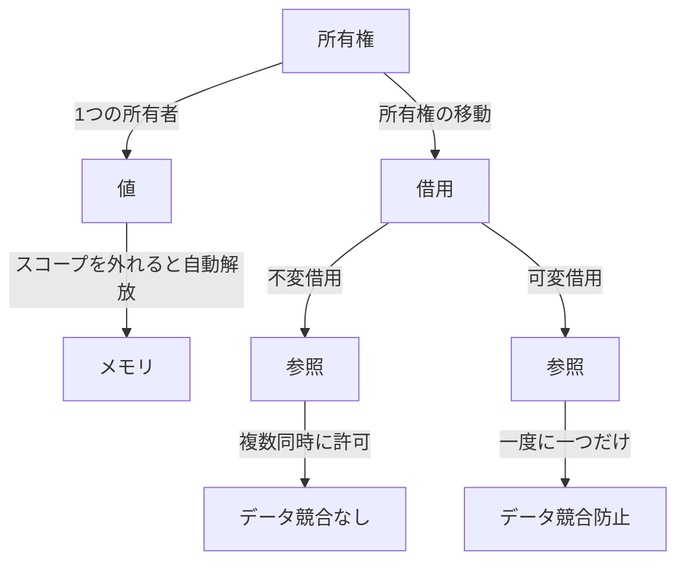

# Rust言語入門：安全性と高速性を兼ね備えた次世代プログラミング言語

## はじめに

Rustは、Mozillaによって開発されたシステムプログラミング言語であり、特に安全性とパフォーマンスを重視しています。CやC++と同様に低レベルの操作が可能でありながら、メモリ安全性を保証するための独自の仕組みを持っています。これにより、開発者はバグやセキュリティの脆弱性を減少させることができ、効率的なプログラムを作成することが可能です。

本記事では、Rustの基本的な概念、特徴、実用的な例を通じて、Rustがどのようにして安全性と高速性を両立させているのかを探ります。また、Rustのエコシステムやコミュニティについても触れ、今後の展望について考察します。

### Rustの基本概念の視覚化

以下のダイアグラムは、Rustのメモリ管理の基本概念である「所有権」「借用」「参照」を視覚的に表現しています。このダイアグラムを通じて、Rustのメモリ管理の仕組みを理解しやすくすることを目的としています。



このダイアグラムは、Rustの所有権システムの基本的なルールを示しています。所有権は1つの所有者を持ち、スコープを外れると自動的にメモリが解放されます。また、所有権は借用を通じて他の変数に渡すことができ、不変借用と可変借用のルールに従ってデータ競合を防ぎます。

## Rustの基本概念

### 1. メモリ管理

Rustの最大の特徴の一つは、所有権（Ownership）システムです。所有権は、メモリ管理をコンパイラの段階で行う仕組みで、これによりランタイムエラーを防ぎます。所有権には以下の3つのルールがあります。

1. **各値は、1つの所有者を持つ**: これは、メモリの管理を明確にし、データのライフサイクルを追跡するための基本的なルールです。所有者がスコープを外れると、メモリは自動的に解放されます。これにより、メモリリークのリスクが大幅に減少します。

2. **所有者がスコープを外れると、値は自動的に解放される**: Rustは、スコープを基にしたメモリ管理を行います。これにより、開発者はメモリの解放を手動で行う必要がなく、メモリリークのリスクを大幅に減少させます。例えば、以下のコードは、スコープを外れた後に自動的にメモリが解放される様子を示しています。

    ```rust
    fn main() {
        let s = String::from("Hello");
        // sはこのスコープ内で有効
    } // ここでsの所有権が解放される
    ```

3. **値は、所有権を移動（ムーブ）することができるが、借用（Borrowing）も可能である**: 所有権の移動は、データの所有者を変更することを意味します。借用は、所有権を移動せずにデータにアクセスする方法です。これにより、データの整合性を保ちながら、効率的なメモリ管理が可能になります。

この仕組みにより、Rustはガーベジコレクションを必要とせず、メモリの効率的な管理が可能です。これにより、パフォーマンスが向上し、リアルタイムシステムやゲーム開発などの分野での利用が進んでいます。

### 2. 借用と参照

Rustでは、所有権を持たない参照を通じてデータにアクセスすることができます。これを借用と呼びます。借用には以下の2種類があります。

- **不変借用（Immutable Borrow）**: 値を変更せずに参照する。複数の不変借用が同時に許可されます。これにより、データの読み取りが安全に行えます。

- **可変借用（Mutable Borrow）**: 値を変更するための参照。可変借用は一度に一つだけ許可され、他の不変借用が存在する場合は許可されません。このルールにより、データ競合を防ぎ、安全な並行処理が可能になります。

以下のコードは、借用の概念を示す例です。

```rust
fn main() {
    let mut s = String::from("Hello");

    let r1 = &s; // 不変借用
    let r2 = &s; // 不変借用
    // let r3 = &mut s; // これはエラーになる

    println!("{} and {}", r1, r2);
}
```

この例では、`r1`と`r2`は`s`の不変借用ですが、可変借用は同時に行うことができません。このように、Rustはコンパイル時にデータ競合を防ぐための強力なメカニズムを提供しています。

### 3. 型システム

Rustは静的型付けの言語であり、コンパイル時に型チェックが行われます。これにより、型に関するエラーを早期に発見することができます。また、Rustの型システムは、構造体や列挙型、トレイトなどの機能を持ち、柔軟で強力なデータ構造を定義することができます。

- **構造体（Struct）**: 複数の異なる型のデータをまとめて扱うことができるカスタムデータ型です。構造体を使用することで、関連するデータを一つの単位として扱うことができます。

    ```rust
    struct Person {
        name: String,
        age: u32,
    }

    fn main() {
        let person = Person {
            name: String::from("Alice"),
            age: 30,
        };
        println!("Name: {}, Age: {}", person.name, person.age);
    }
    ```

- **列挙型（Enum）**: 異なる型の値を持つことができるデータ型で、特に状態を表現するのに便利です。列挙型を使用することで、複数の異なる状態を一つの型で表現できます。

    ```rust
    enum Direction {
        North,
        South,
        East,
        West,
    }

    fn main() {
        let dir = Direction::North;
        match dir {
            Direction::North => println!("Going North"),
            _ => println!("Not going North"),
        }
    }
    ```

- **トレイト（Trait）**: Rustのオブジェクト指向的な機能を提供するもので、特定の機能を持つ型を定義するために使用されます。トレイトを使用することで、異なる型に共通のインターフェースを提供できます。

    ```rust
    trait Speak {
        fn speak(&self);
    }

    struct Dog;

    impl Speak for Dog {
        fn speak(&self) {
            println!("Woof!");
        }
    }

    fn main() {
        let dog = Dog;
        dog.speak();
    }
    ```

## Rustの特徴

### 1. 高速性

Rustは、CやC++と同等のパフォーマンスを提供します。コンパイラは最適化を行い、実行時のオーバーヘッドを最小限に抑えます。これにより、システムプログラミングやゲーム開発、WebAssemblyなどのパフォーマンスが重要な分野での利用が進んでいます。

Rustのコンパイラは、LLVM（Low Level Virtual Machine）を使用しており、これにより高度な最適化が可能です。例えば、以下のようなコードは、Rustの最適化機能を活用して効率的に実行されます。

```rust
fn main() {
    let mut sum = 0;
    for i in 1..1_000_000 {
        sum += i;
    }
    println!("Sum: {}", sum);
}
```

このコードは、1から999,999までの合計を計算しますが、Rustのコンパイラはループの最適化を行い、非常に高速に実行されます。

### 2. 安全性

Rustは、メモリ安全性を保証するための機能を提供します。所有権システムや借用チェッカーにより、データ競合やヌルポインタ参照、バッファオーバーフローなどの問題を防ぎます。これにより、セキュリティの脆弱性を減少させることができます。

例えば、以下のコードは、ヌルポインタ参照を防ぐためのRustの機能を示しています。

```rust
fn main() {
    let s: Option<String> = None;

    match s {
        Some(ref value) => println!("Value: {}", value),
        None => println!("No value"),
    }
}
```

この例では、`Option`型を使用して、値が存在するかどうかを明示的に扱っています。これにより、ヌルポインタ参照のリスクを回避できます。

### 3. 並行性

Rustは、並行プログラミングを容易にするための機能を提供しています。所有権と借用のルールにより、データ競合を防ぎつつ、スレッドを安全に使用することができます。これにより、マルチコアプロセッサを活用した効率的なプログラムを作成することが可能です。

以下は、Rustでスレッドを使用する簡単な例です。

```rust
use std::thread;

fn main() {
    let handle = thread::spawn(|| {
        for i in 1..5 {
            println!("Thread: {}", i);
        }
    });

    for i in 1..5 {
        println!("Main: {}", i);
    }

    handle.join().unwrap();
}
```

このコードでは、メインスレッドと新しいスレッドが同時に実行されます。Rustのスレッドは、デフォルトで安全に設計されており、データ競合を防ぐためのメカニズムが組み込まれています。

### 4. エコシステム

Rustのエコシステムは急速に成長しています。Cargoというパッケージマネージャーを使用することで、依存関係の管理やビルドが容易になります。Cargoは、プロジェクトの作成、ビルド、テスト、ドキュメント生成を一元管理するツールです。

#### Cargoの基本的な使い方

1. **新しいプロジェクトの作成**: `cargo new project_name` コマンドを使用して新しいプロジェクトを作成します。
2. **依存関係の追加**: `Cargo.toml`ファイルに依存関係を追加します。例えば、`serde`ライブラリを追加する場合は、以下のように記述します。

    ```toml
    [dependencies]
    serde = "1.0"
    ```

3. **ビルドと実行**: `cargo build`でビルドし、`cargo run`で実行します。これにより、プロジェクトの依存関係が自動的に解決され、ビルドが行われます。

Cargoを使用することで、Rustのエコシステムを最大限に活用することができます。また、Crates.ioという公式のパッケージリポジトリがあり、多くのライブラリやツールが提供されています。例えば、`tokio`は非同期プログラミングをサポートするライブラリであり、非常に人気があります。

## Rustの実践的な例

### 1. Hello, World!

まずは、Rustの基本的なプログラムである「Hello, World!」を見てみましょう。

```rust
fn main() {
    println!("Hello, World!");
}
```

このプログラムは、`main`関数を定義し、`println!`マクロを使用してコンソールにメッセージを出力します。

### 2. 所有権の例

次に、所有権の概念を示す簡単な例を見てみましょう。

```rust
fn main() {
    let s1 = String::from("Hello");
    let s2 = s1; // s1の所有権がs2に移動

    // println!("{}", s1); // これはエラーになる
    println!("{}", s2); // "Hello"が出力される
}
```

この例では、`s1`の所有権が`s2`に移動するため、`s1`を使用することはできなくなります。これにより、所有権の概念が明確に示されています。

### 3. 借用の例

借用の概念を示す例を見てみましょう。

```rust
fn main() {
    let s = String::from("Hello");

    print_length(&s); // 不変借用
    println!("{}", s); // sはまだ使用可能
}

fn print_length(s: &String) {
    println!("Length: {}", s.len());
}
```

この例では、`print_length`関数が`s`の不変借用を受け取ります。これにより、`s`の所有権は移動せず、関数内での使用が可能です。

### 4. 可変借用の例

可変借用の例を見てみましょう。

```rust
fn main() {
    let mut s = String::from("Hello");

    change(&mut s); // 可変借用
    println!("{}", s); // "Hello, World!"が出力される
}

fn change(s: &mut String) {
    s.push_str(", World!");
}
```

この例では、`change`関数が`s`の可変借用を受け取ります。これにより、`s`の内容を変更することができます。

## Rustのエコシステム

### 1. Cargo

CargoはRustの公式パッケージマネージャーであり、プロジェクトの作成、依存関係の管理、ビルド、テストを簡単に行うことができます。Cargoを使用することで、Rustのエコシステムを最大限に活用することができます。

### 2. Crates.io

Crates.ioは、Rustの公式パッケージリポジトリです。ここでは、多くのオープンソースライブラリやツールが公開されており、簡単にプロジェクトに追加することができます。例えば、`serde`というライブラリは、データのシリアライズとデシリアライズを簡単に行うことができ、非常に人気があります。

### 3. Rustコミュニティ

Rustのコミュニティは非常に活発で、公式のフォーラムやDiscordサーバー、GitHubリポジトリなどで情報交換が行われています。また、定期的に開催されるRustConfやMeetupなどのイベントもあり、開発者同士の交流が促進されています。これにより、Rustの学習や問題解決が容易になります。

## Rustの将来の展望

Rustは、システムプログラミングやWebAssembly、IoTなどの分野での利用が進んでいます。今後も、Rustのエコシステムは拡大し、より多くのライブラリやツールが登場することが期待されます。また、Rustの安全性とパフォーマンスの特性は、今後のソフトウェア開発においてますます重要な要素となるでしょう。

特に、WebAssemblyとの統合が進むことで、Rustはフロントエンド開発においても注目される存在となっています。これにより、Webアプリケーションのパフォーマンスが向上し、よりリッチなユーザー体験を提供することが可能になります。

## まとめ

Rustは、安全性と高速性を兼ね備えた次世代プログラミング言語です。所有権システムや借用の概念により、メモリ管理が効率的に行われ、データ競合を防ぐことができます。Rustのエコシステムは急速に成長しており、CargoやCrates.ioを通じて多くのリソースが利用可能です。今後もRustは、システムプログラミングやWebAssemblyなどの分野での利用が進むことが期待されます。

Rustを学ぶことで、より安全で効率的なプログラムを作成するスキルを身につけることができるでしょう。興味のある方は、公式ドキュメントやコミュニティに参加して、Rustの世界を探求してみてください。

-----

※本記事は生成AIを使用して作成されました。
AI言語モデル: gpt-4o-mini