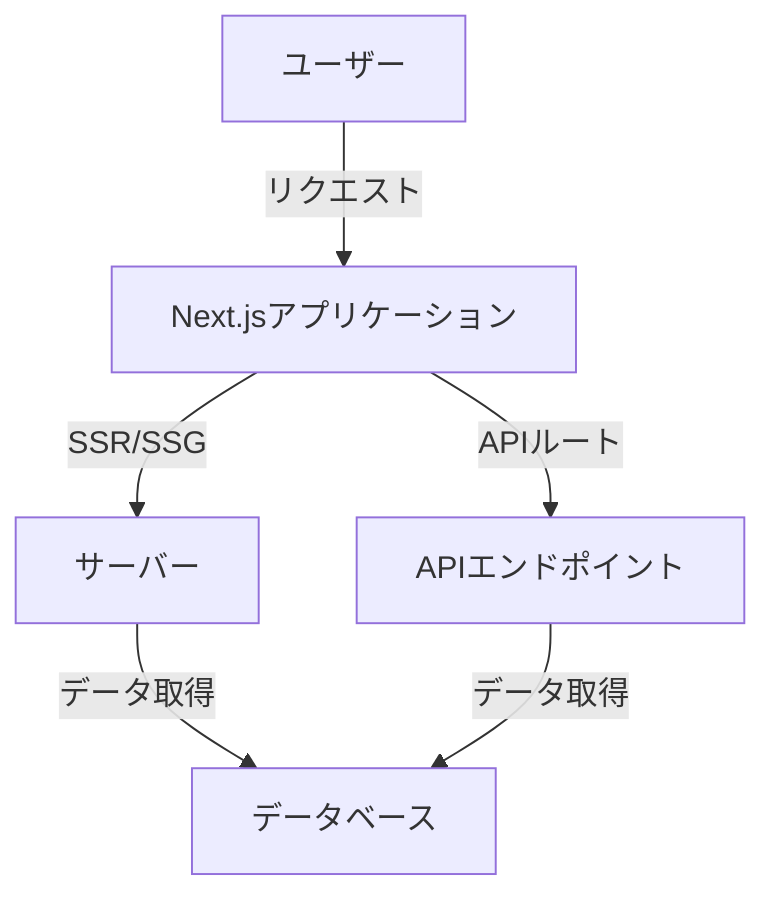
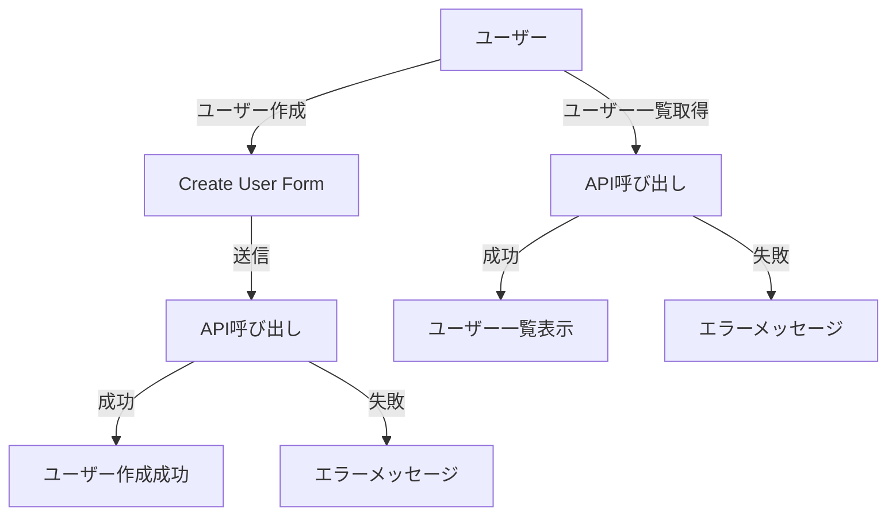

# Next.jsとtRPCで始めるタイプセーフなAPI開発

## はじめに

近年、Webアプリケーションの開発において、フロントエンドとバックエンドの連携がますます重要になっています。特に、APIの設計と実装は、アプリケーションのパフォーマンスやメンテナンス性に大きな影響を与えます。そこで注目されているのが、Next.jsとtRPCの組み合わせです。Next.jsはReactベースのフレームワークであり、tRPCはタイプセーフなAPIを構築するためのライブラリです。この二つを組み合わせることで、開発者は効率的かつ安全にAPIを構築することができます。

本記事では、Next.jsとtRPCを使用してタイプセーフなAPIを開発する方法について詳しく解説します。具体的には、以下のトピックを取り上げます。

- Next.jsの基本概念
- tRPCの概要と特徴
- Next.jsとtRPCの統合方法
- 実践的なコードサンプル
- よくある課題とその解決策

これらの内容を通じて、読者がNext.jsとtRPCを用いたAPI開発の基礎を理解し、実際のプロジェクトに応用できるようになることを目指します。

## Next.jsの基本概念

### Next.jsとは？

Next.jsは、Reactをベースにしたフレームワークで、サーバーサイドレンダリング（SSR）や静的サイト生成（SSG）を簡単に実現できるツールです。これにより、SEO対策やパフォーマンスの向上が期待できます。Next.jsは、以下のような特徴を持っています。

- **ページベースのルーティング**: Next.jsでは、`pages`ディレクトリ内にファイルを作成することで、自動的にルーティングが設定されます。これにより、開発者はルーティングの設定に煩わされることなく、迅速にページを作成できます。

- **APIルート**: Next.jsは、APIエンドポイントを簡単に作成できる機能を提供します。これにより、フロントエンドとバックエンドの開発が一元化され、開発効率が向上します。APIルートは、`pages/api`ディレクトリ内にファイルを作成することで定義できます。

- **自動コード分割**: Next.jsは、ページごとに必要なコードだけを読み込むため、初回の読み込み時間を短縮できます。これにより、ユーザー体験が向上し、アプリケーションのパフォーマンスが改善されます。

- **ホットリローディング**: 開発中にコードを変更すると、ブラウザが自動的に更新され、変更を即座に確認できます。これにより、開発サイクルが短縮され、効率的な開発が可能になります。

- **静的ファイルの提供**: Next.jsは、`public`ディレクトリ内に静的ファイルを配置することで、簡単に静的リソースを提供できます。これにより、画像やCSSファイルなどを簡単に管理できます。

### Next.jsのインストールと基本的なセットアップ

Next.jsを使用するためには、Node.jsがインストールされている必要があります。以下の手順でNext.jsのプロジェクトを作成します。

```bash
npx create-next-app@latest my-next-app
cd my-next-app
npm run dev
```

これで、`http://localhost:3000`にアクセスすると、Next.jsの初期画面が表示されます。プロジェクトが正しくセットアップされたことを確認したら、次にページを作成してみましょう。

#### ページの作成

`pages`ディレクトリ内に新しいファイルを作成することで、新しいページを追加できます。例えば、`about.js`というファイルを作成し、以下のように記述します。

```javascript
// pages/about.js
const About = () => {
  return <h1>About Us</h1>;
};

export default About;
```

このファイルを作成した後、`http://localhost:3000/about`にアクセスすると、「About Us」というタイトルが表示されます。

### Next.jsのアーキテクチャ

Next.jsのアーキテクチャは、フロントエンドとバックエンドの統合を容易にするために設計されています。以下のダイアグラムは、Next.jsの基本的なアーキテクチャを示しています。



このダイアグラムは、ユーザーがNext.jsアプリケーションにリクエストを送信し、サーバーがSSRまたはSSGを通じてデータを取得する流れを示しています。また、APIルートを介してデータベースからデータを取得する様子も表現しています。

## tRPCの概要と特徴

### tRPCとは？

tRPCは、TypeScriptを使用してタイプセーフなAPIを構築するためのライブラリです。tRPCを使用することで、フロントエンドとバックエンドの間で型情報を共有でき、開発時のエラーを減少させることができます。tRPCの主な特徴は以下の通りです。

- **タイプセーフ**: TypeScriptの型を利用して、APIのリクエストやレスポンスの型を自動的に生成します。これにより、開発者は型の不一致によるエラーを未然に防ぐことができます。

- **シンプルなAPI**: RESTやGraphQLのような複雑な設定が不要で、簡単にAPIを定義できます。tRPCでは、関数を定義するだけでAPIエンドポイントが作成されます。

- **リアルタイム通信**: WebSocketを使用して、リアルタイムでデータをやり取りすることが可能です。これにより、チャットアプリや通知システムなど、リアルタイム性が求められるアプリケーションの開発が容易になります。

- **自動生成された型**: tRPCは、APIの型を自動的に生成するため、フロントエンドとバックエンドで型の整合性を保つことができます。これにより、開発者はAPIの変更に対して迅速に対応できます。

### tRPCのインストールと基本的なセットアップ

tRPCをNext.jsプロジェクトに追加するには、以下のコマンドを実行します。

```bash
npm install @trpc/server @trpc/client zod
```

次に、tRPCの基本的なセットアップを行います。以下のように、APIルートを作成します。

```typescript
// pages/api/trpc/[trpc].ts
import { createNextApiHandler } from '@trpc/server/adapters/next';
import { appRouter } from '../../../server/router';

export default createNextApiHandler({
  router: appRouter,
  createContext: () => null,
});
```

このコードは、tRPCのAPIハンドラーを作成し、`appRouter`を使用してAPIエンドポイントを定義します。

## Next.jsとtRPCの統合方法

### APIルーターの作成

tRPCを使用するためには、まずAPIルーターを作成する必要があります。以下のように、ルーターを定義します。

```typescript
// server/router.ts
import { createRouter } from '@trpc/server';
import { z } from 'zod';

export const appRouter = createRouter()
  .query('getUser', {
    input: z.string(),
    resolve({ input }) {
      return { id: input, name: 'John Doe' };
    },
  })
  .mutation('createUser', {
    input: z.object({
      name: z.string(),
    }),
    resolve({ input }) {
      // ユーザーを作成するロジック
      return { id: '1', name: input.name };
    },
  });

export type AppRouter = typeof appRouter;
```

このコードでは、`getUser`クエリと`createUser`ミューテーションを定義しています。`zod`ライブラリを使用して、入力のバリデーションを行っています。

### フロントエンドでのtRPCの使用

次に、フロントエンドでtRPCを使用するための設定を行います。以下のように、tRPCクライアントを作成します。

```typescript
// utils/trpc.ts
import { createReactQueryHooks } from '@trpc/react';
import type { AppRouter } from '../server/router';

export const trpc = createReactQueryHooks<AppRouter>();
```

これで、tRPCを使用してAPIを呼び出す準備が整いました。以下のように、コンポーネント内でAPIを呼び出すことができます。

```typescript
// pages/index.tsx
import { trpc } from '../utils/trpc';

const Home = () => {
  const { data, isLoading } = trpc.useQuery(['getUser', '1']);

  if (isLoading) return <div>Loading...</div>;

  return <div>User: {data?.name}</div>;
};

export default Home;
```

このコードでは、`getUser`クエリを呼び出し、ユーザー情報を表示しています。`isLoading`フラグを使用して、データが読み込まれている間は「Loading...」と表示します。

## 実践的なコードサンプル

### ユーザー管理アプリの例

ここでは、ユーザー管理アプリを例に、Next.jsとtRPCを使用したAPIの実装を示します。

#### 1. ユーザー一覧の取得

まず、ユーザー一覧を取得するAPIを実装します。

```typescript
// server/router.ts
export const appRouter = createRouter()
  .query('getUsers', {
    resolve() {
      return [
        { id: '1', name: 'John Doe' },
        { id: '2', name: 'Jane Doe' },
      ];
    },
  });
```

フロントエンドでは、以下のようにユーザー一覧を表示します。

```typescript
// pages/users.tsx
import { trpc } from '../utils/trpc';

const Users = () => {
  const { data, isLoading } = trpc.useQuery(['getUsers']);

  if (isLoading) return <div>Loading...</div>;

  return (
    <ul>
      {data?.map(user => (
        <li key={user.id}>{user.name}</li>
      ))}
    </ul>
  );
};

export default Users;
```

このコードでは、`getUsers`クエリを呼び出し、取得したユーザー情報をリスト表示しています。

#### 2. ユーザーの作成

次に、ユーザーを作成するAPIを実装します。

```typescript
// server/router.ts
export const appRouter = createRouter()
  .mutation('createUser', {
    input: z.object({
      name: z.string(),
    }),
    resolve({ input }) {
      // ユーザーを作成するロジック
      return { id: '3', name: input.name };
    },
  });
```

フロントエンドでは、以下のようにユーザーを作成するフォームを実装します。

```typescript
// pages/create-user.tsx
import { useState } from 'react';
import { trpc } from '../utils/trpc';

const CreateUser = () => {
  const [name, setName] = useState('');
  const mutation = trpc.useMutation('createUser');

  const handleSubmit = async (e: React.FormEvent) => {
    e.preventDefault();
    await mutation.mutateAsync({ name });
    setName('');
  };

  return (
    <form onSubmit={handleSubmit}>
      <input
        type="text"
        value={name}
        onChange={(e) => setName(e.target.value)}
        placeholder="Enter name"
      />
      <button type="submit">Create User</button>
    </form>
  );
};

export default CreateUser;
```

このコードでは、ユーザー名を入力するフォームを作成し、送信ボタンをクリックすると新しいユーザーが作成されます。

### ユーザー管理のフロー

ユーザー管理アプリのフローを視覚化するために、以下のフローチャートを示します。このフローチャートは、ユーザーの作成と取得の流れを表しています。



このフローチャートは、ユーザーが新しいユーザーを作成する際の流れと、ユーザー一覧を取得する際の流れを示しています。ユーザーがフォームに入力し、APIを呼び出すことで、成功または失敗の結果が得られることが視覚的に表現されています。

## よくある課題とその解決策

### 課題1: 型の不一致

tRPCを使用する際に、フロントエンドとバックエンドで型が一致しない場合があります。これを防ぐためには、APIの型を一元管理することが重要です。tRPCでは、APIの型を自動的に生成するため、型の不一致を防ぐことができます。具体的には、`AppRouter`型をフロントエンドとバックエンドで共有することで、型の整合性を保つことができます。

### 課題2: エラーハンドリング

API呼び出し時にエラーが発生することがあります。tRPCでは、エラーハンドリングを簡単に行うことができます。以下のように、エラーをキャッチして表示することができます。

```typescript
const { data, error } = trpc.useQuery(['getUser', '1']);

if (error) return <div>Error: {error.message}</div>;
```

このコードでは、API呼び出しに失敗した場合にエラーメッセージを表示します。

### 課題3: パフォーマンスの最適化

APIの呼び出しが多くなると、パフォーマンスに影響を与えることがあります。tRPCでは、React Queryを使用してキャッシュを管理するため、同じデータを再度取得する際にパフォーマンスを向上させることができます。例えば、以下のように`staleTime`を設定することで、データの再取得を制御できます。

```typescript
const { data } = trpc.useQuery(['getUsers'], {
  staleTime: 60000, // 1分間キャッシュを保持
});
```

## まとめ

本記事では、Next.jsとtRPCを使用してタイプセーフなAPIを開発する方法について解説しました。Next.jsの基本概念やtRPCの特徴、実際のコードサンプルを通じて、読者がこの技術スタックを理解し、実際のプロジェクトに応用できるようになることを目指しました。

Next.jsとtRPCを組み合わせることで、開発者は効率的かつ安全にAPIを構築できるため、今後のWebアプリケーション開発において非常に有用な技術となるでしょう。さらに学習を進めるためには、公式ドキュメントやコミュニティのリソースを活用することをお勧めします。

-----

※本記事は生成AIを使用して作成されました。
AI言語モデル: gpt-4o-mini