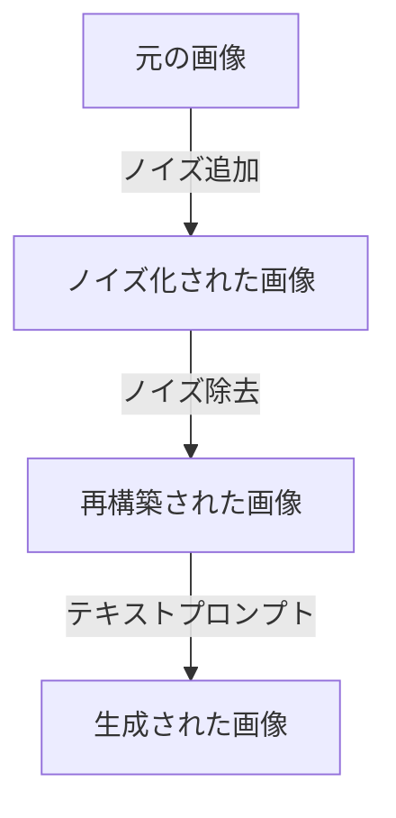

# 画像生成AI Stable Diffusion入門

## はじめに

近年、人工知能（AI）の進化により、画像生成技術が急速に発展しています。その中でも、Stable Diffusionは特に注目を集めている技術の一つです。Stable Diffusionは、テキストから高品質な画像を生成する能力を持ち、アート、デザイン、広告など多岐にわたる分野での応用が期待されています。本記事では、Stable Diffusionの基本概念、技術的な背景、実際の使用方法、そしてその応用例について詳しく解説します。

## Stable Diffusionとは？

Stable Diffusionは、テキストから画像を生成するための深層学習モデルです。特に、拡散モデルと呼ばれる新しいアプローチを採用しており、これにより高解像度でリアルな画像を生成することが可能です。従来の生成モデルと比較して、Stable Diffusionはより効率的で、少ない計算リソースで高品質な画像を生成できる点が特徴です。

### 拡散モデルの基本概念

拡散モデルは、データをノイズで汚染し、そのノイズを徐々に取り除くことで元のデータを再構築するプロセスに基づいています。このプロセスは、以下の2つの主要なステップで構成されています。

1. **前方プロセス**: 元の画像にノイズを加え、徐々にデータを破壊していく過程です。この過程では、画像が完全にノイズ化されるまで繰り返されます。具体的には、元の画像に対してガウスノイズを加え、時間の経過とともにノイズの強度を増加させます。このプロセスは、データの分布を学習するために重要です。

2. **逆プロセス**: ノイズ化された画像から元の画像を再構築する過程です。この過程では、学習したモデルを使用して、ノイズを徐々に取り除いていきます。逆プロセスは、条件付き生成を行うために、テキストプロンプトを入力として受け取ります。これにより、特定の内容に基づいた画像を生成することが可能になります。

以下のダイアグラムは、拡散モデルの前方プロセスと逆プロセスの流れを視覚的に示しています。



このダイアグラムは、Stable Diffusionの基本的なプロセスを示しており、元の画像がどのようにノイズ化され、再構築されるかを視覚的に理解するのに役立ちます。

## Stable Diffusionの技術的背景

Stable Diffusionは、特に以下の技術的要素に基づいています。

### 1. 深層学習

Stable Diffusionは、深層学習を用いて画像生成を行います。深層学習は、人工神経ネットワークを使用してデータを処理し、特徴を学習する手法です。これにより、モデルは複雑なパターンを認識し、高度な生成能力を持つようになります。特に、畳み込みニューラルネットワーク（CNN）やトランスフォーマーアーキテクチャが使用され、画像の特徴を効果的に抽出します。

### 2. トランスフォーマーアーキテクチャ

Stable Diffusionは、トランスフォーマーアーキテクチャを採用しています。トランスフォーマーは、自然言語処理（NLP）での成功により広く知られるようになりましたが、画像生成にも応用されています。このアーキテクチャは、自己注意機構を使用して、入力データの異なる部分間の関係を学習します。これにより、テキストプロンプトに基づいて画像を生成する際に、文脈を考慮した生成が可能になります。

### 3. データセット

Stable Diffusionは、大規模なデータセットを使用して訓練されます。これにより、モデルは多様なスタイルやコンテンツを学習し、さまざまなテキストプロンプトに対して適切な画像を生成する能力を持ちます。具体的には、インターネット上の画像とそのキャプションを組み合わせたデータセットが使用され、数百万から数十億の画像が含まれています。このような多様なデータセットにより、モデルは一般化能力を高め、さまざまなシナリオに対応できるようになります。

## Stable Diffusionの使用方法

Stable Diffusionを使用するためには、いくつかのステップがあります。以下に、基本的な使用方法を示します。

### 1. 環境のセットアップ

Stable Diffusionを使用するためには、Python環境を整える必要があります。以下は、必要なライブラリのインストール手順です。

```bash
pip install torch torchvision torchaudio
pip install transformers
pip install diffusers
```

これにより、PyTorch、Transformers、Diffusersライブラリがインストールされ、Stable Diffusionを実行するための準備が整います。

### 2. モデルのロード

次に、Stable Diffusionモデルをロードします。以下のコードは、Hugging FaceのTransformersライブラリを使用してモデルをロードする例です。

```python
from diffusers import StableDiffusionPipeline

# モデルのロード
pipe = StableDiffusionPipeline.from_pretrained("CompVis/stable-diffusion-v1-4")
pipe.to("cuda")  # GPUを使用する場合
```

このコードでは、Stable Diffusionの事前訓練済みモデルをロードし、GPUを使用する設定にしています。GPUを使用することで、画像生成の速度が大幅に向上します。

### 3. 画像の生成

モデルがロードできたら、テキストプロンプトを入力して画像を生成します。以下は、画像生成の例です。

```python
prompt = "A fantasy landscape with mountains and a river"
image = pipe(prompt).images[0]

# 画像の保存
image.save("generated_image.png")
```

このコードを実行すると、指定したプロンプトに基づいて画像が生成され、"generated_image.png"というファイル名で保存されます。生成された画像は、プロンプトに応じた内容を反映しており、アートやデザインのインスピレーションとして利用できます。

## 実践的な応用例

Stable Diffusionは、さまざまな分野での応用が期待されています。以下にいくつかの具体的な例を示します。

### 1. アートとデザイン

アーティストやデザイナーは、Stable Diffusionを使用して新しいアート作品を生成したり、デザインのアイデアを視覚化したりすることができます。例えば、特定のテーマやスタイルに基づいて画像を生成し、インスピレーションを得ることができます。アーティストは、生成された画像を基に新しい作品を創作したり、既存の作品に新たな要素を加えたりすることができます。

### 2. ゲーム開発

ゲーム開発者は、Stable Diffusionを使用してキャラクターや背景のコンセプトアートを生成することができます。これにより、開発プロセスを効率化し、クリエイティブなアイデアを迅速に具現化することが可能です。例えば、ゲームの世界観に合った風景やキャラクターのデザインを生成し、プロトタイプの段階で視覚的なフィードバックを得ることができます。

### 3. マーケティングと広告

マーケティング担当者は、Stable Diffusionを使用して広告素材やプロモーション用のビジュアルを生成することができます。特定のメッセージやテーマに基づいて画像を生成することで、ターゲットオーディエンスに訴求するコンテンツを作成できます。例えば、新商品のプロモーションに合わせたビジュアルを生成し、SNSやウェブサイトでの広告に活用することができます。

### 4. 教育と研究

教育機関や研究者も、Stable Diffusionを活用して視覚的な教材や研究資料を生成することができます。例えば、歴史的な出来事や科学的な概念を視覚化するための画像を生成し、学習効果を高めることができます。また、研究者は、特定のテーマに関連する画像を生成し、データ分析やプレゼンテーションに利用することができます。

## 課題と今後の展望

Stable Diffusionは非常に強力なツールですが、いくつかの課題も存在します。以下に、主な課題と今後の展望を示します。

### 1. バイアスと倫理的問題

AIモデルは、訓練に使用されるデータに基づいて学習します。そのため、データに含まれるバイアスがモデルに影響を与える可能性があります。これにより、生成される画像が特定の文化や人種に対して偏った表現をすることがあります。今後は、より公平で多様なデータセットを使用することが求められます。また、生成された画像が社会的に敏感なテーマに関連する場合、倫理的な配慮が必要です。

### 2. 著作権と知的財産

生成された画像の著作権や知的財産に関する問題も重要です。特に、商業利用を考える場合、生成された画像が他の作品に似ている場合、法的な問題が発生する可能性があります。これに対処するためには、明確なガイドラインや規制が必要です。例えば、生成された画像の使用に関するライセンスや、著作権の帰属についてのルールを整備することが求められます。

### 3. 技術の進化

Stable Diffusionを含む画像生成技術は、今後も進化し続けるでしょう。新しいアルゴリズムやアプローチが開発されることで、より高品質な画像生成が可能になると期待されます。また、ユーザーインターフェースの改善や、より直感的な操作が可能になることで、幅広いユーザーに利用されるようになるでしょう。さらに、生成された画像の品質向上や、生成速度の向上も期待されます。

## まとめ

Stable Diffusionは、テキストから高品質な画像を生成するための強力なツールです。深層学習や拡散モデルの技術を活用し、さまざまな分野での応用が期待されています。この記事では、Stable Diffusionの基本概念、技術的背景、使用方法、実践的な応用例、そして課題と今後の展望について詳しく解説しました。

今後もこの技術は進化し続け、私たちのクリエイティブな活動を支援する重要なツールとなるでしょう。興味のある方は、ぜひ実際にStable Diffusionを試してみて、その可能性を体験してみてください。

-----

※本記事は生成AIを使用して作成されました。
AI言語モデル: gpt-4o-mini