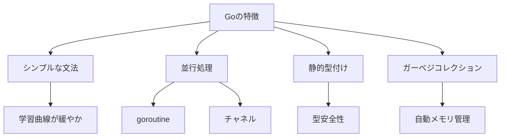

# Go再入門 | The Go Programming Language

## はじめに

Go（ゴー）は、Googleによって開発されたプログラミング言語であり、シンプルさと効率性を重視しています。2009年に初めてリリースされて以来、Goは特にサーバーサイドアプリケーションやクラウドサービスの開発において人気を博しています。本記事では、Goの基本的な概念、特徴、実践的な使用例、そして最新の情報を提供し、Goを再入門するためのガイドを提供します。

以下のダイアグラムは、Goの基本的な特徴を視覚的に表現しています。これにより、Goの特性を理解しやすくなります。



このダイアグラムは、Goの主要な特徴を示しており、各特徴がどのように相互に関連しているかを視覚的に理解するのに役立ちます。

## Goの基本概念

### 1. Goの特徴

Goは、以下のような特徴を持っています。

- **シンプルな文法**: Goの文法は非常にシンプルで、学習曲線が緩やかです。これにより、初心者でも比較的容易に習得できます。例えば、Goではセミコロンが自動的に挿入されるため、コードがすっきりとし、可読性が向上します。また、Goの文法はC言語に似ているため、C系言語に慣れた開発者にとっては学習が容易です。

- **並行処理**: Goは、goroutineと呼ばれる軽量スレッドを使用して、並行処理を簡単に実装できます。これにより、高いパフォーマンスを実現します。goroutineは、数千から数万のスレッドを同時に実行できるため、特にI/Oバウンドなアプリケーションにおいて非常に効果的です。Goの並行処理は、チャネルを使用してデータを安全にやり取りできるため、デッドロックや競合状態を避けることができます。

- **静的型付け**: Goは静的型付けの言語であり、コンパイル時に型チェックが行われます。これにより、実行時エラーを減少させることができます。型安全性が高いため、開発者はより信頼性の高いコードを書くことができます。型推論もサポートされており、変数宣言時に型を明示的に指定しなくても、コンパイラが自動的に型を推測します。

- **ガーベジコレクション**: Goは自動的にメモリ管理を行うガーベジコレクション機能を備えており、開発者はメモリ管理の煩わしさから解放されます。これにより、メモリリークのリスクが低減し、開発者はアプリケーションのロジックに集中できます。Goのガーベジコレクションは、リアルタイムで動作し、アプリケーションのパフォーマンスに影響を与えないように設計されています。

### 2. Goのインストール

Goを使用するためには、まずGoの開発環境をセットアップする必要があります。以下の手順でインストールを行います。

1. [Goの公式サイト](https://golang.org/dl/)から最新のGoのバージョンをダウンロードします。Goは、Windows、macOS、Linuxなどの主要なオペレーティングシステムに対応しています。

2. ダウンロードしたインストーラーを実行し、指示に従ってインストールします。インストール中に、Goのパスを環境変数に追加するオプションが表示されるので、これを選択することをお勧めします。これにより、コマンドラインから`go`コマンドを直接実行できるようになります。

3. インストールが完了したら、コマンドラインで以下のコマンドを実行して、Goが正しくインストールされたか確認します。

   ```bash
   go version
   ```

   正常にインストールされていれば、Goのバージョン情報が表示されます。また、`go env`コマンドを使用して、Goの環境設定を確認することもできます。

### 3. Goの基本的な文法

Goの基本的な文法を理解するために、以下の簡単なプログラムを見てみましょう。

```go
package main

import "fmt"

func main() {
    fmt.Println("Hello, World!")
}
```

このプログラムは、Goの基本的な構造を示しています。`package main`は、プログラムが実行可能なエントリポイントであることを示し、`import "fmt"`は、フォーマットされたI/Oを提供するパッケージをインポートしています。`main`関数は、プログラムの実行が開始される場所です。

Goでは、関数の定義や変数の宣言が非常に直感的であり、例えば、変数の宣言は以下のように行います。

```go
var x int = 10
y := 20 // 短縮記法
```

このように、`:=`を使用することで、型を明示的に指定せずに変数を宣言することができます。Goでは、変数のスコープがブロック内に限定されるため、変数の管理が容易です。

## Goのデータ型

Goには、いくつかの基本的なデータ型があります。以下に主要なデータ型を示します。

### 1. 数値型

Goには、整数型（`int`、`int8`、`int16`、`int32`、`int64`）と浮動小数点型（`float32`、`float64`）があります。以下は、整数型の例です。

```go
var a int = 10
var b int64 = 20
var c float64 = 30.5
```

Goでは、整数型のサイズはプラットフォームに依存しますが、`int`は通常、32ビットまたは64ビットのいずれかです。浮動小数点型は、精度が異なるため、計算の必要に応じて適切な型を選択することが重要です。例えば、`float32`はメモリ使用量が少ないですが、精度が低いため、科学計算などには`float64`を使用することが推奨されます。

### 2. 文字列型

Goの文字列は、`string`型で表されます。文字列は、二重引用符で囲まれた文字のシーケンスです。Goの文字列は不変であり、一度作成された文字列は変更できません。

```go
var name string = "Go Programming"
```

文字列の連結は、`+`演算子を使用して行います。

```go
greeting := "Hello, " + name
```

また、Goでは文字列の長さを取得するために、`len`関数を使用します。

```go
length := len(name) // 文字列の長さを取得
```

### 3. ブール型

Goのブール型は、`bool`型で表され、`true`または`false`の値を取ります。条件分岐やループの制御に使用されます。

```go
var isActive bool = true
```

ブール型は、条件式の評価やフラグの管理に役立ちます。例えば、特定の条件が満たされた場合に処理を実行する際に使用されます。

## Goの制御構文

Goには、一般的な制御構文が用意されています。以下に、条件分岐とループの例を示します。

### 1. 条件分岐

Goの条件分岐は、`if`文を使用して実装します。`if`文は、条件が真である場合に特定のコードブロックを実行します。

```go
age := 18
if age >= 18 {
    fmt.Println("You are an adult.")
} else {
    fmt.Println("You are a minor.")
}
```

Goでは、`if`文の条件式に複数の条件を組み合わせることも可能です。

```go
if age < 13 {
    fmt.Println("You are a child.")
} else if age < 20 {
    fmt.Println("You are a teenager.")
} else {
    fmt.Println("You are an adult.")
}
```

また、`switch`文を使用することで、複数の条件を簡潔に表現することもできます。

```go
switch age {
case 0, 1, 2, 3, 4, 5:
    fmt.Println("You are a toddler.")
case 6, 7, 8, 9, 10, 11, 12:
    fmt.Println("You are a child.")
default:
    fmt.Println("You are an adult.")
}
```

### 2. ループ

Goでは、`for`文を使用してループを実装します。以下は、1から5までの数を出力する例です。

```go
for i := 1; i <= 5; i++ {
    fmt.Println(i)
}
```

Goの`for`文は、他の言語の`while`文や`do-while`文の機能も持っています。以下は、`while`のような使い方の例です。

```go
j := 1
for j <= 5 {
    fmt.Println(j)
    j++
}
```

また、無限ループを作成することも可能です。

```go
for {
    fmt.Println("This will run forever!")
}
```

無限ループは、特定の条件で終了させる場合に便利ですが、注意が必要です。

## Goの関数

Goでは、関数を定義することができます。関数は、特定のタスクを実行するための再利用可能なコードのブロックです。以下は、関数の定義と呼び出しの例です。

```go
func add(a int, b int) int {
    return a + b
}

func main() {
    result := add(5, 10)
    fmt.Println("Result:", result)
}
```

Goでは、関数は複数の戻り値を返すことができます。以下は、複数の戻り値を持つ関数の例です。

```go
func divide(a, b int) (int, error) {
    if b == 0 {
        return 0, fmt.Errorf("division by zero")
    }
    return a / b, nil
}
```

このように、エラーを戻り値として返すことで、呼び出し元でエラーハンドリングを行うことができます。関数の引数には、デフォルト値を設定することはできませんが、可変長引数を使用することで、任意の数の引数を受け取ることができます。

```go
func sum(numbers ...int) int {
    total := 0
    for _, number := range numbers {
        total += number
    }
    return total
}
```

## Goの構造体とインターフェース

Goは、構造体とインターフェースを使用して、データの構造を定義し、オブジェクト指向プログラミングの概念をサポートしています。

### 1. 構造体

構造体は、異なるデータ型を組み合わせて新しいデータ型を作成するための方法です。以下は、構造体の定義と使用例です。

```go
type Person struct {
    Name string
    Age  int
}

func main() {
    p := Person{Name: "Alice", Age: 30}
    fmt.Println(p.Name, p.Age)
}
```

構造体は、メソッドを持つこともできます。以下は、構造体にメソッドを追加する例です。

```go
func (p Person) Greet() {
    fmt.Printf("Hello, my name is %s and I am %d years old.\n", p.Name, p.Age)
}
```

このように、構造体にメソッドを追加することで、データとその操作を一緒に管理することができます。

### 2. インターフェース

インターフェースは、特定のメソッドを持つことを保証するための型です。以下は、インターフェースの例です。

```go
type Animal interface {
    Speak() string
}

type Dog struct{}

func (d Dog) Speak() string {
    return "Woof!"
}

func main() {
    var a Animal = Dog{}
    fmt.Println(a.Speak())
}
```

インターフェースを使用することで、異なる型のオブジェクトを同じ方法で扱うことができ、ポリモーフィズムを実現できます。これにより、コードの再利用性が向上し、柔軟な設計が可能になります。

## Goの並行処理

Goの大きな特徴の一つは、並行処理を簡単に実装できることです。Goでは、`goroutine`を使用して軽量なスレッドを作成できます。

### 1. goroutineの使用

以下は、goroutineを使用した並行処理の例です。

```go
func sayHello() {
    fmt.Println("Hello from goroutine!")
}

func main() {
    go sayHello()
    fmt.Println("Hello from main!")
    time.Sleep(1 * time.Second) // goroutineが完了するのを待つ
}
```

`go`キーワードを使用することで、関数を非同期に実行できます。`time.Sleep`を使用して、メイン関数が終了する前にgoroutineが完了するのを待っています。goroutineは非常に軽量で、数千のgoroutineを同時に実行することが可能です。

### 2. チャネルの使用

Goでは、チャネルを使用してgoroutine間でデータを送受信できます。チャネルは、データの送受信を安全に行うための手段です。

```go
func main() {
    ch := make(chan string)

    go func() {
        ch <- "Hello from goroutine!"
    }()

    msg := <-ch
    fmt.Println(msg)
}
```

この例では、goroutineがチャネルを通じてメッセージを送信し、メイン関数がそのメッセージを受信しています。チャネルを使用することで、データの整合性を保ちながら並行処理を行うことができます。チャネルは、バッファ付きとバッファなしの2種類があり、バッファ付きチャネルは、指定した数のデータを保持できるため、goroutine間の通信をより柔軟に行うことができます。

## Goのエラーハンドリング

Goでは、エラーハンドリングが重要な役割を果たします。Goのエラーハンドリングは、戻り値としてエラーを返すことで行います。これにより、エラーが発生した場合でも、プログラムの流れを維持しやすくなります。

```go
func divide(a, b int) (int, error) {
    if b == 0 {
        return 0, fmt.Errorf("division by zero")
    }
    return a / b, nil
}

func main() {
    result, err := divide(10, 0)
    if err != nil {
        fmt.Println("Error:", err)
    } else {
        fmt.Println("Result:", result)
    }
}
```

このように、エラーが発生した場合は、エラーメッセージを返し、呼び出し元で適切に処理することができます。Goでは、エラーは通常、`error`型として返され、エラーが発生したかどうかを簡単に確認できます。

## Goのパッケージ管理

Goでは、パッケージを使用してコードを整理し、再利用可能なモジュールを作成します。Goのパッケージ管理には、`go mod`が使用されます。

### 1. モジュールの作成

新しいモジュールを作成するには、以下のコマンドを実行します。

```bash
go mod init example.com/my-module
```

これにより、`go.mod`ファイルが作成され、モジュールの依存関係が管理されます。`go.mod`ファイルには、モジュール名や依存関係のバージョン情報が含まれています。

### 2. 依存関係の管理

依存関係を追加するには、`go get`コマンドを使用します。

```bash
go get github.com/some/package
```

これにより、指定したパッケージがダウンロードされ、`go.mod`ファイルに追加されます。依存関係のバージョン管理も自動的に行われるため、開発者は安心してパッケージを利用できます。また、`go mod tidy`コマンドを使用することで、不要な依存関係を削除し、`go.mod`ファイルを整理することができます。

## Goのテスト

Goには、組み込みのテストフレームワークがあり、ユニットテストを簡単に作成できます。テストは、コードの品質を保つために非常に重要です。

### 1. テストの作成

テストは、`*_test.go`というファイル名で作成します。以下は、テストの例です。

```go
package main

import "testing"

func TestAdd(t *testing.T) {
    result := add(2, 3)
    if result != 5 {
        t.Errorf("Expected 5, but got %d", result)
    }
}
```

このテストでは、`add`関数が正しい結果を返すかどうかを確認しています。テストが失敗した場合、エラーメッセージが表示されます。Goのテストフレームワークは、テストの実行や結果の報告を自動的に行います。

### 2. テストの実行

テストを実行するには、以下のコマンドを使用します。

```bash
go test
```

これにより、同じパッケージ内のすべてのテストが実行され、結果が表示されます。テストのカバレッジを確認するためには、以下のコマンドを使用します。

```bash
go test -cover
```

これにより、テストがカバーしているコードの割合が表示され、テストの充実度を確認することができます。

## Goの最新情報

Goは、常に進化を続けており、最新のバージョンでは新しい機能や改善が追加されています。2023年10月時点での最新バージョンはGo 1.20であり、以下のような新機能が追加されています。

- **型推論の改善**: より多くの状況で型推論が行われるようになり、コードが簡潔になりました。これにより、開発者は型を明示的に指定する必要が少なくなります。

- **エラーメッセージの改善**: エラーメッセージがより明確になり、デバッグが容易になりました。特に、コンパイルエラーやランタイムエラーのメッセージが改善され、問題の特定が迅速に行えるようになりました。

- **新しい標準ライブラリの追加**: 新しいパッケージが追加され、開発者がより多くの機能を利用できるようになりました。例えば、HTTPクライアントやJSON処理の機能が強化されています。

## まとめ

Goは、シンプルで効率的なプログラミング言語であり、特に並行処理やサーバーサイドアプリケーションの開発に適しています。本記事では、Goの基本的な概念、データ型、制御構文、関数、構造体、並行処理、エラーハンドリング、パッケージ管理、テスト、そして最新の情報について詳しく解説しました。

Goを学ぶことで、開発者は高いパフォーマンスを持つアプリケーションを効率的に構築できるようになります。今後もGoの進化に注目し、最新の情報を追い続けることが重要です。

さらに学習を進めるためのリソースとして、以下のリンクを参考にしてください。

- [Go公式ドキュメント](https://golang.org/doc/)
- [Go by Example](https://gobyexample.com/)
- [Effective Go](https://golang.org/doc/effective_go.html)

-----

※本記事は生成AIを使用して作成されました。
AI言語モデル: gpt-4o-mini