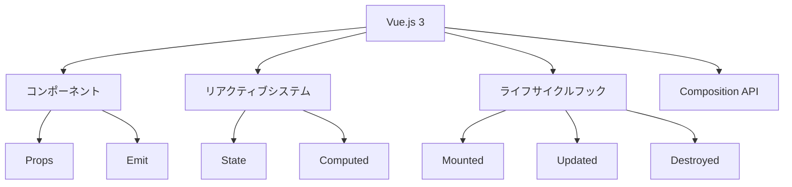

# Vue.js 3とComposition API：状態管理の新しいアプローチ

## はじめに

Vue.jsは、シンプルで柔軟なフロントエンドフレームワークとして広く利用されています。特に、Vue.js 3では、Composition APIという新しいアプローチが導入され、状態管理やコンポーネントの設計において大きな変革をもたらしました。本記事では、Vue.js 3のComposition APIを中心に、状態管理の新しいアプローチについて詳しく解説します。

## Vue.js 3の概要

Vue.js 3は、Vue.jsの最新バージョンであり、パフォーマンスの向上、TypeScriptのサポート、Composition APIの導入など、多くの新機能が追加されています。これにより、開発者はより効率的にアプリケーションを構築できるようになりました。

### Vue.js 3の主な特徴

- **パフォーマンスの向上**: Vue.js 3は、仮想DOMの最適化やコンパイラの改善により、パフォーマンスが大幅に向上しています。特に、コンポーネントの再利用性が高まり、アプリケーションの初期読み込み時間が短縮されました。これにより、ユーザーエクスペリエンスが向上し、特にモバイルデバイスでのパフォーマンスが改善されました。

- **TypeScriptのサポート**: TypeScriptを使用することで、型安全性が向上し、大規模なアプリケーションの開発が容易になります。Vue.js 3では、TypeScriptの型定義が強化されており、開発者はより安心してコードを書くことができます。これにより、開発チームはコードの品質を保ちながら、迅速に機能を追加することが可能になります。

- **Composition API**: 状態管理やロジックの再利用を容易にする新しいAPIです。これにより、開発者はより柔軟にコンポーネントを設計でき、コードの可読性と保守性が向上します。Composition APIは、特に大規模なアプリケーションにおいて、ロジックの分離と再利用を促進します。

### Vue.js 3のアーキテクチャ

Vue.js 3のアーキテクチャは、コンポーネントベースであり、各コンポーネントは独立して機能します。以下のダイアグラムは、Vue.js 3の基本的なアーキテクチャを示しています。



このダイアグラムは、Vue.js 3の主要な要素とその関係を示しています。コンポーネントは、リアクティブシステムやライフサイクルフックと連携して動作し、Composition APIを通じてロジックを再利用します。

## Composition APIとは？

Composition APIは、Vue.js 3で導入された新しいAPIで、従来のOptions APIに代わるものです。これにより、コンポーネントのロジックをより柔軟に構成できるようになります。

### Composition APIの基本概念

Composition APIでは、`setup`関数を使用して、コンポーネントの状態やメソッドを定義します。これにより、状態管理がより直感的になり、コードの可読性が向上します。

```javascript
import { ref } from 'vue';

export default {
  setup() {
    const count = ref(0);

    const increment = () => {
      count.value++;
    };

    return { count, increment };
  }
};
```

上記の例では、`ref`を使用してリアクティブな状態を定義し、`increment`メソッドでその状態を変更しています。このように、Composition APIを使用することで、状態とロジックを一元管理できるため、コードの整理が容易になります。

### Composition APIの利点

1. **ロジックの再利用**: 複数のコンポーネントで同じロジックを再利用するためのカスタムフックを作成できます。これにより、コードの重複を避け、保守性を向上させることができます。たとえば、カスタムフックを使用して、APIからデータを取得するロジックを複数のコンポーネントで共有することができます。

2. **テストの容易さ**: Composition APIを使用することで、ロジックを関数として分離できるため、ユニットテストが容易になります。各関数を独立してテストできるため、バグの特定が迅速に行えます。これにより、開発者は自信を持ってコードを変更できるようになります。

3. **可読性の向上**: 状態とロジックが明確に分離されるため、コードの可読性が向上します。特に、複雑なコンポーネントでは、どの部分がどの状態に依存しているかが明確になります。これにより、新しい開発者がプロジェクトに参加する際の学習コストが低減します。

## 状態管理の重要性

状態管理は、アプリケーションのデータの一貫性を保つために非常に重要です。特に、複雑なアプリケーションでは、状態がどのように変化するかを管理することが、ユーザーエクスペリエンスに大きな影響を与えます。

### 状態管理の課題

- **複雑性の増加**: アプリケーションが大きくなるにつれて、状態管理が複雑になりがちです。特に、複数のコンポーネントが同じデータを参照する場合、状態の変更が他のコンポーネントにどのように影響するかを把握するのが難しくなります。これにより、バグが発生しやすくなり、デバッグが困難になります。

- **データの一貫性**: 複数のコンポーネントが同じデータを参照する場合、データの一貫性を保つことが難しくなります。特に、非同期処理が絡む場合、状態の変更が予期しない結果を引き起こすことがあります。これに対処するためには、状態管理の戦略を明確に定義する必要があります。

## VuexとComposition API

Vuexは、Vue.jsの公式状態管理ライブラリであり、アプリケーションの状態を集中管理するための強力なツールです。しかし、Composition APIの導入により、Vuexを使用せずに状態管理を行う新しいアプローチが可能になりました。

### Vuexの基本

Vuexは、ストアを中心に状態を管理します。ストアは、アプリケーション全体の状態を保持し、状態の変更はミューテーションを通じて行われます。以下は、Vuexの基本的な使用例です。

```javascript
import Vue from 'vue';
import Vuex from 'vuex';

Vue.use(Vuex);

const store = new Vuex.Store({
  state: {
    count: 0
  },
  mutations: {
    increment(state) {
      state.count++;
    }
  }
});
```

この例では、`state`にカウントの状態を保持し、`increment`ミューテーションを通じてその状態を変更しています。Vuexは、状態の変更を追跡しやすくするための強力なツールですが、Composition APIを使用することで、より軽量な状態管理が可能になります。

### Composition APIを使用した状態管理

Composition APIを使用することで、Vuexを使わずに状態管理を行うことができます。以下は、Composition APIを使用した状態管理の例です。

```javascript
import { reactive } from 'vue';

export default {
  setup() {
    const state = reactive({
      count: 0
    });

    const increment = () => {
      state.count++;
    };

    return { state, increment };
  }
};
```

このアプローチでは、`reactive`を使用して状態を定義し、直接その状態を変更することができます。Composition APIを使用することで、Vuexのようなストアを作成することなく、状態を管理できるため、シンプルなアプリケーションにおいては非常に便利です。

## 状態管理のベストプラクティス

状態管理を効果的に行うためには、いくつかのベストプラクティスがあります。

### 1. 状態の分離

状態をコンポーネントごとに分離することで、管理が容易になります。必要な状態だけを各コンポーネントに渡すようにしましょう。これにより、コンポーネント間の依存関係が減り、テストや保守が容易になります。状態を分離することで、特定のコンポーネントが他のコンポーネントに影響を与えるリスクを低減できます。

### 2. リアクティブなデータの使用

Vue.jsのリアクティブなデータを活用することで、状態の変更が自動的にUIに反映されます。これにより、手動でのDOM操作が不要になります。リアクティブなデータを使用することで、アプリケーションのパフォーマンスも向上します。特に、データの変更が頻繁に発生するアプリケーションでは、リアクティブなデータの使用が重要です。

### 3. コンポーネントの再利用

状態管理のロジックをカスタムフックとして切り出すことで、コンポーネントの再利用性が向上します。以下は、カスタムフックの例です。

```javascript
import { ref } from 'vue';

export function useCounter() {
  const count = ref(0);

  const increment = () => {
    count.value++;
  };

  return { count, increment };
}
```

このカスタムフックを使用することで、複数のコンポーネントで同じロジックを再利用できます。これにより、コードの重複を避け、保守性を向上させることができます。カスタムフックは、特定の機能を持つロジックをまとめるのに非常に便利です。

## 状態管理の課題と解決策

状態管理にはいくつかの課題がありますが、これらに対する解決策も存在します。

### 課題1: 状態の同期

複数のコンポーネントが同じ状態を参照する場合、状態の同期が必要です。これには、Vuexを使用するか、Composition APIの`provide`と`inject`を活用する方法があります。`provide`と`inject`を使用することで、親コンポーネントから子コンポーネントに状態を渡すことができます。

```javascript
import { provide, inject, reactive } from 'vue';

export default {
  setup() {
    const state = reactive({ count: 0 });
    provide('state', state);
  }
};

// 子コンポーネント
export default {
  setup() {
    const state = inject('state');
    return { state };
  }
};
```

この方法を使用することで、状態の一貫性を保ちながら、コンポーネント間でデータを共有できます。

### 課題2: デバッグの難しさ

状態管理が複雑になると、デバッグが難しくなります。Vue Devtoolsを使用することで、状態の変化を追跡しやすくなります。Vue Devtoolsは、Vue.jsアプリケーションの状態を視覚的に表示し、リアルタイムでのデバッグを可能にします。これにより、開発者は状態の変化を簡単に確認し、問題を迅速に特定できます。

## Vue.js 3の将来展望

Vue.js 3は、今後も進化を続けることが期待されています。特に、Composition APIのさらなる改善や、TypeScriptのサポートの強化が見込まれています。

### 1. エコシステムの拡大

Vue.jsのエコシステムは急速に拡大しており、さまざまなプラグインやライブラリが登場しています。これにより、開発者はより多くの選択肢を持つことができます。特に、Vue RouterやVuexなどの公式ライブラリは、Vue.jsアプリケーションの開発をさらに簡単にしています。また、サードパーティ製のプラグインも増えており、特定のニーズに応じた機能を簡単に追加できるようになっています。

### 2. コミュニティの成長

Vue.jsのコミュニティは活発であり、さまざまなリソースやサポートが提供されています。これにより、新しい開発者が参加しやすくなっています。公式フォーラムやGitHubリポジトリ、Stack Overflowなどでの情報交換が盛んに行われており、問題解決の手助けとなっています。また、オンラインコースやチュートリアルも豊富に存在し、学習リソースが充実しています。

## まとめ

Vue.js 3とComposition APIは、状態管理において新しいアプローチを提供します。これにより、開発者はより柔軟で効率的なアプリケーションを構築できるようになります。状態管理のベストプラクティスを遵守し、課題に対する解決策を理解することで、より良いユーザーエクスペリエンスを提供できるでしょう。

さらに学習を進めるためには、公式ドキュメントやコミュニティのリソースを活用することをお勧めします。Vue.jsのエコシステムは広がり続けており、今後の発展に期待が寄せられています。

-----

※本記事は生成AIを使用して作成されました。
AI言語モデル: gpt-4o-mini