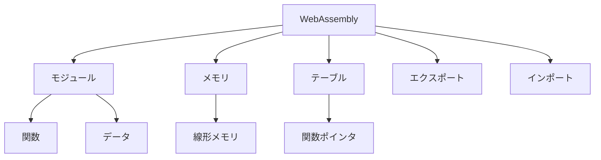

# WebAssemblyで広がるWebの可能性：JavaScriptとの連携と実践的な使用例

## はじめに

WebAssembly（Wasm）は、ウェブアプリケーションのパフォーマンスを飛躍的に向上させるための新しい技術であり、特に計算集約型のアプリケーションにおいてその真価を発揮します。Wasmは、ブラウザ上でネイティブに近い速度でコードを実行できるため、ゲーム、画像処理、データ解析など、さまざまな分野での利用が期待されています。この記事では、WebAssemblyの基本概念、JavaScriptとの連携方法、実践的な使用例を詳しく解説し、さらにWebAssemblyの将来展望についても考察します。

### WebAssemblyの基本概念

WebAssemblyは、バイナリ形式の命令セットであり、ウェブブラウザ上で効率的に実行されることを目的としています。Wasmは、C、C++、Rustなどの高級言語からコンパイルされ、ブラウザで直接実行可能な形式に変換されます。これにより、開発者はパフォーマンスを重視したアプリケーションを構築できるようになります。

#### WebAssemblyの歴史

WebAssemblyは、2015年にW3C（World Wide Web Consortium）によって提案され、2017年に正式に仕様が確定しました。これにより、ウェブ開発者は新しい技術を利用して、より効率的なアプリケーションを開発できるようになりました。Wasmは、JavaScriptの補完的な技術として位置づけられており、特にパフォーマンスが求められる場面での利用が進んでいます。

### WebAssemblyの特徴

- **高いパフォーマンス**: WebAssemblyは、ネイティブコードに近い速度で実行されるため、計算集約型のタスクに適しています。特に、ゲームや画像処理、科学計算などの分野でその効果が顕著です。
- **安全性**: WebAssemblyは、サンドボックス環境で実行されるため、セキュリティリスクが低減されます。これにより、悪意のあるコードがシステムにアクセスすることを防ぎます。
- **ポータビリティ**: WebAssemblyは、異なるプラットフォームやデバイスで同じコードを実行できるため、開発者は一度書いたコードを再利用できます。これにより、開発コストが削減され、メンテナンスが容易になります。

### WebAssemblyの構造

WebAssemblyは、モジュール、メモリ、テーブル、エクスポート、インポートなどの構成要素から成り立っています。これらの要素は、Wasmがどのように動作するかを決定します。

- **モジュール**: WebAssemblyの基本単位であり、関数やデータを含むバイナリ形式のファイルです。
- **メモリ**: WebAssemblyは、線形メモリモデルを使用しており、メモリは1次元の配列として扱われます。これにより、効率的なメモリ管理が可能になります。
- **テーブル**: 関数ポインタの配列であり、動的に関数を呼び出すために使用されます。
- **エクスポートとインポート**: モジュール間で関数やデータを共有するための仕組みです。エクスポートは、他のモジュールからアクセス可能な関数やデータを定義し、インポートは、他のモジュールから提供される関数やデータを使用します。



このダイアグラムは、WebAssemblyの主要な構成要素を示しています。モジュール、メモリ、テーブル、エクスポート、インポートの関係性を視覚的に表現しています。

## JavaScriptとの連携

### WebAssemblyとJavaScriptの相互運用性

WebAssemblyは、JavaScriptと密接に連携することができます。WasmモジュールはJavaScriptから呼び出すことができ、逆にJavaScriptからWasmモジュールにデータを渡すことも可能です。この相互運用性により、開発者は既存のJavaScriptコードと新しいWasmコードを組み合わせて、より効率的なアプリケーションを構築できます。

#### 相互運用性の利点

- **パフォーマンスの向上**: 計算集約型の処理をWasmにオフロードすることで、JavaScriptのパフォーマンスを向上させることができます。特に、CPU集約型のタスクや、複雑なアルゴリズムを実行する際に効果的です。
- **既存のエコシステムの活用**: JavaScriptの豊富なライブラリやフレームワークを活用しつつ、Wasmのパフォーマンスを享受できます。これにより、開発者は新しい技術を学ぶことなく、既存のスキルを活かしてアプリケーションを構築できます。

### WebAssemblyモジュールの作成

Wasmモジュールを作成するためには、まず高級言語でコードを書き、それをWasm形式にコンパイルします。以下は、C言語を使用して簡単なWasmモジュールを作成する手順です。

1. **C言語のコードを書く**:

```c
#include <stdio.h>

int add(int a, int b) {
    return a + b;
}
```

このコードは、2つの整数を受け取り、その合計を返すシンプルな関数です。

2. **Emscriptenを使用してコンパイル**:

Emscriptenは、C/C++コードをWebAssemblyにコンパイルするためのツールです。以下のコマンドを使用して、上記のCコードをWasmにコンパイルします。

```bash
emcc add.c -o add.wasm -s WASM=1
```

このコマンドにより、`add.wasm`というWasmモジュールが生成されます。

3. **JavaScriptからWasmモジュールを呼び出す**:

次に、JavaScriptを使用してWasmモジュールを呼び出します。

```javascript
const fs = require('fs');
const loader = require('@assemblyscript/loader');

async function loadWasm() {
    const wasmModule = await loader.instantiate(fs.readFileSync('add.wasm'));
    const result = wasmModule.exports.add(5, 3);
    console.log(`Result: ${result}`); // Result: 8
}

loadWasm();
```

このコードでは、Wasmモジュールを読み込み、`add`関数を呼び出して結果を表示します。

### データの受け渡し

WasmとJavaScript間でデータを受け渡す際には、メモリ管理が重要です。Wasmは独自のメモリ空間を持っており、JavaScriptからWasmにデータを渡す場合、メモリを共有する必要があります。以下は、配列をWasmに渡す例です。

```javascript
const memory = new WebAssembly.Memory({ initial: 1 });
const wasmModule = await WebAssembly.instantiateStreaming(fetch('add.wasm'), {
    env: {
        memory: memory
    }
});

// JavaScriptの配列をWasmに渡す
const array = new Int32Array(memory.buffer);
array[0] = 5;
array[1] = 3;

// Wasmの関数を呼び出す
wasmModule.instance.exports.add(array.byteOffset);
```

この例では、JavaScriptの`Int32Array`を使用してWasmにデータを渡し、Wasm内で処理を行います。

## 実践的な使用例

### ゲーム開発におけるWebAssemblyの活用

WebAssemblyは、ゲーム開発において特に有用です。高いパフォーマンスを必要とするゲームエンジンや物理シミュレーションをWasmで実装することで、ブラウザ上でもスムーズな動作が可能になります。たとえば、UnityやUnreal Engineなどのゲームエンジンは、WebAssemblyをサポートしており、開発者はこれらのエンジンを使用して高品質なゲームをブラウザで提供できます。

#### UnityのWebAssemblyサポート

Unityは、WebAssemblyを使用してゲームをブラウザで実行するための強力なツールを提供しています。UnityのWebGLビルドオプションを使用することで、開発者はC#で書かれたゲームをWasmにコンパイルし、ブラウザ上で実行できます。これにより、ユーザーはインストールなしでゲームをプレイできるようになります。

- **パフォーマンスの最適化**: Unityは、Wasmの特性を活かして、ゲームのパフォーマンスを最適化するためのさまざまな機能を提供しています。たとえば、アセットの圧縮や、不要なコードの削除などが行えます。
- **クロスプラットフォーム対応**: UnityのWebGLビルドは、デスクトップやモバイルデバイスを問わず、さまざまなプラットフォームで動作します。これにより、開発者は一度の開発で多くのユーザーにリーチできます。

### 画像処理アプリケーション

画像処理は計算集約型のタスクであり、WebAssemblyを使用することで、ブラウザ上での画像処理を高速化できます。たとえば、画像のフィルタリングや変換を行うアプリケーションをWasmで実装することで、ユーザーはリアルタイムで画像を処理できるようになります。

#### 画像処理ライブラリの活用

OpenCVなどの画像処理ライブラリは、C++で書かれており、WebAssemblyにコンパイルすることができます。これにより、ブラウザ上での画像処理が可能になり、ユーザーは画像のエッジ検出やぼかし効果などをリアルタイムで体験できます。

- **リアルタイム処理**: WebAssemblyを使用することで、ユーザーは画像をアップロードすることなく、ブラウザ上でリアルタイムに画像処理を行うことができます。これにより、ユーザーエクスペリエンスが向上します。
- **インタラクティブなアプリケーション**: 画像処理アプリケーションは、ユーザーがインタラクティブに操作できるため、教育やデザインの分野での利用が期待されます。

### データ解析ツール

データ解析もWebAssemblyの得意分野です。大量のデータを処理する必要がある場合、Wasmを使用することで、ブラウザ上でのデータ解析を効率的に行うことができます。たとえば、データの集計や統計分析を行うツールをWasmで実装することで、ユーザーは迅速に結果を得ることができます。

#### WebAssemblyを用いたデータ解析の例

Pythonのデータ解析ライブラリであるNumPyは、Cで書かれた部分が多く、Wasmにコンパイルすることが可能です。これにより、ブラウザ上でNumPyの機能を利用し、大規模なデータセットを効率的に処理することができます。

- **大規模データの処理**: WebAssemblyを使用することで、数百万行のデータを迅速に処理し、リアルタイムで結果を表示することが可能です。これにより、ビジネスインテリジェンスやデータサイエンスの分野での利用が期待されます。
- **インタラクティブなダッシュボード**: データ解析ツールは、ユーザーがインタラクティブにデータを操作できるため、視覚化や分析が容易になります。これにより、データに基づいた意思決定が迅速に行えるようになります。

## WebAssemblyの将来展望

WebAssemblyは、今後ますます多くの分野での利用が期待されています。特に、以下のような分野での発展が見込まれます。

### IoT（Internet of Things）

IoTデバイスは、限られたリソースで動作するため、効率的なコードが求められます。WebAssemblyは、軽量で高性能なコードを提供できるため、IoTデバイスのプログラミングにおいても重要な役割を果たすでしょう。Wasmは、デバイス間の相互運用性を高め、異なるプラットフォームでのアプリケーション開発を容易にします。

- **リソース効率の向上**: WebAssemblyは、メモリ使用量が少なく、CPU負荷が低いため、IoTデバイスに最適です。これにより、バッテリー寿命の延長や、デバイスのパフォーマンス向上が期待されます。
- **セキュリティの強化**: IoTデバイスは、セキュリティリスクが高いため、WebAssemblyのサンドボックス環境は、悪意のある攻撃からデバイスを保護するのに役立ちます。

### 機械学習

機械学習モデルの推論をブラウザ上で行うことができるようになると、ユーザーはリアルタイムでのデータ分析や予測が可能になります。WebAssemblyは、機械学習ライブラリの実行を高速化するための手段として注目されています。TensorFlow.jsなどのライブラリは、Wasmを利用してブラウザ上での機械学習を実現しています。

- **リアルタイム推論**: WebAssemblyを使用することで、ユーザーはブラウザ上でリアルタイムに機械学習モデルを実行し、即座に結果を得ることができます。これにより、インタラクティブなアプリケーションが実現します。
- **エッジコンピューティング**: WebAssemblyは、エッジデバイスでの機械学習推論を可能にし、データをクラウドに送信することなく、迅速な応答を実現します。

### クロスプラットフォームアプリケーション

WebAssemblyは、異なるプラットフォームで同じコードを実行できるため、クロスプラットフォームアプリケーションの開発が容易になります。これにより、開発者は一度の開発で多くのデバイスに対応できるようになります。Wasmは、デスクトップアプリケーションやモバイルアプリケーションの開発にも利用される可能性があります。

- **一貫したユーザーエクスペリエンス**: WebAssemblyを使用することで、異なるプラットフォーム間で一貫したユーザーエクスペリエンスを提供できます。これにより、ユーザーはどのデバイスでも同じアプリケーションを利用できるようになります。
- **開発コストの削減**: クロスプラットフォーム開発により、開発者は異なるプラットフォーム向けに別々のコードベースを維持する必要がなくなり、開発コストを削減できます。

## まとめ

WebAssemblyは、ウェブアプリケーションのパフォーマンスを向上させるための強力な技術です。JavaScriptとの連携により、既存のウェブ技術と組み合わせて新しい可能性を広げることができます。ゲーム開発、画像処理、データ解析など、さまざまな分野での実践的な使用例が増えており、今後の発展が期待されます。WebAssemblyを活用することで、より効率的で高性能なウェブアプリケーションを構築することが可能です。

-----

※本記事は生成AIを使用して作成されました。
AI言語モデル: gpt-4o-mini