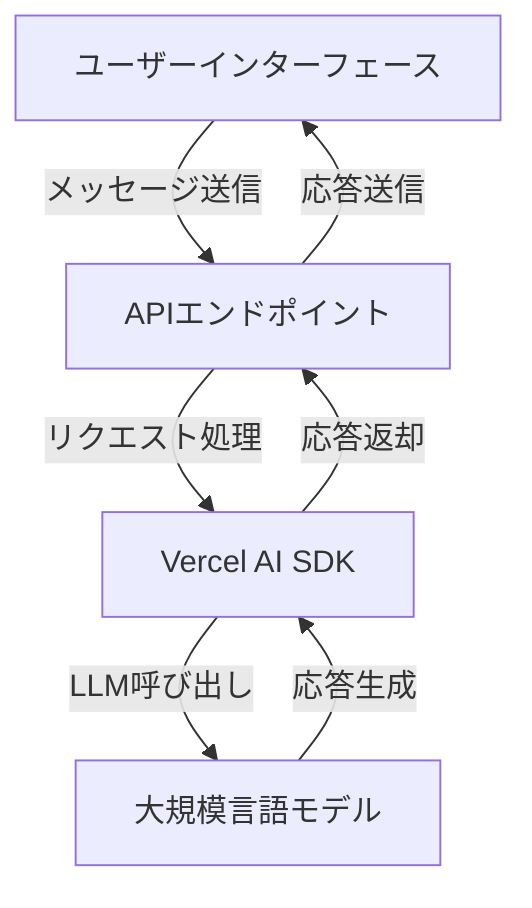

# Vercel AI SDKで作るLLMアプリケーション

## はじめに

近年、人工知能（AI）と機械学習（ML）の進化は目覚ましく、特に大規模言語モデル（LLM）は多くのアプリケーションで利用されています。これに伴い、開発者はこれらの技術を簡単に利用できるツールやSDKを求めています。Vercel AI SDKは、開発者がLLMを活用したアプリケーションを迅速に構築できる強力なツールです。本記事では、Vercel AI SDKを使用してLLMアプリケーションを作成する方法について詳しく解説します。

## Vercel AI SDKとは？

Vercel AI SDKは、Vercelが提供する開発者向けのソフトウェア開発キットで、AI機能を簡単にアプリケーションに統合できるように設計されています。このSDKは、特に大規模言語モデルを利用したアプリケーションの開発を容易にし、開発者が迅速にプロトタイプを作成し、デプロイできるようにします。

### 特徴

- **簡単なインストール**: Vercel AI SDKは、npmを使用して簡単にインストールできます。これにより、開発者はすぐにプロジェクトに組み込むことができます。
- **豊富なAPI**: LLMを利用するための多様なAPIが提供されており、さまざまな機能を簡単に実装できます。これにより、開発者は特定のニーズに応じたカスタマイズが可能です。
- **リアルタイムのデータ処理**: SDKはリアルタイムでデータを処理し、ユーザーに迅速な応答を提供します。これにより、インタラクティブなアプリケーションを構築することができます。
- **スケーラビリティ**: Vercelのインフラストラクチャを利用することで、アプリケーションはスケーラブルで高可用性を持ちます。これにより、トラフィックの増加にも対応可能です。

### Vercel AI SDKのアーキテクチャ

以下のダイアグラムは、Vercel AI SDKの基本的なアーキテクチャを示しています。この図は、SDKがどのようにユーザーインターフェース、API、データベースと連携しているかを視覚的に表現しています。



このダイアグラムは、ユーザーがインターフェースを通じてメッセージを送信し、APIエンドポイントがそのリクエストを処理してVercel AI SDKに渡し、最終的に大規模言語モデルからの応答を受け取る流れを示しています。

## Vercel AI SDKのインストール

Vercel AI SDKを使用するためには、まずNode.jsとnpmがインストールされている必要があります。以下の手順でSDKをインストールします。

### ステップ1: プロジェクトの作成

まず、新しいプロジェクトを作成します。以下のコマンドを実行します。

```bash
mkdir my-llm-app
cd my-llm-app
npm init -y
```

このコマンドにより、`my-llm-app`というディレクトリが作成され、その中に`package.json`ファイルが生成されます。このファイルは、プロジェクトの依存関係やスクリプトを管理するために使用されます。

### ステップ2: Vercel AI SDKのインストール

次に、Vercel AI SDKをインストールします。

```bash
npm install @vercel/ai
```

このコマンドにより、Vercel AI SDKがプロジェクトに追加され、必要な依存関係が自動的にインストールされます。

### ステップ3: 環境変数の設定

Vercel AI SDKを使用するには、APIキーが必要です。VercelのダッシュボードからAPIキーを取得し、`.env`ファイルに設定します。

```
VERCEL_API_KEY=your_api_key_here
```

`.env`ファイルは、環境変数を管理するためのファイルで、セキュリティ上の理由からAPIキーなどの機密情報をコードに直接書かないようにします。

## LLMアプリケーションの構築

Vercel AI SDKを使用して、シンプルなLLMアプリケーションを構築してみましょう。このアプリケーションは、ユーザーからの入力を受け取り、LLMを使用して応答を生成します。

### ステップ1: 基本的なアプリケーションのセットアップ

以下のように、基本的なExpressアプリケーションを作成します。

```javascript
// index.js
const express = require('express');
const { VercelAI } = require('@vercel/ai');

const app = express();
const port = process.env.PORT || 3000;

app.use(express.json());

const ai = new VercelAI({
  apiKey: process.env.VERCEL_API_KEY,
});

app.post('/api/chat', async (req, res) => {
  const userMessage = req.body.message;

  try {
    const response = await ai.chat({
      prompt: userMessage,
      model: 'gpt-3.5-turbo',
    });

    res.json({ reply: response });
  } catch (error) {
    console.error(error);
    res.status(500).json({ error: 'Internal Server Error' });
  }
});

app.listen(port, () => {
  console.log(`Server is running on http://localhost:${port}`);
});
```

このコードは、Expressフレームワークを使用してシンプルなサーバーを構築し、ユーザーからのメッセージを受け取ってAIに送信し、その応答を返すAPIエンドポイントを作成します。

### ステップ2: フロントエンドの作成

次に、フロントエンドを作成します。HTMLとJavaScriptを使用して、ユーザーがメッセージを入力できるインターフェースを作成します。

```html
<!-- index.html -->
<!DOCTYPE html>
<html lang="ja">
<head>
    <meta charset="UTF-8">
    <meta name="viewport" content="width=device-width, initial-scale=1.0">
    <title>LLM Chat App</title>
</head>
<body>
    <h1>LLM Chat Application</h1>
    <input type="text" id="userMessage" placeholder="メッセージを入力してください">
    <button id="sendButton">送信</button>
    <div id="chatLog"></div>

    <script>
        document.getElementById('sendButton').addEventListener('click', async () => {
            const userMessage = document.getElementById('userMessage').value;
            const response = await fetch('/api/chat', {
                method: 'POST',
                headers: {
                    'Content-Type': 'application/json',
                },
                body: JSON.stringify({ message: userMessage }),
            });

            const data = await response.json();
            document.getElementById('chatLog').innerHTML += `<p><strong>あなた:</strong> ${userMessage}</p>`;
            document.getElementById('chatLog').innerHTML += `<p><strong>AI:</strong> ${data.reply}</p>`;
        });
    </script>
</body>
</html>
```

このHTMLコードは、ユーザーがメッセージを入力し、送信ボタンをクリックすることでAIと対話できるインターフェースを提供します。JavaScriptを使用して、ユーザーの入力をAPIに送信し、AIからの応答を表示します。

### ステップ3: アプリケーションの実行

アプリケーションを実行するには、以下のコマンドを使用します。

```bash
node index.js
```

ブラウザで `http://localhost:3000` にアクセスすると、チャットアプリケーションが表示されます。メッセージを入力して送信すると、AIからの応答が表示されます。

## LLMアプリケーションの拡張

基本的なLLMアプリケーションが完成したら、次は機能を拡張してみましょう。以下にいくつかのアイデアを示します。

### 1. ユーザー認証の追加

ユーザー認証を追加することで、個々のユーザーの履歴を保存したり、パーソナライズされた体験を提供したりできます。Firebase AuthenticationやAuth0などのサービスを利用することができます。これにより、ユーザーは自分のアカウントでログインし、過去の会話を参照できるようになります。

### 2. メッセージ履歴の保存

ユーザーのメッセージ履歴をデータベースに保存することで、過去の会話を参照できるようにします。MongoDBやFirebase Firestoreなどのデータベースを使用することができます。これにより、ユーザーは以前の会話を簡単に振り返ることができ、より良い体験を提供できます。

### 3. 多言語対応

LLMを使用して多言語対応のアプリケーションを作成することも可能です。ユーザーが選択した言語に応じて、適切なモデルを呼び出すことができます。これにより、国際的なユーザーに対しても対応できるアプリケーションを構築できます。

### 4. カスタムプロンプトの使用

特定のドメインに特化したアプリケーションを作成する場合、カスタムプロンプトを使用して、より関連性の高い応答を生成することができます。たとえば、医療、法律、教育などの特定の分野に特化したプロンプトを設計することで、専門的な知識を持つAIを構築できます。

## LLMアプリケーションのデプロイ

Vercelを使用してアプリケーションをデプロイするのは非常に簡単です。以下の手順でデプロイを行います。

### ステップ1: Vercel CLIのインストール

Vercel CLIをインストールします。

```bash
npm install -g vercel
```

### ステップ2: Vercelにログイン

Vercelにログインします。

```bash
vercel login
```

### ステップ3: アプリケーションのデプロイ

以下のコマンドを実行して、アプリケーションをデプロイします。

```bash
vercel
```

プロンプトに従って、プロジェクト名や環境変数の設定を行います。デプロイが完了すると、アプリケーションのURLが表示されます。このURLを使用して、インターネット上でアプリケーションにアクセスできるようになります。

## LLMアプリケーションのテスト

デプロイ後、アプリケーションが正しく動作するかテストします。ブラウザでデプロイされたURLにアクセスし、メッセージを送信してAIからの応答を確認します。テスト中に問題が発生した場合は、コンソールログを確認し、エラーメッセージをもとにデバッグを行います。

## 課題と解決策

LLMアプリケーションを開発する際には、いくつかの課題が考えられます。以下に代表的な課題とその解決策を示します。

### 課題1: レイテンシの問題

LLMを使用する際、応答に時間がかかることがあります。これを解決するためには、以下の方法があります。

- **キャッシュの利用**: よく使われる応答をキャッシュすることで、再利用時のレイテンシを削減できます。Redisなどのインメモリデータベースを使用することが一般的です。
- **非同期処理**: ユーザーインターフェースを非同期に更新することで、ユーザーにスムーズな体験を提供できます。Promiseやasync/awaitを活用して、非同期処理を適切に管理します。

### 課題2: コストの管理

LLMの使用にはコストがかかるため、適切なコスト管理が必要です。以下の方法でコストを抑えることができます。

- **使用量のモニタリング**: APIの使用量を定期的にモニタリングし、必要に応じて制限を設けます。Vercelのダッシュボードで使用状況を確認できます。
- **モデルの選択**: 使用するモデルを選択する際、コストと性能のバランスを考慮します。例えば、より小型のモデルを使用することでコストを削減できます。

### 課題3: ユーザーのプライバシー

ユーザーのデータを扱う際には、プライバシーに配慮する必要があります。以下の対策を講じることが重要です。

- **データの暗号化**: ユーザーのデータを暗号化して保存し、不正アクセスから保護します。SSL/TLSを使用して通信を暗号化することも重要です。
- **プライバシーポリシーの策定**: ユーザーに対して、データの取り扱いについて明確に説明するプライバシーポリシーを策定します。これにより、ユーザーの信頼を得ることができます。

## まとめ

Vercel AI SDKを使用することで、開発者は簡単にLLMアプリケーションを構築し、デプロイすることができます。本記事では、基本的なアプリケーションの作成から、機能の拡張、デプロイ、課題の解決策までを詳しく解説しました。これにより、読者はVercel AI SDKを活用して、自身のニーズに合ったLLMアプリケーションを開発できるようになるでしょう。

今後もAI技術は進化し続けるため、最新の情報を追い続けることが重要です。Vercel AI SDKを活用して、次世代のアプリケーションを開発してみてください。

-----

※本記事は生成AIを使用して作成されました。
AI言語モデル: gpt-4o-mini