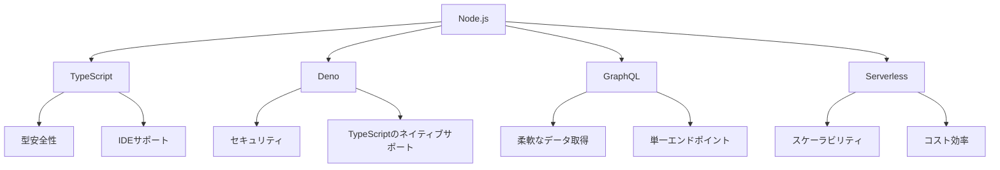

# Node.jsの最新トレンド：TypeScript、Deno、GraphQL、Serverless

## はじめに

Node.jsは、サーバーサイドのJavaScript環境として広く利用されており、近年のウェブ開発において重要な役割を果たしています。Node.jsのエコシステムは急速に進化しており、開発者は新しい技術やトレンドに常に目を光らせています。本記事では、Node.jsに関連する最新のトレンドとして、TypeScript、Deno、GraphQL、Serverlessについて詳しく解説します。これらの技術は、開発者がより効率的に、かつ効果的にアプリケーションを構築するための新しい手段を提供しています。

### 技術トレンドの全体像

以下のダイアグラムは、Node.jsのエコシステムにおける主要な技術トレンドを視覚的に示しています。これにより、各技術がどのように相互に関連しているかを理解しやすくなります。



このダイアグラムは、Node.jsを中心に、TypeScript、Deno、GraphQL、Serverlessの各技術がどのように展開されているかを示しています。各技術の特性や利点も併せて理解することで、全体像を把握しやすくなります。

## TypeScriptの台頭

### TypeScriptとは？

TypeScriptは、JavaScriptのスーパーセットであり、型安全性を提供するプログラミング言語です。Microsoftによって開発され、JavaScriptの機能を拡張することで、より大規模なアプリケーションの開発を容易にします。TypeScriptは、静的型付けを導入することで、開発者がコードのエラーを早期に発見できるようにし、保守性を向上させます。

### TypeScriptの利点

1. **型安全性**: TypeScriptは、変数や関数の型を明示的に定義できるため、型に関するエラーをコンパイル時に検出できます。これにより、実行時エラーを減少させることができます。例えば、以下のように型を指定することで、意図しない型の値が渡されることを防げます。

    ```typescript
    function add(a: number, b: number): number {
        return a + b;
    }

    console.log(add(5, 10)); // 15
    console.log(add(5, "10")); // エラー: Argument of type 'string' is not assignable to parameter of type 'number'.
    ```

2. **IDEサポート**: TypeScriptは、Visual Studio CodeなどのIDEで優れた補完機能を提供します。これにより、開発者はコードを書く際に効率的に作業できます。型情報があることで、IDEは関数の引数や戻り値の型を理解し、適切な補完を提供します。

3. **大規模開発に最適**: TypeScriptは、モジュール化やインターフェースの定義をサポートしており、大規模なプロジェクトにおいてもコードの可読性と保守性を保つことができます。インターフェースを使用することで、オブジェクトの構造を明確に定義し、他の開発者が理解しやすくなります。

    ```typescript
    interface User {
        id: number;
        name: string;
        email: string;
    }

    const user: User = {
        id: 1,
        name: "John Doe",
        email: "john.doe@example.com"
    };
    ```

### TypeScriptの実践例

以下は、TypeScriptを使用した簡単な関数の例です。

```typescript
function greet(name: string): string {
    return `Hello, ${name}!`;
}

console.log(greet("World")); // Hello, World!
```

この例では、`name`引数の型を`string`として定義しています。これにより、`greet`関数に渡される引数が文字列であることが保証されます。

### TypeScriptのエコシステム

TypeScriptは、さまざまなライブラリやフレームワークと統合されており、特にReactやAngularなどのフロントエンドフレームワークでの使用が増えています。これにより、開発者はフロントエンドとバックエンドの両方で一貫した型安全性を享受できます。また、TypeScriptの人気が高まる中で、コミュニティも活発に活動しており、多くの型定義ファイルが提供されています。これにより、既存のJavaScriptライブラリをTypeScriptで安全に使用することが可能です。

## Denoの登場

### Denoとは？

Denoは、Node.jsの創始者であるライアン・ダールによって開発された新しいJavaScript/TypeScriptランタイムです。Denoは、セキュリティ、モジュール管理、TypeScriptのネイティブサポートを重視して設計されています。Denoは、Node.jsの欠点を克服することを目指しており、開発者にとってより使いやすい環境を提供します。

### Denoの特徴

1. **セキュリティ**: Denoは、デフォルトでサンドボックス環境で動作し、ファイルシステムやネットワークへのアクセスを制限します。これにより、悪意のあるコードからシステムを保護します。開発者は、必要な権限を明示的に指定する必要があります。

    ```bash
    deno run --allow-net server.ts
    ```

    上記のコマンドは、`server.ts`を実行する際にネットワークアクセスを許可します。

2. **TypeScriptのネイティブサポート**: Denoは、TypeScriptをネイティブにサポートしており、追加の設定なしでTypeScriptファイルを直接実行できます。これにより、TypeScriptの利点を最大限に活用できます。

3. **モジュール管理**: Denoは、URLを使用してモジュールをインポートします。これにより、npmのようなパッケージマネージャーを必要とせず、シンプルなモジュール管理が可能です。例えば、以下のように外部モジュールをインポートできます。

    ```typescript
    import { serve } from "https://deno.land/std/http/server.ts";
    ```

4. **標準ライブラリ**: Denoは、標準ライブラリを提供しており、HTTPサーバーやファイルシステム操作などの基本的な機能を簡単に利用できます。これにより、外部ライブラリに依存せずにアプリケーションを構築できます。

### Denoの実践例

以下は、Denoを使用してHTTPサーバーを作成する簡単な例です。

```typescript
import { serve } from "https://deno.land/std/http/server.ts";

const server = serve({ port: 8000 });
console.log("Server running on http://localhost:8000");

for await (const req of server) {
    req.respond({ body: "Hello Deno!\n" });
}
```

このコードは、ポート8000でHTTPサーバーを起動し、リクエストが来るたびに「Hello Deno！」と応答します。Denoのシンプルさとセキュリティ機能は、特に新しいプロジェクトにおいて魅力的です。

### Denoの将来性

Denoは、Node.jsの代替として注目されていますが、まだ発展途上の技術です。今後のアップデートやコミュニティの成長により、Denoのエコシステムはさらに拡大することが期待されています。特に、Denoのセキュリティ機能やTypeScriptのサポートは、開発者にとって大きな魅力です。

## GraphQLの普及

### GraphQLとは？

GraphQLは、Facebookによって開発されたクエリ言語であり、APIのデータ取得を効率的に行うための手段です。REST APIに代わる新しいアプローチとして注目されており、クライアントが必要なデータを正確に指定できる点が特徴です。GraphQLは、クライアントとサーバー間のデータのやり取りを最適化し、過剰なデータの取得を防ぎます。

### GraphQLの利点

1. **柔軟なデータ取得**: クライアントは、必要なデータを正確に指定できるため、過剰なデータの取得を避けることができます。例えば、以下のクエリでは、ユーザーの名前とメールアドレスのみを取得します。

    ```graphql
    {
        user(id: 1) {
            name
            email
        }
    }
    ```

2. **単一エンドポイント**: GraphQLは、すべてのリクエストを単一のエンドポイントで処理します。これにより、APIの管理が簡素化されます。REST APIでは、リソースごとに異なるエンドポイントが必要ですが、GraphQLでは一つのエンドポイントで済みます。

3. **型システム**: GraphQLは、スキーマを使用してAPIの型を定義します。これにより、クライアントとサーバー間の契約が明確になります。スキーマは、APIのドキュメントとしても機能し、開発者が利用可能なデータを理解するのに役立ちます。

4. **リアルタイムデータ**: GraphQLは、サブスクリプション機能を提供しており、リアルタイムデータの取得が可能です。これにより、クライアントはデータの変更をリアルタイムで受け取ることができます。

### GraphQLの実践例

以下は、Node.jsとExpressを使用してGraphQLサーバーを構築する簡単な例です。

```javascript
const express = require('express');
const { ApolloServer, gql } = require('apollo-server-express');

// スキーマ定義
const typeDefs = gql`
  type User {
    id: ID!
    name: String!
    email: String!
  }

  type Query {
    users: [User]
  }
`;

// リゾルバ定義
const resolvers = {
  Query: {
    users: () => [
      { id: 1, name: "John Doe", email: "john.doe@example.com" },
      { id: 2, name: "Jane Smith", email: "jane.smith@example.com" }
    ],
  },
};

// Apollo Serverの設定
const server = new ApolloServer({ typeDefs, resolvers });

const app = express();
server.applyMiddleware({ app });

app.listen({ port: 4000 }, () =>
  console.log(`🚀 Server ready at http://localhost:4000${server.graphqlPath}`)
);
```

このコードは、GraphQLサーバーを起動し、`users`クエリに対してユーザーのリストを返します。GraphQLの強力な機能を活用することで、クライアントは必要なデータを効率的に取得できます。

### GraphQLのエコシステム

GraphQLは、さまざまなライブラリやツールと統合されており、Apollo ClientやRelayなどのクライアントライブラリが人気です。これらのライブラリは、GraphQLのクエリを簡単に作成し、データの取得を効率化します。また、GraphQLのスキーマを自動生成するツールも存在し、開発者の負担を軽減します。

## Serverlessアーキテクチャの進化

### Serverlessとは？

Serverlessアーキテクチャは、開発者がサーバーの管理を気にせずにアプリケーションを構築できる環境を提供します。AWS LambdaやAzure Functionsなどのサービスを利用することで、コードを実行するためのインフラストラクチャを自動的に管理します。Serverlessは、スケーラビリティ、コスト効率、迅速な開発を実現します。

### Serverlessの利点

1. **スケーラビリティ**: Serverlessアーキテクチャは、トラフィックに応じて自動的にスケールします。これにより、リソースの無駄を減少させることができます。例えば、急激なトラフィックの増加があった場合でも、サーバーは自動的にスケールアップし、負荷を処理します。

2. **コスト効率**: 使用した分だけ支払うモデルにより、開発者はコストを最適化できます。アイドル状態のサーバーに対して料金を支払う必要がありません。これにより、スタートアップや小規模なプロジェクトにとって非常に魅力的です。

3. **迅速な開発**: サーバーの管理から解放されることで、開発者はビジネスロジックに集中でき、迅速にアプリケーションを開発できます。新しい機能を迅速にデプロイできるため、アジャイル開発に適しています。

4. **イベント駆動型アーキテクチャ**: Serverlessは、イベント駆動型のアーキテクチャをサポートしており、特定のイベントに応じて関数を実行できます。これにより、リアルタイムでのデータ処理やトリガーに基づくアクションが可能になります。

### Serverlessの実践例

以下は、AWS Lambdaを使用して簡単な関数を作成する例です。

```javascript
exports.handler = async (event) => {
    return {
        statusCode: 200,
        body: JSON.stringify('Hello, Serverless!'),
    };
};
```

この関数は、AWS Lambda上で実行され、HTTPリクエストに対して「Hello, Serverless!」と応答します。Serverlessアーキテクチャを利用することで、開発者はインフラストラクチャの管理から解放され、アプリケーションの機能に集中できます。

### Serverlessのエコシステム

Serverlessアーキテクチャは、AWS、Azure、Google Cloudなどの主要なクラウドプロバイダーによってサポートされています。また、Serverless FrameworkやAWS SAMなどのツールを使用することで、Serverlessアプリケーションのデプロイや管理が容易になります。これにより、開発者は迅速にプロトタイプを作成し、スケーラブルなアプリケーションを構築できます。

## まとめ

Node.jsのエコシステムは、TypeScript、Deno、GraphQL、Serverlessといった新しいトレンドによって進化を続けています。これらの技術は、開発者にとってより効率的で柔軟な開発環境を提供し、アプリケーションの構築を容易にします。TypeScriptは型安全性を提供し、Denoは新しいランタイム環境を提供します。GraphQLはデータ取得の柔軟性を高め、Serverlessアーキテクチャはインフラストラクチャの管理を簡素化します。

これらのトレンドを理解し、適切に活用することで、開発者はより高品質なアプリケーションを迅速に構築できるようになります。今後もNode.jsのエコシステムは進化し続けるため、最新の情報を追い続けることが重要です。

-----

※本記事は生成AIを使用して作成されました。
AI言語モデル: gpt-4o-mini