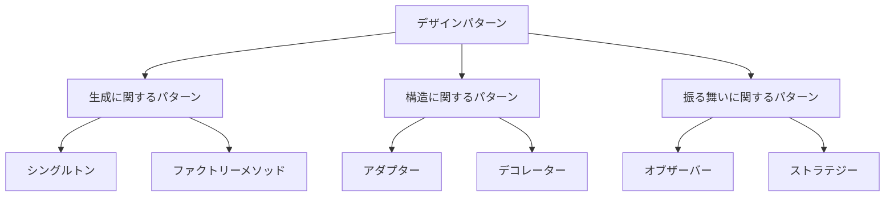

# TypeScriptで始めるデザインパターン入門

## はじめに

デザインパターンは、ソフトウェア開発における一般的な問題に対する再利用可能な解決策を提供します。これらのパターンは、特定の状況でのベストプラクティスを示し、コードの可読性や保守性を向上させるために役立ちます。TypeScriptは、JavaScriptのスーパーセットであり、型安全性を提供することで、デザインパターンの実装をより明確にし、エラーを減少させることができます。本記事では、TypeScriptを使用してデザインパターンを実装する方法を紹介し、具体的な例を通じて理解を深めていきます。

## デザインパターンの基本

デザインパターンは、主に以下の3つのカテゴリに分類されます。

1. **生成に関するパターン**: オブジェクトの生成に関するパターンで、オブジェクトの生成過程を抽象化します。これにより、クラスのインスタンス化を柔軟に行うことができます。例: シングルトン、ファクトリーメソッド。
2. **構造に関するパターン**: オブジェクトの構造に関するパターンで、オブジェクト間の関係を定義します。これにより、オブジェクトの組み合わせや再利用が容易になります。例: アダプター、デコレーター。
3. **振る舞いに関するパターン**: オブジェクトの振る舞いに関するパターンで、オブジェクト間の通信や責任の分担を定義します。これにより、オブジェクトの相互作用を管理しやすくなります。例: オブザーバー、ストラテジー。

これらのパターンを理解することで、より効率的で保守性の高いコードを書くことが可能になります。

### デザインパターンのカテゴリ図

以下のダイアグラムは、デザインパターンの主要なカテゴリを視覚的に示しています。これにより、各パターンの位置づけや関係性を理解しやすくなります。



このダイアグラムは、デザインパターンの全体像を把握するのに役立ちます。

## 生成に関するパターン

### シングルトンパターン

シングルトンパターンは、クラスのインスタンスが1つだけであることを保証し、そのインスタンスへのグローバルなアクセスを提供します。このパターンは、アプリケーション全体で共有されるリソース（例えば、設定情報やログ管理）を管理する際に非常に有用です。TypeScriptでの実装は以下の通りです。

```typescript
class Singleton {
    private static instance: Singleton;

    private constructor() {
        // プライベートコンストラクタにより、外部からのインスタンス化を防ぐ
    }

    public static getInstance(): Singleton {
        if (!Singleton.instance) {
            Singleton.instance = new Singleton();
        }
        return Singleton.instance;
    }

    public someBusinessLogic(): string {
        return 'Business logic executed';
    }
}

// 使用例
const singleton1 = Singleton.getInstance();
const singleton2 = Singleton.getInstance();

console.log(singleton1 === singleton2); // true
console.log(singleton1.someBusinessLogic()); // Business logic executed
```

この例では、`Singleton`クラスのインスタンスは、`getInstance`メソッドを通じてのみ生成されます。これにより、アプリケーション全体で同じインスタンスを使用することができます。シングルトンパターンは、特に設定やリソース管理において、状態を一元管理するのに役立ちます。

### ファクトリーメソッドパターン

ファクトリーメソッドパターンは、オブジェクトの生成をサブクラスに委譲することで、クラスのインスタンス化を柔軟にします。このパターンは、クライアントコードが具体的なクラスに依存せず、インターフェースを通じてオブジェクトを生成できるようにします。以下はTypeScriptでの実装例です。

```typescript
interface Product {
    operation(): string;
}

class ConcreteProductA implements Product {
    public operation(): string {
        return 'Result of ConcreteProductA';
    }
}

class ConcreteProductB implements Product {
    public operation(): string {
        return 'Result of ConcreteProductB';
    }
}

abstract class Creator {
    public abstract factoryMethod(): Product;

    public someOperation(): string {
        const product = this.factoryMethod();
        return `Creator: The same creator's code has just worked with ${product.operation()}`;
    }
}

class ConcreteCreatorA extends Creator {
    public factoryMethod(): Product {
        return new ConcreteProductA();
    }
}

class ConcreteCreatorB extends Creator {
    public factoryMethod(): Product {
        return new ConcreteProductB();
    }
}

// 使用例
const creatorA = new ConcreteCreatorA();
console.log(creatorA.someOperation()); // Creator: The same creator's code has just worked with Result of ConcreteProductA

const creatorB = new ConcreteCreatorB();
console.log(creatorB.someOperation()); // Creator: The same creator's code has just worked with Result of ConcreteProductB
```

この例では、`Creator`クラスがファクトリーメソッドを定義し、具体的なクリエイターがそのメソッドを実装しています。これにより、クライアントコードは具体的なクラスに依存せず、柔軟性が向上します。ファクトリーメソッドパターンは、オブジェクトの生成ロジックをカプセル化し、変更に強い設計を実現します。

## 構造に関するパターン

### アダプターパターン

アダプターパターンは、異なるインターフェースを持つクラス同士を接続するためのパターンです。このパターンは、既存のクラスを変更せずに新しいインターフェースに適合させることができるため、コードの再利用性を高めます。以下はTypeScriptでの実装例です。

```typescript
interface Target {
    request(): string;
}

class Adaptee {
    public specificRequest(): string {
        return 'Specific request';
    }
}

class Adapter implements Target {
    private adaptee: Adaptee;

    constructor(adaptee: Adaptee) {
        this.adaptee = adaptee;
    }

    public request(): string {
        return `Adapter: ${this.adaptee.specificRequest()}`;
    }
}

// 使用例
const adaptee = new Adaptee();
const adapter = new Adapter(adaptee);
console.log(adapter.request()); // Adapter: Specific request
```

この例では、`Adaptee`クラスが特定のリクエストを持ち、`Adapter`クラスがそのリクエストを`Target`インターフェースに適合させています。アダプターパターンは、異なるシステム間の互換性を提供し、既存のコードを再利用する際に非常に便利です。

### デコレーターパターン

デコレーターパターンは、オブジェクトに新しい機能を動的に追加するためのパターンです。このパターンは、クラスの継承を使用せずに機能を拡張できるため、柔軟性が高く、オブジェクトの振る舞いを変更するのに役立ちます。以下はTypeScriptでの実装例です。

```typescript
interface Component {
    operation(): string;
}

class ConcreteComponent implements Component {
    public operation(): string {
        return 'ConcreteComponent';
    }
}

class Decorator implements Component {
    protected component: Component;

    constructor(component: Component) {
        this.component = component;
    }

    public operation(): string {
        return this.component.operation();
    }
}

class ConcreteDecoratorA extends Decorator {
    public operation(): string {
        return `ConcreteDecoratorA(${super.operation()})`;
    }
}

class ConcreteDecoratorB extends Decorator {
    public operation(): string {
        return `ConcreteDecoratorB(${super.operation()})`;
    }
}

// 使用例
const simple = new ConcreteComponent();
console.log(simple.operation()); // ConcreteComponent

const decoratorA = new ConcreteDecoratorA(simple);
console.log(decoratorA.operation()); // ConcreteDecoratorA(ConcreteComponent)

const decoratorB = new ConcreteDecoratorB(decoratorA);
console.log(decoratorB.operation()); // ConcreteDecoratorB(ConcreteDecoratorA(ConcreteComponent))
```

この例では、`Decorator`クラスが`Component`インターフェースを実装し、具体的なデコレーターがその機能を拡張しています。デコレーターパターンは、オブジェクトの機能を動的に追加する際に非常に便利で、特にUIコンポーネントの拡張に役立ちます。

## 振る舞いに関するパターン

### オブザーバーパターン

オブザーバーパターンは、オブジェクトの状態が変化したときに、依存するオブジェクトに通知するためのパターンです。このパターンは、イベント駆動型のアプリケーションや、状態管理が必要なシステムで非常に有用です。以下はTypeScriptでの実装例です。

```typescript
interface Observer {
    update(data: string): void;
}

class ConcreteObserverA implements Observer {
    public update(data: string): void {
        console.log(`ConcreteObserverA: ${data}`);
    }
}

class ConcreteObserverB implements Observer {
    public update(data: string): void {
        console.log(`ConcreteObserverB: ${data}`);
    }
}

class Subject {
    private observers: Observer[] = [];

    public attach(observer: Observer): void {
        this.observers.push(observer);
    }

    public detach(observer: Observer): void {
        const index = this.observers.indexOf(observer);
        if (index !== -1) {
            this.observers.splice(index, 1);
        }
    }

    public notify(data: string): void {
        for (const observer of this.observers) {
            observer.update(data);
        }
    }
}

// 使用例
const subject = new Subject();
const observerA = new ConcreteObserverA();
const observerB = new ConcreteObserverB();

subject.attach(observerA);
subject.attach(observerB);

subject.notify('Hello Observers!');
// ConcreteObserverA: Hello Observers!
// ConcreteObserverB: Hello Observers!
```

この例では、`Subject`クラスがオブザーバーを管理し、状態が変化したときに全てのオブザーバーに通知します。オブザーバーパターンは、状態の変化を監視し、リアルタイムで反応するシステムを構築するのに役立ちます。

### ストラテジーパターン

ストラテジーパターンは、アルゴリズムをカプセル化し、クライアントがそのアルゴリズムを選択できるようにするパターンです。このパターンは、異なるアルゴリズムを持つクラスを作成し、実行時にそのアルゴリズムを変更できるため、柔軟性が高いです。以下はTypeScriptでの実装例です。

```typescript
interface Strategy {
    execute(a: number, b: number): number;
}

class ConcreteStrategyAdd implements Strategy {
    public execute(a: number, b: number): number {
        return a + b;
    }
}

class ConcreteStrategySubtract implements Strategy {
    public execute(a: number, b: number): number {
        return a - b;
    }
}

class Context {
    private strategy: Strategy;

    constructor(strategy: Strategy) {
        this.strategy = strategy;
    }

    public setStrategy(strategy: Strategy): void {
        this.strategy = strategy;
    }

    public executeStrategy(a: number, b: number): number {
        return this.strategy.execute(a, b);
    }
}

// 使用例
const context = new Context(new ConcreteStrategyAdd());
console.log(context.executeStrategy(5, 3)); // 8

context.setStrategy(new ConcreteStrategySubtract());
console.log(context.executeStrategy(5, 3)); // 2
```

この例では、`Context`クラスが異なる戦略を持ち、実行時にその戦略を変更することができます。ストラテジーパターンは、アルゴリズムの選択を柔軟に行うことができ、特に異なる処理を行う必要がある場合に役立ちます。

## まとめ

本記事では、TypeScriptを使用してデザインパターンを実装する方法を紹介しました。シングルトン、ファクトリーメソッド、アダプター、デコレーター、オブザーバー、ストラテジーといった主要なデザインパターンを具体的なコード例を通じて理解しました。これらのパターンを活用することで、より効率的で保守性の高いコードを書くことが可能になります。

デザインパターンは、ソフトウェア開発における重要なツールであり、これらを理解し適切に使用することで、開発プロセスを大幅に改善することができます。今後のプロジェクトにおいて、これらのパターンを積極的に活用してみてください。

さらに学習を進めるためのリソースとして、以下の書籍やオンラインコースをお勧めします。

- **書籍**: "Design Patterns: Elements of Reusable Object-Oriented Software" by Erich Gamma et al.
- **オンラインコース**: UdemyやCourseraで提供されているデザインパターンに関するコース。

これらのリソースを活用し、デザインパターンの理解を深めていきましょう。

-----

※本記事は生成AIを使用して作成されました。
AI言語モデル: gpt-4o-mini