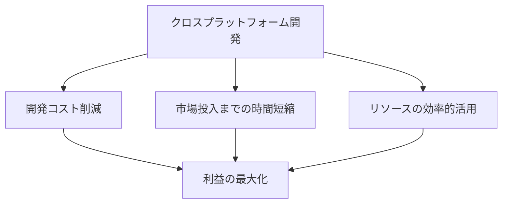

# Flutter vs React Native：クロスプラットフォーム開発の比較と選択基準

## はじめに

モバイルアプリケーションの開発は、近年急速に進化しており、特にクロスプラットフォーム開発の需要が高まっています。開発者は、iOSとAndroidの両方で動作するアプリを効率的に作成するためのフレームワークを探しています。FlutterとReact Nativeは、現在最も人気のあるクロスプラットフォーム開発フレームワークの2つです。本記事では、これらのフレームワークの特徴、利点、欠点、選択基準について詳しく比較し、開発者がどちらを選ぶべきかを考察します。

### クロスプラットフォーム開発の重要性

クロスプラットフォーム開発は、開発者が一つのコードベースで複数のプラットフォームに対応するアプリを作成できるため、開発コストや時間を大幅に削減できます。これにより、企業は市場投入までの時間を短縮し、リソースを効率的に活用することが可能になります。

このフローチャートは、クロスプラットフォーム開発がもたらす利点を視覚的に示しています。開発者は、これらの利点を考慮しながら、最適なフレームワークを選択する必要があります。

## Flutterとは？

Flutterは、Googleが開発したオープンソースのUIツールキットで、モバイル、ウェブ、デスクトップアプリケーションを単一のコードベースで構築することができます。FlutterはDartというプログラミング言語を使用しており、豊富なウィジェットとカスタマイズ可能なUIを提供します。

### Flutterの特徴

- **ホットリロード**: 開発中にコードを変更すると、即座にアプリに反映されるため、開発効率が向上します。これにより、開発者はアプリのUIや機能を迅速にテストし、フィードバックを得ることができます。ホットリロードは、特にデザインの調整や機能の追加を行う際に非常に便利です。
  
- **高性能**: Flutterはネイティブコンパイルを行うため、アプリのパフォーマンスが非常に高いです。特に、アニメーションやグラフィックスを多用するアプリケーションにおいて、そのパフォーマンスの優位性が顕著に現れます。Flutterは、Skiaという高性能な2Dグラフィックスエンジンを使用しており、これにより滑らかなアニメーションを実現しています。

- **豊富なウィジェット**: Flutterは多くのカスタマイズ可能なウィジェットを提供しており、デザインの自由度が高いです。これにより、開発者は独自のデザインを簡単に実現できます。Flutterのウィジェットは、Material DesignやCupertinoスタイルに基づいており、プラットフォームに応じた美しいUIを構築できます。

### Flutterの利点

1. **一貫したUI**: Flutterは、異なるプラットフォーム間で一貫したUIを提供します。これにより、ユーザーは異なるデバイスで同じ体験を得ることができます。特に、アプリのデザインが重要な場合、Flutterは非常に有利です。

2. **強力なコミュニティ**: Googleのサポートを受けており、活発な開発者コミュニティがあります。公式ドキュメントやフォーラム、GitHubリポジトリなど、情報が豊富に存在します。これにより、問題解決や新しい機能の実装が容易になります。

3. **多様なプラットフォーム対応**: モバイルだけでなく、ウェブやデスクトップアプリの開発も可能です。これにより、開発者は一つのフレームワークで多様なアプリケーションを構築できます。Flutterは、Webアプリやデスクトップアプリの開発においても、同じコードベースを使用できるため、開発効率が向上します。

### Flutterの欠点

1. **Dartの学習曲線**: Dartは他の言語に比べて普及していないため、新しい開発者にとっては学習が必要です。特に、JavaScriptやJavaに慣れた開発者にとっては、Dartの文法や特性を理解するのに時間がかかることがあります。Dartはオブジェクト指向プログラミングを基にしているため、他のオブジェクト指向言語に慣れている開発者には比較的学びやすいかもしれません。

2. **アプリサイズ**: Flutterアプリは、他のフレームワークに比べてサイズが大きくなる傾向があります。これは、Flutterが多くのライブラリやリソースを含むためであり、特にモバイルデバイスのストレージに影響を与える可能性があります。アプリのサイズが大きいと、ユーザーのダウンロードやインストールのハードルが上がることがあります。

## React Nativeとは？

React Nativeは、Facebookが開発したオープンソースのフレームワークで、JavaScriptを使用してネイティブアプリを構築することができます。React Nativeは、Reactのコンポーネントベースのアプローチを採用しており、開発者は既存のWeb技術を活用してアプリを構築できます。

### React Nativeの特徴

- **ネイティブコンポーネント**: React Nativeは、ネイティブのUIコンポーネントを使用しており、パフォーマンスが高いです。これにより、ユーザーはネイティブアプリと同様の体験を得ることができます。React Nativeは、iOSやAndroidのネイティブAPIに直接アクセスできるため、デバイスの機能をフルに活用できます。

- **ホットリロード**: コードの変更を即座にアプリに反映できるため、開発がスムーズです。これにより、開発者は迅速にフィードバックを得て、アプリの改善を行うことができます。ホットリロードは、特にUIの調整や機能の追加を行う際に非常に便利です。

- **豊富なライブラリ**: React Nativeは、多くのサードパーティライブラリが利用可能で、機能を簡単に追加できます。これにより、開発者は必要な機能を迅速に実装できます。React Nativeのエコシステムは非常に豊富で、さまざまなプラグインやライブラリが存在します。

### React Nativeの利点

1. **JavaScriptの利用**: JavaScriptは広く使われている言語であり、多くの開発者がすでに習得しています。これにより、新しいプロジェクトに参加する際のハードルが低くなります。特に、Web開発の経験がある開発者にとっては、React Nativeの学習が容易です。

2. **大規模なコミュニティ**: Facebookのサポートを受けており、活発な開発者コミュニティがあります。多くのリソースやチュートリアルが存在し、問題解決が容易です。コミュニティの活発さは、ライブラリやプラグインの更新頻度にも影響を与え、最新の技術にアクセスしやすくなります。

3. **ネイティブ体験**: ネイティブコンポーネントを使用するため、ユーザーにとっての体験が向上します。特に、アプリのパフォーマンスやレスポンスが重要な場合に有利です。React Nativeは、ネイティブのUIコンポーネントを使用するため、ユーザーはスムーズで直感的な操作が可能です。

### React Nativeの欠点

1. **パフォーマンスの問題**: 複雑なアプリケーションでは、パフォーマンスがFlutterに劣る場合があります。特に、アニメーションや大量のデータ処理を行うアプリでは、パフォーマンスの低下が顕著になることがあります。JavaScriptのブリッジを介してネイティブコードと通信するため、オーバーヘッドが発生することがあります。

2. **UIの一貫性**: プラットフォームごとに異なるUIコンポーネントを使用するため、一貫性が欠けることがあります。これにより、ユーザーが異なるデバイスで異なる体験をする可能性があります。特に、iOSとAndroidで異なるデザインガイドラインがあるため、開発者は注意が必要です。

## FlutterとReact Nativeの比較

### 開発言語

- **Flutter**: Dart
- **React Native**: JavaScript

Dartは新しい言語であり、学習曲線がある一方、JavaScriptは広く普及しているため、React Nativeの方が学習しやすいと感じる開発者が多いです。特に、JavaScriptのエコシステムは非常に豊富であり、さまざまなライブラリやフレームワークが利用可能です。

### パフォーマンス

Flutterはネイティブコンパイルを行うため、パフォーマンスが非常に高いです。特に、アニメーションやグラフィックスを多用するアプリケーションにおいて、そのパフォーマンスの優位性が顕著に現れます。一方、React NativeはJavaScriptを使用しているため、複雑なアプリケーションではパフォーマンスが低下する可能性があります。特に、アニメーションや大量のデータ処理を行うアプリでは、パフォーマンスの低下が顕著になることがあります。

### UIのカスタマイズ

Flutterは豊富なウィジェットを提供しており、デザインの自由度が高いです。これにより、開発者は独自のデザインを簡単に実現できます。Flutterのウィジェットは、Material DesignやCupertinoスタイルに基づいており、プラットフォームに応じた美しいUIを構築できます。React Nativeもネイティブコンポーネントを使用していますが、プラットフォームごとに異なるUIが必要になることがあります。これにより、デザインの一貫性が損なわれる可能性があります。

### コミュニティとサポート

両方のフレームワークは活発なコミュニティがあり、サポートが充実しています。しかし、React Nativeはより長い歴史があり、より多くのライブラリやリソースが存在します。これにより、問題解決や新しい機能の実装が容易になります。Flutterも急速に成長しているコミュニティを持っていますが、React Nativeに比べるとまだ発展途上です。

### 開発効率

両方のフレームワークはホットリロード機能を提供しており、開発効率が高いです。ただし、Flutterのウィジェットはカスタマイズが容易であるため、デザインの変更が迅速に行えます。React Nativeもホットリロードを提供していますが、特定の状況では再ビルドが必要になることがあります。これにより、開発者は時間を節約し、迅速にアプリを改善できます。

## 選択基準

### プロジェクトの要件

- **パフォーマンス重視**: 高パフォーマンスが求められるアプリケーションにはFlutterが適しています。特に、ゲームや高負荷なアプリケーションではFlutterの優位性が発揮されます。
  
- **既存の技術スタック**: JavaScriptに精通しているチームにはReact Nativeが適しています。特に、Web開発の経験がある開発者にとっては、React Nativeの学習が容易です。

### 開発者のスキル

- **Dartの習得**: Dartを学ぶ意欲がある場合はFlutterを選択する価値があります。特に、Dartの非同期処理やオブジェクト指向プログラミングの特性を理解することで、より効果的にFlutterを活用できます。

- **JavaScriptの経験**: JavaScriptの経験が豊富な場合はReact Nativeが適しています。特に、Reactのコンポーネントベースのアプローチに慣れている開発者にとっては、React Nativeの学習がスムーズです。

### プラットフォームのターゲット

- **モバイルとデスクトップ**: Flutterはモバイルだけでなく、デスクトップアプリの開発も可能です。これにより、開発者は一つのフレームワークで多様なアプリケーションを構築できます。

- **ネイティブ体験**: React Nativeはネイティブコンポーネントを使用しているため、ネイティブ体験を重視する場合に適しています。特に、ユーザーインターフェースの一貫性が重要なアプリケーションでは、React Nativeが有利です。

## まとめ

FlutterとReact Nativeは、それぞれ異なる利点と欠点を持つ強力なクロスプラットフォーム開発フレームワークです。選択する際は、プロジェクトの要件、開発者のスキル、ターゲットプラットフォームを考慮することが重要です。最終的には、どちらのフレームワークも優れた選択肢であり、開発者のニーズに応じて最適なものを選ぶことが求められます。

## 参考文献

- [Flutter公式サイト](https://flutter.dev/)
- [React Native公式サイト](https://reactnative.dev/)
- [Dartプログラミング言語](https://dart.dev/)
- [JavaScriptの基礎](https://developer.mozilla.org/ja/docs/Web/JavaScript)

-----

※本記事は生成AIを使用して作成されました。
AI言語モデル: gpt-4o-mini