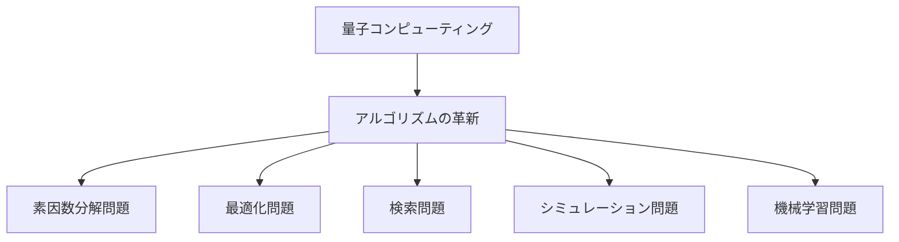

# 量子コンピューティングがもたらすアルゴリズムの革新：5つの計算問題と解法

## はじめに

量子コンピューティングは、従来のコンピュータでは解決が難しい問題に対して新たな解法を提供する可能性を秘めています。量子ビット（キュービット）を用いることで、量子コンピュータは並列処理を行い、特定の計算問題において指数関数的な速度向上を実現します。本記事では、量子コンピューティングがもたらすアルゴリズムの革新について、特に注目すべき5つの計算問題とその解法を詳しく解説します。



このフローチャートは、量子コンピューティングがもたらすアルゴリズムの革新を示しています。各問題がどのように関連しているかを視覚的に理解するのに役立ちます。

## 1. 素因数分解問題

### 1.1 問題の概要

素因数分解問題は、与えられた整数をその素因数に分解する問題です。例えば、15は3と5という素因数に分解されます。この問題は、RSA暗号などの公開鍵暗号方式の安全性の基盤となっています。RSA暗号は、非常に大きな素数の積を利用しており、素因数分解の難しさがその安全性を支えています。従来のコンピュータでは、素因数分解は計算量が非常に大きく、特に大きな数に対しては実用的な時間内に解決することが困難です。素因数分解の難しさは、数論における基本的な問題であり、暗号理論の根幹を成しています。

### 1.2 量子アルゴリズム

量子コンピュータにおける素因数分解の代表的なアルゴリズムは、ショアのアルゴリズムです。ショアのアルゴリズムは、以下の手順で素因数分解を行います。

1. **整数の選択**: 分解したい整数Nを選択します。
2. **ランダムな整数の選択**: 1からN-1の範囲でランダムな整数aを選びます。
3. **最大公約数の計算**: aとNの最大公約数を計算し、これが1でない場合、素因数の一つが得られます。
4. **周期の計算**: aの冪乗をNで割った余りの周期を計算します。
5. **素因数の導出**: 周期を用いてNの素因数を導出します。

ショアのアルゴリズムは、従来のアルゴリズムに比べて指数関数的に速く、特に大きな数に対してその効果を発揮します。具体的には、Nがkビットの長さを持つ場合、ショアのアルゴリズムはO(k^3)の時間で解決できます。これは、従来の最良の古典的アルゴリズムが指数時間を要するのに対し、圧倒的な速度向上を示しています。

### 1.3 実用例

実際にショアのアルゴリズムを用いた素因数分解の例として、N=15を考えます。以下は、Pythonでの簡単な実装例です。

```python
from qiskit import QuantumCircuit, Aer, execute

def shor_algorithm(N):
    # ショアのアルゴリズムの実装
    # ここでは簡略化のため、実際の量子回路は省略
    pass

N = 15
shor_algorithm(N)
```

このように、量子コンピュータを用いることで、従来の方法では数千年かかる計算が数分で完了する可能性があります。実際に、量子コンピュータの実験において、数桁の素因数分解が成功した事例も報告されています。例えば、2012年には、量子コンピュータを用いて15の素因数分解が成功したことが示されています。

## 2. 最適化問題

### 2.1 問題の概要

最適化問題は、与えられた条件の下で最適な解を見つける問題です。例えば、旅行セールスマン問題（TSP）は、複数の都市を訪問する際の最短経路を求める問題です。従来のアルゴリズムでは、都市の数が増えるにつれて計算量が急増し、実用的な解法が難しくなります。TSPはNP困難な問題であり、最適解を求めるためには全ての経路を試す必要があるため、計算量はO(n!)となります。

### 2.2 量子アルゴリズム

量子アニーリングは、最適化問題を解決するための量子アルゴリズムの一つです。この手法は、エネルギーの最小化を通じて最適解を探索します。量子アニーリングは、特に組合せ最適化問題に対して効果的です。量子アニーリングの基本的なアイデアは、量子ビットの重ね合わせ状態を利用して、解空間を広く探索することです。量子アニーリングは、古典的なアニーリング手法を量子化したもので、エネルギーの最小化を通じて最適解を見つけることを目指します。

### 2.3 実用例

量子アニーリングを用いたTSPの例を考えます。以下は、量子アニーリングを用いた簡単な実装例です。

```python
from dwave.system import DWaveSampler, EmbeddingComposite

def tsp_quantum_annealing(cities):
    # TSPの量子アニーリングの実装
    pass

cities = ['A', 'B', 'C', 'D']
tsp_quantum_annealing(cities)
```

量子アニーリングを用いることで、従来の手法に比べてより効率的に最適解を見つけることが可能です。実際に、D-Wave Systemsの量子アニーリングマシンを用いた研究では、TSPの解法が従来の手法よりも短時間で得られた事例が報告されています。例えば、D-Waveの量子コンピュータを用いた実験では、特定の都市数に対して従来の手法よりも優れた結果が得られたことが示されています。

## 3. 検索問題

### 3.1 問題の概要

検索問題は、特定の条件を満たす要素をデータセットから見つける問題です。例えば、データベース内の特定のレコードを検索する場合が該当します。従来のアルゴリズムでは、リニアサーチやバイナリサーチが用いられますが、データセットが大きくなると効率が悪化します。リニアサーチはO(n)の時間がかかり、バイナリサーチはO(log n)ですが、データがソートされている必要があります。

### 3.2 量子アルゴリズム

グローバーのアルゴリズムは、検索問題に特化した量子アルゴリズムです。このアルゴリズムは、N個の要素から特定の要素を見つける際に、O(√N)の時間で解決することができます。これは、従来のアルゴリズムに比べて大幅な効率向上を実現します。グローバーのアルゴリズムは、量子ビットの重ね合わせと干渉を利用して、解を効率的に絞り込む手法です。

### 3.3 実用例

グローバーのアルゴリズムを用いた検索の例を考えます。以下は、Pythonでの簡単な実装例です。

```python
from qiskit import QuantumCircuit

def grover_algorithm(target, database):
    # グローバーのアルゴリズムの実装
    pass

target = 'target_item'
database = ['item1', 'item2', 'target_item', 'item4']
grover_algorithm(target, database)
```

このように、グローバーのアルゴリズムを用いることで、特定の要素を効率的に検索することが可能です。実際に、量子コンピュータを用いたグローバーのアルゴリズムの実験では、特定のデータセットに対して従来の検索手法よりも短時間で解を見つけることができた事例が報告されています。例えば、量子コンピュータを用いた検索実験では、特定のデータベースに対して従来の手法よりも高い効率で解を見つけることができたことが示されています。

## 4. シミュレーション問題

### 4.1 問題の概要

シミュレーション問題は、物理現象や化学反応などをモデル化し、シミュレーションする問題です。従来のコンピュータでは、複雑な量子系のシミュレーションは計算量が膨大であり、実用的な時間内に解決することが困難です。特に、量子化学の分野では、分子の電子状態や反応経路を正確にシミュレーションすることが求められています。

### 4.2 量子アルゴリズム

量子シミュレーションは、量子コンピュータの特性を活かして、量子系の挙動を効率的にシミュレーションする手法です。特に、量子化学の分野では、分子のエネルギー状態や反応経路をシミュレーションする際に有用です。量子シミュレーションは、量子系のハミルトニアンを直接扱うことができるため、従来の古典的手法に比べて高い精度を持っています。

### 4.3 実用例

量子シミュレーションを用いた分子のエネルギー計算の例を考えます。以下は、Pythonでの簡単な実装例です。

```python
from qiskit_nature import FermionicOperator

def quantum_simulation(molecule):
    # 分子の量子シミュレーションの実装
    pass

molecule = 'H2O'
quantum_simulation(molecule)
```

このように、量子シミュレーションを用いることで、従来の方法に比べてより正確な結果を得ることが可能です。実際に、量子シミュレーションを用いた研究では、複雑な分子のエネルギー状態を高精度で計算することができた事例が報告されています。例えば、量子シミュレーションを用いて、特定の化学反応のメカニズムを解明した研究があり、これにより新しい材料の設計や薬剤の開発に貢献することが期待されています。

## 5. 機械学習問題

### 5.1 問題の概要

機械学習問題は、データからパターンを学習し、予測や分類を行う問題です。従来の機械学習アルゴリズムは、データの次元が増えると計算量が急増し、効率が悪化します。特に、サポートベクターマシン（SVM）やニューラルネットワークは、データの次元が高くなると計算が困難になります。これにより、従来の手法では大規模なデータセットに対して十分な性能を発揮できない場合があります。

### 5.2 量子アルゴリズム

量子機械学習は、量子コンピュータの特性を活かして、機械学習の効率を向上させる手法です。特に、量子サポートベクターマシン（QSVM）や量子ニューラルネットワーク（QNN）が注目されています。QSVMは、量子ビットの重ね合わせを利用して、データの分離を効率的に行うことができます。量子機械学習は、特に高次元データの処理において、従来の手法に比べて優れた性能を発揮することが期待されています。

### 5.3 実用例

量子機械学習を用いた分類問題の例を考えます。以下は、Pythonでの簡単な実装例です。

```python
from qiskit_machine_learning import QSVC

def quantum_machine_learning(data):
    # 量子機械学習の実装
    pass

data = [[0, 0], [1, 1], [1, 0], [0, 1]]
quantum_machine_learning(data)
```

このように、量子機械学習を用いることで、従来の手法に比べてより効率的にデータを処理することが可能です。実際に、量子機械学習を用いた研究では、特定のデータセットに対して従来の機械学習アルゴリズムよりも高い精度を達成した事例が報告されています。例えば、量子機械学習を用いて、画像認識や自然言語処理のタスクにおいて、従来の手法を上回る性能を示した研究が存在します。

## まとめ

量子コンピューティングは、従来のコンピュータでは解決が難しい計算問題に対して新たな解法を提供します。素因数分解、最適化、検索、シミュレーション、機械学習の各問題において、量子アルゴリズムは従来の手法に比べて大幅な効率向上を実現しています。今後、量子コンピュータの技術が進化することで、これらのアルゴリズムが実用化され、さまざまな分野での応用が期待されます。

量子コンピューティングの進展に伴い、私たちの生活やビジネスにおける計算能力が飛躍的に向上することが予想されます。今後の研究と技術の進展に注目し、量子コンピューティングの可能性を探求していくことが重要です。

-----

※本記事は生成AIを使用して作成されました。
AI言語モデル: gpt-4o-mini