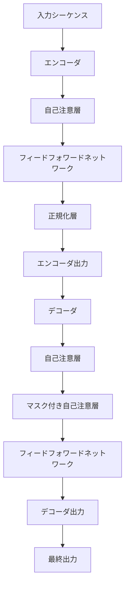

# 大規模言語モデルの内部構造：Transformerアーキテクチャの最新最適化手法

## はじめに

近年、人工知能（AI）と自然言語処理（NLP）の分野において、大規模言語モデル（LLM）が急速に進化しています。特に、Transformerアーキテクチャはその革新性と性能の高さから、さまざまなアプリケーションで広く利用されています。本記事では、Transformerアーキテクチャの基本的な構造とその最新の最適化手法について詳しく解説し、実際の応用例や今後の展望についても考察します。

### ダイアグラム1: Transformerアーキテクチャの基本構造

以下のダイアグラムは、Transformerアーキテクチャの基本的な構造を示しています。エンコーダとデコーダの主要なコンポーネントがどのように相互作用するかを視覚的に表現しています。

このダイアグラムは、エンコーダが入力シーケンスを処理し、デコーダがその出力を基に最終的な出力を生成する流れを示しています。自己注意層やフィードフォワードネットワークがどのように機能するかを理解するための基盤となります。

## Transformerアーキテクチャの基本構造

### 1. Transformerの概要

Transformerは、2017年にVaswaniらによって提案されたモデルで、主に自己注意機構（Self-Attention）を利用して入力データの関係性を捉えます。従来のRNNやLSTMと異なり、Transformerは並列処理が可能であり、長い文脈を効率的に扱うことができます。この特性により、Transformerは大規模なデータセットに対しても高い性能を発揮します。

#### 1.1 従来のモデルとの比較

従来のRNNやLSTMは、シーケンシャルなデータ処理を行うため、長いシーケンスを扱う際に情報の消失や勾配消失問題が発生しやすいです。一方、Transformerは自己注意機構を用いることで、全てのトークン間の関係を同時に考慮することができ、長距離依存性を効果的に捉えることができます。このため、Transformerは特に長文の処理において優れた性能を示します。

### 2. 基本的な構成要素

Transformerは、エンコーダとデコーダの2つの主要な部分から構成されています。

#### 2.1 エンコーダ

エンコーダは、入力シーケンスを受け取り、各トークンの埋め込みベクトルを生成します。エンコーダは以下の層から構成されています。

- **自己注意層**: 各トークンが他のトークンに対してどの程度注意を払うかを計算します。これにより、文脈に基づいた情報の集約が可能になります。
- **フィードフォワードネットワーク**: 各トークンの埋め込みを変換するための全結合層です。通常、ReLUなどの活性化関数が使用されます。
- **正規化層**: 各層の出力を正規化し、学習を安定させます。Layer Normalizationが一般的に使用されます。

エンコーダは、複数の層から構成されており、各層は自己注意層とフィードフォワードネットワークを持ちます。これにより、モデルはより深い文脈を理解する能力を持ちます。

#### 2.2 デコーダ

デコーダは、エンコーダからの出力を受け取り、最終的な出力シーケンスを生成します。デコーダもエンコーダと同様の構成を持ちますが、自己注意層はマスクされており、未来のトークンに対する情報を参照できないようになっています。これにより、生成タスクにおいて適切な出力が得られます。

### 3. 自己注意機構

自己注意機構は、入力シーケンス内のトークン間の関係を捉えるための重要な要素です。具体的には、各トークンが他のトークンに対してどの程度の注意を払うかを計算します。これにより、文脈に基づいた情報の集約が可能になります。

#### 3.1 注意スコアの計算

注意スコアは、クエリ（Query）、キー（Key）、バリュー（Value）の3つのベクトルを用いて計算されます。具体的には、以下の式で表されます。

$$
\text{Attention}(Q, K, V) = \text{softmax}\left(\frac{QK^T}{\sqrt{d_k}}\right)V
$$

ここで、$d_k$はキーの次元数です。この計算により、各トークンが他のトークンに対してどの程度の注意を払うかが決定されます。注意スコアは、トークン間の相対的な重要性を示し、文脈に応じた情報の集約を可能にします。

#### 3.2 マルチヘッドアテンション

Transformerでは、マルチヘッドアテンションが使用されます。これは、複数の自己注意機構を並行して実行し、それぞれのヘッドが異なる部分の情報を捉えることを可能にします。最終的に、各ヘッドの出力を結合し、次の層に渡します。これにより、モデルはより多様な情報を同時に処理することができます。

### 4. ポジショナルエンコーディング

Transformerは、シーケンス内のトークンの順序情報を保持するために、ポジショナルエンコーディングを使用します。これは、トークンの埋め込みに加算されるベクトルで、トークンの位置を示します。ポジショナルエンコーディングは、サインとコサインの関数を用いて計算されます。

$$
PE_{(pos, 2i)} = \sin\left(\frac{pos}{10000^{\frac{2i}{d_{model}}}}\right) \\
PE_{(pos, 2i+1)} = \cos\left(\frac{pos}{10000^{\frac{2i}{d_{model}}}}\right)
$$

ここで、$pos$はトークンの位置、$i$は次元のインデックス、$d_{model}$は埋め込みの次元数です。このポジショナルエンコーディングにより、モデルはトークンの順序を理解し、文脈をより正確に捉えることができます。

## 最新の最適化手法

### 1. モデル圧縮技術

大規模言語モデルは、膨大なパラメータを持つため、計算リソースやメモリの消費が大きいです。これを解決するために、モデル圧縮技術が注目されています。以下に代表的な手法を紹介します。

#### 1.1 プルーニング

プルーニングは、重要でないパラメータを削除することでモデルのサイズを縮小する手法です。これにより、推論速度が向上し、メモリ使用量が削減されます。プルーニングは、トレーニング後に行うことが一般的ですが、トレーニング中に動的に行う手法も研究されています。プルーニングの効果を最大化するためには、重要度スコアを計算し、低いスコアのパラメータを選択的に削除する必要があります。

#### 1.2 量子化

量子化は、モデルのパラメータを低精度の数値（例えば、32ビット浮動小数点から8ビット整数）に変換する手法です。これにより、モデルのサイズが大幅に削減され、計算速度が向上します。量子化には、静的量子化と動的量子化の2つのアプローチがあります。静的量子化は、トレーニング後に行われ、動的量子化は推論時に行われます。量子化の際には、精度の損失を最小限に抑えるための工夫が必要です。

### 2. 転移学習とファインチューニング

転移学習は、事前に学習したモデルを特定のタスクに適応させる手法です。これにより、少ないデータで高い性能を達成することが可能になります。ファインチューニングは、特定のデータセットに対してモデルを再学習させるプロセスです。これにより、モデルは特定のドメインやタスクに特化した知識を獲得します。ファインチューニングの際には、学習率やエポック数を調整することで、過学習を防ぎつつ最適な性能を引き出すことが重要です。

### 3. アテンションの改良

#### 3.1 スパースアテンション

スパースアテンションは、全てのトークン間の関係を計算するのではなく、重要なトークン間の関係のみを計算する手法です。これにより、計算コストが大幅に削減されます。スパースアテンションは、特に長いシーケンスを扱う際に有効です。具体的には、トークンの重要度を事前に評価し、重要なトークンのみに注意を集中させることで、計算の効率を向上させます。

#### 3.2 Linformer

Linformerは、自己注意機構の計算を線形時間に削減する手法です。具体的には、自己注意の計算を低次元の埋め込みに変換することで、計算量を削減します。Linformerは、特に大規模なデータセットに対して効率的に動作します。この手法は、自己注意の計算を行う際に、トークン数に依存しない固定の次元数で処理を行うため、計算リソースの節約に寄与します。

### 4. ハイブリッドアーキテクチャ

最近の研究では、Transformerと他のアーキテクチャ（例えば、CNNやRNN）を組み合わせたハイブリッドアーキテクチャが提案されています。これにより、各アーキテクチャの強みを活かし、より高い性能を実現することが可能になります。例えば、CNNを用いて局所的な特徴を捉え、Transformerで長距離の依存関係を学習するアプローチが考えられます。このようなハイブリッドアーキテクチャは、特に画像処理や音声処理の分野での応用が期待されています。

## 実践的な応用例

### 1. 自然言語処理

大規模言語モデルは、機械翻訳、文書要約、質問応答など、さまざまな自然言語処理タスクで利用されています。例えば、GoogleのBERTやOpenAIのGPTシリーズは、これらのタスクで高い性能を発揮しています。BERTは双方向の文脈を考慮することで、文の意味をより深く理解することができ、GPTは生成タスクに特化したモデルとして知られています。これらのモデルは、特に大規模なデータセットでトレーニングされており、実際のアプリケーションにおいても高い精度を示しています。

### 2. 画像処理

最近では、Transformerを画像処理に応用する研究も進んでいます。Vision Transformer（ViT）は、画像をパッチに分割し、各パッチをトークンとして扱うことで、画像分類タスクにおいて優れた性能を示しています。ViTは、従来のCNNに比べて大規模なデータセットでのトレーニングが可能であり、特に大規模な画像データに対して効果的です。ViTの成功は、画像処理におけるTransformerの有用性を示す重要な例となっています。

### 3. 音声処理

音声認識や音声合成の分野でも、Transformerが利用されています。特に、音声データをトークン化し、自己注意機構を用いることで、音声の文脈を捉えることが可能になります。音声処理におけるTransformerの利用は、従来のRNNベースの手法に比べて、より高い精度を実現しています。音声合成においては、Transformerを用いたモデルが自然な音声生成を実現しており、商業的なアプリケーションでも広く採用されています。

## 課題と今後の展望

### 1. 計算リソースの消費

大規模言語モデルは、トレーニングや推論に膨大な計算リソースを必要とします。これにより、環境への影響やコストの問題が懸念されています。今後は、より効率的なアルゴリズムやハードウェアの開発が求められます。特に、エネルギー効率の良いトレーニング手法や、分散処理を活用したアプローチが注目されています。

### 2. バイアスと倫理的問題

大規模言語モデルは、トレーニングデータに含まれるバイアスを学習する可能性があります。これにより、生成されるコンテンツに不適切な表現が含まれることがあります。今後は、バイアスを軽減するための手法や倫理的なガイドラインの策定が重要です。具体的には、データの選定や前処理においてバイアスを考慮することが求められます。また、モデルの出力を監視し、問題が発生した場合には適切な対策を講じることが必要です。

### 3. ユーザーインターフェースの改善

大規模言語モデルを利用したアプリケーションのユーザーインターフェースは、まだ発展途上です。ユーザーがモデルの出力を理解しやすくするためのインターフェース設計が求められます。特に、ユーザーがモデルの判断根拠を理解できるような可視化手法の開発が期待されています。これにより、ユーザーはモデルの出力をより信頼しやすくなり、実際のアプリケーションでの利用が促進されるでしょう。

## まとめ

本記事では、Transformerアーキテクチャの基本構造とその最新の最適化手法について詳しく解説しました。大規模言語モデルは、自然言語処理をはじめとするさまざまな分野での応用が期待されており、今後の研究や技術の進展が注目されます。計算リソースの消費や倫理的な問題に対する解決策を模索しながら、より効率的で公平なAIシステムの構築が求められています。

## 参考文献

- Vaswani, A., et al. (2017). "Attention is All You Need." NeurIPS.
- Devlin, J., et al. (2018). "BERT: Pre-training of Deep Bidirectional Transformers for Language Understanding." arXiv.
- Dosovitskiy, A., et al. (2020). "An Image is Worth 16x16 Words: Transformers for Image Recognition at Scale." arXiv.

-----

※本記事は生成AIを使用して作成されました。
AI言語モデル: gpt-4o-mini