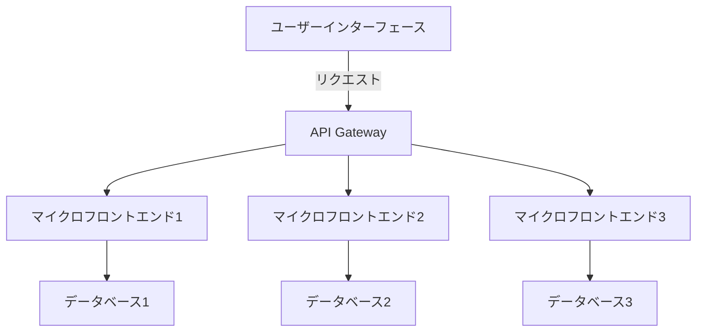

# マイクロフロントエンドアーキテクチャ：モノリスからの段階的移行戦略

## はじめに

近年、ソフトウェア開発の世界では、マイクロサービスアーキテクチャが注目を集めていますが、フロントエンドの開発においても同様のトレンドが見られます。マイクロフロントエンドアーキテクチャは、フロントエンドの開発を小さな独立した部分に分割し、それぞれを独立して開発、デプロイ、運用することを可能にします。このアプローチは、特に大規模なアプリケーションやチームが複数存在する場合において、開発の効率性やスケーラビリティを向上させるための有力な手段となります。

本記事では、マイクロフロントエンドアーキテクチャの基本概念、モノリスからの段階的移行戦略、実践的な実装例、そしてこのアーキテクチャの利点と課題について詳しく解説します。

### マイクロフロントエンドの全体像

以下のダイアグラムは、マイクロフロントエンドアーキテクチャの全体像を示しています。各コンポーネントがどのように相互作用し、全体のアーキテクチャがどのように構成されているかを視覚的に理解するのに役立ちます。



このダイアグラムでは、ユーザーインターフェースがAPI Gatewayを通じて複数のマイクロフロントエンドにリクエストを送信し、それぞれが独自のデータベースにアクセスする様子を示しています。これにより、各マイクロフロントエンドが独立して機能し、全体のアーキテクチャが柔軟性を持つことがわかります。

## マイクロフロントエンドアーキテクチャの基本概念

### マイクロフロントエンドとは？

マイクロフロントエンドは、マイクロサービスの原則をフロントエンドに適用したもので、アプリケーションのユーザーインターフェースを複数の小さな、独立した部分に分割します。これにより、各部分は異なるチームによって独立して開発され、異なる技術スタックを使用することが可能になります。マイクロフロントエンドは、特に大規模なアプリケーションや複数のチームが関与するプロジェクトにおいて、開発の効率性を高めるための重要なアプローチです。

### マイクロフロントエンドの利点

1. **独立したデプロイ**: 各フロントエンド部分は独立してデプロイできるため、全体のアプリケーションを停止することなく新機能を追加できます。これにより、開発サイクルが短縮され、迅速なリリースが可能になります。たとえば、あるチームが新しい機能を開発している間に、他のチームは既存の機能を改善することができます。

2. **技術の多様性**: チームは自分たちのニーズに最適な技術を選択できるため、最新の技術を迅速に取り入れることができます。例えば、あるチームがReactを使用している一方で、別のチームがVue.jsを選択することも可能です。このように、各チームが最適な技術を選ぶことで、全体の開発効率が向上します。

3. **スケーラビリティ**: 大規模なアプリケーションを小さな部分に分割することで、開発のスケーラビリティが向上します。これにより、チームは特定の機能に集中でき、全体の開発効率が向上します。たとえば、ユーザー管理機能を担当するチームが、他の機能に影響を与えずに独自のペースで開発を進めることができます。

4. **チームの独立性**: 各チームは独自の開発プロセスを持つことができ、他のチームに依存することなく作業を進められます。これにより、チーム間のコミュニケーションコストが削減され、開発のスピードが向上します。各チームが自分たちのスケジュールに従って作業できるため、全体の生産性が向上します。

### マイクロフロントエンドの課題

1. **統合の複雑さ**: 複数のフロントエンド部分を統合する際の複雑さが増します。異なる技術スタックやフレームワークを使用する場合、統合のための共通のインターフェースやプロトコルを設計する必要があります。これにより、開発者は統合のための追加の作業を行う必要があります。

2. **パフォーマンスの問題**: 各部分が異なるリソースを使用するため、パフォーマンスの最適化が難しくなることがあります。特に、複数のマイクロフロントエンドが同時に読み込まれる場合、初期ロード時間が長くなる可能性があります。これを解決するためには、リソースの最適化やキャッシュの利用が重要です。

3. **ユーザー体験の一貫性**: 異なるチームが異なるスタイルや技術を使用することで、ユーザー体験が一貫しない可能性があります。これを防ぐためには、デザインシステムやスタイルガイドを策定し、全チームで共有することが重要です。ユーザーが異なる部分を利用する際に、一貫した体験を提供するための努力が必要です。

## モノリスからの段階的移行戦略

### モノリスの理解

モノリスアーキテクチャは、すべての機能が単一のコードベースに統合されているアプローチです。このアプローチは、初期の開発には適しているものの、アプリケーションが成長するにつれて、開発のスピードや柔軟性が制限されることがあります。モノリスの問題点としては、以下のようなものがあります。

- **デプロイの難しさ**: 一部の機能を変更するために、全体のアプリケーションを再デプロイする必要があるため、リリースサイクルが遅くなります。これにより、開発者は小さな変更でも大きなリスクを伴うことになります。

- **技術的負債**: 時間が経つにつれて、コードが複雑化し、保守が難しくなることがあります。特に、古い技術やフレームワークを使用している場合、更新が困難になることがあります。

- **スケーラビリティの制限**: アプリケーション全体をスケールアップする必要があるため、リソースの無駄遣いが発生することがあります。特定の機能だけをスケールアップしたい場合でも、全体をスケールアップする必要があるため、コストが増加します。

### 段階的移行の重要性

モノリスからマイクロフロントエンドへの移行は、一度にすべてを変更するのではなく、段階的に行うことが推奨されます。これにより、リスクを最小限に抑えつつ、既存のシステムを維持しながら新しいアーキテクチャに移行できます。段階的な移行の利点には、以下のようなものがあります。

- **リスク管理**: 小さな部分から移行を始めることで、問題が発生した場合の影響を最小限に抑えることができます。これにより、開発者は新しいアーキテクチャに慣れる時間を持つことができます。

- **フィードバックの収集**: 移行した部分に対するユーザーのフィードバックを収集し、改善を行うことができます。ユーザーの反応を確認し、必要に応じて調整を行うことで、より良いユーザー体験を提供できます。

- **段階的な学習**: チームは新しいアーキテクチャに慣れる時間を持つことができ、スムーズな移行が可能になります。これにより、チームは新しい技術やプロセスに対する理解を深めることができます。

### 移行戦略のステップ

1. **現状分析**: 現在のモノリスアーキテクチャを分析し、どの部分がマイクロフロントエンドに適しているかを特定します。特に、依存関係が少ない機能やコンポーネントを優先的に選定します。これにより、移行の影響を最小限に抑えることができます。

2. **小さな部分から開始**: 最も独立性が高い機能やコンポーネントからマイクロフロントエンドに移行します。これにより、移行の影響を最小限に抑えられます。たとえば、ユーザーのプロフィール情報を表示する機能を最初に移行することが考えられます。

3. **インターフェースの定義**: 各マイクロフロントエンド部分がどのように相互作用するかを定義し、APIやイベントバスを使用して統合します。これにより、異なる部分間の通信が円滑になります。APIの設計は、将来的な拡張性を考慮して行うことが重要です。

4. **テストとフィードバック**: 移行した部分をテストし、フィードバックを収集して改善を行います。ユーザーの反応を確認し、必要に応じて調整を行います。テストは自動化し、継続的インテグレーションのプロセスに組み込むことが推奨されます。

5. **段階的な拡張**: 移行が成功したら、他の部分も同様にマイクロフロントエンドに移行していきます。これにより、全体のアーキテクチャが徐々に進化していきます。移行の進捗を定期的にレビューし、必要に応じて戦略を調整します。

### 実践的な移行例

例えば、あるEコマースサイトがモノリスアーキテクチャで構築されているとします。このサイトには、商品一覧、カート、ユーザーアカウント管理などの機能があります。移行戦略として、まずは「商品一覧」機能をマイクロフロントエンドに移行することを考えます。

1. **現状分析**: 商品一覧機能が他の機能に依存しているかを確認します。依存関係が少ない場合、移行の候補として適しています。

2. **小さな部分から開始**: 商品一覧を独立したマイクロフロントエンドとして開発します。この部分は、他の機能に影響を与えずに開発できます。

3. **インターフェースの定義**: 商品一覧がカートやユーザーアカウントとどのように連携するかをAPIで定義します。例えば、商品をカートに追加するためのAPIエンドポイントを設計します。

4. **テストとフィードバック**: 新しい商品一覧機能をテストし、ユーザーからのフィードバックを収集します。ユーザーの使いやすさやパフォーマンスを確認します。

5. **段階的な拡張**: 商品一覧が成功したら、次にカート機能を移行します。これにより、全体のアーキテクチャが徐々にマイクロフロントエンドに移行していきます。

## マイクロフロントエンドの実装技術

### フレームワークとライブラリ

マイクロフロントエンドを実装するためのフレームワークやライブラリはいくつか存在します。以下はその一部です。

- **Single-SPA**: 複数のフロントエンドアプリケーションを統合するためのフレームワークで、異なるフレームワーク（React、Vue、Angularなど）を同時に使用できます。Single-SPAは、アプリケーションのルーティングやライフサイクル管理を簡素化します。

- **Module Federation**: Webpack 5の機能で、異なるアプリケーション間でモジュールを共有することができます。これにより、アプリケーション間でのコードの再利用が容易になり、パフォーマンスの向上が期待できます。

- **Qiankun**: マイクロフロントエンドのためのフレームワークで、シンプルなAPIを提供し、複数のアプリケーションを統合できます。Qiankunは、アプリケーションのライフサイクル管理やリソースの共有をサポートします。

### コードサンプル

以下は、Single-SPAを使用してマイクロフロントエンドを実装する際の基本的なコードサンプルです。

```javascript
import { registerApplication, start } from 'single-spa';

registerApplication(
  'app1',
  () => import('./app1/main.js'),
  location => location.pathname.startsWith('/app1')
);

registerApplication(
  'app2',
  () => import('./app2/main.js'),
  location => location.pathname.startsWith('/app2')
);

start();
```

このコードは、`app1`と`app2`という2つのマイクロフロントエンドアプリケーションを登録し、URLのパスに基づいて適切なアプリケーションを表示します。これにより、ユーザーは異なるアプリケーションをシームレスに利用できるようになります。

### パフォーマンスの最適化

マイクロフロントエンドを実装する際には、パフォーマンスの最適化が重要です。以下のポイントに注意することで、パフォーマンスを向上させることができます。

1. **コードスプリッティング**: 各マイクロフロントエンド部分を必要なときにのみ読み込むことで、初期ロード時間を短縮します。これにより、ユーザーがアプリケーションを使用する際の待機時間が減少します。

2. **キャッシュの利用**: 静的リソースをキャッシュすることで、再訪問時のパフォーマンスを向上させます。HTTPキャッシュやService Workerを活用することで、リソースの再利用が可能になります。

3. **CDNの利用**: コンテンツ配信ネットワーク（CDN）を使用して、リソースの配信速度を向上させます。これにより、ユーザーが地理的に離れた場所からアクセスしても、高速なレスポンスを提供できます。

## マイクロフロントエンドの将来展望

マイクロフロントエンドアーキテクチャは、今後ますます重要な役割を果たすと考えられています。特に、以下のトレンドが予想されます。

1. **技術の進化**: 新しいフレームワークやライブラリが登場し、マイクロフロントエンドの実装がさらに容易になるでしょう。特に、Web Componentsや新しいJavaScriptの機能が、マイクロフロントエンドの開発を加速させると期待されます。

2. **企業の採用**: 大規模な企業がマイクロフロントエンドを採用することで、成功事例が増え、他の企業も追随する可能性があります。特に、アジャイル開発やDevOpsの普及に伴い、マイクロフロントエンドの需要が高まるでしょう。

3. **コミュニティの成長**: マイクロフロントエンドに関するコミュニティが成長し、ベストプラクティスやツールが共有されることで、開発者の学習が促進されるでしょう。オープンソースプロジェクトやカンファレンスが増えることで、知識の共有が進むと考えられます。

## まとめ

マイクロフロントエンドアーキテクチャは、モノリスからの段階的な移行を可能にし、開発の効率性やスケーラビリティを向上させるための強力な手段です。独立したデプロイや技術の多様性、チームの独立性などの利点を享受しつつ、統合の複雑さやパフォーマンスの問題に対処する必要があります。

段階的な移行戦略を採用することで、リスクを最小限に抑えながら新しいアーキテクチャに移行することが可能です。今後の技術の進化や企業の採用が進む中で、マイクロフロントエンドはますます重要なアプローチとなるでしょう。

さらに学習を進めるためのリソースとして、以下のリンクを参考にしてください。

- [Single-SPA Documentation](https://single-spa.js.org/)
- [Webpack Module Federation](https://webpack.js.org/concepts/module-federation/)
- [Qiankun Documentation](https://qiankun.umijs.org/)

-----

※本記事は生成AIを使用して作成されました。
AI言語モデル: gpt-4o-mini