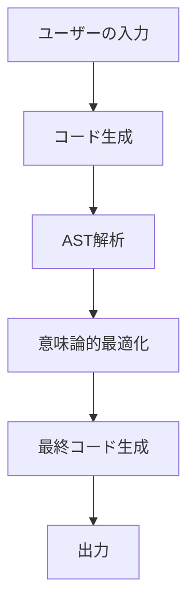
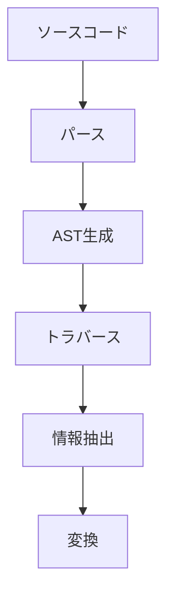
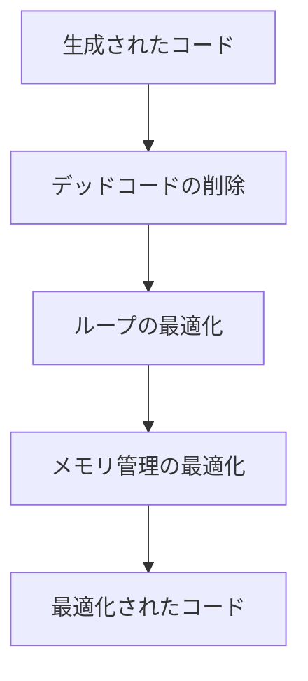

# GPT-4を活用した高度なコード生成：AST解析と意味論的最適化の実践

## はじめに

近年、人工知能（AI）の進化は目覚ましく、特に自然言語処理（NLP）の分野においては、GPT-4のような大規模言語モデルが登場し、プログラミングやコード生成の手法に革命をもたらしています。GPT-4は、従来のプログラミング手法に比べて、より直感的で効率的なコード生成を可能にします。本記事では、GPT-4を活用した高度なコード生成の手法として、抽象構文木（AST）解析と意味論的最適化に焦点を当て、実践的なアプローチを探ります。

### ダイアグラムの挿入

以下のフローチャートは、GPT-4を用いたコード生成のプロセスを視覚的に示しています。このフローチャートは、ユーザーの入力から最終的なコード生成までの流れを示しており、各ステップの関係性を理解するのに役立ちます。



このフローチャートは、GPT-4を使用したコード生成の各ステップを示しており、プロセスの流れを視覚的に理解するのに役立ちます。

## GPT-4の概要

GPT-4は、OpenAIによって開発された最新の言語モデルであり、数十億のパラメータを持つことで知られています。このモデルは、テキスト生成、質問応答、翻訳、要約など、さまざまなタスクに対応できる能力を持っています。特に、プログラミングにおいては、自然言語での指示を受け取り、それに基づいてコードを生成することが可能です。

### GPT-4の特徴

- **大規模なデータセット**: GPT-4は、インターネット上の膨大なテキストデータを学習しており、さまざまなプログラミング言語やフレームワークに関する知識を持っています。これにより、特定の言語やフレームワークに特化したコード生成が可能です。例えば、Python、JavaScript、Java、C++など、主要なプログラミング言語に対する理解が深まっています。

- **コンテキスト理解**: 文脈を理解し、適切なコードを生成する能力が向上しています。これにより、ユーザーの意図をより正確に反映したコードを生成できます。例えば、ユーザーが「データベースに接続するコードを生成して」と指示した場合、GPT-4は適切なライブラリや接続方法を考慮してコードを生成します。

- **多様な出力形式**: コードだけでなく、コメントやドキュメンテーションも生成できるため、開発者にとって非常に便利です。これにより、生成されたコードの理解が容易になり、メンテナンス性が向上します。さらに、生成されたコードに対して自動的にテストケースを作成する機能も期待されています。

## AST解析の重要性

抽象構文木（AST）は、プログラムの構文を木構造で表現したものであり、プログラムの構造を理解するための重要な手段です。ASTを用いることで、コードの解析や変換、最適化が容易になります。

### ASTの基本構造

ASTは、プログラムの各構成要素（関数、変数、演算子など）をノードとして表現し、これらの関係をエッジで示します。以下は、簡単なJavaScriptのコードとそのASTの例です。

```javascript
// JavaScriptの例
function add(a, b) {
    return a + b;
}
```

このコードのASTは、以下のように表現されます。

```
FunctionDeclaration
├── Identifier (add)
├── Parameters
│   ├── Identifier (a)
│   └── Identifier (b)
└── ReturnStatement
    └── BinaryExpression
        ├── Identifier (a)
        ├── +
        └── Identifier (b)
```

### AST解析のプロセス

AST解析は、以下のステップで行われます。

1. **パース**: ソースコードを解析し、ASTを生成します。このプロセスでは、構文解析器がソースコードを読み取り、文法に基づいてASTを構築します。例えば、Pythonでは`ast`モジュールを使用してASTを生成できます。

2. **トラバース**: ASTを走査し、必要な情報を抽出します。トラバースには、深さ優先探索や幅優先探索などの手法が用いられます。これにより、特定のノードにアクセスし、必要な情報を取得することができます。

3. **変換**: ASTを基に新しいコードを生成したり、最適化を行ったりします。この段階では、ASTのノードを変更したり、新しいノードを追加したりすることが可能です。例えば、特定の条件に基づいてコードの一部を変更することができます。

### AST解析のフローチャート

次に、AST解析のプロセスを示すフローチャートを示します。このダイアグラムは、AST解析の各ステップを視覚的に表現しています。



このフローチャートは、AST解析の流れを示しており、各ステップの関係性を理解するのに役立ちます。

## 意味論的最適化

意味論的最適化は、プログラムの意味を考慮しながら、コードの効率を向上させる手法です。これにより、生成されたコードがより効率的で、実行時のパフォーマンスが向上します。

### 意味論的最適化の手法

1. **デッドコードの削除**: 使用されていない変数や関数を削除することで、コードを簡潔にします。デッドコードは、プログラムの可読性を低下させ、メンテナンスの負担を増加させるため、積極的に削除することが推奨されます。例えば、関数内で定義されたが使用されていない変数は、コードの無駄を生むため、削除するべきです。

2. **ループの最適化**: ループの回数を減らしたり、ループの中での計算を外に出すことで、実行速度を向上させます。例えば、ループ内で同じ計算を繰り返す場合、その計算をループの外に移動させることで、パフォーマンスを改善できます。さらに、ループの条件を見直すことで、無駄な反復を減らすことも可能です。

3. **メモリ管理の最適化**: 不要なメモリの割り当てを避け、効率的なメモリ使用を実現します。特に、大規模なデータを扱う場合、メモリの使用効率がパフォーマンスに大きな影響を与えるため、注意が必要です。例えば、リストや配列のサイズを事前に決定することで、メモリの再割り当てを避けることができます。

### 意味論的最適化のフローチャート

次に、意味論的最適化のプロセスを示すフローチャートを示します。このダイアグラムは、最適化の各ステップを視覚的に表現しています。



このフローチャートは、意味論的最適化の流れを示しており、各ステップの関係性を理解するのに役立ちます。

## GPT-4によるAST解析と意味論的最適化の実践

GPT-4を活用して、AST解析と意味論的最適化を実践する方法について詳しく見ていきます。

### コード生成のフロー

1. **ユーザーの入力**: ユーザーが自然言語でコードの要件を入力します。例えば、「与えられたリストの要素をすべて二倍にする関数を作成してください」といった具体的な指示が考えられます。

2. **コード生成**: GPT-4がその要件に基づいて初期コードを生成します。この段階では、ユーザーの意図を正確に反映したコードが生成されることが期待されます。例えば、リストの要素を二倍にするためのPythonコードが生成されます。

3. **AST解析**: 生成されたコードをASTに変換し、解析を行います。ASTを用いることで、コードの構造を視覚化し、理解しやすくなります。これにより、コードの各部分がどのように相互作用しているかを把握できます。

4. **最適化**: ASTを基に意味論的最適化を実施し、最終的なコードを生成します。この段階では、デッドコードの削除やループの最適化が行われ、パフォーマンスが向上します。最適化後のコードは、より効率的で実行速度が速くなります。

### 実践例

以下は、GPT-4を用いたコード生成の実践例です。

#### ユーザーの入力

「2つの数の合計を計算する関数を作成してください。」

#### GPT-4による生成コード

```python
def add_numbers(a, b):
    return a + b
```

#### AST解析

生成されたコードをASTに変換し、解析を行います。

```python
# PythonのASTモジュールを使用
import ast

code = """
def add_numbers(a, b):
    return a + b
"""

tree = ast.parse(code)
```

このASTをトラバースすることで、関数の構造や引数、戻り値の型などを確認できます。ASTの各ノードを調べることで、コードの動作を深く理解することができます。

#### 意味論的最適化

ASTを解析し、最適化を行います。この場合、特に最適化の必要はありませんが、より複雑なコードの場合には、デッドコードの削除やループの最適化が行われることがあります。例えば、生成されたコードに無駄な計算が含まれている場合、それを削除することでパフォーマンスを向上させることができます。

## 課題と解決策

GPT-4を用いたコード生成にはいくつかの課題があります。以下に代表的な課題とその解決策を示します。

### 課題1: コードの正確性

生成されたコードが必ずしも正確であるとは限りません。特に複雑なロジックや特定のライブラリに依存する場合、エラーが発生する可能性があります。

#### 解決策

生成されたコードを自動的にテストするフレームワークを導入し、ユニットテストを実施することで、正確性を確保します。例えば、Pythonでは`unittest`モジュールを使用して、生成された関数の動作を確認することができます。テストケースを作成し、期待される出力と実際の出力を比較することで、コードの正確性を検証できます。

### 課題2: パフォーマンスの最適化

生成されたコードが必ずしも最適化されているわけではありません。特に大規模なデータを扱う場合、パフォーマンスが問題になることがあります。

#### 解決策

AST解析と意味論的最適化を組み合わせることで、生成されたコードのパフォーマンスを向上させることができます。具体的には、ASTを解析してボトルネックを特定し、最適化を行うことで、実行速度を改善します。また、パフォーマンスを測定するためのベンチマークテストを実施し、最適化の効果を確認することも重要です。

## まとめ

本記事では、GPT-4を活用した高度なコード生成の手法として、AST解析と意味論的最適化に焦点を当てました。GPT-4の強力な自然言語処理能力を活かし、ユーザーの要件に基づいて効率的なコードを生成することが可能です。また、AST解析を通じてコードの構造を理解し、意味論的最適化を行うことで、生成されたコードのパフォーマンスを向上させることができます。

今後、AI技術の進化に伴い、プログラミングの手法もさらに進化していくことでしょう。GPT-4を活用したコード生成は、その一環として、開発者にとっての新たな可能性を切り開くものとなるでしょう。

## 参考文献

- OpenAI. (2023). GPT-4 Technical Report.
- Python Software Foundation. (2023). Python AST Documentation.
- Cormen, T. H., Leiserson, C. E., Rivest, R. L., & Stein, C. (2009). Introduction to Algorithms.

-----

※本記事は生成AIを使用して作成されました。
AI言語モデル: gpt-4o-mini