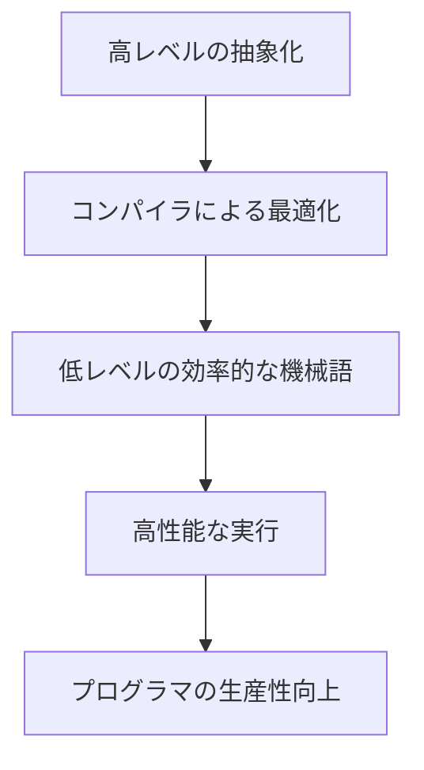

# Rustによる高性能システムプログラミング：ゼロコスト抽象化の実現と応用

## はじめに

Rustは、システムプログラミング言語としての特性を持ちながら、メモリ安全性や並行性を重視した設計がなされています。特に「ゼロコスト抽象化」という概念は、Rustの大きな特徴の一つであり、プログラマが高レベルの抽象化を使用しても、実行時のパフォーマンスに影響を与えないことを意味します。この特性により、Rustは高性能なアプリケーションの開発に適した言語となっています。

本記事では、Rustのゼロコスト抽象化の実現方法とその応用について詳しく解説します。具体的には、Rustの型システム、所有権モデル、ライフタイム、トレイト、ジェネリクスなどの機能がどのようにして高性能なシステムプログラミングを可能にしているのかを掘り下げていきます。また、実際のコード例を交えながら、Rustを用いた高性能システムプログラミングの実践的なアプローチについても紹介します。

### ゼロコスト抽象化の概念

ゼロコスト抽象化は、プログラマが高レベルの抽象化を使用しても、実行時のパフォーマンスに影響を与えないことを意味します。これを視覚的に表現するために、以下のフローチャートを示します。



このフローチャートは、Rustの高レベルの抽象化がどのようにコンパイラによって最適化され、最終的に高性能な実行を実現するかを示しています。プログラマは、抽象化を利用することで生産性を向上させることができます。

## Rustの基本概念

### 所有権と借用

Rustの最も重要な特徴の一つは、所有権システムです。所有権は、メモリ管理をコンパイラの段階で行うことを可能にし、ランタイムエラーを防ぎます。所有権には以下の3つのルールがあります。

1. 各値は、1つの所有者を持つ。
2. 所有者がスコープを外れると、値は自動的に解放される。
3. 借用は、可変借用と不変借用の2種類があり、同時に可変借用はできない。

このシステムにより、メモリリークやデータ競合を防ぎつつ、高速なメモリ管理が実現されます。例えば、以下のコードは、所有権の移動を示しています。

```rust
fn main() {
    let s1 = String::from("Hello");
    let s2 = s1; // 所有権がs1からs2に移動
    // println!("{}", s1); // エラー: s1は無効
    println!("{}", s2); // 正常: s2は有効
}
```

このように、Rustでは所有権の移動が明示的に行われるため、プログラマはメモリ管理の責任を持つことになります。所有権の概念は、特に大規模なプロジェクトにおいて、コードの可読性と保守性を向上させる要因となります。

### ライフタイム

ライフタイムは、Rustのもう一つの重要な概念で、参照が有効である期間を示します。ライフタイムを明示的に指定することで、コンパイラは参照の有効性をチェックし、プログラムの安全性を確保します。これにより、プログラマはメモリ管理の負担を軽減しつつ、パフォーマンスを維持できます。

以下の例では、ライフタイムを使用して、関数の引数として渡された参照の有効性を示しています。

```rust
fn longest<'a>(s1: &'a str, s2: &'a str) -> &'a str {
    if s1.len() > s2.len() {
        s1
    } else {
        s2
    }
}
```

この関数は、2つの文字列スライスのうち、長い方の参照を返します。ライフタイムパラメータ`'a`は、引数の参照が同じライフタイムを持つことを示しています。ライフタイムの概念は、特に複雑なデータ構造を扱う際に、プログラムの安全性を高めるために重要です。

### トレイトとジェネリクス

トレイトは、Rustにおけるインターフェースのようなもので、異なる型に共通の機能を定義します。トレイトを使用することで、コードの再利用性が向上し、抽象化が可能になります。以下の例では、`Add`トレイトを実装した構造体を示します。

```rust
use std::ops::Add;

#[derive(Debug)]
struct Point {
    x: f64,
    y: f64,
}

impl Add for Point {
    type Output = Point;

    fn add(self, other: Point) -> Point {
        Point {
            x: self.x + other.x,
            y: self.y + other.y,
        }
    }
}
```

このように、トレイトを実装することで、異なる型に対して共通の操作を定義できます。トレイトは、特に多態性を持たせるために非常に有用であり、異なる型のオブジェクトを同じインターフェースで扱うことができます。

ジェネリクスは、型に依存しない関数やデータ構造を作成するための機能で、これにより、型安全性を保ちながら柔軟なコードを書くことができます。以下の例では、ジェネリクスを使用した関数を示します。

```rust
fn print_vec<T: std::fmt::Debug>(vec: Vec<T>) {
    for item in vec {
        println!("{:?}", item);
    }
}
```

この関数は、任意の型のベクタを受け取り、その内容をデバッグ表示します。ジェネリクスを使用することで、同じコードを異なる型に対して再利用できるため、コードの冗長性を減らすことができます。

## ゼロコスト抽象化の実現

### コンパイラ最適化

Rustのコンパイラは、LLVMを基盤としており、高度な最適化を行います。これにより、プログラマが書いた高レベルのコードが、低レベルの効率的な機械語に変換されます。例えば、以下のようなコードを考えてみましょう。

```rust
fn sum<T: std::ops::Add<Output = T>>(a: T, b: T) -> T {
    a + b
}
```

この関数は、任意の型Tに対して加算を行いますが、コンパイラは具体的な型が決まった時点で最適化を行い、実行時のオーバーヘッドを最小限に抑えます。これにより、プログラマは高レベルの抽象化を使用しながらも、パフォーマンスを犠牲にすることなく、効率的なコードを書くことができます。

### インライン化

Rustでは、関数が小さい場合、コンパイラはその関数を呼び出す代わりに、関数の本体を呼び出し元に埋め込む「インライン化」を行います。これにより、関数呼び出しのオーバーヘッドを削減し、パフォーマンスを向上させることができます。以下の例では、インライン化の効果を示します。

```rust
#[inline(always)]
fn multiply(x: i32, y: i32) -> i32 {
    x * y
}

fn main() {
    let result = multiply(5, 10);
    println!("Result: {}", result);
}
```

このように、`#[inline(always)]`アトリビュートを使用することで、コンパイラにインライン化を強制することができます。インライン化は、特に頻繁に呼び出される小さな関数に対して有効であり、パフォーマンスの向上に寄与します。

### メモリレイアウトの最適化

Rustは、データ構造のメモリレイアウトを最適化するための機能も提供しています。例えば、構造体のフィールドの順序を工夫することで、キャッシュ効率を向上させることができます。以下の例では、キャッシュフレンドリーな構造体の定義を示します。

```rust
struct CacheFriendly {
    a: u32,
    b: u32,
    c: u32,
}
```

このように、同じ型のフィールドを連続して配置することで、CPUキャッシュのヒット率を向上させることができます。メモリレイアウトの最適化は、特にパフォーマンスが重要なアプリケーションにおいて、効果的な手法です。

## Rustの応用例

### WebAssemblyとの統合

RustはWebAssembly（Wasm）との統合が進んでおり、高性能なWebアプリケーションの開発に利用されています。Rustで書かれたコードは、Wasmにコンパイルされ、ブラウザ上で高速に実行されます。これにより、クライアントサイドのパフォーマンスを大幅に向上させることが可能です。以下の例では、Rustを使用してWasmモジュールを作成する方法を示します。

```rust
use wasm_bindgen::prelude::*;

#[wasm_bindgen]
pub fn greet(name: &str) {
    alert(&format!("Hello, {}!", name));
}
```

このように、Rustで書かれた関数をWasmとしてエクスポートすることで、JavaScriptから呼び出すことができます。Wasmは、特に計算集約型のタスクにおいて、JavaScriptよりも高いパフォーマンスを発揮するため、Webアプリケーションのパフォーマンスを向上させる手段として注目されています。

### ネットワークプログラミング

Rustは、非同期プログラミングのための強力なライブラリを提供しており、ネットワークプログラミングにおいても高いパフォーマンスを発揮します。例えば、`tokio`や`async-std`といったライブラリを使用することで、効率的な非同期I/O操作を実現できます。以下の例では、`tokio`を使用した簡単なTCPサーバーを示します。

```rust
use tokio::net::TcpListener;

#[tokio::main]
async fn main() {
    let listener = TcpListener::bind("127.0.0.1:8080").await.unwrap();
    loop {
        let (socket, _) = listener.accept().await.unwrap();
        tokio::spawn(async move {
            // socketを使った処理
        });
    }
}
```

このように、Rustを用いることで、スケーラブルで高性能なネットワークアプリケーションを構築することができます。非同期プログラミングは、特にI/Oバウンドなアプリケーションにおいて、リソースの効率的な利用を可能にします。

### 組み込みシステム

Rustは、組み込みシステムの開発にも適しています。メモリ管理が厳格であるため、リソースが限られた環境でも安全に動作します。`no_std`環境での開発が可能で、ハードウェアに近いレベルでのプログラミングが行えます。以下の例では、`no_std`環境での基本的な組み込みプログラムを示します。

```rust
#![no_std]
#![no_main]

use core::panic::PanicInfo;

#[no_mangle]
pub extern "C" fn main() -> ! {
    // 組み込みデバイスの初期化
    loop {}
}

#[panic_handler]
fn panic(_info: &PanicInfo) -> ! {
    loop {}
}
```

このように、Rustは組み込みシステムにおいても高いパフォーマンスと安全性を提供します。特に、リアルタイムシステムやリソース制約のあるデバイスにおいて、Rustの特性は非常に有用です。

## Rustの将来展望

Rustは、今後もシステムプログラミング言語としての地位を確立していくと考えられます。特に、以下の分野での発展が期待されます。

### AIと機械学習

Rustは、AIや機械学習の分野でも注目されています。特に、計算性能が求められる場面での利用が進むでしょう。Rustの安全性とパフォーマンスを活かしたライブラリが増えることで、データサイエンスの分野でも活用される可能性があります。例えば、`tch-rs`や`ndarray`といったライブラリは、Rustでの機械学習や数値計算をサポートしています。これにより、RustはPythonやRに代わる選択肢として、データサイエンスの分野でも注目されるでしょう。

### クラウドネイティブアプリケーション

クラウドネイティブアプリケーションの開発においても、Rustの利用が進むと予想されます。特に、マイクロサービスアーキテクチャにおいて、Rustの高いパフォーマンスと安全性が求められる場面が増えるでしょう。`actix-web`や`warp`といったフレームワークは、RustでのWebアプリケーション開発を容易にし、スケーラブルなサービスを構築するための強力なツールを提供します。これにより、Rustはクラウド環境での開発においても重要な役割を果たすことが期待されます。

### エコシステムの拡充

Rustのエコシステムは急速に成長しており、さまざまなライブラリやフレームワークが開発されています。これにより、Rustを用いた開発がさらに容易になり、より多くの開発者がRustを選択するようになるでしょう。特に、Cargoというパッケージマネージャーは、依存関係の管理やビルドプロセスを簡素化し、開発者の生産性を向上させています。Cargoは、Rustのエコシステムを支える重要な要素であり、開発者が迅速にプロジェクトを立ち上げる手助けをします。

## まとめ

Rustは、高性能なシステムプログラミングを実現するための強力な言語です。ゼロコスト抽象化の概念により、プログラマは高レベルの抽象化を使用しながらも、実行時のパフォーマンスを犠牲にすることなく、効率的なコードを書くことができます。所有権、ライフタイム、トレイト、ジェネリクスといったRustの基本概念は、メモリ安全性とパフォーマンスを両立させるための重要な要素です。

今後もRustは、さまざまな分野での応用が期待されており、特にAI、クラウドネイティブアプリケーション、組み込みシステムなどでの利用が進むでしょう。Rustを学ぶことで、開発者は高性能で安全なアプリケーションを構築するための強力なツールを手に入れることができます。

-----

※本記事は生成AIを使用して作成されました。
AI言語モデル: gpt-4o-mini