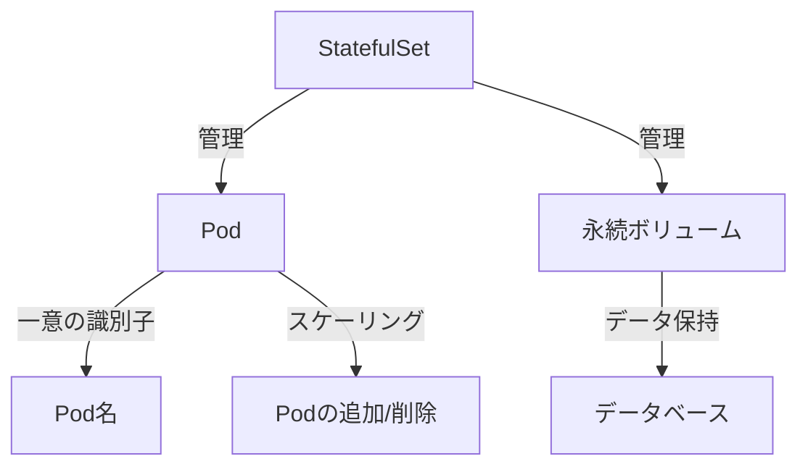
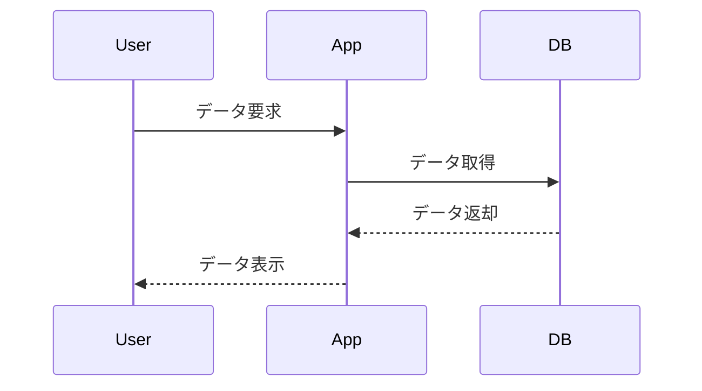

# KubernetesにおけるStateful Workloadsの最適化：永続ボリューム管理の新戦略

## はじめに

Kubernetesは、コンテナ化されたアプリケーションのデプロイ、スケーリング、管理を自動化するためのオープンソースプラットフォームです。特に、Stateless Workloads（ステートレスワークロード）に対しては非常に効果的ですが、Stateful Workloads（ステートフルワークロード）に関しては、より複雑な課題が存在します。Stateful Workloadsは、データの永続性や一貫性が求められるアプリケーションであり、データベースやメッセージキューなどがその代表例です。

本記事では、KubernetesにおけるStateful Workloadsの最適化に焦点を当て、特に永続ボリューム管理の新しい戦略について詳しく解説します。これにより、読者はKubernetes環境でのStateful Workloadsの管理と最適化に関する深い理解を得ることができるでしょう。

## Stateful Workloadsの理解

### Stateful Workloadsとは

Stateful Workloadsは、アプリケーションが状態を持つことを意味します。これに対して、Stateless Workloadsは、各リクエストが独立しており、状態を持たないアプリケーションです。Stateful Workloadsの例としては、以下のようなものがあります。

- **データベース**：MySQL、PostgreSQL、MongoDBなど
- **メッセージキュー**：RabbitMQ、Kafkaなど
- **キャッシュ**：Redis、Memcachedなど

これらのアプリケーションは、データの永続性や一貫性を維持する必要があるため、特別な管理が求められます。特に、データベースはトランザクションの整合性を保つ必要があり、データの損失や不整合が発生すると、アプリケーション全体に深刻な影響を及ぼす可能性があります。

### KubernetesにおけるStateful Workloadsの管理

Kubernetesは、Stateful Workloadsを管理するための特別なリソースであるStatefulSetを提供しています。StatefulSetは、Podの順序や一意のネットワークIDを管理し、永続ボリュームと連携してデータの永続性を確保します。

#### StatefulSetの特徴

- **一意の識別子**：各Podは一意の識別子を持ち、順序が保証されます。これにより、Podの再起動やスケーリング時に、各Podが持つデータの整合性が保たれます。たとえば、Podの名前は`<statefulset-name>-<ordinal>`という形式で、`myapp-0`、`myapp-1`のように命名されます。
  
- **永続ボリュームの管理**：各Podは、独自の永続ボリュームにマウントされ、Podが再起動してもデータが保持されます。これにより、アプリケーションの可用性が向上します。StatefulSetは、Podのライフサイクルに応じて自動的にPVを作成し、管理します。

- **スケーリング**：StatefulSetは、Podのスケーリングをサポートしますが、Podの順序が維持されます。これにより、データベースのレプリケーションやシャーディングが容易になります。スケーリング時には、Podが順番に追加または削除され、データの整合性が保たれます。



このダイアグラムは、StatefulSetがどのようにPodと永続ボリュームを管理し、データの整合性を保つかを示しています。各Podは一意の識別子を持ち、スケーリング時には順序が維持されることが強調されています。

## 永続ボリューム管理の新戦略

### 永続ボリュームの基本

Kubernetesにおける永続ボリューム（Persistent Volume, PV）は、ストレージリソースを抽象化したもので、クラスター内のストレージを管理するための手段です。PVは、ストレージプロバイダー（NFS、AWS EBS、GCE PDなど）に依存せず、Kubernetesのリソースとして扱われます。

#### 永続ボリュームのライフサイクル

1. **PVの作成**：管理者がストレージリソースを定義し、PVを作成します。PVは、ストレージのサイズ、アクセスモード、ストレージプロバイダーなどの情報を含みます。たとえば、以下のようにPVを定義できます。

    ```yaml
    apiVersion: v1
    kind: PersistentVolume
    metadata:
      name: my-pv
    spec:
      capacity:
        storage: 10Gi
      accessModes:
        - ReadWriteOnce
      hostPath:
        path: /mnt/data
    ```

2. **PVCの作成**：ユーザーが永続ボリューム要求（Persistent Volume Claim, PVC）を作成し、必要なストレージを要求します。PVCは、必要なストレージのサイズやアクセスモードを指定します。

    ```yaml
    apiVersion: v1
    kind: PersistentVolumeClaim
    metadata:
      name: my-pvc
    spec:
      accessModes:
        - ReadWriteOnce
      resources:
        requests:
          storage: 5Gi
    ```

3. **PVとPVCのバインディング**：Kubernetesは、PVCに適合するPVを自動的にバインドします。これにより、ユーザーはストレージの詳細を気にせずにアプリケーションをデプロイできます。

4. **Podへのマウント**：PodがPVCを参照し、PVをマウントします。これにより、アプリケーションは永続的なストレージにアクセスできるようになります。

### 新しいストレージプロバイダーの活用

近年、Kubernetesのエコシステムには多くの新しいストレージプロバイダーが登場しています。これにより、Stateful Workloadsの永続ボリューム管理がより柔軟かつ効率的になっています。以下にいくつかの新しいストレージプロバイダーを紹介します。

#### 1. CSI（Container Storage Interface）

CSIは、Kubernetesとストレージプロバイダー間のインターフェースを標準化するための仕様です。これにより、さまざまなストレージソリューションがKubernetesと統合され、永続ボリュームの管理が容易になります。

##### CSIの利点

- **互換性**：さまざまなストレージプロバイダーと互換性があります。これにより、ユーザーは特定のストレージソリューションに依存せず、柔軟に選択できます。
  
- **拡張性**：新しいストレージプロバイダーを簡単に追加できます。これにより、Kubernetesのエコシステムは常に進化し続けます。

- **機能の拡張**：スナップショットやクローンなどの高度な機能をサポートします。これにより、データのバックアップやリカバリが容易になります。

#### 2. ストレージクラスの活用

Kubernetesでは、ストレージクラス（StorageClass）を使用して、異なるストレージプロバイダーやパラメータを定義できます。これにより、ユーザーは必要なストレージの特性に応じて、適切なストレージを選択できます。

##### ストレージクラスの例

```yaml
apiVersion: storage.k8s.io/v1
kind: StorageClass
metadata:
  name: fast
provisioner: kubernetes.io/aws-ebs
parameters:
  type: gp2
  fsType: ext4
```

この例では、AWS EBSを使用して、`gp2`タイプのストレージをプロビジョニングするストレージクラスを定義しています。ストレージクラスを使用することで、ユーザーはストレージの特性を簡単に指定でき、必要に応じて異なるストレージを選択できます。

### データのバックアップとリカバリ戦略

Stateful Workloadsにおいて、データのバックアップとリカバリは非常に重要です。Kubernetes環境でのデータ保護のための戦略を以下に示します。

#### 1. スナップショットの利用

多くのストレージプロバイダーは、PVのスナップショットを作成する機能を提供しています。これにより、特定の時点のデータを保存し、必要に応じて復元できます。スナップショットは、データの整合性を保ちながら、迅速にバックアップを取得する手段として非常に有効です。

##### スナップショットの作成例

```yaml
apiVersion: snapshot.storage.k8s.io/v1
kind: VolumeSnapshot
metadata:
  name: my-snapshot
spec:
  volumeSnapshotClassName: my-snapshot-class
  source:
    persistentVolumeClaimName: my-pvc
```

この例では、`my-pvc`というPVCのスナップショットを作成しています。スナップショットを使用することで、特定の時点のデータを簡単に保存し、必要に応じて復元することができます。

#### 2. 定期的なバックアップ

定期的なバックアップを自動化するために、CronJobを使用してバックアッププロセスをスケジュールすることができます。これにより、データの損失を最小限に抑えることができます。定期的なバックアップは、特に重要なデータを扱うアプリケーションにおいて、データ保護の基本的な戦略となります。

```yaml
apiVersion: batch/v1
kind: CronJob
metadata:
  name: backup-job
spec:
  schedule: "0 2 * * *"  # 毎日午前2時に実行
  jobTemplate:
    spec:
      template:
        spec:
          containers:
          - name: backup
            image: my-backup-image
            args:
            - /bin/sh
            - -c
            - "backup-command"
          restartPolicy: OnFailure
```

この例では、毎日午前2時にバックアップジョブを実行するCronJobを定義しています。バックアッププロセスを自動化することで、手動でのバックアップ作業を減らし、データ保護の信頼性を向上させることができます。

### パフォーマンスの最適化

Stateful Workloadsのパフォーマンスを最適化するためには、以下の戦略を考慮することが重要です。

#### 1. ストレージの選択

アプリケーションの特性に応じて、適切なストレージタイプを選択することが重要です。例えば、データベースには高いIOPSを持つSSDストレージが適しています。ストレージの選択は、アプリケーションのパフォーマンスに直接影響を与えるため、慎重に行う必要があります。

#### 2. キャッシュの利用

データベースやメッセージキューなどのStateful Workloadsでは、キャッシュを利用することでパフォーマンスを向上させることができます。RedisやMemcachedなどのキャッシュソリューションを活用することが推奨されます。キャッシュを使用することで、データベースへのアクセス頻度を減らし、全体的なレスポンス時間を短縮することができます。

#### 3. リソースの監視と調整

Kubernetesのリソース監視ツール（PrometheusやGrafanaなど）を使用して、Stateful Workloadsのパフォーマンスを監視し、必要に応じてリソースを調整することが重要です。リソースの監視により、ボトルネックを特定し、適切な対策を講じることができます。

## 課題と解決策

### 課題1: データの一貫性

Stateful Workloadsでは、データの一貫性を維持することが重要です。特に、複数のPodが同じデータにアクセスする場合、データの競合が発生する可能性があります。データの一貫性が損なわれると、アプリケーションの信頼性が低下し、ユーザーに悪影響を及ぼす可能性があります。

#### 解決策

- **分散トランザクション**：分散トランザクションを使用して、データの整合性を確保します。分散トランザクションは、複数のデータベースやサービスにまたがるトランザクションを管理するための手法です。これにより、データの整合性を保ちながら、複数のサービス間でのデータのやり取りが可能になります。

- **ロック機構**：データに対するアクセスを制御するために、ロック機構を導入します。ロックを使用することで、同時にデータにアクセスすることを防ぎ、データの整合性を保つことができます。たとえば、データベースの行レベルロックやテーブルロックを使用することが考えられます。

### 課題2: スケーラビリティ

Stateful Workloadsは、スケーラビリティの面で課題があることがあります。特に、データベースのスケーリングは難しい場合があります。スケーラビリティの問題は、アプリケーションのパフォーマンスや可用性に直接影響を与えるため、適切な対策が必要です。

#### 解決策

- **シャーディング**：データを複数のデータベースに分散させることで、スケーラビリティを向上させます。シャーディングは、データを水平に分割し、異なるデータベースインスタンスに分散させる手法です。これにより、各データベースインスタンスの負荷を軽減し、全体のパフォーマンスを向上させることができます。

- **レプリケーション**：データのレプリケーションを行い、負荷を分散させます。レプリケーションにより、複数のデータベースインスタンスが同じデータを保持し、読み取り負荷を分散させることができます。これにより、データベースの可用性が向上し、障害時のリカバリが容易になります。



このシーケンス図は、ユーザーがアプリケーションを通じてデータを要求し、アプリケーションがデータベースからデータを取得する流れを示しています。データの取得と表示のプロセスが視覚的に表現されています。

## まとめ

KubernetesにおけるStateful Workloadsの管理は、データの永続性や一貫性を確保するために重要です。StatefulSetや永続ボリュームの管理、新しいストレージプロバイダーの活用、データのバックアップとリカバリ戦略、パフォーマンスの最適化など、さまざまな戦略を駆使することで、Stateful Workloadsを効果的に管理できます。

今後もKubernetesのエコシステムは進化し続けるため、最新の情報を常に追い続けることが重要です。これにより、Stateful Workloadsの最適化に向けた新しい戦略を見つけ、実践することができるでしょう。

## 参考文献

- Kubernetes公式ドキュメント
- Container Storage Interface (CSI) 仕様
- Kubernetes Patterns: Reusable Elements for Designing Cloud-Native Applications

-----

※本記事は生成AIを使用して作成されました。
AI言語モデル: gpt-4o-mini