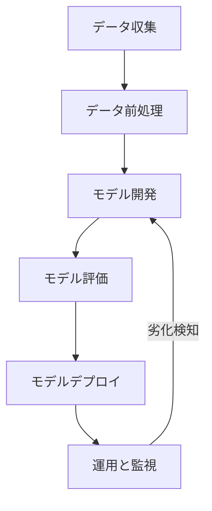
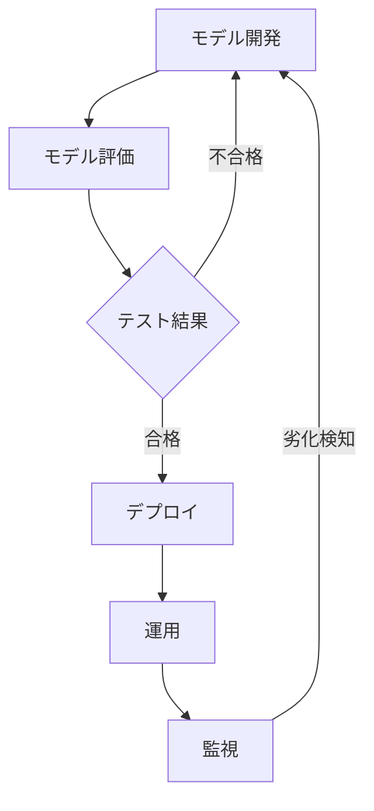

# MLOpsパイプラインの自動化：CI/CDとモデルバージョニングの統合アプローチ

## はじめに

近年、機械学習（ML）とデータサイエンスの分野は急速に進化しており、企業はデータ駆動型の意思決定を行うために、より効率的な方法を模索しています。この背景の中で、MLOps（Machine Learning Operations）が注目を集めています。MLOpsは、機械学習モデルの開発、デプロイ、運用を効率化するための手法やツールの集合体です。特に、CI/CD（Continuous Integration/Continuous Deployment）とモデルバージョニングの統合は、MLOpsパイプラインの自動化において重要な役割を果たします。

本記事では、MLOpsパイプラインの自動化におけるCI/CDとモデルバージョニングの統合アプローチについて詳しく解説します。具体的には、MLOpsの基本概念、CI/CDの役割、モデルバージョニングの重要性、そしてこれらを統合するための実践的な手法について掘り下げていきます。

## MLOpsの基本概念

MLOpsは、機械学習モデルのライフサイクル全体を管理するためのフレームワークです。これには、データの収集、前処理、モデルのトレーニング、評価、デプロイ、運用、監視が含まれます。MLOpsの目的は、これらのプロセスを自動化し、効率化することで、モデルの品質を向上させ、ビジネス価値を最大化することです。

### MLOpsの主要な要素

1. **データ管理**: データの収集、前処理、保存、バージョニングを行います。データの品質はモデルの性能に直結するため、適切なデータ管理が不可欠です。データの前処理には、欠損値の処理、異常値の検出、特徴量のエンジニアリングなどが含まれます。これらのプロセスを自動化することで、データの一貫性と再現性を確保できます。

2. **モデル開発**: 機械学習アルゴリズムを使用してモデルをトレーニングし、評価します。モデルの選定やハイパーパラメータの調整もこの段階で行います。モデル開発には、さまざまなアルゴリズム（例：回帰、分類、クラスタリングなど）を試し、最適なモデルを選定するための実験が必要です。これには、交差検証やグリッドサーチなどの手法が用いられます。

3. **デプロイメント**: トレーニングしたモデルを本番環境にデプロイします。これには、APIとしての提供やバッチ処理など、さまざまな方法があります。デプロイメントの際には、モデルのスケーラビリティやレスポンスタイムを考慮し、適切なインフラストラクチャを選定することが重要です。

4. **運用と監視**: デプロイしたモデルの性能を監視し、必要に応じて再トレーニングや更新を行います。モデルの劣化を早期に検知するための仕組みが求められます。運用段階では、モデルの予測精度や処理時間を定期的に評価し、ビジネスニーズに応じてモデルを更新する必要があります。

5. **CI/CDの導入**: 継続的な統合とデプロイを実現するためのプロセスを構築します。これにより、変更があった際に迅速に対応できるようになります。CI/CDの導入により、開発者はコードの変更を頻繁に行い、その都度自動テストを実施することで、品質を保ちながら迅速なデリバリーを実現できます。

### MLOpsのフロー

以下のダイアグラムは、MLOpsの主要なフローを示しています。データの収集からモデルのデプロイ、運用までの一連のプロセスが視覚的に表現されています。

このフローチャートは、MLOpsのプロセスがどのように連携しているかを示しています。データ収集から始まり、前処理、モデル開発、評価、デプロイ、運用と続き、運用段階でモデルの劣化が検知されると、再びモデル開発に戻る流れが視覚化されています。

## CI/CDの役割

CI/CDは、ソフトウェア開発における重要な手法であり、MLOpsにおいても同様に重要です。CI（Continuous Integration）は、コードの変更を頻繁に統合し、自動テストを行うプロセスです。一方、CD（Continuous Deployment）は、テストを通過したコードを自動的に本番環境にデプロイするプロセスを指します。

### CI/CDの利点

- **迅速なフィードバック**: コードの変更が即座にテストされるため、問題を早期に発見できます。これにより、開発者は迅速に修正を行い、品質を保つことができます。

- **品質の向上**: 自動テストにより、バグやエラーを減少させ、モデルの品質を向上させます。テストの自動化により、手動でのテスト作業が削減され、人的エラーのリスクも低減します。

- **デプロイの効率化**: 手動でのデプロイ作業を減らし、迅速かつ安全にモデルを本番環境に展開できます。これにより、デプロイの頻度が増し、ビジネスニーズに迅速に対応できるようになります。

### CI/CDの実装

CI/CDを実装するためには、以下のステップが必要です。

1. **リポジトリの設定**: Gitなどのバージョン管理システムを使用して、コードを管理します。リポジトリの設定には、ブランチ戦略やプルリクエストの運用ルールを定めることが含まれます。

2. **自動テストの構築**: モデルのトレーニングや評価を自動化するテストスクリプトを作成します。テストには、ユニットテスト、統合テスト、エンドツーエンドテストなどが含まれ、各テストが自動的に実行されるように設定します。

3. **CI/CDツールの選定**: Jenkins、GitLab CI、CircleCIなどのCI/CDツールを選定し、パイプラインを構築します。選定するツールは、チームのニーズや既存のインフラストラクチャに応じて決定します。

4. **デプロイメントの自動化**: モデルを本番環境にデプロイするためのスクリプトや設定を作成します。デプロイメントの自動化には、コンテナ技術（Dockerなど）やオーケストレーションツール（Kubernetesなど）を活用することが一般的です。

5. **監視とロギング**: デプロイ後のモデルの性能を監視し、ログを収集する仕組みを整えます。監視には、リアルタイムのメトリクス収集やアラート設定が含まれ、異常が発生した際には迅速に対応できるようにします。

## モデルバージョニングの重要性

モデルバージョニングは、機械学習モデルの異なるバージョンを管理するプロセスです。これにより、過去のモデルに戻ったり、特定のバージョンを再現したりすることが可能になります。モデルバージョニングは、特に複数のチームが関与するプロジェクトにおいて、モデルの整合性を保つために重要です。

### モデルバージョニングの利点

- **再現性の確保**: 特定のデータセットやハイパーパラメータでトレーニングしたモデルを再現できます。これにより、研究や実験の結果を他のチームと共有しやすくなります。

- **比較分析**: 異なるモデルの性能を比較し、最適なモデルを選定することができます。モデルのバージョンを管理することで、過去のモデルと新しいモデルの性能を定量的に評価できます。

- **リスク管理**: 新しいモデルが本番環境で問題を引き起こした場合、以前の安定したバージョンに戻すことができます。これにより、ビジネスへの影響を最小限に抑えることができます。

### モデルバージョニングの実装

モデルバージョニングを実装するためには、以下の手法が考えられます。

1. **ファイル名によるバージョニング**: モデルファイルの名前にバージョン番号を付与します。例えば、`model_v1.h5`や`model_v2.h5`のように、バージョン番号を明示的に示すことで、ファイルの管理が容易になります。

2. **メタデータの管理**: モデルのトレーニングに使用したデータやハイパーパラメータをメタデータとして保存します。これにより、モデルのトレーニング条件を明確にし、再現性を高めることができます。

3. **バージョン管理ツールの利用**: DVC（Data Version Control）やMLflowなどのツールを使用して、モデルのバージョンを管理します。これらのツールは、データやモデルのバージョンを簡単に追跡できる機能を提供します。

## CI/CDとモデルバージョニングの統合アプローチ

CI/CDとモデルバージョニングを統合することで、MLOpsパイプラインの自動化が実現します。この統合により、モデルの開発からデプロイ、運用までのプロセスが一貫して管理され、効率的な運用が可能になります。

### 統合のステップ

1. **CI/CDパイプラインの設計**: モデルのトレーニング、評価、デプロイを含むCI/CDパイプラインを設計します。パイプラインの設計には、各ステージのフローや依存関係を明確にすることが重要です。

2. **モデルバージョニングの組み込み**: モデルのトレーニング時に自動的にバージョンを管理し、CI/CDパイプラインに組み込みます。これにより、モデルの変更があった際に自動的に新しいバージョンが生成されます。

3. **自動テストの実施**: 新しいモデルがトレーニングされた際に、自動テストを実施し、性能を評価します。テストには、モデルの精度や処理時間を評価するためのメトリクスを設定し、合格基準を明確にします。

4. **デプロイの自動化**: テストを通過したモデルを自動的に本番環境にデプロイします。デプロイメントの際には、ロールバック機能を実装し、問題が発生した場合に迅速に以前のバージョンに戻せるようにします。

5. **監視とフィードバック**: デプロイ後のモデルの性能を監視し、フィードバックを得て次のサイクルに活かします。監視には、リアルタイムのメトリクス収集やアラート設定が含まれ、異常が発生した際には迅速に対応できるようにします。

### CI/CDとモデルバージョニングの統合フロー

以下のダイアグラムは、CI/CDとモデルバージョニングの統合フローを示しています。このフローは、モデルのトレーニングからデプロイ、運用までの一連のプロセスを視覚化しています。

このフローチャートは、CI/CDとモデルバージョニングの統合プロセスを示しています。モデル開発から始まり、評価、テスト、デプロイ、運用、監視と続き、運用段階でモデルの劣化が検知されると、再びモデル開発に戻る流れが視覚化されています。

## 課題と解決策

MLOpsパイプラインの自動化にはいくつかの課題が存在します。以下に代表的な課題とその解決策を示します。

### 課題1: データの品質管理

データの品質が低いと、モデルの性能に悪影響を及ぼします。データの前処理やクリーニングを自動化する仕組みが必要です。

#### 解決策

- データの前処理を自動化するスクリプトを作成し、CI/CDパイプラインに組み込みます。これにより、データの一貫性を保ちながら、迅速に処理を行うことができます。

- データの品質を評価するためのメトリクスを設定し、定期的にチェックします。例えば、欠損値の割合や異常値の検出率をモニタリングすることで、データの品質を維持します。

### 課題2: モデルの劣化

デプロイしたモデルが時間とともに劣化することがあります。これを早期に検知するための仕組みが求められます。

#### 解決策

- モデルの性能を定期的に監視し、劣化を検知するためのアラートを設定します。例えば、予測精度が一定の閾値を下回った場合に通知を受け取る仕組みを構築します。

- 劣化が検知された場合、自動的に再トレーニングを行う仕組みを構築します。これにより、モデルの性能を常に最適化することができます。

### 課題3: チーム間のコミュニケーション

MLOpsは多くのチームが関与するため、コミュニケーションが重要です。情報の共有が不十分だと、プロジェクトが遅延する可能性があります。

#### 解決策

- 定期的なミーティングを設定し、進捗状況や課題を共有します。これにより、チーム間の情報共有が促進され、協力体制が強化されます。

- ドキュメントを整備し、全員がアクセスできるようにします。ドキュメントには、プロジェクトの進捗、技術的な決定、問題点などを記録し、透明性を持たせます。

## まとめ

MLOpsパイプラインの自動化は、CI/CDとモデルバージョニングの統合によって実現されます。これにより、機械学習モデルの開発からデプロイ、運用までのプロセスが効率化され、ビジネス価値を最大化することが可能になります。データの品質管理やモデルの劣化、チーム間のコミュニケーションといった課題に対しても、適切な解決策を講じることで、より効果的なMLOpsの実現が期待できます。

今後もMLOpsの進化が続く中で、CI/CDとモデルバージョニングの重要性はますます高まるでしょう。これらの手法を適切に活用し、機械学習のプロジェクトを成功に導くための基盤を築いていくことが求められます。

## 参考文献

- "MLOps: Model Management and Deployment" by Google Cloud
- "Continuous Integration and Continuous Deployment for Machine Learning" by Microsoft Azure
- "Data Version Control: A New Approach to Data Management" by DVC

-----

※本記事は生成AIを使用して作成されました。
AI言語モデル: gpt-4o-mini