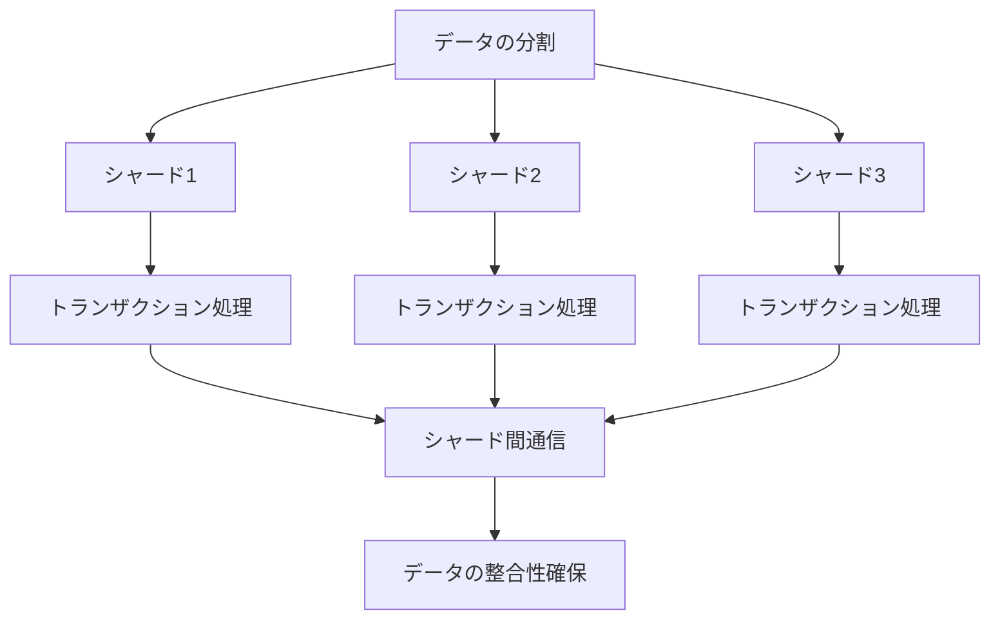
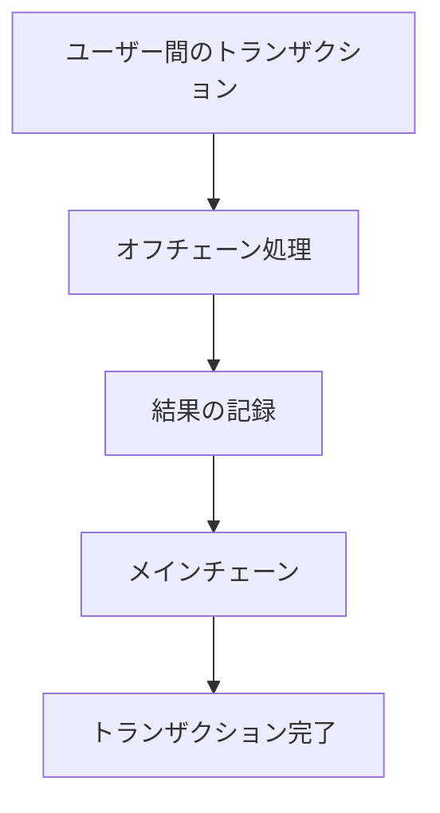

# Web3.0のスケーラビリティ課題：シャーディングとレイヤー2ソリューションの比較

## はじめに

Web3.0は、分散型インターネットの新しい時代を象徴する概念であり、ブロックチェーン技術を基盤にしたアプリケーションやサービスの発展を促進しています。しかし、Web3.0の普及に伴い、スケーラビリティの課題が浮上しています。スケーラビリティとは、システムが増加する負荷に対してどれだけ効率的に対応できるかを示す指標です。特に、ブロックチェーンネットワークは、トランザクションの処理速度やコストにおいて限界があり、これがユーザー体験やアプリケーションの成長を妨げる要因となっています。

本記事では、Web3.0のスケーラビリティ課題に対処するための主要なアプローチである「シャーディング」と「レイヤー2ソリューション」について詳しく比較し、それぞれの利点と欠点を探ります。また、これらの技術がどのようにWeb3.0の未来に影響を与えるかについても考察します。

### スケーラビリティの課題

#### ブロックチェーンの基本的な制約

ブロックチェーンは、分散型のデータベースであり、トランザクションをブロックとしてまとめ、これをチェーン状に連結することで成り立っています。この構造は、データの改ざんを防ぎ、透明性を確保する一方で、スケーラビリティに関していくつかの制約をもたらします。

1. **トランザクション処理速度**: ブロックチェーンのトランザクション処理速度は、ネットワークのノード数やブロック生成時間に依存します。例えば、ビットコインは約10分ごとにブロックを生成し、1秒あたりのトランザクション処理能力は約7件とされています。これに対し、従来の中央集権型システムは、数千件のトランザクションを瞬時に処理することが可能です。この速度の違いは、特に急増するトランザクション需要に対して大きな障害となります。

2. **トランザクションコスト**: ネットワークが混雑すると、トランザクション手数料が高騰します。特に、イーサリアムのようなプラットフォームでは、ガス代が急騰することがあり、これがユーザーの負担となります。例えば、2021年のDeFiブームの際には、ガス代が数十ドルに達することもあり、これが新規ユーザーの参入を妨げる要因となりました。

3. **データの保存と管理**: ブロックチェーンは、全てのトランザクションデータをノードが保持するため、データ量が増加すると、ノードのストレージや帯域幅に負担がかかります。特に、ビットコインやイーサリアムのような大規模なネットワークでは、ノードの運営コストが増加し、参加者が減少するリスクがあります。

#### スケーラビリティの必要性

Web3.0のアプリケーションは、ユーザー数の増加やトランザクションの増加に対応する必要があります。特に、DeFi（分散型金融）やNFT（非代替性トークン）などの新しいユースケースは、急速に成長しており、これに伴うスケーラビリティの課題はますます重要になっています。例えば、NFTマーケットプレイスの急成長により、イーサリアムのネットワークは頻繁に混雑し、ユーザーは高額な手数料を支払わざるを得なくなっています。

## シャーディングとは

### シャーディングの基本概念

シャーディングは、データベースやブロックチェーンのスケーラビリティを向上させるための手法であり、データを複数の部分（シャード）に分割し、それぞれを独立して処理することを可能にします。これにより、全体の処理能力を向上させることができます。

#### シャーディングの仕組み

シャーディングは、以下のようなプロセスで機能します。

1. **データの分割**: トランザクションやデータを複数のシャードに分割します。各シャードは、特定のトランザクションやデータのサブセットを保持します。例えば、イーサリアム2.0では、64のシャードが提案されており、各シャードが独自のトランザクションを処理します。

2. **独立した処理**: 各シャードは独立してトランザクションを処理できるため、全体の処理能力が向上します。これにより、ネットワーク全体のスループットが増加します。シャーディングにより、トランザクションの処理が並行して行われるため、全体の処理速度が向上します。

3. **シャード間の通信**: シャード間でのデータの整合性を保つために、必要に応じて通信が行われます。これにより、全体のデータの一貫性が確保されます。シャード間の通信は、特にトランザクションが他のシャードにまたがる場合に重要です。

### シャーディングの利点

- **スループットの向上**: シャーディングにより、同時に多くのトランザクションを処理できるため、スループットが大幅に向上します。これにより、ユーザーは迅速なトランザクション処理を体験できます。

- **コストの削減**: トランザクション処理が効率化されることで、手数料が低下する可能性があります。特に、ネットワークが混雑している際に、シャーディングが効果を発揮します。

- **スケーラビリティの向上**: ネットワークのノード数が増加することで、全体のスケーラビリティが向上します。シャーディングは、ノードの負荷を分散させるため、より多くのユーザーが参加できるようになります。

### シャーディングの欠点

- **複雑性の増加**: シャーディングは、システムの設計や実装が複雑になるため、開発や運用において課題が生じる可能性があります。特に、シャード間の通信やデータの整合性を保つためのプロトコルが必要です。

- **セキュリティのリスク**: シャードごとに独立して処理されるため、特定のシャードが攻撃を受けた場合、全体のセキュリティが脅かされる可能性があります。攻撃者が特定のシャードを狙うことで、ネットワーク全体に影響を及ぼすリスクがあります。

- **データの整合性**: シャード間でのデータの整合性を保つための通信が必要であり、これがボトルネックになる可能性があります。特に、トランザクションが複数のシャードにまたがる場合、整合性を保つための処理が複雑になります。

### シャーディングのプロセス

以下のダイアグラムは、シャーディングのプロセスを視覚的に表現しています。データの分割から独立した処理、シャード間の通信までの流れを示しています。

このダイアグラムは、シャーディングのプロセスを示しており、データがどのように分割され、各シャードで独立して処理されるかを視覚的に理解するのに役立ちます。

## レイヤー2ソリューションとは

### レイヤー2ソリューションの基本概念

レイヤー2ソリューションは、既存のブロックチェーンネットワークの上に構築される追加のプロトコルや技術であり、スケーラビリティを向上させることを目的としています。これにより、メインのブロックチェーン（レイヤー1）の負荷を軽減し、トランザクション処理を効率化します。

#### レイヤー2ソリューションの種類

1. **状態チャネル**: ユーザー間でオフチェーンでトランザクションを行い、最終的な結果だけをメインのブロックチェーンに記録します。これにより、トランザクションの処理速度が向上し、手数料が削減されます。状態チャネルは、特に少数の参加者間での頻繁なトランザクションに適しています。

2. **サイドチェーン**: メインのブロックチェーンとは独立したチェーンであり、特定のトランザクションを処理します。サイドチェーンは、メインチェーンと相互に接続されており、データの移動が可能です。これにより、特定のユースケースに特化した処理が可能になります。

3. **ロールアップ**: 複数のトランザクションをまとめて一つのトランザクションとしてメインチェーンに記録します。これにより、トランザクションの処理効率が向上します。ロールアップには、オプティマルロールアップとゼロ知識ロールアップの2種類があります。

### レイヤー2ソリューションの利点

- **迅速なトランザクション処理**: オフチェーンでの処理により、トランザクションの処理速度が大幅に向上します。特に、状態チャネルを使用することで、数千件のトランザクションを瞬時に処理することが可能です。

- **コストの削減**: 手数料が低く抑えられるため、ユーザーにとってのコストが削減されます。特に、ネットワークが混雑している際に、レイヤー2ソリューションが効果を発揮します。

- **柔軟性**: レイヤー2ソリューションは、特定のユースケースに応じてカスタマイズ可能であり、さまざまなアプリケーションに対応できます。これにより、開発者は特定のニーズに応じたソリューションを構築できます。

### レイヤー2ソリューションの欠点

- **セキュリティの懸念**: オフチェーンでの処理は、メインチェーンのセキュリティに依存しないため、セキュリティリスクが存在します。特に、状態チャネルやサイドチェーンが攻撃を受けた場合、ユーザーの資産が危険にさらされる可能性があります。

- **複雑な実装**: レイヤー2ソリューションの実装は複雑であり、開発者にとってのハードルが高くなる可能性があります。特に、異なるレイヤー2ソリューション間の相互運用性を確保することが課題となります。

- **ユーザーの理解**: ユーザーがレイヤー2ソリューションを理解し、利用するためには、教育が必要です。特に、オフチェーンでのトランザクション処理の仕組みを理解することが重要です。

### レイヤー2ソリューションのプロセス

以下のダイアグラムは、レイヤー2ソリューションのプロセスを視覚的に表現しています。オフチェーンでのトランザクション処理からメインチェーンへの結果の記録までの流れを示しています。

このダイアグラムは、レイヤー2ソリューションのプロセスを示しており、オフチェーンでの処理がどのように行われ、最終的にメインチェーンに結果が記録されるかを視覚的に理解するのに役立ちます。

## シャーディングとレイヤー2ソリューションの比較

### スケーラビリティの観点から

| 特徴               | シャーディング                       | レイヤー2ソリューション               |
|--------------------|-------------------------------------|-------------------------------------|
| スループット       | 高い（複数のシャードで同時処理）   | 非常に高い（オフチェーン処理）     |
| トランザクションコスト | 低下する可能性がある               | 大幅に低下する                       |
| データの整合性     | シャード間の通信が必要             | メインチェーンに依存               |

### セキュリティの観点から

| 特徴               | シャーディング                       | レイヤー2ソリューション               |
|--------------------|-------------------------------------|-------------------------------------|
| セキュリティリスク | シャードごとの攻撃リスク           | オフチェーン処理によるリスク       |
| データの整合性     | シャード間の整合性が課題           | メインチェーンとの整合性が必要     |

### 実装の観点から

| 特徴               | シャーディング                       | レイヤー2ソリューション               |
|--------------------|-------------------------------------|-------------------------------------|
| 実装の複雑性       | 高い（システム設計が複雑）         | 高い（オフチェーンの設計が必要）   |
| 開発者の負担       | 高い（新しい技術の習得が必要）     | 高い（新しいプロトコルの理解が必要）|

## 未来の展望

Web3.0のスケーラビリティ課題に対する解決策として、シャーディングとレイヤー2ソリューションはそれぞれ異なるアプローチを提供しています。今後、これらの技術がどのように進化し、相互に補完し合うかが注目されます。

### シャーディングの進化

シャーディングは、特に大規模なブロックチェーンネットワークにおいて、スケーラビリティを向上させるための重要な手法として期待されています。今後、シャーディングの実装が進むことで、より多くのトランザクションを効率的に処理できるようになるでしょう。また、シャーディングのセキュリティを強化するための新しいプロトコルや技術が開発されることが期待されます。例えば、シャード間の通信を効率化するための新しいアルゴリズムや、攻撃に対する防御策が求められています。

### レイヤー2ソリューションの普及

レイヤー2ソリューションは、特にDeFiやNFTなどの新しいユースケースにおいて、急速に普及しています。今後、これらのソリューションがさらに進化し、ユーザーにとって使いやすくなることで、Web3.0の普及が加速するでしょう。また、レイヤー2ソリューションの相互運用性が向上することで、異なるブロックチェーン間でのトランザクションが容易になることが期待されます。これにより、ユーザーは異なるプラットフォーム間でシームレスに資産を移動できるようになります。

## まとめ

Web3.0のスケーラビリティ課題は、ブロックチェーン技術の普及において重要なテーマです。シャーディングとレイヤー2ソリューションは、それぞれ異なるアプローチでこの課題に対処しています。シャーディングは、データを分割して処理することでスループットを向上させる手法であり、レイヤー2ソリューションは、オフチェーンでの処理を通じてトランザクションの効率を高める技術です。

今後、これらの技術がどのように進化し、相互に補完し合うかがWeb3.0の未来を形作る重要な要素となるでしょう。スケーラビリティの課題を克服することで、より多くのユーザーがWeb3.0の恩恵を享受できるようになることが期待されます。

さらに学習を進めたい方には、以下のリソースをお勧めします。

- [Ethereumの公式ドキュメント](https://ethereum.org/en/developers/docs/)
- [シャーディングに関する研究論文](https://arxiv.org/abs/1904.05234)
- [レイヤー2ソリューションの解説](https://layer2.network/)

-----

※本記事は生成AIを使用して作成されました。
AI言語モデル: gpt-4o-mini