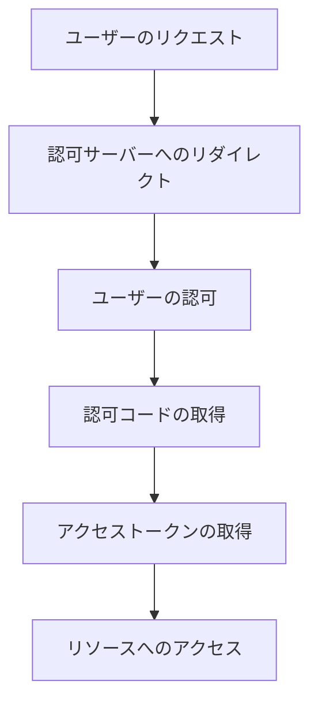
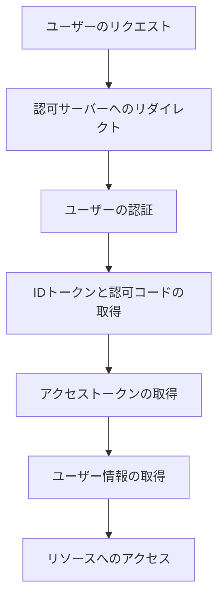

# OAuth 2.1とOpenID Connect：最新の認証・認可プロトコルの実装と脆弱性対策

## はじめに

インターネットの普及に伴い、オンラインサービスの利用が増加し、ユーザーのデータ保護がますます重要になっています。特に、ユーザーの認証と認可に関するプロトコルは、セキュリティの要となります。OAuth 2.1とOpenID Connectは、これらのニーズに応えるために設計された最新のプロトコルです。本記事では、これらのプロトコルの基本概念、実装方法、脆弱性対策について詳しく解説し、実践的な知識を提供します。

## OAuth 2.1の概要

### OAuth 2.1とは

OAuth 2.1は、OAuth 2.0の進化版であり、認可フレームワークとして広く使用されています。OAuth 2.0は、ユーザーが第三者のアプリケーションに自分のデータへのアクセスを許可するためのプロトコルです。OAuth 2.1は、OAuth 2.0の機能を統合し、複雑さを軽減することを目的としています。これにより、開発者はより簡単に安全な認可フローを実装できるようになります。

### OAuth 2.1の主な特徴

- **シンプルなフロー**: OAuth 2.1は、認可フローを簡素化し、開発者が容易に実装できるように設計されています。これにより、開発者は複雑な仕様を理解することなく、迅速に実装を行うことができます。

- **セキュリティの強化**: OAuth 2.1では、セキュリティのベストプラクティスが組み込まれており、特にリダイレクトURIの検証やPKCE（Proof Key for Code Exchange）を必須としています。PKCEは、モバイルアプリケーションやパブリッククライアントにおいて、認可コードの盗難を防ぐための重要な手段です。

- **統一された仕様**: OAuth 2.1は、OAuth 2.0の仕様を統合し、不要な部分を削除することで、より明確で一貫性のある仕様を提供します。これにより、開発者は異なる実装間での互換性を確保しやすくなります。

### OAuth 2.1のフロー

OAuth 2.1の認可フローは、以下のステップで構成されています。

1. **ユーザーのリクエスト**: ユーザーがアプリケーションにアクセスし、認可を要求します。この時、アプリケーションは必要なスコープを指定します。

2. **認可サーバーへのリダイレクト**: アプリケーションは、ユーザーを認可サーバーにリダイレクトします。このリダイレクトには、クライアントID、リダイレクトURI、要求するスコープなどが含まれます。

3. **ユーザーの認可**: ユーザーは、認可サーバーでアプリケーションに対するアクセスを許可します。この際、ユーザーは自分のデータにアクセスするアプリケーションを確認し、許可するかどうかを選択します。

4. **認可コードの取得**: 認可サーバーは、アプリケーションに認可コードを返します。このコードは一時的なものであり、アクセストークンを取得するために使用されます。

5. **アクセストークンの取得**: アプリケーションは、認可コードを使用してアクセストークンを取得します。この際、クライアントシークレットを使用して自分の身元を証明します。

6. **リソースへのアクセス**: アプリケーションは、アクセストークンを使用してリソースサーバーにアクセスします。リソースサーバーは、アクセストークンを検証し、ユーザーのデータにアクセスを許可します。

以下のダイアグラムは、OAuth 2.1の認可フローを視覚的に表現しています。



このフローチャートは、OAuth 2.1の認可フローの各ステップを示しています。ユーザーがアプリケーションにアクセスするところから始まり、最終的にリソースサーバーにアクセスするまでの流れを視覚的に理解するのに役立ちます。

## OpenID Connectの概要

### OpenID Connectとは

OpenID Connectは、OAuth 2.1の上に構築された認証レイヤーです。ユーザーのアイデンティティを確認し、ユーザー情報を取得するためのプロトコルです。OpenID Connectは、OAuth 2.1の認可機能を利用しつつ、ユーザーの認証を行うための標準化された方法を提供します。

### OpenID Connectの主な特徴

- **IDトークン**: OpenID Connectは、ユーザーの認証情報を含むIDトークンを提供します。これにより、アプリケーションはユーザーのアイデンティティを確認できます。IDトークンはJWT（JSON Web Token）形式であり、署名されているため、改ざんを防ぐことができます。

- **ユーザー情報エンドポイント**: OpenID Connectは、ユーザー情報を取得するためのエンドポイントを提供し、アプリケーションがユーザーのプロファイル情報にアクセスできるようにします。このエンドポイントを使用することで、アプリケーションはユーザーの名前やメールアドレスなどの情報を取得できます。

- **スコープの管理**: OpenID Connectでは、スコープを使用して、アプリケーションが要求する情報の範囲を明示的に指定できます。例えば、`openid`スコープを指定することで、認証を要求し、`profile`スコープを指定することで、ユーザーの基本情報へのアクセスを要求します。

### OpenID Connectのフロー

OpenID Connectのフローは、OAuth 2.1のフローに似ていますが、以下の追加ステップがあります。

1. **ユーザーのリクエスト**: ユーザーがアプリケーションにアクセスし、認証を要求します。この時、アプリケーションは必要なスコープを指定します。

2. **認可サーバーへのリダイレクト**: アプリケーションは、ユーザーを認可サーバーにリダイレクトします。このリダイレクトには、クライアントID、リダイレクトURI、要求するスコープなどが含まれます。

3. **ユーザーの認証**: ユーザーは、認可サーバーで認証を行います。この際、ユーザーは自分の資格情報を入力し、認証が成功すると、認可サーバーはアプリケーションにリダイレクトします。

4. **IDトークンと認可コードの取得**: 認可サーバーは、アプリケーションにIDトークンと認可コードを返します。IDトークンは、ユーザーの認証情報を含んでいます。

5. **アクセストークンの取得**: アプリケーションは、認可コードを使用してアクセストークンを取得します。この際、クライアントシークレットを使用して自分の身元を証明します。

6. **ユーザー情報の取得**: アプリケーションは、IDトークンを使用してユーザー情報を取得します。この情報は、ユーザーのプロファイル情報を含んでいます。

7. **リソースへのアクセス**: アプリケーションは、アクセストークンを使用してリソースサーバーにアクセスします。リソースサーバーは、アクセストークンを検証し、ユーザーのデータにアクセスを許可します。

以下のダイアグラムは、OpenID Connectのフローを視覚的に表現しています。



このフローチャートは、OpenID Connectの認証フローの各ステップを示しています。ユーザーがアプリケーションにアクセスするところから始まり、最終的にリソースサーバーにアクセスするまでの流れを視覚的に理解するのに役立ちます。

## OAuth 2.1とOpenID Connectの実装

### 実装の準備

OAuth 2.1とOpenID Connectを実装するためには、以下の準備が必要です。

1. **認可サーバーの選定**: OAuth 2.1とOpenID Connectをサポートする認可サーバーを選定します。例えば、Auth0やOkta、Google Identity Platformなどのサービスがあります。これらのサービスは、認証と認可の機能を提供し、開発者が迅速に実装できるようにサポートします。

2. **クライアントアプリケーションの設定**: 認可サーバーにクライアントアプリケーションを登録し、クライアントIDとクライアントシークレットを取得します。この情報は、アプリケーションが認可サーバーと通信する際に必要です。

3. **リダイレクトURIの設定**: 認可サーバーにリダイレクトURIを設定し、ユーザーが認可後に戻るURLを指定します。このURIは、認可サーバーによって検証され、オープンリダイレクト攻撃を防ぐために重要です。

### コードサンプル

以下は、OAuth 2.1とOpenID Connectを使用してユーザーを認証するための簡単なコードサンプルです。ここでは、Node.jsとExpressを使用しています。

```javascript
const express = require('express');
const request = require('request');
const app = express();

const CLIENT_ID = 'your_client_id';
const CLIENT_SECRET = 'your_client_secret';
const REDIRECT_URI = 'http://localhost:3000/callback';
const AUTH_URL = 'https://authorization-server.com/auth';
const TOKEN_URL = 'https://authorization-server.com/token';
const USER_INFO_URL = 'https://authorization-server.com/userinfo';

app.get('/login', (req, res) => {
    const authUrl = `${AUTH_URL}?response_type=code&client_id=${CLIENT_ID}&redirect_uri=${REDIRECT_URI}&scope=openid profile email`;
    res.redirect(authUrl);
});

app.get('/callback', (req, res) => {
    const code = req.query.code;
    const options = {
        url: TOKEN_URL,
        method: 'POST',
        json: true,
        body: {
            grant_type: 'authorization_code',
            code: code,
            redirect_uri: REDIRECT_URI,
            client_id: CLIENT_ID,
            client_secret: CLIENT_SECRET
        }
    };

    request(options, (error, response, body) => {
        if (error) {
            return res.status(500).send('Error retrieving access token');
        }
        const accessToken = body.access_token;
        // ユーザー情報を取得
        request.get({
            url: USER_INFO_URL,
            headers: {
                'Authorization': `Bearer ${accessToken}`
            }
        }, (error, response, body) => {
            if (error) {
                return res.status(500).send('Error retrieving user info');
            }
            res.send(body);
        });
    });
});

app.listen(3000, () => {
    console.log('Server is running on http://localhost:3000');
});
```

このコードは、ユーザーがログインを要求すると、認可サーバーにリダイレクトし、認可コードを取得してアクセストークンを取得し、最終的にユーザー情報を取得する流れを示しています。実際のアプリケーションでは、エラーハンドリングやセキュリティ対策を強化することが重要です。

## 脆弱性対策

### 一般的な脆弱性

OAuth 2.1とOpenID Connectを実装する際には、以下のような脆弱性に注意する必要があります。

- **リダイレクトURIのオープンリダイレクト**: 攻撃者が悪意のあるリダイレクトURIを使用して、ユーザーをフィッシングサイトに誘導する可能性があります。リダイレクトURIは、事前に登録されたものと一致する必要があります。

- **アクセストークンの漏洩**: アクセストークンが漏洩すると、攻撃者がユーザーのデータにアクセスできるようになります。アクセストークンは、HTTPSを使用して安全に送信する必要があります。

- **CSRF攻撃**: 認可フロー中にCSRF攻撃が発生する可能性があります。PKCEを使用することで、これを防ぐことができます。

### 脆弱性対策のベストプラクティス

1. **PKCEの使用**: PKCEを使用することで、認可コードの交換時にセキュリティを強化します。これにより、攻撃者が認可コードを盗むことが難しくなります。

2. **HTTPSの使用**: すべての通信はHTTPSを使用して暗号化し、データの漏洩を防ぎます。特に、アクセストークンやユーザー情報を送信する際には、必ずHTTPSを使用することが重要です。

3. **リダイレクトURIの検証**: リダイレクトURIは、事前に登録されたものと一致することを確認し、オープンリダイレクト攻撃を防ぎます。これにより、悪意のあるサイトへのリダイレクトを防止できます。

4. **アクセストークンの有効期限の設定**: アクセストークンには有効期限を設定し、定期的に更新することで、漏洩した場合のリスクを軽減します。短い有効期限を設定することで、攻撃者がアクセストークンを使用できる時間を制限できます。

5. **セキュリティログの監視**: 認可サーバーやリソースサーバーのセキュリティログを監視し、不正アクセスの兆候を早期に発見することが重要です。異常なアクセスパターンを検出した場合は、迅速に対応する必要があります。

## まとめ

OAuth 2.1とOpenID Connectは、現代のウェブアプリケーションにおける認証と認可のための強力なプロトコルです。これらのプロトコルを適切に実装し、脆弱性対策を講じることで、ユーザーのデータを安全に保護することができます。今後も、これらのプロトコルの進化に注目し、最新のセキュリティベストプラクティスを取り入れていくことが重要です。

さらに学習を進めるためのリソースとして、以下のリンクを参考にしてください。

- [OAuth 2.1 Specification](https://oauth.net/2.1/)
- [OpenID Connect Specification](https://openid.net/connect/)
- [OWASP OAuth 2.0 Security Cheat Sheet](https://cheatsheetseries.owasp.org/cheatsheets/OAuth_2.0_Cheat_Sheet.html)

-----

※本記事は生成AIを使用して作成されました。
AI言語モデル: gpt-4o-mini