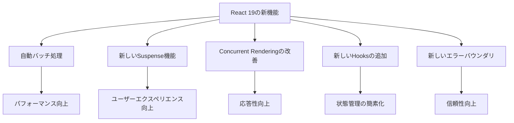

# React 19の新機能総まとめ：パフォーマンス改善とコード簡素化のベストプラクティス

## はじめに

Reactは、ユーザーインターフェースを構築するための人気のあるJavaScriptライブラリであり、開発者にとって非常に強力なツールです。2023年にリリースされたReact 19では、パフォーマンスの改善やコードの簡素化に関する新機能が多数追加され、開発者の生産性を向上させることが期待されています。本記事では、React 19の新機能を詳しく解説し、パフォーマンス改善とコード簡素化のベストプラクティスを紹介します。

### ダイアグラムの挿入

以下のダイアグラムは、React 19の新機能の概要を示しています。各機能がどのように相互に関連しているかを視覚的に理解するのに役立ちます。



このダイアグラムは、React 19の新機能がどのようにパフォーマンスやユーザーエクスペリエンスに寄与するかを示しています。

## React 19の新機能

### 1. 自動バッチ処理

React 19では、自動バッチ処理が導入されました。これにより、複数の状態更新を一度に処理することが可能になり、パフォーマンスが向上します。従来のReactでは、状態更新が個別に処理されていましたが、自動バッチ処理により、これを一括で処理することができます。

#### 自動バッチ処理の仕組み

自動バッチ処理は、Reactが状態更新をグループ化し、1回の再レンダリングで処理する機能です。これにより、パフォーマンスが向上し、アプリケーションの応答性が改善されます。例えば、ユーザーがボタンをクリックして複数の状態を更新する場合、従来のReactではそれぞれの更新が個別に処理されていましたが、React 19ではこれらが一括で処理されます。

#### コード例

以下のコードは、従来の状態更新と自動バッチ処理の違いを示しています。

```javascript
// 従来のReact
setCount(count + 1);
setName('John');

// React 19の自動バッチ処理
setCount(count + 1);
setName('John');
```

このように、React 19では、複数の状態更新が自動的にバッチ処理され、パフォーマンスが向上します。

### 2. 新しいSuspense機能

React 19では、Suspenseの機能が強化され、データの取得や遅延読み込みをより簡単に行えるようになりました。これにより、ユーザーエクスペリエンスが向上し、アプリケーションのパフォーマンスが改善されます。

#### Suspenseの新機能

新しいSuspense機能では、データフェッチングの際に、コンポーネントが読み込まれるまでの間、フォールバックUIを表示することができます。これにより、ユーザーはアプリケーションが応答していることを視覚的に確認でき、待機時間のストレスを軽減します。

#### コード例

以下は、Suspenseを使用したデータ取得の例です。

```javascript
import React, { Suspense } from 'react';

const UserProfile = React.lazy(() => import('./UserProfile'));

function App() {
  return (
    <Suspense fallback={<div>Loading...</div>}>
      <UserProfile />
    </Suspense>
  );
}
```

このコードでは、`UserProfile`コンポーネントが遅延読み込みされ、読み込み中は「Loading...」というメッセージが表示されます。これにより、ユーザーはデータが読み込まれていることを理解しやすくなります。

### 3. Concurrent Renderingの改善

React 19では、Concurrent Renderingがさらに改善され、アプリケーションの応答性が向上しました。これにより、ユーザーの操作に対する反応がよりスムーズになります。

#### Concurrent Renderingの仕組み

Concurrent Renderingは、Reactが複数のタスクを同時に処理できるようにする機能です。これにより、ユーザーの操作に対する反応が迅速になり、アプリケーションのパフォーマンスが向上します。特に、重い計算やデータの取得が行われている間でも、ユーザーインターフェースがスムーズに動作することが可能です。

#### コード例

以下は、Concurrent Renderingを使用した例です。

```javascript
import { startTransition } from 'react';

function handleClick() {
  startTransition(() => {
    setCount(count + 1);
  });
}
```

このコードでは、`startTransition`を使用して、状態更新を非同期で処理しています。これにより、ユーザーインターフェースがブロックされることなく、スムーズな操作が可能になります。

### 4. 新しいHooksの追加

React 19では、新しいHooksが追加され、開発者がより簡単に状態管理や副作用の処理を行えるようになりました。特に、`useDeferredValue`や`useTransition`などの新しいHooksは、パフォーマンスを向上させるために設計されています。

#### useDeferredValueの活用

`useDeferredValue`は、状態の更新を遅延させるためのHooksです。これにより、ユーザーが入力を行っている間に、パフォーマンスを向上させることができます。特に、検索ボックスやフィルタリング機能など、リアルタイムでの入力が求められる場面で効果を発揮します。

#### コード例

以下は、`useDeferredValue`を使用した例です。

```javascript
import { useDeferredValue } from 'react';

function SearchComponent({ query }) {
  const deferredQuery = useDeferredValue(query);

  return <div>Searching for: {deferredQuery}</div>;
}
```

このコードでは、`useDeferredValue`を使用して、検索クエリの更新を遅延させています。これにより、ユーザーが入力を行っている間に、パフォーマンスが向上します。

### 5. 新しいエラーバウンダリ

React 19では、新しいエラーバウンダリが導入され、エラー処理がより簡単になりました。これにより、アプリケーションの信頼性が向上し、ユーザーエクスペリエンスが改善されます。

#### エラーバウンダリの仕組み

エラーバウンダリは、Reactコンポーネント内で発生したエラーをキャッチし、フォールバックUIを表示するための機能です。これにより、アプリケーションがクラッシュすることなく、ユーザーに適切なエラーメッセージを表示することができます。

#### コード例

以下は、新しいエラーバウンダリを使用した例です。

```javascript
import { ErrorBoundary } from 'react-error-boundary';

function App() {
  return (
    <ErrorBoundary fallback={<div>Something went wrong!</div>}>
      <MyComponent />
    </ErrorBoundary>
  );
}
```

このコードでは、`ErrorBoundary`を使用して、`MyComponent`内で発生したエラーをキャッチし、適切なエラーメッセージを表示しています。これにより、ユーザーはエラーが発生したことを理解しやすくなります。

## パフォーマンス改善のベストプラクティス

### 1. コンポーネントの最適化

React 19の新機能を活用するためには、コンポーネントの最適化が重要です。特に、`React.memo`や`useMemo`、`useCallback`を使用して、不要な再レンダリングを防ぐことができます。

#### React.memoの活用

`React.memo`は、コンポーネントのメモ化を行い、プロパティが変更されない限り再レンダリングを防ぎます。これにより、パフォーマンスが向上し、アプリケーションの応答性が改善されます。

#### コード例

以下は、`React.memo`を使用したコンポーネントの最適化の例です。

```javascript
const MyComponent = React.memo(({ data }) => {
  return <div>{data}</div>;
});
```

このコードでは、`MyComponent`がメモ化され、`data`が変更されない限り再レンダリングされません。

### 2. 遅延読み込みの活用

React 19では、遅延読み込みの機能が強化されているため、必要なコンポーネントやデータを遅延読み込みすることで、初期表示のパフォーマンスを向上させることができます。

#### 遅延読み込みの実装

遅延読み込みを実装することで、初期表示時に必要なリソースを最小限に抑え、ユーザーに迅速なフィードバックを提供することができます。特に、大規模なアプリケーションでは、遅延読み込みが効果的です。

#### コード例

以下は、遅延読み込みを使用した例です。

```javascript
const LazyComponent = React.lazy(() => import('./LazyComponent'));

function App() {
  return (
    <Suspense fallback={<div>Loading...</div>}>
      <LazyComponent />
    </Suspense>
  );
}
```

このコードでは、`LazyComponent`が遅延読み込みされ、初期表示のパフォーマンスが向上します。

### 3. 状態管理の最適化

状態管理は、Reactアプリケーションのパフォーマンスに大きな影響を与えます。状態を適切に管理し、必要な部分だけを再レンダリングすることで、パフォーマンスを向上させることができます。

#### 状態管理の戦略

状態管理の戦略としては、コンポーネントのローカル状態を使用することや、グローバルな状態管理ライブラリ（ReduxやMobXなど）を活用することが考えられます。これにより、状態の変更が必要なコンポーネントだけを再レンダリングすることができます。

#### コード例

以下は、状態管理を最適化するための例です。

```javascript
const [count, setCount] = useState(0);

const increment = () => {
  setCount(prevCount => prevCount + 1);
};
```

このコードでは、状態を適切に管理し、必要な部分だけを再レンダリングしています。

### 4. 不要なリレンダリングの防止

React 19では、自動バッチ処理や新しいHooksを活用することで、不要なリレンダリングを防ぐことができます。これにより、アプリケーションのパフォーマンスが向上します。

#### 不要なリレンダリングの検出

不要なリレンダリングを検出するためには、Reactの開発者ツールを使用することが有効です。これにより、どのコンポーネントが再レンダリングされているかを確認し、最適化のポイントを見つけることができます。

#### コード例

以下は、不要なリレンダリングを防ぐための例です。

```javascript
const handleClick = () => {
  setCount(count + 1);
  setName('John');
};
```

このコードでは、状態更新が自動バッチ処理され、不要なリレンダリングが防止されています。

### 5. エラーハンドリングの強化

エラーハンドリングは、アプリケーションの信頼性を向上させるために重要です。React 19の新しいエラーバウンダリを活用することで、エラー処理を簡素化し、ユーザーエクスペリエンスを向上させることができます。

#### エラーハンドリングのベストプラクティス

エラーハンドリングのベストプラクティスとしては、エラーバウンダリを使用して、アプリケーション全体でエラーをキャッチし、適切なエラーメッセージを表示することが挙げられます。また、エラーのログを記録し、後で分析することも重要です。

#### コード例

以下は、エラーハンドリングを強化するための例です。

```javascript
<ErrorBoundary fallback={<div>Something went wrong!</div>}>
  <MyComponent />
</ErrorBoundary>
```

このコードでは、`ErrorBoundary`を使用して、`MyComponent`内で発生したエラーをキャッチし、適切なエラーメッセージを表示しています。これにより、ユーザーはエラーが発生したことを理解しやすくなります。

## まとめ

React 19では、パフォーマンス改善とコード簡素化に関する新機能が多数追加され、開発者の生産性を向上させることが期待されています。自動バッチ処理や新しいSuspense機能、Concurrent Renderingの改善、新しいHooksの追加、エラーバウンダリの強化など、さまざまな機能が導入されました。

これらの新機能を活用することで、アプリケーションのパフォーマンスを向上させ、ユーザーエクスペリエンスを改善することができます。また、コンポーネントの最適化や遅延読み込み、状態管理の最適化、不要なリレンダリングの防止、エラーハンドリングの強化など、ベストプラクティスを実践することで、Reactアプリケーションの品質を向上させることができます。

React 19の新機能を活用し、より良いアプリケーションを構築していきましょう。

-----

※本記事は生成AIを使用して作成されました。
AI言語モデル: gpt-4o-mini