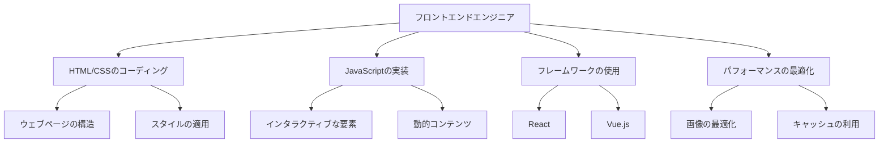

# 2024年版：フロントエンドエンジニアのためのロードマップ完全ガイド

## はじめに

フロントエンドエンジニアリングは、ウェブ開発の中でも特にダイナミックで進化の速い分野です。2024年に向けて、フロントエンドエンジニアとして成功するためには、最新の技術やトレンドを把握し、適切なスキルを身につけることが不可欠です。本記事では、2024年版のフロントエンドエンジニアのためのロードマップを詳しく解説し、必要なスキルセットや学習リソースを提供します。

## フロントエンドエンジニアの役割

フロントエンドエンジニアは、ユーザーが直接触れる部分、つまりウェブサイトやアプリケーションのインターフェースを設計・実装します。彼らの主な役割は、ユーザーエクスペリエンス（UX）を向上させることです。これには、以下のようなタスクが含まれます。

- **HTML/CSSのコーディング**: ウェブページの構造とスタイルを定義します。HTMLは文書の構造を、CSSはそのスタイルを決定します。これにより、視覚的に魅力的で使いやすいインターフェースを作成します。HTML5の新機能（例：`<article>`, `<section>`, `<header>`など）を活用することで、より意味のあるマークアップが可能になります。

- **JavaScriptの実装**: インタラクティブな要素を追加し、動的なコンテンツを提供します。JavaScriptは、ユーザーの操作に応じてページの内容を変更するための重要な言語です。DOM操作やイベントリスナーの設定を通じて、ユーザーとのインタラクションを実現します。

- **フレームワークの使用**: ReactやVue.jsなどのフレームワークを利用して、効率的に開発を行います。これにより、コードの再利用性が高まり、開発速度が向上します。特に、コンポーネントベースのアプローチは、複雑なアプリケーションの管理を容易にします。

- **パフォーマンスの最適化**: ウェブサイトの読み込み速度や応答性を向上させるための技術を適用します。これには、画像の最適化、キャッシュの利用、HTTP/2の導入などが含まれます。特に、Lighthouseなどのツールを使用して、パフォーマンスを測定し、改善点を特定することが重要です。

### フロントエンドエンジニアの役割を視覚化するダイアグラム

以下のダイアグラムは、フロントエンドエンジニアの役割とその主要なタスクを視覚的に表現しています。このダイアグラムを通じて、フロントエンドエンジニアがどのような業務を行っているのかを理解しやすくしています。



## 2024年のフロントエンド技術トレンド

### 1. モダンJavaScript（ES6+）

JavaScriptはフロントエンド開発の中心的な言語であり、ES6以降の新機能を活用することが求められます。以下は、特に重要な機能です。

- **アロー関数**: 簡潔な関数定義を可能にします。従来の関数定義よりも短く、可読性が向上します。特に、`this`の扱いが明確になるため、コールバック関数での混乱を避けることができます。

- **テンプレートリテラル**: 文字列の埋め込みを簡単にします。これにより、複雑な文字列を扱う際のコードがシンプルになります。例えば、複数行の文字列や変数の埋め込みが容易になります。

- **非同期処理**: `async/await`を使用して、非同期コードをより読みやすくします。これにより、コールバック地獄を避けることができます。非同期処理を適切に扱うことで、ユーザーエクスペリエンスが向上します。

```javascript
const fetchData = async () => {
    try {
        const response = await fetch('https://api.example.com/data');
        if (!response.ok) throw new Error('Network response was not ok');
        const data = await response.json();
        console.log(data);
    } catch (error) {
        console.error('Fetch error:', error);
    }
};
```

### 2. フロントエンドフレームワーク

2024年には、以下のフレームワークが特に人気を集めると予想されます。

- **React**: コンポーネントベースのアプローチで、再利用性が高い。状態管理にはReduxやContext APIを使用することが一般的です。Reactのエコシステムには、React RouterやStyled Componentsなど、多くの便利なライブラリがあります。特に、React Hooksを使用することで、状態管理や副作用の処理が簡素化されます。

- **Vue.js**: 学習コストが低く、柔軟性がある。Vueは、シンプルな構文と強力な機能を兼ね備えており、特に小規模から中規模のプロジェクトに適しています。Vuexを使用した状態管理や、Vue Routerを利用したルーティングの実装が一般的です。

- **Svelte**: コンパイラを使用して、軽量なアプリケーションを構築。Svelteは、他のフレームワークと異なり、ランタイムが不要で、コンパイル時に最適化されるため、パフォーマンスが非常に高いです。Svelteのシンプルな構文は、開発者にとって学習しやすい利点があります。

### 3. スタティックサイトジェネレーター

Jamstackアーキテクチャの普及により、スタティックサイトジェネレーター（SSG）が注目されています。これにより、パフォーマンスが向上し、セキュリティリスクが低減します。代表的なSSGには、GatsbyやNext.jsがあります。これらは、APIを利用して動的なコンテンツを生成することができ、開発者にとって非常に便利です。特に、Next.jsはサーバーサイドレンダリング（SSR）や静的サイト生成（SSG）の両方をサポートしており、柔軟なアプローチが可能です。

### 4. CSSの進化

CSSは、デザインの表現力を高めるために進化し続けています。特に注目すべきは以下の技術です。

- **CSS Grid**: 複雑なレイアウトを簡単に作成できます。Gridを使用することで、2次元のレイアウトを直感的に設計できます。特に、レスポンシブデザインにおいて、異なる画面サイズに対応するための強力なツールです。

- **Flexbox**: レスポンシブデザインを容易にします。Flexboxは、要素の配置やサイズを柔軟に調整できるため、特にモバイルファーストのデザインに適しています。Flexboxを使用することで、要素の整列やスペースの分配が簡単になります。

- **CSS Variables**: 再利用可能なカスタムプロパティを定義できます。これにより、テーマの変更が容易になり、メンテナンス性が向上します。CSS Variablesを使用することで、スタイルの一貫性を保ちながら、簡単にカスタマイズが可能です。

```css
:root {
    --main-color: #3498db;
    --secondary-color: #2ecc71;
}

.button {
    background-color: var(--main-color);
    color: white;
    padding: 10px 20px;
    border: none;
    border-radius: 5px;
}
```

### 5. ウェブアクセシビリティ（a11y）

ウェブアクセシビリティは、すべてのユーザーがウェブコンテンツにアクセスできるようにするための重要な要素です。2024年には、アクセシビリティを考慮したデザインがますます求められます。具体的な手法には、ARIA属性の使用や、キーボードナビゲーションの実装が含まれます。アクセシビリティを考慮することで、より多くのユーザーにリーチでき、UXが向上します。特に、視覚障害者や聴覚障害者に配慮したデザインが求められます。

## フロントエンドエンジニアに必要なスキルセット

### 1. 基本的なスキル

- **HTML/CSS**: ウェブページの構造とスタイルを理解する。HTML5の新機能や、CSS3のアニメーション、トランジションを活用することが重要です。特に、セマンティックHTMLを使用することで、SEOやアクセシビリティの向上が期待できます。

- **JavaScript**: プログラミングの基礎を学ぶ。DOM操作やイベント処理、AJAX通信など、実践的なスキルを身につけることが求められます。JavaScriptの非同期処理やPromiseの理解も重要です。

### 2. フレームワークとライブラリ

- **React**: コンポーネントの作成と状態管理を学ぶ。React Hooksを使用して、状態管理や副作用の処理を行うことが一般的です。特に、useEffectやuseStateの使い方を理解することが重要です。

- **Vue.js**: シンプルなアプリケーションを構築する。Vueのリアクティブシステムを理解し、Vuexを使用した状態管理を学ぶことが重要です。Vue Routerを利用したルーティングの実装も必要です。

### 3. バージョン管理

- **Git**: コードのバージョン管理を行うための基本的なコマンドを習得する。GitHubやGitLabを利用して、チームでのコラボレーションを行うことが一般的です。特に、ブランチ戦略やプルリクエストの作成方法を理解することが重要です。

### 4. テストとデバッグ

- **ユニットテスト**: JestやMochaを使用して、コードの品質を保つ。テスト駆動開発（TDD）の手法を学ぶことで、より堅牢なコードを書くことができます。特に、テストケースの設計やモックの使用方法を理解することが重要です。

- **デバッグツール**: Chrome DevToolsを使いこなす。コンソール、ネットワーク、パフォーマンスタブを活用して、問題を特定し解決するスキルが求められます。特に、パフォーマンスのボトルネックを特定するためのツールを活用することが重要です。

### 5. パフォーマンス最適化

- **Lazy Loading**: 必要なときにのみリソースを読み込む技術。これにより、初期読み込み時間を短縮できます。特に、画像や動画の遅延読み込みは、ユーザーエクスペリエンスを向上させます。

- **コードスプリッティング**: アプリケーションの初期読み込みを軽くする。WebpackやParcelを使用して、コードを分割し、必要な部分だけを読み込むことができます。これにより、アプリケーションのパフォーマンスが向上します。

## 学習リソース

### オンラインコース

- **Udemy**: フロントエンド開発に特化した多くのコースが提供されています。特に、実践的なプロジェクトを通じて学べるコースが人気です。受講者のレビューを参考にして、自分に合ったコースを選ぶことが重要です。

- **Coursera**: 大学の講義を受講できるプラットフォーム。特に、フロントエンド開発に関する専門的なコースが充実しています。修了証を取得できるコースも多く、キャリアに役立てることができます。

### 書籍

- **"Eloquent JavaScript"**: JavaScriptの基礎から応用までを学べる良書。実践的な例が豊富で、初心者から中級者まで幅広く対応しています。特に、演習問題が充実しており、実践的なスキルを身につけることができます。

- **"You Don’t Know JS"**: JavaScriptの深い理解を促すシリーズ。特に、言語の内部動作を理解するための良書です。各巻が特定のトピックに焦点を当てており、深い知識を得ることができます。

### コミュニティ

- **GitHub**: プロジェクトに参加し、他の開発者と交流する。オープンソースプロジェクトに貢献することで、実践的な経験を積むことができます。特に、Issueやプルリクエストを通じて、他の開発者と協力することが重要です。

- **Stack Overflow**: 質問を投稿し、解決策を見つける。多くの開発者が集まるため、迅速に回答が得られることが多いです。特に、タグを活用して関連する質問を見つけることが重要です。

## まとめ

2024年のフロントエンドエンジニアリングは、技術の進化とともに新たな挑戦が待っています。モダンなJavaScript、フレームワーク、アクセシビリティなど、さまざまなスキルを身につけることで、競争力を高めることができます。学習リソースを活用し、実践的なプロジェクトに取り組むことで、スキルを磨いていきましょう。フロントエンドエンジニアとしてのキャリアを築くためには、常に学び続ける姿勢が重要です。

-----

※本記事は生成AIを使用して作成されました。
AI言語モデル: gpt-4o-mini