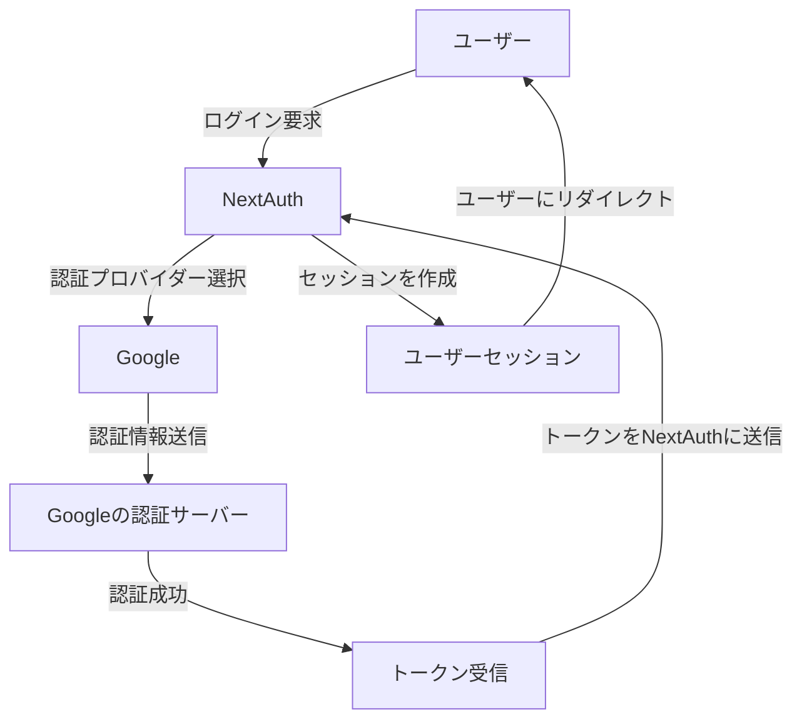

# NextAuthを使った最新認証システムの構築：セキュリティと使いやすさの両立

## はじめに

現代のウェブアプリケーションにおいて、ユーザー認証は非常に重要な要素です。特に、セキュリティと使いやすさの両立は、開発者にとって大きな課題となっています。NextAuthは、Next.jsアプリケーションにおける認証を簡素化するためのライブラリであり、さまざまな認証プロバイダーをサポートしています。本記事では、NextAuthを使用して最新の認証システムを構築する方法について詳しく解説し、セキュリティと使いやすさを両立させるためのベストプラクティスを紹介します。

### 認証フローの概要

NextAuthを使用した認証フローは、ユーザーがアプリケーションにアクセスし、認証プロバイダーを通じてログインするプロセスを含みます。以下のダイアグラムは、一般的な認証フローを示しています。



このフローは、ユーザーがアプリケーションにログインする際の一連のステップを視覚的に表現しています。ユーザーはNextAuthを介して認証プロバイダーを選択し、認証情報を送信します。認証が成功すると、トークンが生成され、ユーザーセッションが作成されます。

## NextAuthの概要

NextAuthは、Next.jsアプリケーションに特化したオープンソースの認証ライブラリです。以下の特徴があります。

- **多様な認証プロバイダー**: Google、Facebook、Twitter、GitHubなど、さまざまなOAuthプロバイダーをサポートしています。これにより、ユーザーは自分の好みの方法でログインでき、開発者は多様なニーズに応えることができます。
- **セッション管理**: JWT（JSON Web Token）やデータベースセッションを使用して、ユーザーのセッションを管理できます。これにより、セッションの持続性やセキュリティを高めることができます。
- **カスタマイズ性**: 認証フローやUIを自由にカスタマイズ可能です。これにより、アプリケーションのブランドに合わせたデザインを実現できます。

### NextAuthのインストール

NextAuthを使用するには、まずNext.jsプロジェクトを作成し、NextAuthをインストールします。以下の手順で進めます。

1. **Next.jsプロジェクトの作成**

```bash
npx create-next-app my-auth-app
cd my-auth-app
```

2. **NextAuthのインストール**

```bash
npm install next-auth
```

3. **APIルートの設定**

NextAuthを使用するためには、APIルートを設定する必要があります。`pages/api/auth/[...nextauth].js`というファイルを作成し、以下のように設定します。

```javascript
import NextAuth from "next-auth";
import Providers from "next-auth/providers";

export default NextAuth({
  providers: [
    Providers.Google({
      clientId: process.env.GOOGLE_CLIENT_ID,
      clientSecret: process.env.GOOGLE_CLIENT_SECRET,
    }),
    // 他のプロバイダーもここに追加可能
  ],
  // セッションやコールバックの設定
});
```

この設定により、Googleを使用した認証が可能になります。環境変数には、Google Cloud Consoleで取得したクライアントIDとクライアントシークレットを設定します。

## セキュリティの考慮事項

認証システムを構築する際には、セキュリティが最も重要な要素の一つです。以下に、NextAuthを使用する際のセキュリティ対策をいくつか紹介します。

### 1. HTTPSの使用

すべての通信はHTTPSを使用して暗号化することが重要です。これにより、データの盗聴や改ざんを防ぐことができます。特に、ユーザーの認証情報や個人情報を扱う場合、HTTPSは必須です。SSL証明書を取得し、サーバーに適切に設定することで、HTTPSを有効にできます。

### 2. セッション管理

NextAuthでは、セッションの管理が容易です。セッションの有効期限を設定し、定期的に更新することで、セキュリティを強化できます。以下のように設定することで、セッションの持続性を管理できます。

```javascript
session: {
  jwt: true,
  maxAge: 30 * 24 * 60 * 60, // 30日
},
```

この設定により、ユーザーは30日間セッションを維持できますが、定期的にセッションを更新することが推奨されます。さらに、セッションの状態を監視し、異常が発生した場合には自動的にログアウトさせる機能を実装することも考慮すべきです。

### 3. CSRF対策

NextAuthは、CSRF（Cross-Site Request Forgery）攻撃に対する保護を提供しています。デフォルトでCSRFトークンが生成され、リクエストに含まれます。これにより、悪意のあるサイトからの不正なリクエストを防ぐことができます。CSRFトークンは、セッションの開始時に生成され、各リクエストに対して検証されます。

### 4. 環境変数の管理

クライアントIDやシークレットなどの機密情報は、環境変数として管理し、コードベースにハードコーディングしないようにします。これにより、情報漏洩のリスクを軽減できます。`.env.local`ファイルを使用して、環境変数を設定することが一般的です。

## 使いやすさの向上

セキュリティが確保されていても、ユーザーが使いやすいと感じなければ意味がありません。NextAuthを使用して、使いやすさを向上させるためのポイントを以下に示します。

### 1. シンプルなUI

認証フローはシンプルで直感的であるべきです。NextAuthでは、カスタムUIを作成することができ、ユーザーが迷わないようにデザインできます。例えば、ログインボタンやエラーメッセージを明確に表示することで、ユーザーのストレスを軽減できます。

### 2. ソーシャルログインの導入

ユーザーが手軽にログインできるように、ソーシャルログインを導入することが効果的です。NextAuthは多くのソーシャルプロバイダーをサポートしているため、簡単に実装できます。これにより、ユーザーは複数のアカウントを持つ必要がなくなり、利便性が向上します。

### 3. エラーメッセージの明確化

認証エラーが発生した場合、ユーザーに対して明確なエラーメッセージを表示することが重要です。これにより、ユーザーは問題を理解しやすくなります。例えば、「メールアドレスまたはパスワードが間違っています」といった具体的なメッセージを表示することで、ユーザーは次に何をすべきかを理解できます。

## 実践的な例

ここでは、NextAuthを使用した簡単な認証システムの実装例を示します。この例では、Google認証を使用します。

### 1. プロジェクトのセットアップ

まず、Next.jsプロジェクトを作成し、NextAuthをインストールします。

```bash
npx create-next-app my-auth-app
cd my-auth-app
npm install next-auth
```

### 2. 環境変数の設定

`.env.local`ファイルを作成し、GoogleのクライアントIDとシークレットを設定します。

```
GOOGLE_CLIENT_ID=your-client-id
GOOGLE_CLIENT_SECRET=your-client-secret
```

### 3. APIルートの作成

`pages/api/auth/[...nextauth].js`ファイルを作成し、以下のように設定します。

```javascript
import NextAuth from "next-auth";
import Providers from "next-auth/providers";

export default NextAuth({
  providers: [
    Providers.Google({
      clientId: process.env.GOOGLE_CLIENT_ID,
      clientSecret: process.env.GOOGLE_CLIENT_SECRET,
    }),
  ],
  session: {
    jwt: true,
    maxAge: 30 * 24 * 60 * 60, // 30日
  },
  callbacks: {
    async session(session, token) {
      session.user.id = token.sub;
      return session;
    },
  },
});
```

### 4. 認証ボタンの作成

`pages/index.js`ファイルを編集し、認証ボタンを作成します。

```javascript
import { signIn, signOut, useSession } from "next-auth/react";

export default function Home() {
  const { data: session } = useSession();

  return (
    <div>
      <h1>NextAuth認証デモ</h1>
      {session ? (
        <>
          <p>ようこそ、{session.user.name}さん！</p>
          <button onClick={() => signOut()}>ログアウト</button>
        </>
      ) : (
        <>
          <p>ログインしてください。</p>
          <button onClick={() => signIn("google")}>Googleでログイン</button>
        </>
      )}
    </div>
  );
}
```

### 5. アプリケーションの起動

アプリケーションを起動し、ブラウザで確認します。

```bash
npm run dev
```

## 課題と解決策

NextAuthを使用する際に直面する可能性のある課題とその解決策を以下に示します。

### 課題1: 認証プロバイダーの設定

複数の認証プロバイダーを設定する際、設定が複雑になることがあります。これを解決するためには、各プロバイダーの設定を明確にドキュメント化し、必要な情報を整理しておくことが重要です。また、設定のサンプルコードを用意することで、開発者が迅速に実装できるようにします。

### 課題2: セッションの管理

セッションの管理が不十分だと、セキュリティリスクが高まります。セッションの有効期限を適切に設定し、定期的に更新することで、リスクを軽減できます。さらに、セッションの状態を監視し、異常が発生した場合には自動的にログアウトさせる機能を実装することも考慮すべきです。

### 課題3: ユーザーエクスペリエンスの向上

ユーザーが認証フローでつまずくことがあるため、エラーメッセージやヘルプを充実させることが重要です。また、UIをシンプルに保つことで、ユーザーのストレスを軽減できます。ユーザーからのフィードバックを収集し、改善点を見つけることも重要です。

## まとめ

NextAuthを使用することで、セキュリティと使いやすさを両立させた最新の認証システムを構築することが可能です。多様な認証プロバイダーのサポート、セッション管理の容易さ、カスタマイズ性の高さがNextAuthの魅力です。セキュリティ対策を講じつつ、ユーザーエクスペリエンスを向上させるための工夫を行うことで、より良い認証システムを実現できます。

今後のウェブアプリケーション開発において、NextAuthは非常に有用なツールとなるでしょう。ぜひ、実際のプロジェクトに取り入れてみてください。

## 参考文献

- [NextAuth.js Documentation](https://next-auth.js.org/getting-started/introduction)
- [OAuth 2.0](https://oauth.net/2/)
- [JSON Web Tokens](https://jwt.io/)

-----

※本記事は生成AIを使用して作成されました。
AI言語モデル: gpt-4o-mini