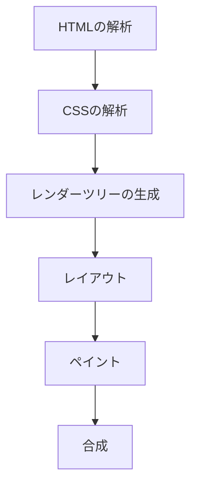

# 0からわかる！最新ブラウザレンダリングの仕組みと最適化テクニック

## はじめに

ウェブブラウザは、私たちがインターネットを利用する際の重要なツールです。ブラウザは、HTML、CSS、JavaScriptなどのコードを解釈し、ユーザーが視覚的に理解できる形で表示します。このプロセスを「レンダリング」と呼びます。レンダリングの仕組みを理解することは、ウェブ開発者にとって非常に重要です。なぜなら、レンダリングの最適化は、ウェブサイトのパフォーマンスやユーザーエクスペリエンスに直接影響を与えるからです。

本記事では、最新のブラウザレンダリングの仕組みを詳しく解説し、最適化テクニックを紹介します。これにより、読者はブラウザの動作を深く理解し、実際の開発に役立てることができるでしょう。

### レンダリングプロセスのフローチャート

以下のフローチャートは、ブラウザのレンダリングプロセスを視覚的に示しています。この図を参照することで、各ステップの流れを理解しやすくなります。



このフローチャートは、レンダリングプロセスの各ステップを示しており、HTMLの解析から始まり、最終的な合成に至るまでの流れを視覚的に表現しています。

## ブラウザレンダリングの基本

### レンダリングプロセスの概要

ブラウザのレンダリングプロセスは、主に以下のステップで構成されています。

1. **HTMLの解析**: ブラウザは、HTMLファイルを読み込み、DOM（Document Object Model）ツリーを構築します。DOMは、文書の構造を表すツリー状のデータ構造であり、各要素はノードとして表現されます。これにより、JavaScriptを使用して動的に操作することが可能になります。

2. **CSSの解析**: CSSファイルを読み込み、CSSOM（CSS Object Model）ツリーを構築します。CSSOMは、CSSスタイルシートの構造を表すツリーで、各ルールはスタイルを適用する要素に関連付けられます。

3. **レンダーツリーの生成**: DOMツリーとCSSOMツリーを組み合わせて、レンダーツリーを生成します。このツリーは、実際に画面に表示される要素を表します。たとえば、`display: none;`が指定された要素は、レンダーツリーには含まれません。これにより、ブラウザは描画すべき要素を効率的に管理できます。

4. **レイアウト**: レンダーツリーを基に、各要素の位置やサイズを計算します。これにより、ブラウザは画面上での要素の配置を決定します。

5. **ペイント**: レイアウトが完了したら、ブラウザは画面に描画します。ペイントは、色、フォント、画像などの視覚的な要素を含みます。

6. **合成**: 複数のレイヤーがある場合、最終的な画像を合成して表示します。合成は、GPU（Graphics Processing Unit）を使用して行われるため、パフォーマンスが向上します。

### DOMとCSSOMの詳細

#### DOM（Document Object Model）

DOMは、HTML文書の構造を表すツリー状のデータ構造です。各要素はノードとして表現され、親子関係を持ちます。DOMは、JavaScriptを使用して動的に操作することができ、ユーザーのインタラクションに応じて内容を変更することが可能です。たとえば、ユーザーがボタンをクリックしたときに、特定の要素を表示したり非表示にしたりすることができます。

```javascript
document.getElementById("myButton").addEventListener("click", function() {
    document.getElementById("myElement").style.display = "none";
});
```

DOMは、ウェブページのインタラクティブ性を高めるための基盤であり、開発者はこの構造を理解することで、より効果的なユーザーインターフェースを構築できます。

#### CSSOM（CSS Object Model）

CSSOMは、CSSスタイルシートの構造を表すツリーです。CSSの各ルールは、スタイルを適用する要素に関連付けられます。CSSOMもJavaScriptから操作可能で、スタイルの動的変更が可能です。たとえば、特定の条件に基づいてスタイルを変更することができます。

```javascript
document.getElementById("myElement").style.color = "red";
```

CSSOMを理解することで、開発者はスタイルの適用や変更を効率的に行うことができ、ユーザーの操作に応じた動的なデザインを実現できます。

### レンダーツリーの生成

レンダーツリーは、DOMとCSSOMを組み合わせたもので、実際に画面に表示される要素のみを含みます。たとえば、`display: none;`が指定された要素は、レンダーツリーには含まれません。これにより、ブラウザは描画すべき要素を効率的に管理できます。レンダーツリーの生成は、パフォーマンスに大きな影響を与えるため、開発者はこのプロセスを理解し、最適化する必要があります。

レンダーツリーの生成においては、CSSの特異性や継承のルールも考慮されます。特異性が高いスタイルが適用される要素は、レンダーツリーにおいても優先されます。このため、CSSの設計においては、特異性を意識したスタイルの記述が重要です。

### レイアウトとペイント

レイアウトは、レンダーツリーに基づいて各要素の位置とサイズを計算するプロセスです。これにより、ブラウザは画面上での要素の配置を決定します。レイアウトは、特に複雑なページや多くの要素がある場合に時間がかかることがあります。レイアウトの計算は、ボックスモデルに基づいて行われ、各要素のマージン、パディング、ボーダー、コンテンツのサイズが考慮されます。

ペイントは、計算されたレイアウトに基づいて、実際に画面に描画するプロセスです。ペイントは、色、フォント、画像などの視覚的な要素を含みます。ペイントのプロセスは、特に多くの要素がある場合や、複雑なスタイルが適用されている場合にパフォーマンスに影響を与えることがあります。

### 合成

合成は、複数のレイヤーを組み合わせて最終的な画像を生成するプロセスです。特に、CSSの`position`プロパティや`transform`プロパティを使用している要素は、別のレイヤーとして扱われることがあります。合成は、GPU（Graphics Processing Unit）を使用して行われるため、パフォーマンスが向上します。合成の効率を高めるためには、レイヤーの数を最小限に抑えることが重要です。

合成のプロセスでは、各レイヤーが独立して描画され、最終的に一つの画像として合成されます。このため、合成を適切に管理することで、描画のパフォーマンスを向上させることができます。

## 最新のブラウザレンダリング技術

### レンダリングエンジンの進化

ブラウザのレンダリングエンジンは、常に進化しています。主要なブラウザには、以下のようなレンダリングエンジンがあります。

- **Blink**: Google ChromeやMicrosoft Edgeで使用されているエンジンです。高速なレンダリングと最新のウェブ標準への対応が特徴です。Blinkは、WebKitからフォークされており、オープンソースで開発されています。Blinkは、特にJavaScriptの処理速度やCSSのレンダリングにおいて高いパフォーマンスを発揮します。

- **WebKit**: Safariで使用されているエンジンで、Appleの製品に最適化されています。WebKitは、特にモバイルデバイスでのパフォーマンスに優れています。WebKitは、HTML5やCSS3の最新の機能をサポートしており、特にタッチインターフェースにおいてスムーズな操作を実現しています。

- **Gecko**: Mozilla Firefoxで使用されているエンジンで、オープンソースのプロジェクトとして開発されています。Geckoは、ウェブ標準への対応が強化されており、特にCSSやJavaScriptの処理において高いパフォーマンスを発揮します。Geckoは、特にアクセシビリティやプライバシーに配慮した機能を提供しています。

これらのエンジンは、パフォーマンスの向上や新しい機能の追加を目指して、定期的にアップデートされています。たとえば、最近のアップデートでは、WebAssemblyのサポートや、CSS Grid Layoutの実装が進められています。

### レンダリングの最適化技術

#### 1. レイジーローディング

レイジーローディングは、必要なときにのみリソースを読み込む技術です。これにより、初期のページロード時間を短縮し、ユーザーエクスペリエンスを向上させます。たとえば、画像や動画をスクロールして表示されるまで読み込まないように設定できます。

```html

```

この技術は、特に画像が多いページや、長いコンテンツを持つページで効果的です。ユーザーがスクロールするたびに必要なリソースを読み込むことで、初期の負荷を軽減できます。

#### 2. CSSの最適化

CSSの最適化は、レンダリングパフォーマンスを向上させるために重要です。以下のテクニックが有効です。

- **CSSのミニファイ**: 不要な空白やコメントを削除し、ファイルサイズを小さくします。これにより、読み込み時間が短縮されます。

- **CSSの結合**: 複数のCSSファイルを1つにまとめ、HTTPリクエストの数を減らします。これにより、サーバーへのリクエストが減少し、ページの読み込みが速くなります。

- **Critical CSS**: 初期表示に必要なCSSをインラインで埋め込み、レンダリングを早めます。これにより、ページが表示されるまでの時間を短縮できます。

#### 3. JavaScriptの最適化

JavaScriptは、レンダリングに大きな影響を与える要素です。以下のテクニックを使用して最適化できます。

- **非同期読み込み**: `async`や`defer`属性を使用して、スクリプトの読み込みを非同期に行います。これにより、ページのレンダリングがブロックされることを防ぎます。

```html
<script src="script.js" async></script>
```

- **DOM操作の最小化**: DOMの操作は高コストなため、まとめて行うことが推奨されます。たとえば、複数の要素を一度に変更する場合は、ドキュメントフラグメントを使用して、パフォーマンスを向上させることができます。

```javascript
const fragment = document.createDocumentFragment();
const newElement = document.createElement("div");
newElement.textContent = "新しい要素";
fragment.appendChild(newElement);
document.body.appendChild(fragment);
```

#### 4. 画像の最適化

画像はウェブページのパフォーマンスに大きな影響を与えます。以下の方法で最適化できます。

- **適切なフォーマットの選択**: JPEG、PNG、WebPなど、用途に応じたフォーマットを選びます。WebPは、圧縮率が高く、画質を保ちながらファイルサイズを小さくできるため、特に推奨されます。

- **圧縮**: 画像を圧縮してファイルサイズを小さくします。オンラインツールや画像編集ソフトを使用して、圧縮率を調整し、画質を保ちながらファイルサイズを削減します。

## 実践的な最適化テクニック

### 1. パフォーマンス測定ツールの活用

ウェブサイトのパフォーマンスを測定するためのツールが多数存在します。以下は代表的なツールです。

- **Google PageSpeed Insights**: ページのパフォーマンスを分析し、改善点を提案します。特に、モバイルデバイスでのパフォーマンスを重視しており、具体的な改善策を示してくれます。

- **Lighthouse**: Chrome DevToolsに組み込まれているツールで、パフォーマンス、アクセシビリティ、SEOなどを評価します。Lighthouseは、ウェブアプリケーションの品質を向上させるための具体的な指針を提供します。

- **WebPageTest**: ウェブページの読み込み速度を詳細に分析し、各リソースの読み込み時間を可視化します。これにより、ボトルネックを特定し、最適化の手助けをします。

### 2. コンテンツ配信ネットワーク（CDN）の利用

CDNを利用することで、リソースを地理的に近いサーバーから配信し、ロード時間を短縮できます。これにより、ユーザーエクスペリエンスが向上します。CDNは、特にグローバルなユーザーを持つウェブサイトにとって重要です。CDNを使用することで、サーバーの負荷を分散し、可用性を向上させることができます。

### 3. サーバーサイドレンダリング（SSR）

サーバーサイドレンダリングは、サーバーでHTMLを生成し、クライアントに送信する手法です。これにより、初期表示が速くなり、SEOにも有利です。SSRは、特に動的なコンテンツを持つウェブアプリケーションにおいて、ユーザーに迅速なフィードバックを提供します。SSRを実装することで、クライアントサイドのJavaScriptが完全に読み込まれる前に、ユーザーがコンテンツを視認できるようになります。

### 4. プログレッシブウェブアプリ（PWA）

PWAは、ウェブアプリケーションにネイティブアプリのような機能を持たせる技術です。オフラインでの利用やプッシュ通知などが可能になり、ユーザーエクスペリエンスが向上します。PWAは、ユーザーがアプリをインストールすることなく、ブラウザから直接アクセスできるため、利便性が高いです。PWAを実装することで、ユーザーはアプリのような体験を得ることができ、リテンション率の向上が期待できます。

## まとめ

ブラウザのレンダリングプロセスは、ウェブ開発において非常に重要な要素です。レンダリングの仕組みを理解し、最適化テクニックを適用することで、ウェブサイトのパフォーマンスを向上させることができます。最新の技術やツールを活用し、ユーザーに快適な体験を提供することが求められています。

今後もブラウザの技術は進化し続けるため、最新の情報を常にキャッチアップし、実践に活かしていくことが重要です。これにより、より良いウェブ体験を提供できるでしょう。

-----

※本記事は生成AIを使用して作成されました。
AI言語モデル: gpt-4o-mini