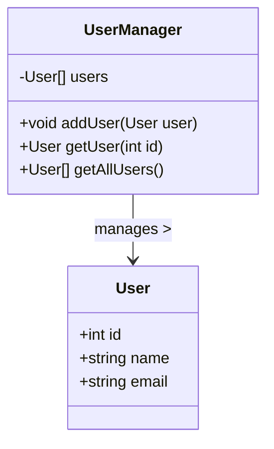

# TypeScriptの高度な型システム活用法：生産性とコード品質の向上に向けて

## はじめに

TypeScriptは、JavaScriptのスーパーセットとして、型安全性を提供することで開発者の生産性を向上させるプログラミング言語です。特に、TypeScriptの高度な型システムは、コードの品質を向上させるための強力なツールです。本記事では、TypeScriptの型システムの特徴を深く掘り下げ、実践的な例を通じてその活用法を探ります。最終的には、これらの技術を用いて生産性を向上させ、コードの品質を高める方法を示します。

## TypeScriptの型システムの基本

### 型の基本概念

TypeScriptでは、型は変数や関数の引数、戻り値に対して明示的に指定できます。これにより、開発者は意図しないエラーを防ぎ、コードの可読性を向上させることができます。基本的な型には、以下のようなものがあります。

- **プリミティブ型**: `number`, `string`, `boolean`, `null`, `undefined`, `symbol`
- **オブジェクト型**: オブジェクトリテラルや配列
- **タプル型**: 固定長の配列で、異なる型を持つことができる
- **列挙型**: 定義された定数の集合

これらの型を理解することは、TypeScriptを効果的に使用するための第一歩です。たとえば、`number`型は数値を表し、`string`型は文字列を表します。これにより、開発者は変数の意図を明確にし、エラーを未然に防ぐことができます。

### 型推論

TypeScriptは型推論をサポートしており、変数の初期値から型を自動的に推測します。これにより、開発者は型を明示的に指定する必要がなくなり、コードが簡潔になります。

```typescript
let num = 42; // TypeScriptはnumをnumber型と推論
```

型推論は、特に大規模なコードベースでの開発において、開発者の負担を軽減します。型を明示的に指定することなく、TypeScriptが適切な型を推測してくれるため、コードの可読性が向上します。

## 高度な型システムの機能

TypeScriptの型システムには、より複雑な型を定義するための多くの機能があります。これらの機能を活用することで、より堅牢でメンテナンスしやすいコードを書くことができます。

### ユニオン型と交差型

ユニオン型は、複数の型のいずれかを許可する型です。交差型は、複数の型を組み合わせて新しい型を作成します。

#### ユニオン型の例

ユニオン型を使用することで、関数や変数が複数の型を受け入れることができます。これにより、柔軟性が向上します。

```typescript
function printId(id: number | string) {
    console.log(`ID: ${id}`);
}

printId(101); // OK
printId("202"); // OK
```

この例では、`printId`関数は`number`型または`string`型の引数を受け取ることができます。これにより、異なる型のデータを処理する際に、関数を再利用することが可能になります。

#### 交差型の例

交差型は、複数の型を組み合わせて新しい型を作成します。これにより、複数のインターフェースを持つオブジェクトを簡単に定義できます。

```typescript
interface Person {
    name: string;
}

interface Employee {
    employeeId: number;
}

type EmployeeDetails = Person & Employee;

const employee: EmployeeDetails = {
    name: "Alice",
    employeeId: 123,
};
```

この例では、`EmployeeDetails`型は`Person`と`Employee`の両方のプロパティを持つオブジェクトを表します。これにより、異なる型の情報を一つのオブジェクトにまとめることができます。

### 型エイリアスとインターフェース

型エイリアスは、型に別名を付けるための機能で、インターフェースはオブジェクトの構造を定義するためのものです。どちらも型を定義するために使用されますが、インターフェースは拡張可能であるため、オブジェクト指向プログラミングにおいて特に便利です。

#### 型エイリアスの例

型エイリアスを使用することで、複雑な型を簡潔に表現できます。

```typescript
type StringOrNumber = string | number;

let value: StringOrNumber;
value = "Hello"; // OK
value = 100; // OK
```

この例では、`StringOrNumber`型は`string`または`number`のいずれかを受け入れることができます。これにより、異なる型のデータを一つの変数で扱うことが可能になります。

#### インターフェースの例

インターフェースは、オブジェクトの構造を定義するために使用されます。インターフェースは他のインターフェースを拡張することができ、オブジェクト指向プログラミングの概念を取り入れることができます。

```typescript
interface Vehicle {
    make: string;
    model: string;
}

interface Car extends Vehicle {
    doors: number;
}

const myCar: Car = {
    make: "Toyota",
    model: "Corolla",
    doors: 4,
};
```

この例では、`Car`インターフェースは`Vehicle`インターフェースを拡張し、`doors`プロパティを追加しています。これにより、`Car`型のオブジェクトは`Vehicle`のプロパティを持ちながら、追加の情報を持つことができます。

### ジェネリクス

ジェネリクスは、型をパラメータ化することで、再利用可能なコンポーネントを作成するための機能です。これにより、型安全性を保ちながら、柔軟なコードを書くことができます。

#### ジェネリクスの例

ジェネリクスを使用することで、関数やクラスが異なる型を受け入れることができ、再利用性が向上します。

```typescript
function identity<T>(arg: T): T {
    return arg;
}

let output = identity<string>("Hello"); // outputはstring型
let numberOutput = identity<number>(100); // outputはnumber型
```

この例では、`identity`関数は型パラメータ`T`を受け入れ、引数の型に応じた戻り値を返します。これにより、異なる型のデータを処理する際に、同じ関数を再利用することができます。

## TypeScriptの型システムを活用するメリット

### 生産性の向上

TypeScriptの型システムを活用することで、開発者はエディタの補完機能を最大限に利用できます。型情報があることで、関数やメソッドの使用方法が明確になり、エラーを事前に防ぐことができます。これにより、開発者はより迅速にコーディングを行うことができ、全体の生産性が向上します。

### コードの品質向上

型安全性により、意図しない型の使用を防ぎ、バグを減少させることができます。また、型定義が明確であるため、コードの可読性が向上し、他の開発者が理解しやすくなります。これにより、チーム全体のコード品質が向上し、メンテナンスが容易になります。

### チーム開発の効率化

TypeScriptの型システムは、チーム開発において特に有用です。型定義があることで、チームメンバー間でのコミュニケーションが円滑になり、コードの整合性が保たれます。型情報が明示的であるため、他の開発者がコードを理解しやすく、レビューやコラボレーションがスムーズに行えます。

## 実践的な活用法

### プロジェクトにおける型定義のベストプラクティス

1. **型定義ファイルの利用**: 外部ライブラリを使用する際は、型定義ファイル（`.d.ts`）を活用して型情報を提供します。これにより、ライブラリの使用時に型安全性を確保できます。
   
2. **明示的な型指定**: 可能な限り、変数や関数の型を明示的に指定することで、コードの可読性を向上させます。特に、複雑な型を扱う場合は、型を明示的に指定することが重要です。

3. **インターフェースの活用**: オブジェクトの構造を定義する際は、インターフェースを使用して拡張性を持たせます。これにより、将来的な変更に柔軟に対応できます。

4. **型ガードの利用**: 型ガードを使用することで、実行時に型を確認し、型安全性を向上させることができます。これにより、より堅牢なコードを書くことが可能になります。

### 具体的なプロジェクト例

以下に、TypeScriptを使用した簡単なプロジェクトの例を示します。このプロジェクトでは、ユーザー情報を管理するためのクラスを定義します。

```typescript
interface User {
    id: number;
    name: string;
    email: string;
}

class UserManager {
    private users: User[] = [];

    addUser(user: User): void {
        this.users.push(user);
    }

    getUser(id: number): User | undefined {
        return this.users.find(user => user.id === id);
    }

    getAllUsers(): User[] {
        return this.users;
    }
}

const userManager = new UserManager();
userManager.addUser({ id: 1, name: "Alice", email: "alice@example.com" });
userManager.addUser({ id: 2, name: "Bob", email: "bob@example.com" });

const user = userManager.getUser(1);
console.log(user); // { id: 1, name: "Alice", email: "alice@example.com" }

const allUsers = userManager.getAllUsers();
console.log(allUsers); // [{ id: 1, name: "Alice", email: "alice@example.com" }, { id: 2, name: "Bob", email: "bob@example.com" }]
```

この例では、`UserManager`クラスがユーザー情報を管理しています。`addUser`メソッドでユーザーを追加し、`getUser`メソッドで特定のユーザーを取得、`getAllUsers`メソッドで全ユーザーを取得することができます。このように、TypeScriptの型システムを活用することで、コードの可読性と保守性が向上します。

### ダイアグラムの挿入

以下のダイアグラムは、`UserManager`クラスの構造を示しています。このダイアグラムは、クラスのプロパティやメソッドの関係を視覚的に表現しています。



このクラス図は、`User`と`UserManager`の関係を示しています。`UserManager`クラスは、`User`オブジェクトの配列を管理し、ユーザーを追加したり、特定のユーザーを取得したり、全ユーザーを取得するメソッドを持っています。この視覚的な表現により、クラスの構造とその機能が明確に理解できるようになります。

## TypeScriptの型システムの将来

TypeScriptは、常に進化を続けており、型システムもその一部です。今後のバージョンでは、さらなる型の機能や改善が期待されます。特に、型推論の精度向上や新しい型の追加が注目されています。また、TypeScriptのコミュニティは活発であり、ユーザーからのフィードバックを基に新機能が追加されることが多いため、今後の展開に期待が寄せられています。

## まとめ

TypeScriptの高度な型システムは、開発者にとって非常に強力なツールです。ユニオン型、交差型、ジェネリクスなどの機能を活用することで、生産性を向上させ、コードの品質を高めることができます。実践的な例を通じて、これらの技術をどのようにプロジェクトに適用できるかを示しました。今後もTypeScriptの進化に注目し、最新の機能を取り入れていくことが重要です。

-----

※本記事は生成AIを使用して作成されました。
AI言語モデル: gpt-4o-mini