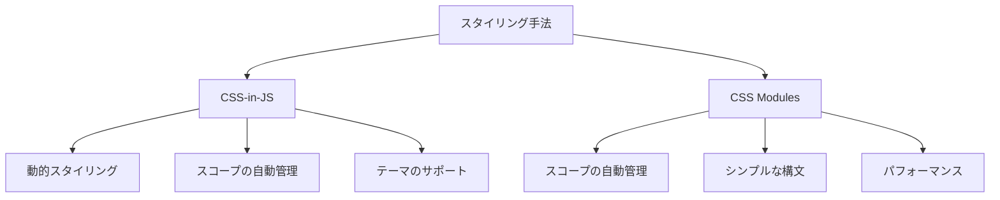

# CSS-in-JS vs CSS Modules：2024年のスタイリング戦略を徹底比較

## はじめに

ウェブ開発の進化に伴い、スタイリングの手法も多様化しています。特に、CSS-in-JSとCSS Modulesは、現代のフロントエンド開発において非常に人気のあるスタイリング戦略です。これらの手法は、それぞれ異なるアプローチを持ち、開発者にとっての利点や課題も異なります。本記事では、CSS-in-JSとCSS Modulesの特徴、利点、欠点、実際の使用例を比較し、2024年のスタイリング戦略としてどちらが適しているかを探ります。

### ダイアグラム：スタイリング手法の比較

以下のダイアグラムは、CSS-in-JSとCSS Modulesの主要な特徴を視覚的に比較したものです。この図を通じて、各手法の利点や欠点を一目で理解できるようにしています。



このダイアグラムは、CSS-in-JSとCSS Modulesの主要な特徴を示しています。CSS-in-JSは動的スタイリングやテーマのサポートが強みであり、CSS Modulesはシンプルな構文とパフォーマンスに優れています。

## CSS-in-JSとは

CSS-in-JSは、JavaScriptの中にCSSを埋め込むスタイリング手法です。このアプローチは、コンポーネント指向の開発スタイルに特に適しており、スタイルをコンポーネントと一緒に管理することができます。以下に、CSS-in-JSの主要な特徴を示します。

### 特徴

1. **動的スタイリング**: CSS-in-JSでは、JavaScriptの変数や関数を使用してスタイルを動的に変更できます。これにより、ユーザーのインタラクションに応じてスタイルを変更することが容易になります。例えば、ボタンの色をクリック時に変更することができます。これにより、ユーザーエクスペリエンスが向上し、インタラクティブなアプリケーションを構築することが可能です。

2. **スコープの自動管理**: CSS-in-JSは、スタイルをコンポーネントにスコープするため、クラス名の衝突を防ぎます。これにより、スタイルの管理が簡単になります。特に大規模なアプリケーションでは、スタイルの衝突を避けることが重要です。例えば、異なるコンポーネントで同じクラス名を使用しても、CSS-in-JSではそれぞれのスタイルが正しく適用されます。

3. **テーマのサポート**: 多くのCSS-in-JSライブラリは、テーマ機能を提供しており、アプリケーション全体で一貫したスタイルを維持するのが容易です。これにより、デザインの一貫性を保ちながら、異なるテーマを簡単に適用できます。たとえば、ダークモードやライトモードの切り替えが簡単に実装できます。

### 代表的なライブラリ

- **Styled-components**: Reactアプリケーションで広く使用されているライブラリで、CSSをJavaScriptの中に書くことができます。Styled-componentsは、スタイルをコンポーネントに直接関連付けることができ、非常に直感的です。これにより、開発者はスタイルをコンポーネントのロジックと一緒に管理でき、可読性が向上します。

- **Emotion**: 高速で柔軟なCSS-in-JSライブラリで、スタイルの定義が簡単です。Emotionは、パフォーマンスを重視しており、必要に応じてスタイルを最適化します。特に、スタイルのキャッシング機能が強力で、アプリケーションのパフォーマンスを向上させることができます。

### コード例

以下は、Styled-componentsを使用した簡単なコンポーネントの例です。

```javascript
import styled from 'styled-components';

const Button = styled.button`
  background-color: blue;
  color: white;
  padding: 10px;
  border: none;
  border-radius: 5px;

  &:hover {
    background-color: darkblue;
  }
`;

const App = () => {
  return <Button>Click Me</Button>;
};
```

この例では、ボタンが青色で、ホバー時に暗い青色に変わります。スタイルはコンポーネントに直接関連付けられているため、他のスタイルと衝突することはありません。さらに、ボタンのスタイルを変更する際も、コンポーネント内で完結するため、メンテナンスが容易です。

## CSS Modulesとは

CSS Modulesは、CSSファイルをモジュールとして扱う手法で、各スタイルが自動的にユニークなクラス名に変換されます。これにより、スタイルのスコープがコンポーネントに限定され、クラス名の衝突を防ぎます。

### 特徴

1. **スコープの自動管理**: CSS Modulesは、各クラス名をユニークにするため、他のスタイルと衝突することがありません。これにより、特に大規模なプロジェクトでのスタイル管理が容易になります。たとえば、異なるコンポーネントで同じクラス名を使用しても、CSS Modulesではそれぞれのスタイルが正しく適用されます。

2. **シンプルな構文**: CSS Modulesは、通常のCSSと同じ構文を使用するため、学習コストが低いです。開発者は既存のCSSの知識を活かして、すぐに利用を開始できます。これにより、特に新しいメンバーがチームに加わった際にも、スムーズにプロジェクトに参加できる環境が整います。

3. **パフォーマンス**: CSS Modulesは、スタイルを事前にビルドするため、ランタイムのオーバーヘッドが少なく、パフォーマンスが向上します。これにより、特に大規模なアプリケーションでのパフォーマンスが改善されます。ビルド時にスタイルが最適化されるため、最終的なバンドルサイズが小さくなります。

### コード例

以下は、CSS Modulesを使用したコンポーネントの例です。

```css
/* styles.module.css */
.button {
  background-color: blue;
  color: white;
  padding: 10px;
  border: none;
  border-radius: 5px;
}

.button:hover {
  background-color: darkblue;
}
```

```javascript
import styles from './styles.module.css';

const App = () => {
  return <button className={styles.button}>Click Me</button>;
};
```

この例では、CSS Modulesを使用してボタンのスタイルを定義しています。`styles.button`を使用することで、ユニークなクラス名が自動的に生成され、他のスタイルと衝突することはありません。これにより、特に大規模なアプリケーションでのスタイル管理が容易になります。

## CSS-in-JSとCSS Modulesの比較

### 1. スコープ管理

- **CSS-in-JS**: スタイルはコンポーネントにスコープされ、クラス名の衝突を防ぎます。これにより、特に大規模なアプリケーションでのスタイル管理が容易になります。

- **CSS Modules**: 自動的にユニークなクラス名に変換され、衝突を防ぎます。これにより、特に複数の開発者が関与するプロジェクトでのスタイル管理が簡単になります。

### 2. 動的スタイリング

- **CSS-in-JS**: JavaScriptの力を借りて、動的にスタイルを変更できます。例えば、ユーザーのインタラクションに応じてスタイルを変更することが容易です。これにより、ユーザーエクスペリエンスが向上し、インタラクティブなアプリケーションを構築することが可能です。

- **CSS Modules**: 動的スタイリングは難しく、CSS変数やJavaScriptを組み合わせる必要があります。これにより、特に動的なスタイリングが必要な場合には制約があります。

### 3. 学習コスト

- **CSS-in-JS**: 新しい概念を学ぶ必要があり、特に初学者にはハードルが高いかもしれません。チーム全体での学習が必要です。特に、CSS-in-JSのライブラリによっては、特有のAPIや構文が存在するため、これらを理解する必要があります。

- **CSS Modules**: 通常のCSSと同じ構文を使用するため、学習コストが低いです。既存のCSSの知識を活かして、すぐに利用を開始できます。これにより、特に新しいメンバーがチームに加わった際にも、スムーズにプロジェクトに参加できる環境が整います。

### 4. パフォーマンス

- **CSS-in-JS**: ランタイムでスタイルを生成するため、オーバーヘッドが発生します。特に大規模なアプリケーションでは、パフォーマンスが低下する可能性があります。これを解決するためには、スタイルを事前に生成する手法を検討することが重要です。

- **CSS Modules**: ビルド時にスタイルを生成するため、パフォーマンスが向上します。これにより、特に大規模なアプリケーションでのパフォーマンスが改善されます。ビルド時にスタイルが最適化されるため、最終的なバンドルサイズが小さくなります。

### 5. テーマ管理

- **CSS-in-JS**: テーマ機能が組み込まれていることが多く、簡単にテーマを切り替えられます。これにより、デザインの一貫性を保ちながら、異なるテーマを簡単に適用できます。たとえば、ダークモードやライトモードの切り替えが簡単に実装できます。

- **CSS Modules**: テーマ管理は手動で行う必要があり、やや複雑です。これを解決するためには、テーマを管理するためのユーティリティを作成することが有効です。たとえば、テーマを切り替えるためのコンテキストを作成し、アプリケーション全体でテーマを管理することができます。

## 2024年のスタイリング戦略

2024年において、どちらのスタイリング手法が適しているかは、プロジェクトの要件やチームのスキルセットによります。以下に、選択の指針を示します。

### CSS-in-JSを選ぶべき場合

- **動的なスタイリングが必要な場合**: ユーザーのインタラクションに応じてスタイルを変更する必要がある場合、CSS-in-JSが適しています。例えば、ダークモードの切り替えや、ユーザーのアクションに応じたスタイル変更が容易です。

- **コンポーネント指向の開発**: コンポーネントベースのアーキテクチャを採用している場合、CSS-in-JSは自然な選択です。スタイルをコンポーネントに直接関連付けることで、コードの可読性が向上します。

- **テーマの切り替えが頻繁な場合**: アプリケーションのテーマを頻繁に変更する必要がある場合、CSS-in-JSのテーマ機能が役立ちます。これにより、デザインの一貫性を保ちながら、異なるテーマを簡単に適用できます。

### CSS Modulesを選ぶべき場合

- **シンプルなスタイリングが求められる場合**: プロジェクトがシンプルで、特に動的なスタイリングが必要ない場合、CSS Modulesが適しています。特に、静的なスタイルが多い場合には、CSS Modulesが効果的です。

- **パフォーマンスが重視される場合**: ビルド時にスタイルを生成するため、パフォーマンスが重要なプロジェクトに向いています。特に大規模なアプリケーションでは、CSS Modulesの方がパフォーマンスが向上します。

- **チームがCSSに慣れている場合**: CSS Modulesは通常のCSSと同じ構文を使用するため、チームがCSSに慣れている場合に適しています。これにより、開発のスピードが向上します。

## 課題と解決策

### CSS-in-JSの課題

1. **パフォーマンスのオーバーヘッド**: ランタイムでスタイルを生成するため、パフォーマンスが低下する可能性があります。これを解決するためには、スタイルを事前に生成する手法を検討することが重要です。例えば、ビルド時にスタイルを生成する設定を行うことが有効です。

2. **学習コスト**: 新しい概念を学ぶ必要があるため、特に初学者にはハードルが高いです。チュートリアルやドキュメントを活用し、チーム全体で学習を進めることが推奨されます。また、社内勉強会を開催することも効果的です。

### CSS Modulesの課題

1. **動的スタイリングの難しさ**: 動的なスタイリングが難しいため、CSS変数やJavaScriptを組み合わせる必要があります。これに対処するためには、CSS ModulesとJavaScriptを組み合わせたアプローチを検討することが重要です。例えば、CSS変数を使用して、スタイルを動的に変更することができます。

2. **テーマ管理の複雑さ**: テーマ管理が手動で行う必要があるため、やや複雑です。これを解決するためには、テーマを管理するためのユーティリティを作成することが有効です。例えば、テーマを切り替えるためのコンテキストを作成し、アプリケーション全体でテーマを管理することができます。

## まとめ

CSS-in-JSとCSS Modulesは、それぞれ異なるアプローチを持つスタイリング手法です。2024年のスタイリング戦略を考える際には、プロジェクトの要件やチームのスキルセットを考慮することが重要です。動的なスタイリングやテーマ管理が必要な場合はCSS-in-JSを、シンプルなスタイリングやパフォーマンスが重視される場合はCSS Modulesを選ぶと良いでしょう。

最終的には、どちらの手法も一長一短があり、プロジェクトに最適な選択をすることが成功の鍵となります。今後のウェブ開発において、これらの手法がどのように進化していくのか、引き続き注目していきたいと思います。

-----

※本記事は生成AIを使用して作成されました。
AI言語モデル: gpt-4o-mini