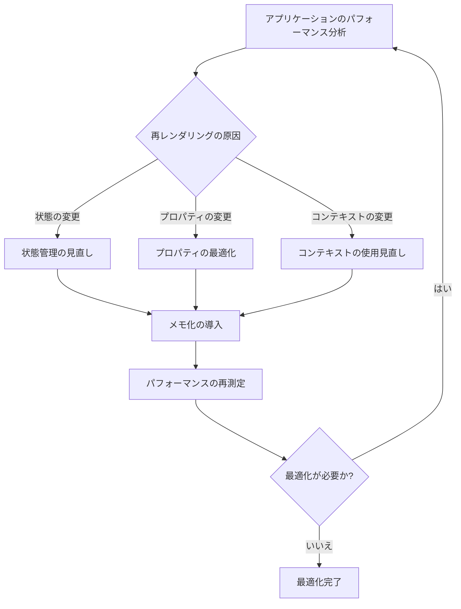

# Reactパフォーマンスチューニング：メモ化とレンダリング最適化の実践ガイド

## はじめに

Reactは、ユーザーインターフェースを構築するための人気のあるライブラリであり、その柔軟性と効率性から多くの開発者に支持されています。しかし、アプリケーションが大規模になるにつれて、パフォーマンスの問題が発生することがあります。特に、不要な再レンダリングや状態管理の不適切な使用は、アプリケーションのパフォーマンスを著しく低下させる要因となります。本記事では、Reactのパフォーマンスを向上させるためのメモ化とレンダリング最適化の手法について詳しく解説します。

### パフォーマンス最適化のフロー

以下のフローチャートは、Reactアプリケーションのパフォーマンス最適化の流れを示しています。これにより、どのようにして最適化を進めるべきかを視覚的に理解することができます。



このフローチャートは、アプリケーションのパフォーマンスを分析し、再レンダリングの原因を特定するプロセスを示しています。状態、プロパティ、コンテキストの変更を見直し、メモ化を導入することで、最終的にパフォーマンスを向上させることができます。

## 1. Reactの再レンダリングの理解

### 1.1 再レンダリングのメカニズム

Reactは、コンポーネントの状態やプロパティが変更されると、再レンダリングを行います。このプロセスは、仮想DOMを使用して効率的に行われますが、頻繁な再レンダリングはパフォーマンスに悪影響を及ぼす可能性があります。再レンダリングが発生する主な要因は以下の通りです。

- **状態の変更**: `setState`や`useState`フックを使用して状態が変更されると、コンポーネントは再レンダリングされます。状態が変更されると、Reactはそのコンポーネントとその子コンポーネントを再評価し、必要に応じて再描画します。これにより、ユーザーインターフェースが最新の状態を反映することができますが、頻繁な状態変更はパフォーマンスに影響を与える可能性があります。

- **プロパティの変更**: 親コンポーネントから渡されるプロパティが変更されると、子コンポーネントも再レンダリングされます。これにより、親からのデータが変わった場合に子コンポーネントが最新の情報を表示できるようになります。特に、リストやテーブルなどのデータを表示するコンポーネントでは、プロパティの変更が頻繁に発生することがあります。

- **コンテキストの変更**: ReactのコンテキストAPIを使用している場合、コンテキストの値が変更されると、関連するコンポーネントが再レンダリングされます。これにより、アプリケーション全体で状態を共有することが可能になりますが、コンテキストの変更が多いと、パフォーマンスに影響を与えることがあります。

### 1.2 再レンダリングの影響

再レンダリングが頻繁に発生すると、以下のような問題が生じることがあります。

- **パフォーマンスの低下**: 不要な再レンダリングは、CPUやメモリのリソースを消費し、アプリケーションの応答性を低下させます。特に、複雑なUIや大量のデータを扱う場合、再レンダリングのコストは無視できません。例えば、数百のコンポーネントが同時に再レンダリングされると、アプリケーション全体のパフォーマンスが著しく低下する可能性があります。

- **ユーザー体験の悪化**: 再レンダリングによる遅延やちらつきは、ユーザーにとって不快な体験となります。特に、モバイルデバイスや低スペックのデバイスでは、パフォーマンスの問題が顕著に現れることがあります。ユーザーがアプリケーションを操作している際に、画面がちらついたり、応答が遅れたりすると、ユーザーの満足度が低下します。

## 2. メモ化の概念

メモ化は、計算結果をキャッシュすることで、同じ入力に対して再計算を避ける手法です。Reactでは、メモ化を使用してコンポーネントの再レンダリングを最適化することができます。

### 2.1 React.memo

`React.memo`は、関数コンポーネントをメモ化するための高階コンポーネントです。これにより、プロパティが変更されない限り、コンポーネントは再レンダリングされません。`React.memo`は、特に再レンダリングのコストが高いコンポーネントに対して有効です。

```javascript
import React from 'react';

const MyComponent = React.memo(({ value }) => {
  console.log('Rendering MyComponent');
  return <div>{value}</div>;
});
```

上記の例では、`MyComponent`は`value`が変更されない限り再レンダリングされません。これにより、パフォーマンスが向上し、無駄な計算を避けることができます。`React.memo`は、プロパティの比較を行うため、複雑なオブジェクトや配列をプロパティとして渡す場合は注意が必要です。デフォルトでは、浅い比較が行われるため、深い比較が必要な場合はカスタム比較関数を提供することができます。

### 2.2 useMemoフック

`useMemo`フックは、計算結果をメモ化するために使用されます。これにより、依存配列に指定された値が変更されない限り、計算が再実行されることを防ぎます。`useMemo`は、特に重い計算を行う場合に有効です。

```javascript
import React, { useMemo } from 'react';

const MyComponent = ({ items }) => {
  const total = useMemo(() => {
    return items.reduce((sum, item) => sum + item, 0);
  }, [items]);

  return <div>Total: {total}</div>;
};
```

この例では、`items`が変更されない限り、合計の計算は再実行されません。これにより、パフォーマンスが向上し、無駄な計算を避けることができます。`useMemo`は、計算結果をキャッシュするため、同じ計算を繰り返す必要がなくなります。ただし、依存配列に指定する値は、正確に指定する必要があります。誤った依存関係を指定すると、意図しない動作を引き起こす可能性があります。

## 3. レンダリング最適化の手法

### 3.1 コンポーネントの分割

大きなコンポーネントを小さなコンポーネントに分割することで、再レンダリングの影響を最小限に抑えることができます。小さなコンポーネントは、必要なときにのみ再レンダリングされるため、パフォーマンスが向上します。例えば、リスト表示のコンポーネントを分割することで、リストの一部が変更された場合でも、全体を再描画する必要がなくなります。

```javascript
const ListItem = React.memo(({ item }) => {
  console.log('Rendering ListItem');
  return <li>{item}</li>;
});

const List = ({ items }) => {
  return (
    <ul>
      {items.map(item => (
        <ListItem key={item.id} item={item} />
      ))}
    </ul>
  );
};
```

この例では、`ListItem`コンポーネントがメモ化されているため、`items`が変更されない限り、リストアイテムは再レンダリングされません。これにより、リスト全体のパフォーマンスが向上します。

### 3.2 shouldComponentUpdateとPureComponent

クラスコンポーネントでは、`shouldComponentUpdate`メソッドをオーバーライドすることで、再レンダリングの条件を制御できます。このメソッドは、コンポーネントが再レンダリングされるべきかどうかを判断するために使用されます。また、`PureComponent`を使用すると、プロパティや状態が変更されない限り自動的に再レンダリングを防ぐことができます。

```javascript
import React, { PureComponent } from 'react';

class MyComponent extends PureComponent {
  render() {
    return <div>{this.props.value}</div>;
  }
}
```

`PureComponent`は、浅い比較を行い、プロパティや状態が変更されていない場合は再レンダリングをスキップします。これにより、パフォーマンスが向上します。`shouldComponentUpdate`メソッドを使用する場合は、カスタムロジックを実装することで、より細かい制御が可能です。

### 3.3 useCallbackフック

`useCallback`フックは、関数をメモ化するために使用されます。これにより、依存配列に指定された値が変更されない限り、関数が再生成されることを防ぎます。特に、子コンポーネントに関数を渡す場合、`useCallback`を使用することで、不要な再レンダリングを防ぐことができます。

```javascript
import React, { useCallback } from 'react';

const MyComponent = ({ onClick }) => {
  const handleClick = useCallback(() => {
    onClick();
  }, [onClick]);

  return <button onClick={handleClick}>Click me</button>;
};
```

この例では、`onClick`が変更されない限り、`handleClick`関数は再生成されません。これにより、子コンポーネントが不必要に再レンダリングされるのを防ぎます。`useCallback`は、特にイベントハンドラやコールバック関数を渡す際に有効です。

## 4. パフォーマンス測定と最適化

### 4.1 React DevTools

React DevToolsを使用すると、コンポーネントの再レンダリングの回数やパフォーマンスを測定できます。これにより、どのコンポーネントがパフォーマンスのボトルネックになっているかを特定できます。DevToolsの「Profiler」タブを使用することで、各コンポーネントのレンダリング時間を視覚的に確認できます。これにより、どのコンポーネントが最も時間を消費しているかを把握し、最適化の手がかりを得ることができます。

### 4.2 Profiler API

ReactのProfiler APIを使用すると、コンポーネントのレンダリング時間を測定し、パフォーマンスを分析できます。Profilerを使用することで、どのコンポーネントが最も時間を消費しているかを把握できます。

```javascript
import React, { Profiler } from 'react';

const onRenderCallback = (id, phase, actualDuration) => {
  console.log({ id, phase, actualDuration });
};

const MyComponent = () => (
  <Profiler id="MyComponent" onRender={onRenderCallback}>
    <div>My Component</div>
  </Profiler>
);
```

この例では、`MyComponent`がレンダリングされるたびに、実際のレンダリング時間がコンソールに出力されます。これにより、パフォーマンスのボトルネックを特定し、最適化の手がかりを得ることができます。

## 5. まとめ

Reactのパフォーマンスを最適化するためには、メモ化やレンダリング最適化の手法を適切に活用することが重要です。再レンダリングのメカニズムを理解し、`React.memo`や`useMemo`、`useCallback`などの機能を利用することで、アプリケーションのパフォーマンスを向上させることができます。また、React DevToolsやProfiler APIを使用して、パフォーマンスを測定し、ボトルネックを特定することも重要です。

これらの手法を実践することで、Reactアプリケーションのパフォーマンスを大幅に改善し、ユーザーに快適な体験を提供することができるでしょう。さらに、パフォーマンスの最適化は一度行えば終わりではなく、アプリケーションの成長や変更に応じて継続的に行う必要があります。最適化の手法を理解し、適切に適用することで、Reactアプリケーションのパフォーマンスを常に最適な状態に保つことができます。

-----

※本記事は生成AIを使用して作成されました。
AI言語モデル: gpt-4o-mini