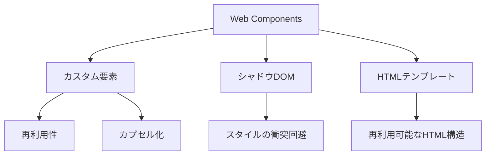

# モダンなWeb Components：Reactとの共存と活用シナリオ

## はじめに

Web開発の世界は急速に進化しており、さまざまな技術が登場しています。その中でも、Web Componentsは、再利用可能なコンポーネントを作成するための強力な手段として注目されています。特に、Reactのようなライブラリと組み合わせることで、開発者はより効率的で柔軟なアプリケーションを構築できるようになります。本記事では、モダンなWeb Componentsの基本概念、Reactとの共存方法、そして具体的な活用シナリオについて詳しく解説します。

## Web Componentsの基本概念

Web Componentsは、カスタム要素、シャドウDOM、HTMLテンプレートの3つの主要な技術から構成されています。これらの技術を使用することで、開発者は独自のHTML要素を作成し、再利用可能なコンポーネントを構築できます。

### カスタム要素

カスタム要素は、開発者が独自のHTMLタグを定義できる機能です。これにより、特定の機能を持つ要素を作成し、他のHTML要素と同様に使用できます。カスタム要素は、JavaScriptのクラスを使用して定義され、`customElements.define`メソッドを使用して登録されます。

```javascript
class MyElement extends HTMLElement {
    constructor() {
        super();
        const shadow = this.attachShadow({ mode: 'open' });
        shadow.innerHTML = `<p>Hello, Web Component!</p>`;
    }
}

customElements.define('my-element', MyElement);
```

この例では、`MyElement`というカスタム要素を定義しています。コンストラクタ内でシャドウDOMを作成し、内部にHTMLを挿入しています。これにより、`<my-element>`タグをHTML内で使用できるようになります。

カスタム要素の利点は、以下の通りです：

- **再利用性**: 一度作成したカスタム要素は、異なるプロジェクトやアプリケーションで再利用できます。
- **カプセル化**: カスタム要素は、内部の実装を隠蔽し、外部からの干渉を防ぎます。
- **拡張性**: 既存のHTML要素を拡張して、新しい機能を持つ要素を作成できます。

### シャドウDOM

シャドウDOMは、カスタム要素の内部構造を隠蔽するための技術です。これにより、スタイルやスクリプトが外部のDOMに影響を与えず、カプセル化されたコンポーネントを作成できます。シャドウDOMを使用することで、スタイルの衝突を避け、コンポーネントの再利用性を高めることができます。

シャドウDOMの利点は、以下の通りです：

- **カプセル化**: コンポーネントの内部スタイルやスクリプトが外部に影響を与えないため、他のコンポーネントやページ全体のスタイルと衝突しません。
- **再利用性**: 一度作成したコンポーネントを、異なるプロジェクトやアプリケーションで再利用できます。
- **メンテナンス性**: コンポーネントの内部構造が隠蔽されているため、変更が容易で、他の部分に影響を与えにくくなります。

シャドウDOMの実装例は以下の通りです：

```javascript
class MyShadowElement extends HTMLElement {
    constructor() {
        super();
        const shadow = this.attachShadow({ mode: 'open' });
        shadow.innerHTML = `
            <style>
                p { color: blue; }
            </style>
            <p>Hello from the Shadow DOM!</p>
        `;
    }
}

customElements.define('my-shadow-element', MyShadowElement);
```

この例では、シャドウDOM内にスタイルを定義し、外部のスタイルに影響を与えないようにしています。

### HTMLテンプレート

HTMLテンプレートは、再利用可能なHTML構造を定義するための機能です。`<template>`タグを使用して、DOMに追加されることなく、HTMLを定義できます。これにより、必要なときにテンプレートをインスタンス化して使用することができます。

```html
<template id="my-template">
    <style>
        p { color: blue; }
    </style>
    <p>Hello from the template!</p>
</template>
```

このテンプレートは、後でJavaScriptを使用してインスタンス化し、DOMに追加することができます。テンプレートを使用することで、同じ構造を何度も記述する必要がなくなり、コードの可読性と保守性が向上します。

テンプレートの使用例は以下の通りです：

```javascript
const template = document.getElementById('my-template');
const clone = document.importNode(template.content, true);
document.body.appendChild(clone);
```

このコードでは、テンプレートをインスタンス化し、DOMに追加しています。

### Web Componentsの全体像

以下のダイアグラムは、Web Componentsの主要な要素とその関係を示しています。カスタム要素、シャドウDOM、HTMLテンプレートがどのように相互作用するかを視覚的に理解するのに役立ちます。



このダイアグラムは、Web Componentsの基本的な構成要素とそれぞれの利点を示しています。これにより、Web Componentsの全体像を把握しやすくなります。

## Reactとの共存

Reactは、コンポーネントベースのライブラリであり、状態管理やライフサイクル管理を提供します。Web ComponentsとReactを組み合わせることで、両者の利点を活かしたアプリケーションを構築できます。

### Web ComponentsをReactで使用する方法

Reactアプリケーション内でWeb Componentsを使用するには、いくつかの手順が必要です。まず、カスタム要素をReactコンポーネントとしてラップする必要があります。これにより、Reactのライフサイクルメソッドを利用しつつ、Web Componentsの機能を活用できます。

```javascript
import React, { useEffect, useRef } from 'react';

const MyWebComponent = () => {
    const ref = useRef(null);

    useEffect(() => {
        // Web Componentの初期化
        const element = document.createElement('my-element');
        ref.current.appendChild(element);

        return () => {
            ref.current.removeChild(element);
        };
    }, []);

    return <div ref={ref}></div>;
};
```

この例では、`MyWebComponent`というReactコンポーネントを作成し、`useEffect`フックを使用してWeb Componentを初期化しています。`ref`を使用してDOM要素にアクセスし、Web Componentを追加しています。コンポーネントがアンマウントされる際には、Web Componentを削除することで、メモリリークを防いでいます。

### Reactのプロパティとイベントの取り扱い

Web Componentsは、Reactのプロパティやイベントを直接受け取ることができません。そのため、ReactからWeb Componentsにプロパティを渡す場合は、`setAttribute`メソッドを使用する必要があります。また、カスタムイベントを使用して、Web ComponentsからReactにイベントを伝えることができます。

```javascript
const MyWebComponent = () => {
    const ref = useRef(null);

    useEffect(() => {
        const element = document.createElement('my-element');
        element.setAttribute('some-prop', 'value');

        element.addEventListener('custom-event', (event) => {
            console.log(event.detail);
        });

        ref.current.appendChild(element);

        return () => {
            ref.current.removeChild(element);
        };
    }, []);

    return <div ref={ref}></div>;
};
```

このコードでは、`some-prop`という属性をWeb Componentに設定し、カスタムイベント`custom-event`をリッスンしています。Reactのイベントシステムと統合するために、カスタムイベントを使用することが重要です。

## 活用シナリオ

Web ComponentsとReactを組み合わせることで、さまざまなシナリオでの活用が可能です。以下にいくつかの具体的な例を示します。

### 1. UIライブラリの構築

Web Componentsを使用して、再利用可能なUIコンポーネントライブラリを構築できます。これにより、異なるプロジェクト間で同じコンポーネントを簡単に共有できます。たとえば、ボタン、モーダル、ダイアログなどのコンポーネントをWeb Componentsとして実装し、Reactアプリケーションで使用することができます。

#### 例: カスタムボタンコンポーネント

```javascript
class CustomButton extends HTMLElement {
    constructor() {
        super();
        const shadow = this.attachShadow({ mode: 'open' });
        const button = document.createElement('button');
        button.textContent = this.getAttribute('label') || 'Click me';
        button.style.backgroundColor = this.getAttribute('color') || 'blue';
        button.style.color = 'white';
        button.style.border = 'none';
        button.style.padding = '10px 20px';
        button.style.cursor = 'pointer';

        shadow.appendChild(button);
    }
}

customElements.define('custom-button', CustomButton);
```

このカスタムボタンは、`label`と`color`属性を受け取り、スタイルを適用します。Reactアプリケーション内でこのボタンを使用することで、統一感のあるUIを実現できます。

### 2. マイクロフロントエンドアーキテクチャ

マイクロフロントエンドアーキテクチャでは、異なるチームが独立して開発したコンポーネントを統合することが求められます。Web Componentsを使用することで、異なるフレームワークやライブラリで開発されたコンポーネントを統一的に扱うことができます。これにより、チーム間の協力が容易になり、開発の効率が向上します。

#### 例: マイクロフロントエンドの統合

異なるチームが開発したWeb ComponentsをReactアプリケーションに統合することで、各チームの専門知識を活かしつつ、全体のアプリケーションを構築できます。たとえば、ユーザー管理、商品表示、カート機能などをそれぞれのチームがWeb Componentsとして実装し、Reactアプリケーションで組み合わせることができます。

### 3. レガシーシステムとの統合

既存のレガシーシステムに新しい機能を追加する際、Web Componentsを使用することで、既存のコードベースに影響を与えずに新しいコンポーネントを導入できます。これにより、段階的な移行が可能になり、リスクを最小限に抑えることができます。

#### 例: レガシーアプリケーションへの新機能追加

レガシーアプリケーションに新しい機能を追加する際、Web Componentsを使用して新しいUIコンポーネントを作成し、既存のアプリケーションに統合することができます。これにより、既存のコードを変更することなく、新しい機能を追加できます。

## 課題と解決策

Web ComponentsとReactを組み合わせる際には、いくつかの課題が存在します。以下に代表的な課題とその解決策を示します。

### 1. パフォーマンスの問題

Web Componentsは、Reactの仮想DOMと異なるDOM操作を行うため、パフォーマンスに影響を与える可能性があります。この問題を解決するためには、必要なときにのみWeb Componentsを生成し、不要な再レンダリングを避けることが重要です。

#### 解決策

- **条件付きレンダリング**: Web Componentsを必要なときにのみレンダリングすることで、パフォーマンスを向上させることができます。
- **メモ化**: Reactの`useMemo`や`React.memo`を使用して、再レンダリングを最小限に抑えることができます。

### 2. スタイルの衝突

Web ComponentsはシャドウDOMを使用してスタイルをカプセル化しますが、Reactのスタイルと衝突する可能性があります。この問題を解決するためには、スタイルを明示的に定義し、必要に応じてCSS変数を使用してスタイルを調整することが有効です。

#### 解決策

- **CSS変数の使用**: Web Components内でCSS変数を使用することで、外部からスタイルを調整できます。
- **スタイルのスコープ**: Web Components内でスタイルを定義する際、特定のクラス名やIDを使用してスタイルのスコープを明確にすることが重要です。

### 3. イベントの取り扱い

Web ComponentsからReactにイベントを伝える際、カスタムイベントを使用する必要があります。これにより、Reactのイベントシステムと統合することができますが、イベントのバブリングやキャプチャリングに注意が必要です。

#### 解決策

- **カスタムイベントの使用**: Web Components内でカスタムイベントを発火し、Reactでリッスンすることで、イベントの伝達を行います。
- **イベントのバブリング**: カスタムイベントをバブリングさせることで、親コンポーネントでイベントをキャッチできるようにします。

## まとめ

モダンなWeb Componentsは、再利用可能なコンポーネントを作成するための強力な手段であり、Reactとの共存が可能です。Web Componentsを使用することで、異なるプロジェクト間でのコンポーネントの共有や、マイクロフロントエンドアーキテクチャの実現が容易になります。課題も存在しますが、適切なアプローチを取ることで、Web ComponentsとReactを効果的に活用することができます。

今後のWeb開発において、Web Componentsはますます重要な役割を果たすでしょう。開発者は、これらの技術を理解し、実践することで、より効率的で柔軟なアプリケーションを構築できるようになります。さらに、Web Componentsの進化に伴い、より多くの機能やライブラリが登場することが期待されます。これにより、開発者は新しい技術を取り入れ、より良いユーザー体験を提供できるようになるでしょう。

-----

※本記事は生成AIを使用して作成されました。
AI言語モデル: gpt-4o-mini