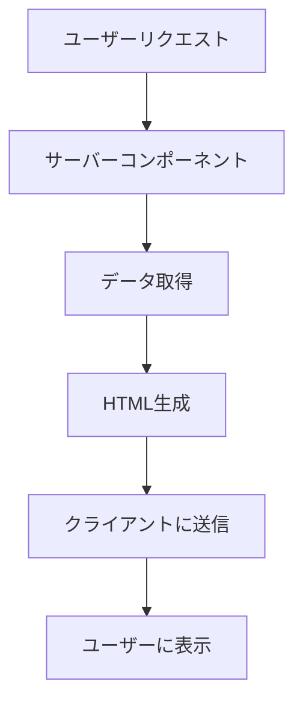

# Next.js 14のサーバーコンポーネント完全解説：SSRとCSRの最適な使い分け

## はじめに

Next.jsは、Reactをベースにしたフレームワークで、サーバーサイドレンダリング（SSR）や静的サイト生成（SSG）など、さまざまなレンダリング手法をサポートしています。2023年にリリースされたNext.js 14では、サーバーコンポーネントの機能が強化され、開発者はより効率的にアプリケーションを構築できるようになりました。本記事では、Next.js 14のサーバーコンポーネントの基本概念、SSRとクライアントサイドレンダリング（CSR）の違い、そしてそれぞれの最適な使い分けについて詳しく解説します。

### サーバーコンポーネントの概要

サーバーコンポーネントは、サーバー上で実行されるReactコンポーネントで、クライアントに送信される前にデータを取得し、HTMLを生成します。これにより、クライアント側でのJavaScriptの実行を減らし、パフォーマンスを向上させることができます。



このフローチャートは、サーバーコンポーネントがどのように機能するかを示しています。ユーザーのリクエストがサーバーコンポーネントに送信され、データを取得し、HTMLを生成してクライアントに送信される流れを視覚化しています。

## Next.js 14の新機能

Next.js 14では、サーバーコンポーネントの導入により、開発者はより効率的にデータを取得し、ページをレンダリングできるようになりました。以下に、サーバーコンポーネントの主な特徴を示します。

### サーバーコンポーネントの特徴

- **データ取得の簡素化**: サーバーコンポーネントは、データを直接取得し、レンダリングすることができます。これにより、クライアント側でのデータ取得の手間が省けます。特に、APIからのデータ取得が必要な場合、サーバーコンポーネントを使用することで、コードがシンプルになります。

- **SEOの向上**: サーバーサイドで生成されたHTMLは、クローラーによって容易にインデックスされるため、SEOに有利です。特に、コンテンツが豊富なページや、特定のキーワードでの検索結果に影響を与えるページにおいて重要です。

- **パフォーマンスの向上**: クライアント側でのJavaScriptの実行が減るため、ページの読み込み速度が向上します。特に、データが多いページでは顕著です。

- **開発体験の向上**: サーバーコンポーネントは、開発者がデータを取得するためのAPIを簡単に利用できるように設計されており、開発体験が向上します。これにより、開発者は迅速に機能を実装でき、プロジェクトの進行がスムーズになります。

## SSRとCSRの違い

### サーバーサイドレンダリング（SSR）

SSRは、リクエストがあるたびにサーバーでページを生成し、クライアントにHTMLを返す手法です。これにより、初回のページロード時に完全なHTMLが提供され、SEOやパフォーマンスの面で利点があります。

#### SSRの利点

- **初回表示速度の向上**: サーバーで生成されたHTMLが直接クライアントに送信されるため、初回表示が速くなります。特に、ユーザーが最初に訪れるページでの体験が向上します。

- **SEOの最適化**: 検索エンジンがページの内容を容易にインデックスできるため、SEOに有利です。特に、製品ページやブログ記事など、検索トラフィックを重視する場合に有効です。

- **ユーザー体験の向上**: 初回表示が速いため、ユーザーはすぐにコンテンツにアクセスでき、離脱率が低下します。これにより、ユーザーの満足度が向上し、サイトのリピート率が高まります。

#### SSRの欠点

- **サーバー負荷の増加**: リクエストごとにページを生成するため、サーバーに負荷がかかります。特にトラフィックが多いサイトでは、サーバーのリソースを圧迫する可能性があります。

- **インタラクティブ性の低下**: ページが完全にロードされるまで、ユーザーはインタラクションできない場合があります。これにより、動的なコンテンツが必要な場合には不便です。

### クライアントサイドレンダリング（CSR）

CSRは、クライアント側でJavaScriptを実行し、ページを生成する手法です。初回のページロード時には最小限のHTMLが提供され、その後JavaScriptが実行されてコンテンツが生成されます。

#### CSRの利点

- **インタラクティブ性の向上**: ページがロードされた後、ユーザーはすぐにインタラクションできます。特に、ユーザーがデータを操作する必要があるアプリケーションでは、CSRが効果的です。

- **サーバー負荷の軽減**: ページの生成がクライアント側で行われるため、サーバーの負荷が軽減されます。これにより、サーバーのリソースを他のリクエストに割り当てることができます。

#### CSRの欠点

- **初回表示速度の低下**: JavaScriptの実行が必要なため、初回表示が遅くなることがあります。特に、ネットワークが遅い環境では顕著です。

- **SEOの課題**: クライアント側で生成されるコンテンツは、検索エンジンによってインデックスされにくい場合があります。特に、動的に生成されるコンテンツが多い場合、SEO対策が難しくなります。

## サーバーコンポーネントの使い方

Next.js 14では、サーバーコンポーネントを簡単に作成できます。以下に、基本的なサーバーコンポーネントの作成方法を示します。

### サーバーコンポーネントの作成

まず、サーバーコンポーネントを作成するためのファイルを作成します。例えば、`app/page.js`というファイルを作成します。

```javascript
// app/page.js
import React from 'react';

const Page = async () => {
  const data = await fetch('https://api.example.com/data');
  const json = await data.json();

  return (
    <div>
      <h1>サーバーコンポーネントの例</h1>
      <pre>{JSON.stringify(json, null, 2)}</pre>
    </div>
  );
};

export default Page;
```

この例では、サーバーコンポーネントがAPIからデータを取得し、そのデータを表示しています。`fetch`関数はサーバー側で実行され、クライアントに送信される前にデータが取得されます。

### サーバーコンポーネントの利点

サーバーコンポーネントを使用することで、以下のような利点があります。

- **データ取得の簡素化**: サーバーコンポーネントは、データを直接取得し、レンダリングすることができます。これにより、クライアント側でのデータ取得の手間が省けます。

- **パフォーマンスの向上**: クライアント側でのJavaScriptの実行が減るため、ページの読み込み速度が向上します。特に、データが多いページでは顕著です。

- **開発の効率化**: サーバーコンポーネントは、データ取得のためのAPIを簡単に利用できるように設計されており、開発者は迅速に機能を実装できます。

## SSRとCSRの最適な使い分け

Next.js 14では、SSRとCSRを適切に使い分けることが重要です。以下に、どのような状況でどちらを選択すべきかを示します。

### SSRを選択すべき場合

- **SEOが重要な場合**: 検索エンジンによるインデックスが必要なページでは、SSRを選択することが推奨されます。特に、製品ページやブログ記事など、検索トラフィックを重視する場合に有効です。

- **初回表示速度が重要な場合**: ユーザーがすぐにコンテンツを確認できることが重要な場合、SSRが適しています。特に、ユーザーが最初に訪れるページでの体験が向上します。

- **データが頻繁に変わらない場合**: データが比較的静的である場合、SSRを使用することで、サーバー側でのキャッシュを活用し、パフォーマンスを向上させることができます。

### CSRを選択すべき場合

- **インタラクティブなアプリケーション**: ユーザーが頻繁にインタラクションを行うアプリケーションでは、CSRが適しています。特に、ダッシュボードやチャットアプリなど、リアルタイムでのデータ更新が必要な場合に有効です。

- **サーバー負荷を軽減したい場合**: サーバーの負荷を軽減したい場合、CSRを選択することが有効です。特に、トラフィックが多いサイトでは、クライアント側での処理を増やすことで、サーバーのリソースを節約できます。

- **ユーザー体験を重視する場合**: ユーザーがすぐに操作できることが重要な場合、CSRを選択することで、インタラクティブな体験を提供できます。

## 具体的な使用例

### SSRの使用例

例えば、ブログサイトを構築する場合、各記事のページはSEOが重要です。このため、SSRを使用して、各記事の内容をサーバー側で生成し、クライアントに送信します。

```javascript
// app/posts/[id].js
import React from 'react';

const Post = async ({ params }) => {
  const res = await fetch(`https://api.example.com/posts/${params.id}`);
  const post = await res.json();

  return (
    <div>
      <h1>{post.title}</h1>
      <p>{post.content}</p>
    </div>
  );
};

export default Post;
```

この例では、特定のブログ記事を取得し、その内容を表示しています。`params.id`を使用して、URLから記事のIDを取得し、APIからデータを取得しています。

### CSRの使用例

一方、ダッシュボードのようなインタラクティブなアプリケーションでは、CSRを使用することが適しています。ユーザーがデータをフィルタリングしたり、リアルタイムで更新したりする場合、CSRが効果的です。

```javascript
// app/dashboard.js
import React, { useEffect, useState } from 'react';

const Dashboard = () => {
  const [data, setData] = useState([]);

  useEffect(() => {
    const fetchData = async () => {
      const res = await fetch('https://api.example.com/dashboard');
      const json = await res.json();
      setData(json);
    };

    fetchData();
  }, []);

  return (
    <div>
      <h1>ダッシュボード</h1>
      <ul>
        {data.map(item => (
          <li key={item.id}>{item.name}</li>
        ))}
      </ul>
    </div>
  );
};

export default Dashboard;
```

この例では、ダッシュボードのデータをAPIから取得し、リストとして表示しています。`useEffect`フックを使用して、コンポーネントがマウントされたときにデータを取得しています。

## サーバーコンポーネントのベストプラクティス

Next.js 14のサーバーコンポーネントを使用する際のベストプラクティスを以下に示します。

### 1. データ取得の最適化

サーバーコンポーネントでは、データ取得を最適化することが重要です。必要なデータのみを取得し、不要なリクエストを避けるようにしましょう。これにより、サーバーの負荷を軽減し、パフォーマンスを向上させることができます。

### 2. エラーハンドリング

APIからのデータ取得時には、エラーハンドリングを行うことが重要です。適切なエラーメッセージを表示し、ユーザーに情報を提供しましょう。以下は、エラーハンドリングの例です。

```javascript
const Page = async () => {
  try {
    const data = await fetch('https://api.example.com/data');
    if (!data.ok) throw new Error('データ取得に失敗しました');
    const json = await data.json();

    return (
      <div>
        <h1>サーバーコンポーネントの例</h1>
        <pre>{JSON.stringify(json, null, 2)}</pre>
      </div>
    );
  } catch (error) {
    return <div>{error.message}</div>;
  }
};
```

### 3. コンポーネントの分割

大きなコンポーネントは、適切に分割して再利用性を高めましょう。これにより、コードの可読性が向上し、メンテナンスが容易になります。特に、サーバーコンポーネントとクライアントコンポーネントを明確に分けることで、役割を明確にし、開発効率を向上させることができます。

### 4. キャッシュの活用

データ取得の際には、キャッシュを活用することで、パフォーマンスを向上させることができます。特に、頻繁に変更されないデータに対しては、キャッシュを利用することで、サーバーへのリクエストを減らすことができます。

## まとめ

Next.js 14のサーバーコンポーネントは、SSRとCSRの最適な使い分けを可能にし、開発者にとって強力なツールとなります。サーバーコンポーネントを活用することで、データ取得の簡素化、SEOの向上、パフォーマンスの改善が実現できます。SSRとCSRの特性を理解し、適切な場面で使い分けることで、より良いユーザー体験を提供できるでしょう。

今後のNext.jsの進化に注目し、最新の機能を活用して、より効率的なアプリケーション開発を行っていきましょう。

-----

※本記事は生成AIを使用して作成されました。
AI言語モデル: gpt-4o-mini