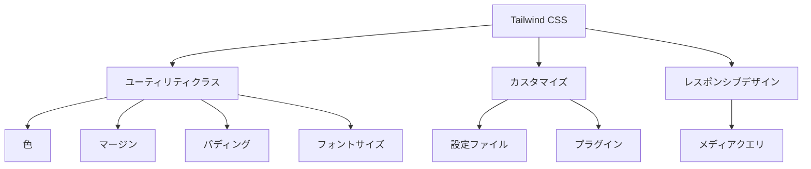

# Tailwind CSSマスターガイド：カスタマイズと大規模プロジェクトでの運用テクニック

## はじめに

Tailwind CSSは、ユーティリティファーストなCSSフレームワークとして、開発者の間で急速に人気を集めています。従来のCSSフレームワークとは異なり、Tailwindは事前に定義されたコンポーネントを提供するのではなく、クラスを組み合わせてスタイルを構築するアプローチを取ります。このアプローチにより、開発者はデザインの自由度が高まり、プロジェクトのニーズに応じたカスタマイズが容易になります。

本記事では、Tailwind CSSの基本から始め、カスタマイズ方法や大規模プロジェクトでの運用テクニックについて詳しく解説します。具体的なコード例や実践的なアドバイスを交えながら、Tailwind CSSをマスターするためのガイドを提供します。

### Tailwind CSSの全体像

以下のダイアグラムは、Tailwind CSSの基本的な構成要素とその関係を示しています。これにより、Tailwind CSSがどのように機能し、どのようにプロジェクトに統合されるかを視覚的に理解できます。



このダイアグラムは、Tailwind CSSの主要な機能を示しており、ユーティリティクラス、カスタマイズ、レスポンシブデザインの各要素がどのように相互に関連しているかを視覚的に表現しています。

## Tailwind CSSの基本

### Tailwind CSSとは？

Tailwind CSSは、ユーティリティファーストなCSSフレームワークで、開発者が迅速にスタイリングを行うためのツールです。Tailwindは、以下のような特徴を持っています。

- **ユーティリティファースト**: 小さなクラスを組み合わせてスタイルを構築します。これにより、CSSの冗長性を減らし、スタイルの一貫性を保つことができます。例えば、`bg-blue-500`や`text-white`などのクラスを組み合わせることで、迅速にデザインを適用できます。
  
- **カスタマイズ性**: 設定ファイルを通じて、デフォルトのスタイルを簡単に変更できます。これにより、プロジェクトのブランドやデザインガイドラインに合わせたスタイルを適用できます。Tailwindの設定ファイル（`tailwind.config.js`）を編集することで、色やフォント、スペーシングなどを自由にカスタマイズできます。

- **レスポンシブデザイン**: メディアクエリを簡単に適用できるクラスが用意されています。これにより、異なるデバイスや画面サイズに対応したデザインを迅速に構築できます。例えば、`md:bg-red-500`のように、特定の画面サイズで異なるスタイルを適用することができます。

### Tailwind CSSのインストール

Tailwind CSSをプロジェクトに導入するには、以下の手順を実行します。

1. **Node.jsのインストール**: Tailwind CSSはNode.jsを使用してビルドされるため、まずNode.jsをインストールします。Node.jsは公式サイトからダウンロードできます。

2. **プロジェクトの作成**: 新しいプロジェクトを作成し、ディレクトリに移動します。

   ```bash
   mkdir my-project
   cd my-project
   ```

3. **Tailwind CSSのインストール**: npmを使用してTailwind CSSをインストールします。

   ```bash
   npm install tailwindcss
   ```

4. **Tailwindの設定ファイルを生成**: Tailwindの設定ファイルを生成します。

   ```bash
   npx tailwindcss init
   ```

5. **CSSファイルの作成**: Tailwindのディレクティブを含むCSSファイルを作成します。

   ```css
   /* styles.css */
   @tailwind base;
   @tailwind components;
   @tailwind utilities;
   ```

6. **ビルドプロセスの設定**: Tailwind CSSをビルドするためのスクリプトをpackage.jsonに追加します。

   ```json
   "scripts": {
     "build": "tailwindcss build styles.css -o output.css"
   }
   ```

7. **ビルドの実行**: 以下のコマンドでCSSをビルドします。

   ```bash
   npm run build
   ```

### 基本的なユーティリティクラス

Tailwind CSSでは、さまざまなユーティリティクラスが用意されています。以下は、一般的に使用されるユーティリティクラスの例です。

- **色**: `bg-blue-500`、`text-white`など、背景色や文字色を簡単に設定できます。Tailwindでは、色のバリエーションが豊富に用意されており、`bg-red-100`から`bg-red-900`までのグラデーションを簡単に適用できます。

- **マージン**: `m-4`、`mt-2`など、要素の外側の余白を設定します。Tailwindでは、マージンのサイズを`0`から`64`までのスケールで指定でき、`m-0`から`m-64`までのクラスが用意されています。

- **パディング**: `p-4`、`px-2`など、要素の内側の余白を設定します。これにより、要素の内容と境界の間にスペースを作ることができます。

- **フォントサイズ**: `text-lg`、`text-sm`など、フォントのサイズを調整します。Tailwindでは、フォントサイズもスケールで指定でき、`text-xs`から`text-9xl`までのクラスが用意されています。

これらのクラスを組み合わせることで、迅速にスタイリングを行うことができます。例えば、以下のようにHTML要素にクラスを適用することで、簡単にスタイルを設定できます。

```html
<div class="bg-blue-500 text-white p-4 rounded-lg">
  Tailwind CSSの基本的なスタイル
</div>
```

## Tailwind CSSのカスタマイズ

### 設定ファイルの編集

Tailwind CSSの設定ファイル（`tailwind.config.js`）を編集することで、デフォルトのスタイルをカスタマイズできます。以下は、カスタマイズの例です。

```javascript
// tailwind.config.js
module.exports = {
  theme: {
    extend: {
      colors: {
        customColor: '#1c1c1e',
      },
      spacing: {
        '128': '32rem',
      },
    },
  },
  variants: {},
  plugins: [],
}
```

この設定により、新しい色やスペーシングを追加できます。`extend`オプションを使用することで、デフォルトの設定を上書きすることなく、新しいスタイルを追加できます。

### プラグインの利用

Tailwind CSSは、プラグインを使用して機能を拡張できます。例えば、`@tailwindcss/forms`プラグインを使用すると、フォーム要素のスタイルを簡単にカスタマイズできます。

```bash
npm install @tailwindcss/forms
```

次に、設定ファイルにプラグインを追加します。

```javascript
// tailwind.config.js
module.exports = {
  plugins: [
    require('@tailwindcss/forms'),
  ],
}
```

このプラグインを使用することで、フォーム要素に対して一貫したスタイルを適用でき、ユーザーエクスペリエンスを向上させることができます。例えば、`<input>`要素に対して、デフォルトでスタイリングが適用され、開発者は追加のCSSを書く必要がなくなります。

### カスタムユーティリティの作成

Tailwind CSSでは、独自のユーティリティクラスを作成することも可能です。以下は、カスタムユーティリティの例です。

```javascript
// tailwind.config.js
module.exports = {
  theme: {
    extend: {
      spacing: {
        '72': '18rem',
      },
    },
  },
  plugins: [
    function({ addUtilities }) {
      const newUtilities = {
        '.skew-10deg': {
          transform: 'skewY(-10deg)',
        },
      }
      addUtilities(newUtilities, ['responsive', 'hover']);
    },
  ],
}
```

この例では、`skew-10deg`というカスタムユーティリティを追加しています。このユーティリティを使用することで、要素を傾けたスタイルを簡単に適用できます。カスタムユーティリティを作成することで、プロジェクトの特定のニーズに応じたスタイルを追加できます。

## 大規模プロジェクトでの運用テクニック

### コンポーネントの設計

大規模プロジェクトでは、再利用可能なコンポーネントを設計することが重要です。Tailwind CSSを使用して、コンポーネントを作成する際のポイントは以下の通りです。

- **ユーティリティクラスの組み合わせ**: コンポーネントのスタイルをユーティリティクラスで定義します。これにより、スタイルの一貫性を保ちながら、迅速にデザインを構築できます。例えば、ボタンコンポーネントを作成する場合、以下のように定義できます。

```html
<!-- Button Component -->
<button class="bg-blue-500 text-white font-bold py-2 px-4 rounded hover:bg-blue-700">
  ボタン
</button>
```

- **コンポーネントの分離**: 各コンポーネントを独立したファイルに分け、管理しやすくします。これにより、コードの可読性が向上し、メンテナンスが容易になります。例えば、Reactを使用している場合、各コンポーネントを別々のファイルに分けることで、再利用性が高まります。

### JITモードの活用

Tailwind CSSのJIT（Just-In-Time）モードを使用すると、必要なスタイルのみを生成することができ、ビルドサイズを削減できます。JITモードを有効にするには、設定ファイルを以下のように変更します。

```javascript
// tailwind.config.js
module.exports = {
  mode: 'jit',
  purge: ['./src/**/*.{js,jsx,ts,tsx}', './public/index.html'],
  theme: {
    extend: {},
  },
  variants: {},
  plugins: [],
}
```

JITモードを使用することで、開発中に使用されていないスタイルが生成されず、ビルド時間が短縮されます。また、必要なスタイルが即座に生成されるため、開発効率が向上します。特に大規模なプロジェクトでは、JITモードを活用することで、パフォーマンスを大幅に向上させることができます。

### パフォーマンスの最適化

大規模プロジェクトでは、パフォーマンスの最適化が重要です。以下のテクニックを活用して、パフォーマンスを向上させましょう。

- **不要なスタイルの削除**: `purge`オプションを使用して、使用されていないスタイルを削除します。これにより、最終的なCSSファイルのサイズを小さく保つことができます。特に、プロダクションビルドでは、`purge`を適切に設定することが重要です。

- **CDNの利用**: Tailwind CSSをCDNから読み込むことで、初期ロード時間を短縮できます。特に、プロトタイプや小規模なプロジェクトでは、CDNを利用することで迅速にスタイルを適用できます。CDNを使用する場合、以下のようにHTMLにリンクを追加します。

```html
<link href="https://cdn.jsdelivr.net/npm/tailwindcss@2.2.19/dist/tailwind.min.css" rel="stylesheet">
```

### テストとデバッグ

Tailwind CSSを使用したプロジェクトでは、テストとデバッグが重要です。以下のツールを活用して、スタイルの確認やデバッグを行いましょう。

- **ブラウザの開発者ツール**: スタイルの適用状況を確認し、問題を特定します。特に、要素のスタイルが正しく適用されているかを確認するために、要素の検査機能を活用します。これにより、CSSの競合や誤ったスタイルの適用を迅速に特定できます。

- **Tailwind CSS IntelliSense**: VSCodeの拡張機能を使用して、Tailwind CSSのクラスを補完します。これにより、クラス名を手動で入力する手間が省け、開発効率が向上します。IntelliSenseを使用することで、クラス名の候補が表示され、正確なクラス名を簡単に選択できます。

## まとめ

Tailwind CSSは、ユーティリティファーストなアプローチにより、開発者に高い自由度とカスタマイズ性を提供します。本記事では、Tailwind CSSの基本からカスタマイズ方法、大規模プロジェクトでの運用テクニックまでを詳しく解説しました。これらの知識を活用することで、効率的かつ効果的にプロジェクトを進めることができるでしょう。

Tailwind CSSをマスターするためには、実際に手を動かしてプロジェクトを構築することが重要です。ぜひ、この記事を参考にして、Tailwind CSSを活用した開発を楽しんでください。

-----

※本記事は生成AIを使用して作成されました。
AI言語モデル: gpt-4o-mini