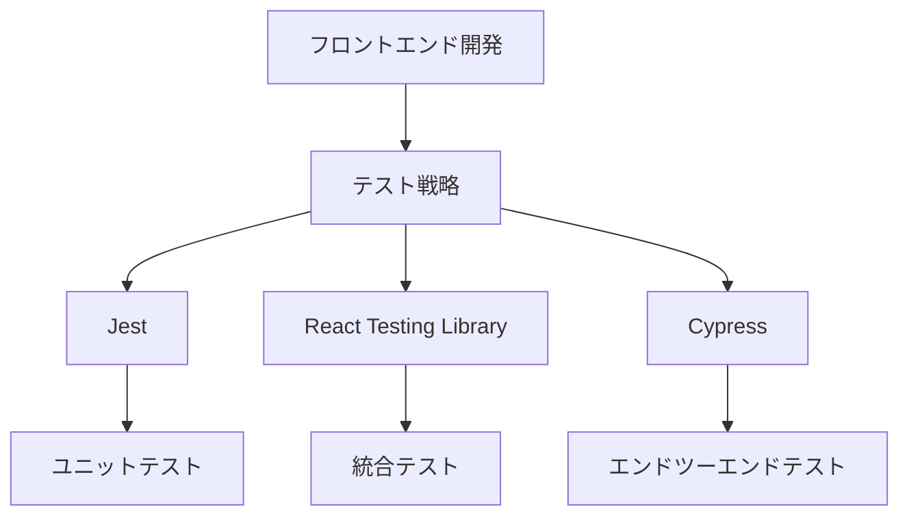

# フロントエンドのテスト戦略2024：Jest、React Testing Library、Cypressの使い分け

## はじめに

フロントエンド開発において、テストは品質保証の重要な要素です。特に、ユーザーインターフェース（UI）の複雑さが増す中で、テスト戦略の選定はますます重要になっています。2024年において、Jest、React Testing Library、Cypressは、フロントエンドテストの主要なツールとして広く使用されています。本記事では、これらのツールの特性、使い分けのポイント、実践的な例を通じて、効果的なテスト戦略を構築する方法を探ります。



このフローチャートは、フロントエンド開発におけるテスト戦略の全体像を示しています。テスト戦略は、Jest、React Testing Library、Cypressの3つの主要なツールに分かれ、それぞれが異なるテストの種類に対応しています。

## 1. Jestの概要

### 1.1 Jestとは

Jestは、Facebookが開発したJavaScriptのテストフレームワークで、特にReactアプリケーションのテストに最適化されています。Jestは、スナップショットテスト、モック機能、非同期テストのサポートなど、多くの機能を提供しています。Jestは、設定が簡単で、デフォルトで多くの機能が有効になっているため、開発者はすぐにテストを始めることができます。

### 1.2 Jestの特徴

- **スナップショットテスト**: コンポーネントの出力を保存し、将来の変更と比較することで、UIの変更を簡単に検出できます。これにより、意図しない変更を早期に発見することが可能です。スナップショットは、特にUIコンポーネントの変更を追跡するのに役立ちます。
  
- **モック機能**: 外部依存関係をモックすることで、テストの独立性を保ちます。これにより、テストが他の部分に影響されることなく、特定の機能を検証できます。モックを使用することで、API呼び出しやデータベースアクセスをシミュレートし、テストの実行速度を向上させることができます。

- **非同期テストのサポート**: Promiseやasync/awaitを使用した非同期コードのテストが容易です。これにより、API呼び出しやタイマーを使用するコードのテストが簡単になります。Jestは、非同期テストのための便利なメソッドを提供しており、テストの記述が直感的です。

### 1.3 Jestの基本的な使い方

以下は、Jestを使用した簡単なテストの例です。

```javascript
// sum.js
function sum(a, b) {
  return a + b;
}
module.exports = sum;

// sum.test.js
const sum = require('./sum');

test('adds 1 + 2 to equal 3', () => {
  expect(sum(1, 2)).toBe(3);
});
```

この例では、`sum`関数が正しく動作するかどうかをテストしています。Jestは、テストの実行結果をコンソールに出力し、成功したテストと失敗したテストを明確に示します。テストの実行は、コマンドラインから簡単に行うことができ、開発者は迅速にフィードバックを得ることができます。

## 2. React Testing Libraryの概要

### 2.1 React Testing Libraryとは

React Testing Libraryは、Reactコンポーネントのテストを容易にするためのライブラリです。ユーザーの視点からコンポーネントをテストすることに重点を置いており、実際のユーザーがどのようにアプリケーションを使用するかを模倣します。これにより、開発者はコンポーネントの実際の使用状況に基づいたテストを作成できます。

### 2.2 React Testing Libraryの特徴

- **ユーザー中心のテスト**: DOMの構造や実装の詳細に依存せず、ユーザーが実際に行う操作に基づいてテストを記述します。これにより、テストがより信頼性の高いものになります。ユーザーの操作を模倣することで、実際の使用状況に近いテストが可能です。

- **簡潔なAPI**: シンプルで直感的なAPIを提供し、テストの可読性を向上させます。例えば、`getByText`や`getByRole`などのクエリを使用して、要素を簡単に取得できます。これにより、テストの記述が迅速かつ効率的になります。

### 2.3 React Testing Libraryの基本的な使い方

以下は、React Testing Libraryを使用したコンポーネントのテストの例です。

```javascript
// MyComponent.js
import React from 'react';

const MyComponent = ({ onClick }) => (
  <button onClick={onClick}>Click me</button>
);

export default MyComponent;

// MyComponent.test.js
import React from 'react';
import { render, fireEvent } from '@testing-library/react';
import MyComponent from './MyComponent';

test('calls onClick prop when clicked', () => {
  const handleClick = jest.fn();
  const { getByText } = render(<MyComponent onClick={handleClick} />);
  
  fireEvent.click(getByText('Click me'));
  
  expect(handleClick).toHaveBeenCalledTimes(1);
});
```

この例では、ボタンがクリックされたときに`onClick`プロパティが呼び出されることをテストしています。React Testing Libraryは、ユーザーの操作を模倣するための便利なメソッドを提供しており、テストの記述が容易です。テストの実行結果は、コンソールに出力され、成功したテストと失敗したテストが明確に示されます。

## 3. Cypressの概要

### 3.1 Cypressとは

Cypressは、エンドツーエンド（E2E）テストを行うための強力なツールです。ブラウザ内で直接テストを実行し、ユーザーの操作を模倣することで、アプリケーションの全体的な動作を確認します。Cypressは、開発者がテストを簡単に作成し、実行できるように設計されています。

### 3.2 Cypressの特徴

- **リアルタイムのテスト実行**: テストが実行される様子をリアルタイムで確認でき、デバッグが容易です。Cypressのダッシュボードでは、テストの進行状況や結果を視覚的に確認できます。これにより、テストの失敗時に迅速に問題を特定し、修正することが可能です。

- **強力なAPI**: DOM操作やアサーションを簡単に行えるAPIを提供します。Cypressは、jQueryのようなセレクタを使用して要素を取得し、操作することができます。これにより、複雑なユーザーインターフェースのテストも容易になります。

### 3.3 Cypressの基本的な使い方

以下は、Cypressを使用したE2Eテストの例です。

```javascript
// cypress/integration/my_component_spec.js
describe('MyComponent', () => {
  it('should call onClick when button is clicked', () => {
    cy.visit('http://localhost:3000'); // アプリケーションのURL
    cy.get('button').click();
    cy.get('button').should('have.class', 'active'); // クリック後の状態を確認
  });
});
```

この例では、ボタンがクリックされたときの動作をテストしています。Cypressは、テストの実行中にブラウザを自動的に操作し、結果をリアルタイムで表示します。これにより、開発者はテストの進行状況を視覚的に確認でき、問題が発生した場合には迅速に対応できます。

## 4. Jest、React Testing Library、Cypressの使い分け

### 4.1 テストの種類による使い分け

- **ユニットテスト**: Jestを使用して、個々の関数やコンポーネントの動作を確認します。ユニットテストは、最も基本的なテストであり、個々の機能が正しく動作するかを確認するために重要です。ユニットテストは、開発の初期段階で実施されることが多く、迅速なフィードバックを提供します。

- **統合テスト**: React Testing Libraryを使用して、複数のコンポーネントが連携して動作するかを確認します。統合テストは、コンポーネント間の相互作用を検証するために必要です。これにより、アプリケーションの全体的な動作を確認し、バグを早期に発見することができます。

- **エンドツーエンドテスト**: Cypressを使用して、アプリケーション全体の動作を確認します。E2Eテストは、ユーザーがアプリケーションを使用する際のフローを確認するために重要です。これにより、実際のユーザーの視点からアプリケーションの動作を検証できます。

### 4.2 テストの実行速度

ユニットテストは最も速く、次に統合テスト、最後にエンドツーエンドテストが続きます。開発の初期段階では、ユニットテストを重視し、後に統合テストやE2Eテストを追加するのが一般的です。テストの実行速度を考慮し、必要に応じてテストの種類を選択することが重要です。特に、CI/CDパイプラインにおいては、テストの実行速度がリリースサイクルに大きな影響を与えるため、効率的なテスト戦略が求められます。

### 4.3 テストのメンテナンス性

テストが増えると、メンテナンスが難しくなることがあります。テストの可読性を保つために、テストケースを明確にし、適切な命名規則を使用することが重要です。また、テストの失敗時には、エラーメッセージを明確にし、問題の特定を容易にすることが求められます。テストのメンテナンス性を向上させるためには、テストコードのリファクタリングや、テストの整理を定期的に行うことが推奨されます。

## 5. 2024年のテスト戦略のトレンド

### 5.1 テスト自動化の進化

テスト自動化は、開発プロセスの効率を向上させるための重要な要素です。2024年には、CI/CDパイプラインにおけるテストの自動化がさらに進化し、開発者はより迅速にフィードバックを受け取ることができるようになるでしょう。自動化されたテストは、手動テストに比べてエラーを減少させ、リリースサイクルを短縮します。特に、テストの自動化は、アジャイル開発やDevOpsの実践において不可欠な要素となっています。

### 5.2 テストのカバレッジと品質

テストのカバレッジを測定し、品質を向上させるためのツールが増加しています。これにより、開発者はどの部分がテストされていないかを把握し、必要なテストを追加することができます。カバレッジツールを使用することで、テストの網羅性を確認し、品質を向上させることが可能です。テストカバレッジの指標を定期的に確認し、目標を設定することで、テストの品質を継続的に改善することができます。

### 5.3 ユーザーエクスペリエンスの重視

ユーザーエクスペリエンス（UX）を重視したテストが増加しています。実際のユーザーの行動を模倣することで、よりリアルなテストが可能になります。UXテストは、ユーザーがアプリケーションをどのように使用するかを理解し、改善点を見つけるために重要です。ユーザーのフィードバックを取り入れたテスト戦略を構築することで、アプリケーションの使いやすさを向上させることができます。

## 6. まとめ

フロントエンドのテスト戦略は、Jest、React Testing Library、Cypressの3つのツールを適切に使い分けることで、効果的に構築できます。ユニットテスト、統合テスト、エンドツーエンドテストを組み合わせることで、アプリケーションの品質を高めることができます。2024年においては、テスト自動化の進化やユーザーエクスペリエンスの重視がトレンドとなるでしょう。これらのツールを活用し、効果的なテスト戦略を構築することが、フロントエンド開発における成功の鍵となります。

-----

※本記事は生成AIを使用して作成されました。
AI言語モデル: gpt-4o-mini