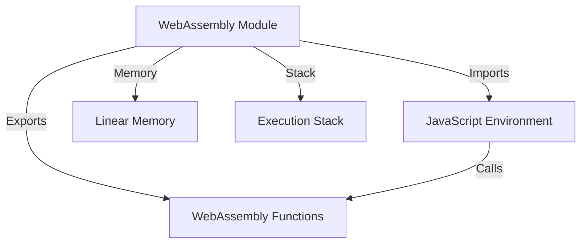
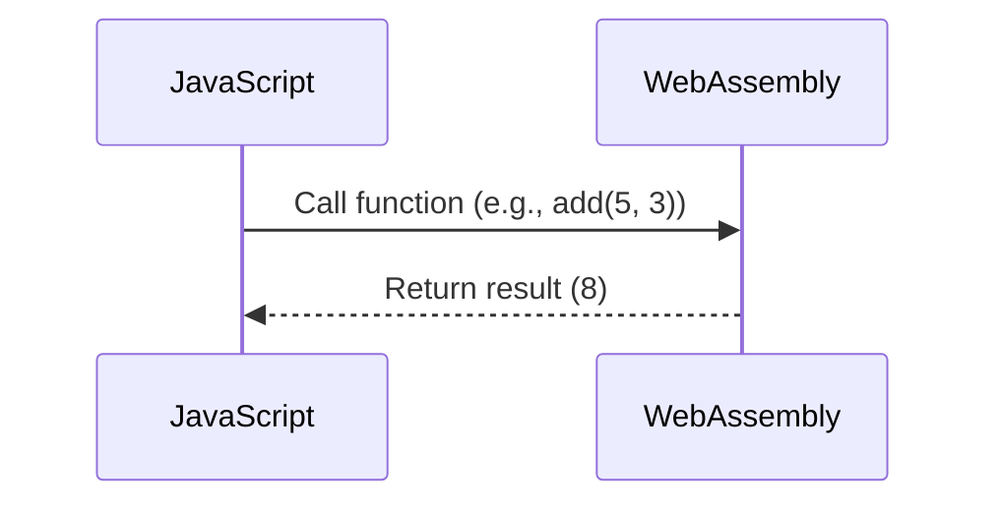

# WebAssemblyとJavaScript：フロントエンドパフォーマンスの新境地

## はじめに

Web開発の世界は急速に進化しており、特にフロントエンド技術においては、パフォーマンスの向上が常に求められています。JavaScriptは長年にわたり、ウェブアプリケーションの主要なプログラミング言語として君臨してきましたが、最近ではWebAssembly（Wasm）が登場し、フロントエンド開発に新たな可能性をもたらしています。本記事では、WebAssemblyとJavaScriptの関係、両者の利点、実際の使用例、そして今後の展望について詳しく解説します。

## WebAssemblyとは？

WebAssemblyは、ブラウザ上で高性能なアプリケーションを実行するための新しいバイナリフォーマットです。Wasmは、C、C++、Rustなどの言語で書かれたコードをコンパイルして生成され、JavaScriptと同様にブラウザで実行できます。これにより、開発者はパフォーマンスが求められるアプリケーションを効率的に構築できるようになります。

### WebAssemblyの特徴

1. **高いパフォーマンス**: WebAssemblyはバイナリ形式であるため、JavaScriptよりも高速に実行されます。これは、コンパイルされたコードが直接CPUで実行されるためです。特に、計算集約型のタスクにおいては、Wasmが優れたパフォーマンスを発揮します。例えば、数値計算や画像処理などのアプリケーションでは、Wasmを使用することで処理速度が大幅に向上します。

2. **言語の多様性**: C、C++、Rustなど、さまざまなプログラミング言語からコンパイル可能であり、開発者は自分の得意な言語を使用できます。これにより、既存のコードベースを活用しやすくなります。たとえば、C++で書かれたゲームエンジンをWebAssemblyにコンパイルすることで、ブラウザ上で高性能なゲームを実行できるようになります。

3. **セキュリティ**: WebAssemblyはサンドボックス環境で実行されるため、セキュリティが強化されています。これにより、悪意のあるコードがシステムにアクセスするリスクが低減します。Wasmは、メモリ安全性を確保するための設計がなされており、バッファオーバーフローやメモリリークのリスクを軽減します。

4. **ブラウザ互換性**: 主要なブラウザ（Chrome、Firefox、Safari、Edge）でサポートされており、広範な互換性があります。これにより、開発者は特定のブラウザに依存せずにアプリケーションを展開できます。さらに、WebAssemblyは、将来的に新しいブラウザやプラットフォームが登場しても、互換性を保つことが期待されています。

### WebAssemblyのアーキテクチャ

WebAssemblyのアーキテクチャは、モジュール、メモリ、スタック、エクスポート、インポートなどの要素で構成されています。以下のダイアグラムは、WebAssemblyの基本的なアーキテクチャを示しています。



このダイアグラムは、WebAssemblyモジュールがJavaScript環境とどのように相互作用するかを示しています。モジュールは、JavaScriptからのインポートを受け入れ、関数をエクスポートします。また、モジュールはメモリとスタックを持ち、実行時にこれらを使用します。

## JavaScriptの役割

JavaScriptは、ウェブページにインタラクティブな要素を追加するためのスクリプト言語です。DOM操作、イベント処理、AJAXリクエストなど、フロントエンド開発において不可欠な役割を果たしています。JavaScriptは動的型付け言語であり、開発者は迅速にプロトタイプを作成し、変更を加えることができます。

### JavaScriptの特徴

1. **動的型付け**: 変数の型を明示的に指定する必要がなく、柔軟なコーディングが可能です。これにより、開発者は迅速にコードを記述し、変更を加えることができます。動的型付けは、特にプロトタイピングやアジャイル開発において有用です。

2. **非同期処理**: Promiseやasync/awaitを使用することで、非同期処理を簡潔に記述できます。これにより、ユーザーインターフェースがスムーズに動作し、ユーザー体験が向上します。非同期処理は、APIからのデータ取得やユーザーの入力待ちなど、さまざまなシナリオで重要です。

3. **豊富なライブラリとフレームワーク**: React、Vue.js、Angularなど、多くのライブラリやフレームワークが存在し、開発を効率化します。これらのツールは、開発者が迅速にアプリケーションを構築できるように設計されています。特に、ReactやVue.jsはコンポーネントベースのアプローチを採用しており、再利用性が高いコードを書くことができます。

4. **広範なコミュニティ**: JavaScriptは非常に人気があり、活発なコミュニティが存在するため、情報やリソースが豊富です。これにより、開発者は問題解決のためのサポートを受けやすくなります。コミュニティの活動は、オープンソースプロジェクトやチュートリアル、フォーラムなどを通じて行われています。

## WebAssemblyとJavaScriptの連携

WebAssemblyとJavaScriptは、互いに補完し合う関係にあります。WebAssemblyは計算集約型のタスクを効率的に処理し、JavaScriptはユーザーインターフェースや非同期処理を担当します。この連携により、開発者はパフォーマンスと使いやすさの両方を享受できます。

### 連携の方法

WebAssemblyをJavaScriptから呼び出す方法は非常にシンプルです。以下は、WebAssemblyモジュールをJavaScriptで読み込み、関数を呼び出す基本的な例です。

```javascript
// WebAssemblyモジュールを読み込む
const loadWasm = async () => {
    const response = await fetch('module.wasm');
    const buffer = await response.arrayBuffer();
    const module = await WebAssembly.instantiate(buffer);
    return module.instance;
};

// WebAssembly関数を呼び出す
loadWasm().then(instance => {
    const result = instance.exports.add(5, 3);
    console.log(result); // 8
});
```

この例では、`module.wasm`というWebAssemblyモジュールを読み込み、`add`という関数を呼び出しています。WebAssemblyの関数は、JavaScriptから簡単にアクセスできるため、開発者は両者の利点を活かすことができます。

### WebAssemblyとJavaScriptの相互作用

WebAssemblyとJavaScriptの相互作用を示すシーケンス図を以下に示します。この図は、WebAssemblyモジュールがJavaScriptから呼び出され、結果が返される流れを視覚化しています。



このシーケンス図は、JavaScriptがWebAssemblyモジュールの関数を呼び出し、結果を受け取る流れを示しています。これにより、開発者は両者の連携を理解しやすくなります。

## WebAssemblyの利点

WebAssemblyを使用することで、フロントエンドアプリケーションのパフォーマンスを大幅に向上させることができます。以下に、具体的な利点をいくつか挙げます。

### 1. パフォーマンスの向上

WebAssemblyは、特に計算集約型のタスクにおいて、JavaScriptよりも優れたパフォーマンスを発揮します。例えば、ゲームエンジンや画像処理、データ解析などのアプリケーションでは、Wasmを使用することで処理速度が向上します。具体的には、Wasmはバイナリ形式であるため、ブラウザがコードを解釈する時間が短縮され、実行速度が向上します。

### 2. クロスプラットフォームの互換性

WebAssemblyは、異なるプラットフォームやデバイスで同じコードを実行できるため、開発者は一度書いたコードを再利用できます。これにより、開発コストが削減され、メンテナンスが容易になります。たとえば、C++で書かれたゲームエンジンをWebAssemblyにコンパイルすることで、デスクトップ、モバイル、ブラウザのすべてで同じゲームをプレイできるようになります。

### 3. 既存のコードの再利用

CやC++で書かれた既存のライブラリやコードをWebAssemblyにコンパイルすることで、既存の資産を活用できます。これにより、新しいアプリケーションをゼロから開発する必要がなくなります。たとえば、OpenCVなどの画像処理ライブラリをWebAssemblyにコンパイルすることで、ブラウザ上での画像処理が可能になります。

### 4. セキュリティの強化

WebAssemblyはサンドボックス環境で実行されるため、セキュリティが強化されています。これにより、悪意のあるコードがシステムにアクセスするリスクが低減します。Wasmは、メモリ安全性を確保するための設計がなされており、バッファオーバーフローやメモリリークのリスクを軽減します。

## WebAssemblyの使用例

WebAssemblyはさまざまな分野で活用されています。以下に、いくつかの具体的な使用例を紹介します。

### 1. ゲーム開発

WebAssemblyは、ブラウザ上で高性能なゲームを実行するために使用されています。例えば、UnityやUnreal Engineなどのゲームエンジンは、WebAssemblyをサポートしており、開発者はこれらのエンジンを使用してブラウザ向けのゲームを作成できます。これにより、ユーザーはインストールなしで高品質なゲームを楽しむことができます。

### 2. 画像処理

画像処理アプリケーションでは、WebAssemblyを使用することで、リアルタイムでの画像フィルタリングやエフェクトの適用が可能になります。これにより、ユーザーはスムーズな体験を享受できます。たとえば、画像編集ツールでは、WebAssemblyを使用してフィルタを適用することで、処理速度が向上し、ユーザーインターフェースがより反応的になります。

### 3. データ解析

データ解析や機械学習の分野でもWebAssemblyが活用されています。例えば、TensorFlow.jsは、WebAssemblyを使用してブラウザ上での機械学習モデルの実行を高速化しています。これにより、開発者はブラウザ内でリアルタイムにデータを解析し、結果を表示することができます。

### 4. 科学計算

科学計算や数値解析の分野でもWebAssemblyが利用されています。高性能な数値計算ライブラリをWebAssemblyにコンパイルすることで、ブラウザ上での計算が迅速に行えます。たとえば、数値解析のためのライブラリをWasmにコンパイルすることで、ユーザーはブラウザ上で複雑な計算を実行できるようになります。

## WebAssemblyの課題

WebAssemblyには多くの利点がありますが、いくつかの課題も存在します。以下に、主な課題を挙げます。

### 1. デバッグの難しさ

WebAssemblyはバイナリ形式であるため、デバッグが難しい場合があります。開発者は、元のソースコードとWasmコードの間でのマッピングを理解する必要があります。これにより、エラーの特定や修正が難しくなることがあります。デバッグツールの進化が期待されますが、現時点では課題の一つです。

### 2. ランタイムの制約

WebAssemblyは、JavaScriptと比較して、いくつかの制約があります。たとえば、DOM操作やブラウザAPIへのアクセスが制限されているため、JavaScriptとの連携が必要です。これにより、開発者はWasmとJavaScriptの間でデータをやり取りするための追加のコードを書く必要があります。

### 3. 学習コスト

WebAssemblyを使用するためには、新しい技術やツールを学ぶ必要があります。特に、CやC++などの言語に不慣れな開発者にとっては、学習コストが高くなる可能性があります。これにより、Wasmを導入する際のハードルが上がることがあります。

## WebAssemblyの将来展望

WebAssemblyは、今後ますます重要な技術となると予想されます。以下に、将来の展望をいくつか挙げます。

### 1. 言語のサポート拡大

WebAssemblyは、今後さらに多くのプログラミング言語をサポートすることが期待されます。これにより、開発者は自分の得意な言語を使用してWebAssemblyを活用できるようになります。たとえば、GoやPythonなどの言語もWasmに対応する動きが見られます。

### 2. エコシステムの発展

WebAssemblyのエコシステムは急速に発展しており、さまざまなツールやライブラリが登場しています。これにより、開発者はWebAssemblyをより簡単に利用できるようになります。たとえば、Wasmを使用したフレームワークやライブラリが増えることで、開発者はより効率的にアプリケーションを構築できるようになります。

### 3. ブラウザの最適化

主要なブラウザは、WebAssemblyのパフォーマンスを向上させるための最適化を進めています。これにより、WebAssemblyを使用したアプリケーションの実行速度がさらに向上することが期待されます。特に、WebAssemblyのコンパイラやランタイムの最適化が進むことで、よりスムーズなユーザー体験が実現されるでしょう。

## まとめ

WebAssemblyとJavaScriptは、フロントエンド開発において強力なコンビネーションを形成しています。WebAssemblyは高性能なアプリケーションを実現するための新しい手段を提供し、JavaScriptはインタラクティブな要素を追加する役割を果たします。両者を組み合わせることで、開発者はパフォーマンスと使いやすさを両立させたアプリケーションを構築できるようになります。

今後、WebAssemblyはますます重要な技術となり、さまざまな分野での活用が期待されます。開発者はこの新しい技術を学び、実践することで、フロントエンド開発の新たな可能性を切り開くことができるでしょう。

-----

※本記事は生成AIを使用して作成されました。
AI言語モデル: gpt-4o-mini