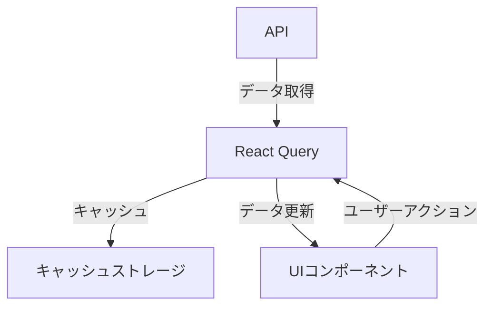

# React Query v5マスター講座：状態管理とデータフェッチングの革新的アプローチ

## はじめに

Reactは、ユーザーインターフェースを構築するための人気のあるライブラリですが、アプリケーションが大規模になるにつれて、状態管理やデータフェッチングの複雑さが増してきます。これに対処するために、React Queryは非常に強力なツールとして登場しました。特に、React Query v5は、状態管理とデータフェッチングのアプローチを革新し、開発者にとっての利便性を大幅に向上させています。

本記事では、React Query v5の基本的な概念から、実践的な使用例、さらには高度な機能までを詳しく解説します。最終的には、React Queryを使った状態管理とデータフェッチングのベストプラクティスを理解し、実際のプロジェクトに応用できるようになることを目指します。

## React Queryとは？

React Queryは、サーバーからのデータを取得し、キャッシュし、更新するためのライブラリです。これにより、データの取得や状態管理が簡素化され、開発者はビジネスロジックに集中できるようになります。React Queryは、以下のような機能を提供します。

- **データフェッチング**: APIからデータを取得するための簡単な方法。
- **キャッシング**: 取得したデータをキャッシュし、再利用することでパフォーマンスを向上。
- **自動再フェッチ**: データが変更された場合に自動的に再フェッチを行う機能。
- **状態管理**: アプリケーションの状態を簡単に管理できる。

### React Query v5の新機能

React Query v5では、いくつかの新機能と改善が導入されています。主な変更点は以下の通りです。

1. **新しいAPI**: より直感的で使いやすいAPIが提供され、開発者は簡単にデータを取得できるようになりました。特に、クエリの定義がシンプルになり、必要なオプションを簡単に指定できるようになりました。

2. **改善されたキャッシング**: キャッシュの管理がより柔軟になり、データの整合性を保ちながら効率的にキャッシュを利用できます。これにより、データの取得が高速化され、ユーザーエクスペリエンスが向上します。

3. **サーバー状態の管理**: サーバーからのデータをより簡単に管理できるようになり、クライアント側の状態とサーバー側の状態をシームレスに統合できます。これにより、アプリケーションの状態管理が一元化され、開発が容易になります。

4. **新しいDevTools**: 開発者がクエリの状態を視覚的に確認できる新しいDevToolsが追加され、デバッグが容易になりました。これにより、開発中の問題を迅速に特定し、解決することができます。

### React Queryのアーキテクチャ

React Queryのアーキテクチャは、データの取得、キャッシング、更新を効率的に行うために設計されています。以下のダイアグラムは、React Queryの基本的なアーキテクチャを示しています。



このダイアグラムは、APIからデータを取得し、React Queryがそのデータをキャッシュし、UIコンポーネントに提供する流れを示しています。ユーザーアクションが発生すると、React Queryは再度データを取得し、キャッシュを更新します。

## React Queryの基本的な使い方

### インストール

React Queryをプロジェクトに追加するには、以下のコマンドを実行します。

```bash
npm install @tanstack/react-query
```

または、Yarnを使用している場合は次のようにします。

```bash
yarn add @tanstack/react-query
```

インストールが完了したら、アプリケーションのエントリーポイントで`QueryClient`と`QueryClientProvider`を設定します。これにより、アプリケーション全体でReact Queryを使用できるようになります。

```javascript
import React from 'react';
import ReactDOM from 'react-dom';
import { QueryClient, QueryClientProvider } from '@tanstack/react-query';
import App from './App';

const queryClient = new QueryClient();

ReactDOM.render(
  <QueryClientProvider client={queryClient}>
    <App />
  </QueryClientProvider>,
  document.getElementById('root')
);
```

### 基本的なデータフェッチング

React Queryを使用してデータを取得するためには、`useQuery`フックを使用します。以下は、基本的なデータフェッチングの例です。

```javascript
import React from 'react';
import { useQuery } from '@tanstack/react-query';

const fetchUsers = async () => {
  const response = await fetch('https://jsonplaceholder.typicode.com/users');
  if (!response.ok) {
    throw new Error('Network response was not ok');
  }
  return response.json();
};

const UsersList = () => {
  const { data, error, isLoading } = useQuery(['users'], fetchUsers);

  if (isLoading) return <div>Loading...</div>;
  if (error) return <div>Error: {error.message}</div>;

  return (
    <ul>
      {data.map(user => (
        <li key={user.id}>{user.name}</li>
      ))}
    </ul>
  );
};

export default UsersList;
```

この例では、`fetchUsers`関数を使用してユーザーのデータを取得し、`useQuery`フックを使ってそのデータを管理しています。`isLoading`や`error`の状態を使って、ローディング中やエラー時の表示を制御しています。

### データのキャッシング

React Queryは、デフォルトでデータをキャッシュします。これにより、同じデータを再度取得する際に、ネットワークの負荷を軽減し、パフォーマンスを向上させることができます。キャッシュの有効期限や更新のポリシーは、`useQuery`のオプションで設定できます。

```javascript
const { data } = useQuery(['users'], fetchUsers, {
  staleTime: 1000 * 60 * 5, // 5分間キャッシュを有効にする
});
```

`staleTime`オプションを設定することで、データが「古くなった」と見なされるまでの時間を指定できます。この時間内に再度同じクエリが呼ばれた場合、キャッシュからデータが返され、ネットワークリクエストは行われません。

### 自動再フェッチ

React Queryは、データが変更された場合に自動的に再フェッチを行う機能を提供しています。これにより、最新のデータを常に表示することができます。再フェッチのトリガーは、ウィンドウがフォーカスされたときや、ネットワークが再接続されたときなどです。

```javascript
const { data } = useQuery(['users'], fetchUsers, {
  refetchOnWindowFocus: true, // ウィンドウがフォーカスされたときに再フェッチ
});
```

この機能は、特にリアルタイムデータを扱うアプリケーションにおいて非常に便利です。ユーザーがアプリケーションを使用している間にデータが更新された場合でも、常に最新の情報を提供できます。

## 状態管理のベストプラクティス

React Queryを使用する際の状態管理のベストプラクティスについて考えてみましょう。

### 1. クエリキーの設計

クエリキーは、データを一意に識別するための重要な要素です。適切なクエリキーを設計することで、データの整合性を保ち、キャッシュの管理を容易にします。クエリキーは、配列として指定し、必要に応じてパラメータを追加することができます。

```javascript
const { data } = useQuery(['users', userId], fetchUserById);
```

このように、クエリキーにユーザーIDを追加することで、特定のユーザーのデータを取得することができます。これにより、異なるユーザーのデータをキャッシュし、効率的に管理できます。

### 2. データの正規化

データの正規化は、状態管理を効率的に行うための重要な手法です。React Queryを使用する際には、データを正規化して、重複を避け、更新を容易にすることが推奨されます。例えば、ユーザー情報を正規化して、各ユーザーを一意に識別できるようにします。

正規化の一例として、以下のようにデータを構造化することが考えられます。

```javascript
const normalizedData = {
  users: {
    1: { id: 1, name: 'John Doe' },
    2: { id: 2, name: 'Jane Smith' },
  },
};
```

このようにすることで、特定のユーザーを簡単に参照でき、更新も容易になります。

### 3. エラーハンドリング

エラーハンドリングは、ユーザーエクスペリエンスを向上させるために重要です。React Queryでは、`error`オブジェクトを使用して、エラーの詳細を取得し、適切なエラーメッセージを表示することができます。

```javascript
if (error) {
  console.error(error);
  return <div>Error: {error.message}</div>;
}
```

エラーハンドリングを適切に行うことで、ユーザーに対して明確なフィードバックを提供し、問題が発生した際の対処を容易にします。

### 4. ミューテーションの使用

データの作成、更新、削除を行う場合は、`useMutation`フックを使用します。これにより、サーバーへのリクエストを簡単に管理できます。

```javascript
import { useMutation } from '@tanstack/react-query';

const addUser = async (newUser) => {
  const response = await fetch('https://jsonplaceholder.typicode.com/users', {
    method: 'POST',
    body: JSON.stringify(newUser),
    headers: {
      'Content-Type': 'application/json',
    },
  });
  if (!response.ok) {
    throw new Error('Network response was not ok');
  }
  return response.json();
};

const AddUserForm = () => {
  const mutation = useMutation(addUser);

  const handleSubmit = (event) => {
    event.preventDefault();
    const newUser = { name: event.target.name.value };
    mutation.mutate(newUser);
  };

  return (
    <form onSubmit={handleSubmit}>
      <input name="name" required />
      <button type="submit">Add User</button>
      {mutation.isLoading ? (
        <p>Adding user...</p>
      ) : (
        mutation.isError ? (
          <p>Error: {mutation.error.message}</p>
        ) : null
      )}
    </form>
  );
};
```

この例では、ユーザーを追加するためのフォームを作成し、`useMutation`を使用してサーバーにデータを送信しています。ミューテーションの状態（ローディング、エラー）を表示することで、ユーザーに対してフィードバックを提供しています。

## 高度な機能

### 1. クエリの無効化と再フェッチ

特定の条件下でクエリを無効化し、再フェッチを行うことができます。これにより、特定のアクションが完了した後に最新のデータを取得することができます。

```javascript
const queryClient = useQueryClient();

const mutation = useMutation(addUser, {
  onSuccess: () => {
    queryClient.invalidateQueries(['users']);
  },
});
```

このように、ユーザーを追加した後に`invalidateQueries`を呼び出すことで、ユーザーリストを再フェッチし、最新のデータを表示することができます。

### 2. ページネーションと無限スクロール

React Queryは、ページネーションや無限スクロールを簡単に実装するための機能を提供しています。これにより、大量のデータを効率的に表示できます。

```javascript
const fetchUsers = async ({ pageParam = 1 }) => {
  const response = await fetch(`https://jsonplaceholder.typicode.com/users?page=${pageParam}`);
  return response.json();
};

const { data, fetchNextPage } = useInfiniteQuery('users', fetchUsers, {
  getNextPageParam: (lastPage, pages) => lastPage.nextPage,
});
```

この例では、`useInfiniteQuery`を使用して、ページネーションを実装しています。`getNextPageParam`を使用することで、次のページのパラメータを取得し、無限スクロールを実現しています。

### 3. DevToolsの活用

React Queryには、開発中にデバッグを容易にするためのDevToolsが用意されています。これを使用することで、クエリの状態やキャッシュの内容を視覚的に確認できます。

```javascript
import { ReactQueryDevtools } from '@tanstack/react-query-devtools';

const App = () => (
  <>
    <UsersList />
    <ReactQueryDevtools initialIsOpen={false} />
  </>
);
```

DevToolsを使用することで、クエリの状態をリアルタイムで確認でき、デバッグが容易になります。特に、複雑なアプリケーションでは、状態の可視化が非常に役立ちます。

## まとめ

React Query v5は、状態管理とデータフェッチングのアプローチを革新し、開発者にとって非常に強力なツールとなっています。データの取得、キャッシング、自動再フェッチ、エラーハンドリングなど、多くの機能を提供し、アプリケーションのパフォーマンスとユーザーエクスペリエンスを向上させます。

本記事では、React Queryの基本的な使い方から高度な機能までを詳しく解説しました。これにより、React Queryを使った状態管理とデータフェッチングのベストプラクティスを理解し、実際のプロジェクトに応用できるようになることを目指しました。

React Queryを活用することで、開発者はより効率的にアプリケーションを構築できるようになります。ぜひ、実際のプロジェクトで試してみてください。

-----

※本記事は生成AIを使用して作成されました。
AI言語モデル: gpt-4o-mini