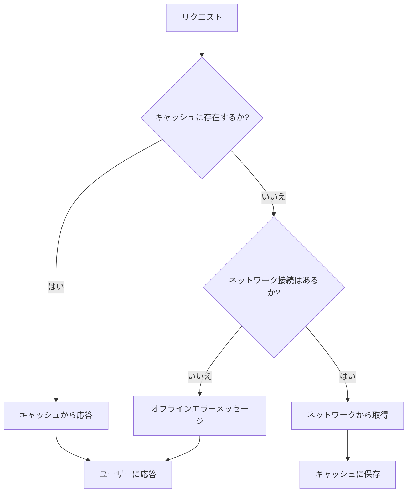

# Progressive Web Apps in 2024：最新APIとオフライン戦略の実装テクニック

## はじめに

Progressive Web Apps（PWA）は、ウェブとモバイルアプリの利点を融合させた革新的なアプローチであり、2024年においてもその重要性は増しています。PWAは、ユーザーにネイティブアプリのような体験を提供し、オフラインでの利用やプッシュ通知、ホーム画面への追加などの機能を実現します。本記事では、2024年における最新のAPI、オフライン戦略、そしてそれらを実装するためのテクニックについて詳しく解説します。

## PWAの基本概念

### PWAとは？

PWAは、ウェブ技術を使用して構築されたアプリケーションで、ユーザーにネイティブアプリのような体験を提供します。PWAは、以下の特徴を持っています。

- **レスポンシブ**：デバイスの画面サイズに応じて適切に表示されます。これにより、スマートフォン、タブレット、デスクトップなど、さまざまなデバイスで一貫した体験を提供します。
- **オフライン対応**：Service Workerを使用して、オフラインでも動作します。これにより、ユーザーはインターネット接続が不安定な環境でもアプリを利用できます。
- **プッシュ通知**：ユーザーにリアルタイムで情報を提供できます。これにより、ユーザーのエンゲージメントを高め、アプリの利用頻度を向上させることができます。
- **インストール可能**：ユーザーはPWAをホーム画面に追加できます。これにより、アプリの起動が容易になり、ネイティブアプリと同様の体験を提供します。

### PWAの利点

PWAの利点は多岐にわたります。以下に主な利点を示します。

1. **クロスプラットフォーム**：PWAは、異なるデバイスやプラットフォームで動作します。これにより、開発者は一度の開発で多くのユーザーにリーチできるため、コストと時間を大幅に削減できます。
2. **コスト効率**：ネイティブアプリを開発するよりもコストが低く、開発時間も短縮できます。PWAは、ウェブ技術を使用しているため、開発者は既存のスキルを活かして迅速に開発できます。
3. **SEO効果**：ウェブサイトとしてインデックスされるため、SEO効果があります。これにより、検索エンジンからのトラフィックを増加させることができます。
4. **ユーザーエンゲージメント**：PWAは、プッシュ通知やオフライン機能を通じて、ユーザーとのインタラクションを強化します。これにより、ユーザーのリテンション率が向上します。

## 2024年の最新API

### 1. Web App Manifest

Web App Manifestは、PWAのメタデータを提供するJSONファイルです。これにより、アプリの名前、アイコン、テーマカラーなどを指定できます。2024年には、Manifest V2からV3への移行が進んでおり、より多くの機能が追加されています。

#### 例：Web App Manifestの基本構造

```json
{
  "name": "My PWA",
  "short_name": "PWA",
  "start_url": "/index.html",
  "display": "standalone",
  "background_color": "#ffffff",
  "theme_color": "#000000",
  "icons": [
    {
      "src": "icon-192x192.png",
      "sizes": "192x192",
      "type": "image/png"
    },
    {
      "src": "icon-512x512.png",
      "sizes": "512x512",
      "type": "image/png"
    }
  ],
  "description": "A progressive web app example.",
  "scope": "/"
}
```

この例では、アプリの基本的な情報が含まれています。特に、`scope`プロパティは、アプリがアクセスできるURLの範囲を定義します。これにより、アプリがどのリソースにアクセスできるかを制御できます。また、`description`プロパティを追加することで、アプリの目的や機能を説明することができ、ユーザーにとっての理解を深めることができます。

### 2. Service Worker

Service Workerは、PWAのオフライン機能を実現するための重要なコンポーネントです。2024年には、Service Workerの機能が拡張され、キャッシュ管理やバックグラウンド同期がより簡単に行えるようになっています。

#### 例：Service Workerの基本的な実装

```javascript
self.addEventListener('install', (event) => {
  event.waitUntil(
    caches.open('my-cache').then((cache) => {
      return cache.addAll([
        '/',
        '/index.html',
        '/styles.css',
        '/script.js',
      ]);
    })
  );
});

self.addEventListener('fetch', (event) => {
  event.respondWith(
    caches.match(event.request).then((response) => {
      return response || fetch(event.request);
    })
  );
});
```

このコードは、Service Workerのインストール時にキャッシュを作成し、リクエストがあった際にキャッシュから応答する基本的な実装です。`caches.match`メソッドを使用して、キャッシュ内にリクエストが存在するかを確認し、存在しない場合はネットワークから取得します。これにより、オフライン時でもアプリが機能し続けることが可能になります。

### 3. Background Sync

Background Syncは、オフライン時に行った操作をオンラインに戻った際に自動的に同期する機能です。これにより、ユーザーはオフラインでもアプリを利用でき、後でデータが自動的に送信されます。

#### 例：Background Syncの実装

```javascript
self.addEventListener('sync', (event) => {
  if (event.tag === 'sync-data') {
    event.waitUntil(syncData());
  }
});

async function syncData() {
  const response = await fetch('/api/sync', {
    method: 'POST',
    body: JSON.stringify(dataToSync),
    headers: {
      'Content-Type': 'application/json'
    }
  });
  return response.json();
}
```

このコードは、`sync`イベントをリッスンし、特定のタグ（この場合は`sync-data`）がトリガーされたときにデータを同期する処理を実行します。これにより、ユーザーがオフラインで行った操作が自動的にサーバーに送信されます。Background Syncは、特にデータの整合性が重要なアプリケーションにおいて非常に有用です。

## オフライン戦略の実装テクニック

### 1. キャッシュ戦略

PWAのオフライン機能を実現するためには、適切なキャッシュ戦略を選択することが重要です。以下に代表的なキャッシュ戦略を示します。

- **Cache First**：リクエストがあった際に、まずキャッシュを確認し、存在しない場合にネットワークから取得します。この戦略は、オフライン時に迅速な応答を提供します。
- **Network First**：リクエストがあった際に、まずネットワークから取得し、失敗した場合にキャッシュを使用します。この戦略は、最新のデータを優先する場合に適しています。
- **Stale While Revalidate**：キャッシュからデータを返しつつ、バックグラウンドでネットワークから新しいデータを取得します。これにより、ユーザーは即座に応答を受け取りつつ、最新のデータを取得できます。

これらの戦略は、アプリケーションの特性やユーザーのニーズに応じて選択することが重要です。例えば、ニュースアプリでは最新情報を優先するためにNetwork First戦略が適している一方、オフラインでの利用が多いアプリではCache First戦略が有効です。

#### キャッシュ戦略のフローチャート

以下のフローチャートは、PWAにおけるキャッシュ戦略の選択プロセスを示しています。この図を参考に、どの戦略が最適かを判断する手助けにしてください。



このフローチャートは、リクエストがあった際の処理の流れを示しています。キャッシュにデータが存在する場合は、キャッシュから応答し、存在しない場合はネットワーク接続の有無を確認します。ネットワーク接続があれば、データを取得してキャッシュに保存し、ユーザーに応答します。オフラインの場合は、エラーメッセージを表示します。

### 2. プッシュ通知の実装

プッシュ通知は、ユーザーにリアルタイムで情報を提供するための強力な手段です。2024年には、プッシュ通知のAPIが改善され、より多くのカスタマイズが可能になっています。

#### 例：プッシュ通知の基本的な実装

```javascript
self.addEventListener('push', (event) => {
  const options = {
    body: event.data.text(),
    icon: 'icon.png',
    badge: 'badge.png',
    actions: [
      { action: 'explore', title: 'Explore' },
      { action: 'close', title: 'Close' }
    ]
  };
  event.waitUntil(
    self.registration.showNotification('新しい通知', options)
  );
});
```

このコードは、プッシュ通知を受信した際に、通知の内容やアイコン、アクションボタンを設定する基本的な実装です。アクションボタンを追加することで、ユーザーは通知から直接アクションを実行できます。これにより、ユーザーのエンゲージメントを高めることができます。

### 3. オフラインファーストのアプローチ

オフラインファーストのアプローチは、PWAの設計において重要な考え方です。アプリケーションは、最初からオフラインでの利用を考慮して設計されるべきです。これにより、ユーザーは常にアプリを利用できる体験を得ることができます。

オフラインファーストのアプローチを実現するためには、以下のポイントを考慮する必要があります。

- **データのローカルストレージ**：オフライン時にユーザーが行った操作やデータをローカルストレージに保存し、オンラインに戻った際にサーバーに送信します。これにより、ユーザーはオフラインでもアプリを利用でき、データの損失を防ぎます。
- **ユーザーインターフェースの工夫**：オフライン時にユーザーに適切なメッセージを表示し、利用可能な機能を明示することで、ユーザー体験を向上させます。例えば、「現在オフラインですが、アプリの一部機能は利用可能です」といったメッセージを表示することが考えられます。

## 2024年のPWAのトレンド

### 1. AIの統合

2024年には、AI技術がPWAに統合されることが期待されています。これにより、ユーザー体験が向上し、パーソナライズされたコンテンツの提供が可能になります。例えば、ユーザーの行動データを分析し、興味に基づいたコンテンツを表示することができます。これにより、ユーザーは自分に合った情報を迅速に得ることができ、アプリの利用頻度が向上します。

### 2. アクセシビリティの向上

PWAは、すべてのユーザーに対してアクセス可能であるべきです。2024年には、アクセシビリティに関するガイドラインが強化され、開発者はこれを考慮する必要があります。具体的には、スクリーンリーダーに対応したコンテンツの提供や、キーボード操作のサポートが求められます。これにより、視覚障害者や身体障害者を含むすべてのユーザーがアプリを利用できるようになります。

### 3. セキュリティの強化

PWAはHTTPSを使用する必要がありますが、2024年にはさらに強化されたセキュリティ機能が求められるでしょう。これにより、ユーザーのデータが保護され、信頼性が向上します。特に、ユーザーのプライバシーを守るためのデータ暗号化や、セキュリティポリシーの強化が重要です。また、セキュリティの観点から、定期的なセキュリティ監査や脆弱性スキャンを実施することが推奨されます。

## まとめ

2024年におけるProgressive Web Appsは、最新のAPIやオフライン戦略を活用することで、より強力でユーザーに優しい体験を提供します。Web App ManifestやService Worker、Background Syncなどの技術を駆使し、オフラインでも快適に利用できるアプリケーションを構築することが求められます。また、AIの統合やアクセシビリティの向上、セキュリティの強化といったトレンドにも注目し、今後のPWAの発展に備えましょう。

-----

※本記事は生成AIを使用して作成されました。
AI言語モデル: gpt-4o-mini