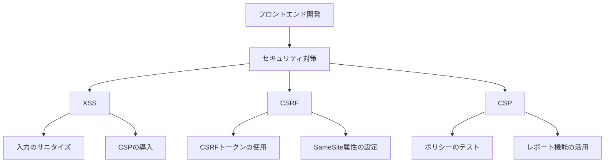

# フロントエンドのセキュリティ対策：XSS、CSRF、CSPの最新ベストプラクティス

## はじめに

フロントエンド開発において、セキュリティは非常に重要な要素です。特に、クロスサイトスクリプティング（XSS）、クロスサイトリクエストフォージェリ（CSRF）、およびコンテンツセキュリティポリシー（CSP）は、ウェブアプリケーションの脆弱性を悪用する攻撃手法として広く知られています。これらの脅威は、ユーザーのデータを危険にさらし、アプリケーションの信頼性を損なう可能性があります。本記事では、これらの脅威に対する最新のベストプラクティスを詳しく解説し、実践的な対策を提供します。

### セキュリティの重要性

ウェブアプリケーションは、日々進化し続ける技術の中で、ユーザーの個人情報や機密データを扱うため、セキュリティ対策が不可欠です。攻撃者は、脆弱性を突いてデータを盗んだり、システムを不正に操作したりすることができます。したがって、開発者はこれらの脅威を理解し、適切な対策を講じる必要があります。



このフローチャートは、フロントエンド開発におけるセキュリティ対策の主要な要素を示しています。XSS、CSRF、CSPの各脅威に対する具体的な対策がどのように関連しているかを視覚的に表現しています。

## XSS（クロスサイトスクリプティング）

### XSSの概要

XSSは、攻撃者が悪意のあるスクリプトをウェブページに挿入し、他のユーザーのブラウザで実行させる攻撃手法です。これにより、ユーザーのクッキーやセッション情報が盗まれたり、フィッシング攻撃が行われたりします。XSS攻撃は、特にユーザーが信頼しているサイトで発生するため、被害が大きくなることがあります。XSSは、ウェブアプリケーションのセキュリティにおいて最も一般的な脅威の一つであり、攻撃者はさまざまな手法を用いてこの脆弱性を悪用します。

### XSSの種類

1. **ストアドXSS**: 攻撃者が悪意のあるスクリプトをサーバーに保存し、他のユーザーがそのスクリプトを含むページを訪れると実行されます。例えば、掲示板やコメントセクションにスクリプトを埋め込むことで、他のユーザーがそのページを訪れた際にスクリプトが実行されます。このタイプの攻撃は、特にユーザーが信頼しているサイトで発生するため、被害が大きくなることがあります。

2. **リフレクトXSS**: 攻撃者が特定のURLを生成し、ユーザーがそのリンクをクリックすると、悪意のあるスクリプトが実行されます。このタイプの攻撃は、フィッシングメールや悪意のある広告を通じて行われることが多いです。リフレクトXSSは、攻撃者がユーザーに特定のリンクをクリックさせることで、即座に攻撃を実行することができます。

3. **DOM-based XSS**: クライアントサイドのJavaScriptによって、悪意のあるスクリプトが実行される場合です。例えば、URLのパラメータを直接DOMに挿入することで、攻撃者がスクリプトを実行できるようになります。このタイプのXSSは、サーバー側の処理を介さずに、クライアント側で直接発生するため、検出が難しいことがあります。

### XSS対策のベストプラクティス

1. **入力のサニタイズ**: ユーザーからの入力を適切にサニタイズし、HTMLエスケープを行うことで、悪意のあるスクリプトが実行されるのを防ぎます。例えば、以下のようにJavaScriptでエスケープ処理を行います。

   ```javascript
   function escapeHtml(unsafe) {
       return unsafe
           .replace(/&/g, "&amp;")
           .replace(/</g, "&lt;")
           .replace(/>/g, "&gt;")
           .replace(/"/g, "&quot;")
           .replace(/'/g, "&#039;");
   }
   ```

   この関数を使用することで、ユーザーが入力したデータを安全に表示することができます。サニタイズは、特にユーザーが入力するフィールド（コメント欄や検索ボックスなど）で重要です。

2. **コンテンツセキュリティポリシー（CSP）の導入**: CSPを使用することで、許可されたソースからのみスクリプトを読み込むことができます。以下はCSPの設定例です。

   ```http
   Content-Security-Policy: default-src 'self'; script-src 'self' https://trustedscripts.example.com;
   ```

   CSPを適切に設定することで、悪意のあるスクリプトの実行を防ぐことができます。CSPは、XSS攻撃を防ぐための強力なツールであり、特に外部リソースを使用する場合には必須です。

3. **HTTPOnlyおよびSecureフラグの設定**: クッキーにHTTPOnlyおよびSecureフラグを設定することで、JavaScriptからのアクセスを防ぎ、HTTPS接続時のみクッキーが送信されるようにします。これにより、XSS攻撃によってクッキーが盗まれるリスクを低減できます。HTTPOnlyフラグを設定することで、クッキーがJavaScriptからアクセスできなくなり、セキュリティが向上します。

4. **フレームワークの利用**: ReactやAngularなどのフレームワークは、XSS攻撃に対する防御機能を内蔵しています。これらのフレームワークを利用することで、セキュリティを強化できます。例えば、Reactでは、デフォルトでHTMLをエスケープするため、XSS攻撃のリスクが低減されます。フレームワークのセキュリティ機能を活用することで、開発者はセキュリティ対策を簡素化できます。

5. **定期的なセキュリティテスト**: アプリケーションのセキュリティを維持するために、定期的にセキュリティテストを実施し、脆弱性を特定して修正することが重要です。自動化されたツールや手動のペネトレーションテストを活用して、XSSの脆弱性を検出します。セキュリティテストは、開発プロセスの一環として組み込むべきです。

## CSRF（クロスサイトリクエストフォージェリ）

### CSRFの概要

CSRFは、ユーザーが意図しないリクエストを送信させる攻撃手法です。攻撃者は、ユーザーがログインしている状態を利用して、悪意のあるリクエストを送信させることができます。これにより、ユーザーのアカウントが不正に操作される可能性があります。CSRF攻撃は、特にユーザーが信頼しているサイトで発生するため、被害が大きくなることがあります。

### CSRF対策のベストプラクティス

1. **CSRFトークンの使用**: 各リクエストに対してユニークなトークンを生成し、サーバー側で検証します。これにより、正当なリクエストかどうかを確認できます。以下は、CSRFトークンを使用したリクエストの例です。

   ```javascript
   // CSRFトークンを取得
   const csrfToken = document.querySelector('meta[name="csrf-token"]').getAttribute('content');

   // リクエストにトークンを追加
   fetch('/api/resource', {
       method: 'POST',
       headers: {
           'Content-Type': 'application/json',
           'X-CSRF-Token': csrfToken
       },
       body: JSON.stringify(data)
   });
   ```

   このように、リクエストにCSRFトークンを含めることで、攻撃を防ぐことができます。CSRFトークンは、サーバー側で生成され、ユーザーのセッションに関連付けられます。

2. **SameSite属性の設定**: クッキーにSameSite属性を設定することで、クロスサイトリクエストを制限します。以下はその設定例です。

   ```http
   Set-Cookie: sessionId=abc123; SameSite=Strict;
   ```

   SameSite属性を使用することで、他のサイトからのリクエストによるクッキーの送信を防ぎます。これにより、CSRF攻撃のリスクを低減できます。

3. **リファラーチェック**: リクエストのリファラーを確認し、信頼できるドメインからのリクエストのみを受け入れるようにします。これにより、悪意のあるサイトからのリクエストをブロックできます。リファラーチェックは、特に重要な操作を行う際に有効です。

4. **ユーザー確認の実施**: 重要な操作（例：パスワード変更や削除）を行う際に、ユーザーに確認を求めることで、CSRF攻撃を防ぎます。例えば、削除ボタンをクリックした際に確認ダイアログを表示することが考えられます。これにより、ユーザーが意図しない操作を行うリスクを低減できます。

5. **セキュリティヘッダーの設定**: HTTPヘッダーにセキュリティ関連の設定を追加することで、CSRF攻撃のリスクを低減できます。例えば、X-Frame-Optionsヘッダーを設定することで、クリックジャッキング攻撃を防ぐことができます。これにより、他のサイトからの不正なリクエストを防ぐことができます。

## CSP（コンテンツセキュリティポリシー）

### CSPの概要

CSPは、ウェブページが読み込むことのできるリソースの制限を設定するためのセキュリティ機能です。これにより、XSS攻撃やデータインジェクションを防ぐことができます。CSPを適切に設定することで、悪意のあるスクリプトの実行を防ぎ、アプリケーションのセキュリティを強化できます。CSPは、特に外部リソースを使用する場合には必須です。

### CSPの設定方法

1. **基本的なCSPの設定**: CSPはHTTPヘッダーまたはHTMLメタタグで設定できます。以下はHTTPヘッダーでの設定例です。

   ```http
   Content-Security-Policy: default-src 'self'; img-src 'self' data:;
   ```

   この設定により、同一オリジンからのリソースのみが許可され、外部のリソースはブロックされます。CSPは、XSS攻撃を防ぐための強力なツールであり、特に外部リソースを使用する場合には必須です。

2. **ポリシーのテスト**: CSPを導入した後は、ポリシーが正しく機能しているかをテストします。ブラウザのデベロッパーツールを使用して、CSP違反のレポートを確認できます。これにより、ポリシーの調整が必要な場合に迅速に対応できます。

3. **レポート機能の活用**: CSPにはレポート機能があり、ポリシー違反が発生した場合に通知を受け取ることができます。以下はレポートURIの設定例です。

   ```http
   Content-Security-Policy: default-src 'self'; report-uri /csp-violation-report-endpoint;
   ```

   レポートを受け取ることで、どのリソースがブロックされたかを把握し、ポリシーを改善する手助けになります。

### CSPのベストプラクティス

1. **最小権限の原則**: 必要なリソースのみを許可し、不要なリソースはブロックします。これにより、攻撃のリスクを低減できます。例えば、スクリプトの読み込み元を特定のドメインに制限することが考えられます。

2. **nonceまたはhashの使用**: スクリプトやスタイルに対してnonceまたはhashを使用することで、特定のスクリプトのみを許可します。以下はその設定例です。

   ```http
   Content-Security-Policy: script-src 'self' 'nonce-<random-nonce>';
   ```

   この設定により、nonceが付与されたスクリプトのみが実行されるようになります。これにより、悪意のあるスクリプトの実行を防ぐことができます。

3. **CSPの段階的導入**: 初めは緩やかなポリシーを設定し、徐々に厳格なポリシーに移行することで、アプリケーションの動作を確認しながら導入できます。これにより、予期しない問題を回避できます。

4. **定期的なポリシーの見直し**: アプリケーションの変更に伴い、CSPも見直す必要があります。新しいリソースが追加された場合や、不要なリソースが削除された場合には、ポリシーを更新します。

5. **CSPのドキュメント化**: CSPの設定や変更履歴をドキュメント化することで、チーム内での情報共有が容易になります。これにより、将来的なメンテナンスがスムーズに行えます。

## まとめ

フロントエンドのセキュリティ対策は、ウェブアプリケーションの安全性を確保するために不可欠です。XSS、CSRF、CSPの各脅威に対する最新のベストプラクティスを理解し、実践することで、攻撃からアプリケーションを守ることができます。これらの対策を適切に実施することで、ユーザーの信頼を得ることができ、より安全なウェブ環境を提供することが可能になります。

さらに学習を進めるためには、以下のリソースを参考にしてください：

- [OWASP XSS Prevention Cheat Sheet](https://owasp.org/www-community/OWASP_XSS_Prevention_Cheat_Sheet)
- [OWASP CSRF Prevention Cheat Sheet](https://owasp.org/www-community/OWASP_CSRF_Prevention_Cheat_Sheet)
- [Content Security Policy (CSP) - MDN Web Docs](https://developer.mozilla.org/en-US/docs/Web/HTTP/CSP)

-----

※本記事は生成AIを使用して作成されました。
AI言語モデル: gpt-4o-mini