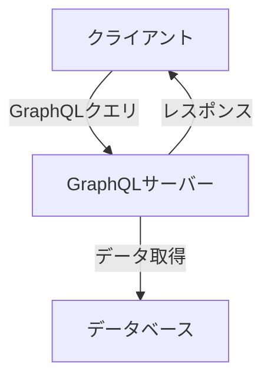

# GraphQL + Apollo Client：Reactアプリケーションでの効率的なデータ管理

## はじめに

近年、Webアプリケーションの開発において、データの取得と管理は非常に重要な要素となっています。特に、ユーザーインターフェースが複雑化する中で、効率的なデータ管理が求められています。そこで登場するのが、GraphQLとApollo Clientです。これらの技術を組み合わせることで、Reactアプリケーションにおけるデータ管理を大幅に改善することが可能です。本記事では、GraphQLとApollo Clientの基本概念から、実際の実装方法、さらにはベストプラクティスまでを詳しく解説します。

### ダイアグラムの挿入

以下のダイアグラムは、GraphQLとApollo Clientの基本的なアーキテクチャを示しています。この図は、クライアント、サーバー、データベースの関係を視覚的に表現しています。



このダイアグラムは、クライアントがGraphQLサーバーにクエリを送信し、サーバーがデータベースからデータを取得してクライアントにレスポンスを返す流れを示しています。これにより、GraphQLの基本的な動作を理解しやすくなります。

## GraphQLとは？

GraphQLは、Facebookによって開発されたクエリ言語であり、APIのためのランタイムです。従来のREST APIとは異なり、クライアントが必要なデータを正確に指定できるため、過剰なデータの取得や不足を防ぐことができます。GraphQLの主な特徴は以下の通りです。

### 1. クエリの柔軟性

GraphQLでは、クライアントが必要なデータの構造を指定できます。これにより、サーバーから返されるデータの量を最小限に抑えることができます。例えば、以下のクエリは、ユーザーの名前とメールアドレスのみを取得します。

```graphql
{
  user(id: "1") {
    name
    email
  }
}
```

このクエリは、必要な情報だけを取得するため、ネットワークの負荷を軽減し、アプリケーションのパフォーマンスを向上させます。さらに、クエリの構造を変更することで、必要に応じて異なるデータを簡単に取得できるため、開発者は柔軟に対応できます。

### 2. 型システム

GraphQLは強い型システムを持っており、スキーマを定義することで、APIの構造を明確にします。スキーマは、データの型、クエリ、ミューテーションを定義するためのもので、開発者はAPIの使用方法を理解しやすくなります。例えば、以下のようにスキーマを定義することができます。

```graphql
type User {
  id: ID!
  name: String!
  email: String!
}

type Query {
  user(id: ID!): User
}
```

このスキーマにより、`user`クエリがどのようなデータを返すかが明確になります。型システムにより、開発者はAPIの使用時に型エラーを早期に発見でき、より堅牢なアプリケーションを構築できます。

### 3. リアルタイムデータ

GraphQLは、サブスクリプションを使用してリアルタイムデータの取得をサポートしています。これにより、クライアントはデータの変更をリアルタイムで受け取ることができます。例えば、チャットアプリケーションでは、新しいメッセージが送信されるたびに、クライアントが自動的に更新されるように設定できます。

```graphql
subscription {
  messageSent {
    id
    content
    sender {
      name
    }
  }
}
```

このように、GraphQLのサブスクリプションを利用することで、ユーザーに対してリアルタイムな体験を提供できます。リアルタイムデータの取得は、ユーザーエクスペリエンスを向上させるために非常に重要です。

## Apollo Clientとは？

Apollo Clientは、GraphQLを使用するための強力なクライアントライブラリです。Reactアプリケーションと統合することで、データの取得、キャッシング、更新を簡単に行うことができます。Apollo Clientの主な機能は以下の通りです。

### 1. データのキャッシング

Apollo Clientは、取得したデータをキャッシュする機能を持っています。これにより、同じデータを再度取得する際のネットワーク負荷を軽減し、アプリケーションのパフォーマンスを向上させます。デフォルトでは、Apollo Clientは`InMemoryCache`を使用してデータをキャッシュします。キャッシュは、クエリの結果を保存し、次回同じクエリが実行された際にキャッシュからデータを返すことで、ネットワークの呼び出しを最小限に抑えます。

キャッシュの管理は非常に重要で、適切に設定することでアプリケーションの応答性を大幅に向上させることができます。例えば、キャッシュのポリシーを設定することで、特定のクエリに対してキャッシュを優先的に使用することができます。

### 2. クエリとミューテーションの管理

Apollo Clientは、GraphQLのクエリとミューテーションを簡単に管理できます。これにより、データの取得や更新が直感的に行えます。例えば、クエリを実行する際には、`useQuery`フックを使用し、ミューテーションを実行する際には、`useMutation`フックを使用します。これにより、Reactのコンポーネント内で簡単にデータの取得や更新が行えます。

```javascript
import { useQuery, gql } from '@apollo/client';

const GET_USERS = gql`
  query GetUsers {
    users {
      id
      name
      email
    }
  }
`;

const UsersList = () => {
  const { loading, error, data } = useQuery(GET_USERS);

  if (loading) return <p>Loading...</p>;
  if (error) return <p>Error: {error.message}</p>;

  return (
    <ul>
      {data.users.map(user => (
        <li key={user.id}>{user.name} - {user.email}</li>
      ))}
    </ul>
  );
};
```

このコードでは、`GET_USERS`クエリを使用して、ユーザーのリストを取得しています。`loading`、`error`、`data`の状態を管理し、適切なUIを表示することができます。

### 3. 状態管理

Apollo Clientは、ローカル状態管理の機能も提供しています。これにより、アプリケーションの状態を一元管理することが可能です。Apollo Clientを使用することで、リモートデータとローカルデータを統一的に扱うことができ、状態管理の複雑さを軽減します。

ローカル状態を管理するために、Apollo ClientはGraphQLスキーマを拡張することができます。これにより、アプリケーションの状態をGraphQLのクエリやミューテーションを通じて管理することが可能になります。

## Reactアプリケーションへの統合

### 1. Apollo Clientのインストール

まず、Apollo ClientをReactアプリケーションにインストールします。以下のコマンドを実行してください。

```bash
npm install @apollo/client graphql
```

### 2. ApolloProviderの設定

次に、ApolloProviderを使用して、アプリケーション全体にApollo Clientを提供します。以下のように設定します。

```javascript
import React from 'react';
import ReactDOM from 'react-dom';
import { ApolloClient, InMemoryCache, ApolloProvider } from '@apollo/client';
import App from './App';

const client = new ApolloClient({
  uri: 'https://your-graphql-endpoint.com/graphql',
  cache: new InMemoryCache(),
});

ReactDOM.render(
  <ApolloProvider client={client}>
    <App />
  </ApolloProvider>,
  document.getElementById('root')
);
```

この設定により、アプリケーション内のすべてのコンポーネントでApollo Clientを使用できるようになります。ApolloProviderは、Reactのコンテキストを使用して、Apollo Clientをアプリケーション全体に提供します。

### 3. クエリの実行

Apollo Clientを使用して、GraphQLクエリを実行する方法を見てみましょう。以下は、ユーザー情報を取得するクエリの例です。

```javascript
import React from 'react';
import { useQuery, gql } from '@apollo/client';

const GET_USER = gql`
  query GetUser($id: ID!) {
    user(id: $id) {
      name
      email
    }
  }
`;

const User = ({ id }) => {
  const { loading, error, data } = useQuery(GET_USER, {
    variables: { id },
  });

  if (loading) return <p>Loading...</p>;
  if (error) return <p>Error: {error.message}</p>;

  return (
    <div>
      <h2>{data.user.name}</h2>
      <p>{data.user.email}</p>
    </div>
  );
};

export default User;
```

このコードでは、`useQuery`フックを使用して、指定したIDのユーザー情報を取得しています。`loading`、`error`、`data`の状態を管理し、適切なUIを表示することができます。

### 4. ミューテーションの実行

データの更新には、ミューテーションを使用します。以下は、ユーザー情報を更新するミューテーションの例です。

```javascript
import React from 'react';
import { useMutation, gql } from '@apollo/client';

const UPDATE_USER = gql`
  mutation UpdateUser($id: ID!, $name: String!, $email: String!) {
    updateUser(id: $id, name: $name, email: $email) {
      id
      name
      email
    }
  }
`;

const UpdateUserForm = ({ id }) => {
  let name, email;
  const [updateUser, { data, loading, error }] = useMutation(UPDATE_USER);

  const handleSubmit = (e) => {
    e.preventDefault();
    updateUser({ variables: { id, name: name.value, email: email.value } });
  };

  if (loading) return <p>Loading...</p>;
  if (error) return <p>Error: {error.message}</p>;

  return (
    <form onSubmit={handleSubmit}>
      <input ref={(node) => (name = node)} placeholder="Name" />
      <input ref={(node) => (email = node)} placeholder="Email" />
      <button type="submit">Update User</button>
    </form>
  );
};

export default UpdateUserForm;
```

このコードでは、`useMutation`フックを使用して、ユーザー情報を更新するミューテーションを実行しています。フォームの送信時に、指定したIDのユーザー情報を更新します。

## Apollo Clientのキャッシング戦略

Apollo Clientは、デフォルトでデータをキャッシュしますが、キャッシング戦略をカスタマイズすることも可能です。以下に、いくつかのキャッシング戦略を紹介します。

### 1. キャッシュポリシーの設定

Apollo Clientでは、クエリごとにキャッシュポリシーを設定できます。以下のように、`fetchPolicy`を指定することで、キャッシュの動作を制御できます。

```javascript
const { loading, error, data } = useQuery(GET_USER, {
  variables: { id },
  fetchPolicy: 'cache-and-network', // キャッシュとネットワークの両方を使用
});
```

`fetchPolicy`には、以下のようなオプションがあります。

- `cache-first`: キャッシュが存在する場合はキャッシュを使用し、存在しない場合はネットワークから取得します（デフォルト）。
- `network-only`: 常にネットワークからデータを取得します。
- `cache-only`: キャッシュからのみデータを取得します。
- `no-cache`: キャッシュを使用せず、常にネットワークからデータを取得します。

これらのポリシーを適切に設定することで、アプリケーションのパフォーマンスを最適化できます。

### 2. キャッシュの更新

ミューテーションを実行した後にキャッシュを更新することも可能です。以下のように、`update`オプションを使用してキャッシュを手動で更新できます。

```javascript
const [updateUser] = useMutation(UPDATE_USER, {
  update(cache, { data: { updateUser } }) {
    cache.modify({
      id: cache.identify({ id: updateUser.id, __typename: 'User' }),
      fields: {
        name(existingName) {
          return updateUser.name;
        },
        email(existingEmail) {
          return updateUser.email;
        },
      },
    });
  },
});
```

このコードでは、`update`オプションを使用して、ミューテーションの結果をキャッシュに反映させています。これにより、UIが即座に更新され、ユーザーに対してスムーズな体験を提供できます。

## Apollo Clientのローカル状態管理

Apollo Clientは、ローカル状態管理の機能も提供しています。これにより、アプリケーションの状態を一元管理することが可能です。以下に、ローカル状態管理の基本的な使い方を示します。

### 1. ローカルフィールドの定義

ローカル状態を管理するために、スキーマにローカルフィールドを追加します。以下のように、ローカルフィールドを定義することができます。

```graphql
const typeDefs = gql`
  extend type Query {
    isLoggedIn: Boolean!
  }
`;
```

### 2. 初期値の設定

初期値を設定するために、`InMemoryCache`を使用します。以下のように、キャッシュのポリシーを設定します。

```javascript
const cache = new InMemoryCache({
  typePolicies: {
    Query: {
      fields: {
        isLoggedIn: {
          read() {
            return localStorage.getItem('isLoggedIn') === 'true';
          },
        },
      },
    },
  },
});
```

この設定により、`isLoggedIn`フィールドがローカルストレージの値に基づいて読み取られます。

### 3. ローカル状態の更新

ローカル状態を更新するために、`writeQuery`メソッドを使用します。以下のように、ユーザーがログインした際にローカル状態を更新します。

```javascript
const [login] = useMutation(LOGIN_MUTATION, {
  update(cache) {
    localStorage.setItem('isLoggedIn', 'true');
    cache.writeQuery({
      query: GET_IS_LOGGED_IN,
      data: { isLoggedIn: true },
    });
  },
});
```

このコードでは、ユーザーがログインした際に、ローカルストレージとキャッシュの両方を更新しています。これにより、アプリケーションの状態が一貫して保たれます。

## GraphQLのベストプラクティス

GraphQLを使用する際のベストプラクティスをいくつか紹介します。

### 1. スキーマの設計

スキーマは、APIの設計において非常に重要です。明確で一貫性のあるスキーマを設計することで、開発者がAPIを理解しやすくなります。スキーマは、データの型、クエリ、ミューテーションを明確に定義することが求められます。スキーマの設計には、以下のポイントを考慮することが重要です。

- **一貫性**: スキーマの命名規則や構造を一貫させることで、開発者が理解しやすくなります。
- **拡張性**: 将来的な機能追加を考慮して、スキーマを設計することが重要です。
- **ドキュメンテーション**: スキーマの各フィールドや型に対して、適切な説明を追加することで、他の開発者が理解しやすくなります。

### 2. クエリの最適化

クエリは必要なデータのみを取得するように最適化しましょう。過剰なデータの取得を避けることで、パフォーマンスを向上させることができます。また、クエリの複雑さを避けるために、必要に応じてクエリを分割することも検討してください。クエリの最適化には、以下の方法があります。

- **フィールドの選択**: 必要なフィールドのみを選択することで、データの取得量を減らします。
- **バッチ処理**: 複数のクエリを一度に実行することで、ネットワークの呼び出し回数を減らします。
- **フラグメントの使用**: 再利用可能なクエリの部分をフラグメントとして定義することで、クエリの可読性を向上させます。

### 3. エラーハンドリング

エラーハンドリングは重要な要素です。GraphQLでは、エラーが発生した場合でも部分的なデータを返すことができます。エラーの内容を適切に処理することが求められます。例えば、エラーが発生した場合には、ユーザーに対して適切なメッセージを表示することが重要です。エラーハンドリングのベストプラクティスには、以下のポイントがあります。

- **エラーメッセージの明確化**: エラーメッセージは具体的で明確にすることで、ユーザーが問題を理解しやすくなります。
- **リトライ機能の実装**: 一時的なエラーに対しては、リトライ機能を実装することで、ユーザーエクスペリエンスを向上させることができます。
- **ロギング**: エラーの発生時には、適切にロギングを行い、後で問題を分析できるようにします。

### 4. ドキュメンテーションの整備

GraphQLのスキーマは自己文書化されているため、APIの使用方法を理解するのが容易です。しかし、開発者がスキーマを理解しやすくするために、ドキュメンテーションを整備することが重要です。GraphQL PlaygroundやGraphiQLなどのツールを使用して、APIのインタラクティブなドキュメンテーションを提供することができます。ドキュメンテーションの整備には、以下のポイントが重要です。

- **インタラクティブなドキュメンテーション**: 開発者が実際にクエリを試すことができる環境を提供します。
- **サンプルコードの提供**: APIの使用例を示すサンプルコードを提供することで、開発者が理解しやすくなります。
- **FAQの作成**: よくある質問や問題に対する回答をまとめたFAQを作成することで、開発者の疑問を解消します。

## まとめ

GraphQLとApollo Clientを使用することで、Reactアプリケーションにおけるデータ管理は大幅に改善されます。クエリの柔軟性、キャッシング機能、ローカル状態管理など、さまざまな機能を活用することで、効率的なデータ管理が実現できます。これにより、開発者はより迅速に高品質なアプリケーションを構築できるようになります。

今後もGraphQLとApollo Clientは進化を続けるでしょう。新しい機能やベストプラクティスを学び続けることで、より良いアプリケーションを開発していきましょう。

-----

※本記事は生成AIを使用して作成されました。
AI言語モデル: gpt-4o-mini