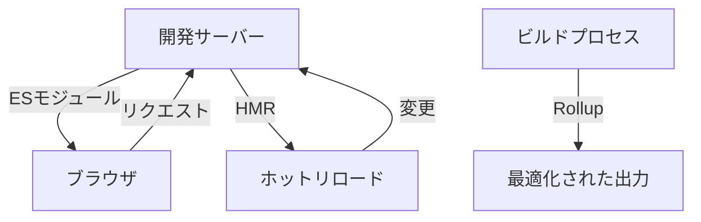

# Viteを使った次世代フロントエンド開発環境の構築：プラグインとパフォーマンス最適化

## はじめに

近年、フロントエンド開発の世界は急速に進化しています。特に、開発者の生産性を向上させるためのツールやフレームワークが次々と登場しています。その中でも、Viteは特に注目を集めているビルドツールです。Viteは、モダンなフロントエンド開発において、開発サーバーの起動時間やビルド時間を大幅に短縮することができるため、多くの開発者に支持されています。

本記事では、Viteを使用した次世代フロントエンド開発環境の構築方法について詳しく解説します。特に、Viteのプラグインシステムやパフォーマンス最適化の手法に焦点を当て、実践的な例を交えながら説明します。

## Viteの基本概念

### Viteとは？

Viteは、フロントエンド開発のためのビルドツールであり、特に以下の特徴を持っています。

- **超高速な開発サーバー**: Viteは、ESモジュールを利用して、必要なファイルだけを即座に読み込むことができるため、開発サーバーの起動が非常に速いです。これにより、開発者は待ち時間を大幅に削減し、迅速にフィードバックを得ることができます。Viteは、開発中にファイルを変更すると、その変更が即座に反映されるため、開発者はリアルタイムでアプリケーションの動作を確認できます。

- **ホットモジュールリプレースメント（HMR）**: コードを変更すると、ページをリロードすることなく、変更が即座に反映されます。これにより、開発効率が向上し、ユーザー体験を損なうことなく、リアルタイムでの開発が可能になります。HMRは、特にスタイルやコンポーネントの変更を行う際に非常に便利です。

- **ビルドの最適化**: Viteは、Rollupを使用して本番ビルドを行うため、最適化された出力を得ることができます。これにより、アプリケーションのパフォーマンスが向上し、ユーザーにとって快適な体験を提供します。Viteは、デフォルトでコードスプリッティングやツリーシェイキングを行い、不要なコードを排除します。

### Viteのインストール

Viteを使用するためには、まずNode.jsがインストールされている必要があります。以下のコマンドを使用して、Viteをプロジェクトにインストールします。

```bash
npm create vite@latest my-vite-app
cd my-vite-app
npm install
```

このコマンドにより、新しいViteプロジェクトが作成され、必要な依存関係がインストールされます。プロジェクトのディレクトリに移動した後、以下のコマンドで開発サーバーを起動できます。

```bash
npm run dev
```

これにより、`http://localhost:3000`でアプリケーションを確認することができます。初期設定が完了したら、すぐに開発を開始できます。

## Viteのプラグインシステム

Viteの強力な機能の一つが、プラグインシステムです。プラグインを使用することで、Viteの機能を拡張し、特定のニーズに応じたカスタマイズが可能になります。

### プラグインの基本

Viteのプラグインは、Viteのライフサイクルにフックを提供し、特定の処理を追加することができます。プラグインは、以下のような機能を持つことができます。

- **ビルドプロセスのカスタマイズ**: 特定のファイルタイプの処理や、ビルド時の最適化を行うことができます。例えば、TypeScriptやSassなどのプリプロセッサを使用する際に、プラグインを利用して自動的に変換することが可能です。

- **開発サーバーの拡張**: 開発中のサーバーに新しいエンドポイントを追加することができます。これにより、APIのモックや特定のリソースへのアクセスを簡単に行うことができます。

### プラグインの作成

Viteのプラグインは、JavaScriptのオブジェクトとして定義されます。以下は、シンプルなプラグインの例です。

```javascript
// vite-plugin-example.js
export default function examplePlugin() {
  return {
    name: 'example-plugin',
    transform(code, id) {
      // ここでコードを変換する処理を追加
      return code.replace(/console.log/g, 'console.warn');
    }
  };
}
```

このプラグインは、すべてのJavaScriptファイル内の`console.log`を`console.warn`に置き換えます。プラグインをViteプロジェクトに追加するには、`vite.config.js`に以下のように記述します。

```javascript
import { defineConfig } from 'vite';
import examplePlugin from './vite-plugin-example';

export default defineConfig({
  plugins: [examplePlugin()]
});
```

### 人気のあるViteプラグイン

Viteには、多くの便利なプラグインが存在します。以下は、特に人気のあるプラグインのいくつかです。

- **Vite Plugin Vue**: Vue.jsアプリケーションのためのプラグインで、Vueコンポーネントのサポートを提供します。これにより、Vueのシングルファイルコンポーネント（SFC）を簡単に使用することができます。Vue 3のComposition APIやTeleportなどの新機能もサポートしています。

- **Vite Plugin React**: Reactアプリケーションのためのプラグインで、JSXのサポートを提供します。Reactの最新機能であるReact Fast Refreshもサポートしており、開発中の体験を向上させます。これにより、状態を保持したままコンポーネントを更新することができます。

- **Vite Plugin PWA**: プログレッシブウェブアプリケーション（PWA）を簡単に構築するためのプラグインです。これにより、オフライン機能やホーム画面への追加など、PWAの特性を簡単に実装できます。Service Workerの設定も自動で行ってくれます。

- **Vite Plugin Markdown**: Markdownファイルをコンポーネントとしてインポートできるプラグインです。これにより、ブログやドキュメントサイトの構築が容易になります。Markdownのカスタムコンポーネントを使用することで、スタイルを適用することも可能です。

## Viteのアーキテクチャ

Viteのアーキテクチャは、開発サーバーとビルドプロセスの2つの主要なコンポーネントから成り立っています。以下のダイアグラムは、Viteの基本的なアーキテクチャを示しています。



このダイアグラムは、Viteの開発サーバーがどのようにブラウザと連携し、ホットリロードを実現しているかを示しています。また、ビルドプロセスがRollupを使用して最適化された出力を生成する様子も表現しています。

## パフォーマンス最適化

Viteを使用する際のパフォーマンス最適化は、開発体験を向上させるために非常に重要です。以下に、いくつかの最適化手法を紹介します。

### コードスプリッティング

Viteは、デフォルトでコードスプリッティングをサポートしています。これにより、アプリケーションの初期読み込み時間を短縮し、必要なコードだけを読み込むことができます。以下は、Reactアプリケーションでのコードスプリッティングの例です。

```javascript
import React, { Suspense, lazy } from 'react';

const LazyComponent = lazy(() => import('./LazyComponent'));

function App() {
  return (
    <div>
      <h1>Hello Vite!</h1>
      <Suspense fallback={<div>Loading...</div>}>
        <LazyComponent />
      </Suspense>
    </div>
  );
}
```

このコードでは、`LazyComponent`が必要になるまで読み込まれず、初期の読み込み時間を短縮します。これにより、ユーザーはアプリケーションの他の部分をすぐに利用できるようになります。

### 画像の最適化

画像は、ウェブアプリケーションのパフォーマンスに大きな影響を与える要素です。Viteでは、画像を最適化するためのプラグインがいくつか存在します。例えば、`vite-plugin-imagemin`を使用することで、ビルド時に画像を圧縮することができます。

```bash
npm install vite-plugin-imagemin --save-dev
```

次に、`vite.config.js`にプラグインを追加します。

```javascript
import { defineConfig } from 'vite';
import imagemin from 'vite-plugin-imagemin';

export default defineConfig({
  plugins: [
    imagemin({
      gifsicle: { interlaced: true },
      optipng: { optimizationLevel: 5 },
      mozjpeg: { quality: 20 },
      webp: { quality: 20 }
    })
  ]
});
```

この設定により、ビルド時に画像が自動的に圧縮され、ページの読み込み速度が向上します。特に、画像が多いアプリケーションでは、これによりユーザー体験が大きく改善されます。

### キャッシュの活用

Viteは、ビルド時に生成されるファイルにハッシュを付与することで、ブラウザのキャッシュを活用します。これにより、変更がないファイルは再ダウンロードされず、パフォーマンスが向上します。具体的には、`vite.config.js`で以下のように設定できます。

```javascript
export default defineConfig({
  build: {
    rollupOptions: {
      output: {
        entryFileNames: '[name].[hash].js',
        chunkFileNames: '[name].[hash].js',
        assetFileNames: '[name].[hash][extname]'
      }
    }
  }
});
```

この設定により、ビルドされたファイル名にハッシュが付与され、キャッシュの効率が向上します。これにより、ユーザーはアプリケーションを再訪問した際に、より速くページを表示できるようになります。

### プリロードとプリフェッチ

Viteでは、リソースのプリロードやプリフェッチを簡単に設定できます。これにより、ユーザーが必要とするリソースを事前に読み込むことができ、ページの表示速度を向上させることができます。以下は、HTMLファイルにプリロードを追加する例です。

```html
<link rel="preload" href="/path/to/resource.js" as="script">
```

このようにすることで、指定したリソースが優先的に読み込まれ、ユーザー体験が向上します。特に、初期表示に必要なリソースをプリロードすることで、ユーザーが待たされる時間を短縮できます。

## Viteの将来展望

Viteは、今後もフロントエンド開発の重要なツールとして進化し続けるでしょう。特に、以下の点が注目されます。

- **エコシステムの拡大**: Viteのプラグインエコシステムは急速に成長しており、さまざまなニーズに応じたプラグインが登場しています。これにより、開発者は自分のプロジェクトに最適なツールを選択できるようになります。

- **新しい機能の追加**: Viteの開発チームは、ユーザーからのフィードバックを基に新機能を追加し続けています。これにより、より使いやすく、強力なツールへと進化するでしょう。特に、TypeScriptや新しいJavaScriptの機能への対応が期待されます。

- **コミュニティの活性化**: Viteの人気が高まるにつれて、コミュニティも活発になっています。多くの開発者がViteに関する情報を共有し、問題解決のためのリソースを提供しています。これにより、Viteを学ぶための環境が整いつつあります。

## まとめ

Viteは、次世代のフロントエンド開発環境を構築するための強力なツールです。プラグインシステムを活用することで、開発者は自分のニーズに合わせたカスタマイズが可能になり、パフォーマンス最適化の手法を取り入れることで、より快適な開発体験を実現できます。

今後もViteの進化に注目し、最新の情報をキャッチアップしていくことが重要です。Viteを使った開発環境を構築し、次世代のフロントエンド開発を体験してみてください。

-----

※本記事は生成AIを使用して作成されました。
AI言語モデル: gpt-4o-mini