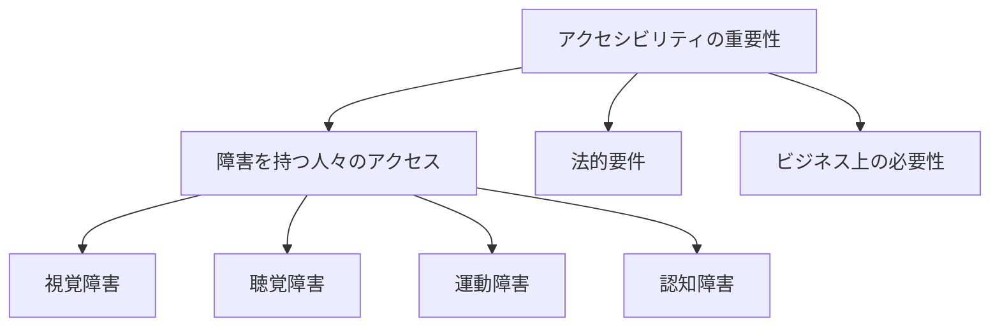
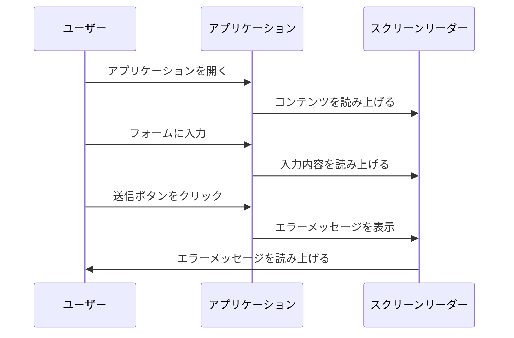

# Reactアクセシビリティ実践ガイド：インクルーシブなUIコンポーネント設計

## はじめに

アクセシビリティは、ウェブ開発においてますます重要な要素となっています。特に、Reactのようなコンポーネントベースのライブラリを使用する場合、インクルーシブなユーザーインターフェース（UI）を設計することは、すべてのユーザーにとって使いやすいアプリケーションを作成するための鍵です。本記事では、Reactを使用したアクセシビリティのベストプラクティスを詳しく解説し、具体的な実装例を通じて、開発者がどのようにインクルーシブなUIコンポーネントを設計できるかを探ります。

### アクセシビリティの重要性

アクセシビリティは、障害を持つ人々がウェブコンテンツにアクセスできるようにするための設計原則です。これには、視覚、聴覚、運動、認知の障害を持つユーザーが含まれます。世界保健機関（WHO）によると、全世界で約10億人が何らかの障害を抱えており、これは全人口の約15%に相当します。このため、アクセシビリティを考慮した設計は、単なる倫理的な義務ではなく、ビジネス上の必要性でもあります。

### アクセシビリティの法的要件

多くの国では、アクセシビリティに関する法律や規制が存在します。例えば、アメリカの「障害者法（ADA）」や、EUの「ウェブアクセシビリティ指令」などが挙げられます。これらの法律は、公共機関や企業がウェブサイトをアクセシブルに保つことを義務付けています。これに違反すると、法的な問題が発生する可能性があります。さらに、アクセシビリティを考慮することで、企業はより広範な顧客層にアプローチでき、ブランドの信頼性を高めることができます。



このフローチャートは、アクセシビリティの重要性を視覚的に示しています。障害を持つ人々がウェブコンテンツにアクセスすることの重要性や、法的要件、ビジネス上の必要性を強調しています。

## Reactにおけるアクセシビリティの基本

Reactを使用する際に考慮すべきアクセシビリティの基本的な原則には、以下のようなものがあります。

### 1. セマンティックHTMLの使用

Reactコンポーネントを作成する際には、セマンティックHTMLを使用することが重要です。セマンティックHTMLは、要素がその内容を正確に表現することを意味します。例えば、見出しには`<h1>`から`<h6>`、リストには`<ul>`や`<ol>`を使用します。これにより、スクリーンリーダーなどの支援技術がコンテンツを正しく解釈できるようになります。

```jsx
const MyComponent = () => (
  <div>
    <h1>私のウェブサイト</h1>
    <p>これはアクセシブルなコンポーネントの例です。</p>
  </div>
);
```

セマンティックHTMLを使用することで、検索エンジンの最適化（SEO）にも寄与します。検索エンジンは、セマンティックなマークアップを解析して、ページの内容を理解しやすくなります。これにより、検索結果でのランキング向上が期待できます。

### 2. ARIA属性の活用

Accessible Rich Internet Applications（ARIA）は、動的なコンテンツや高度なユーザーインターフェースを支援技術に対してより理解しやすくするための属性を提供します。ARIA属性を使用することで、特定の要素の役割や状態を明示的に示すことができます。

```jsx
const MyButton = () => (
  <button aria-label="送信">送信</button>
);
```

ARIA属性は、特にカスタムコンポーネントや動的なUI要素において重要です。例えば、タブやアコーディオンなどのインタラクティブな要素では、ARIA属性を使用して、現在の状態や選択された要素を示すことができます。これにより、スクリーンリーダーを使用するユーザーが、コンテンツの状態を理解しやすくなります。

### 3. キーボードナビゲーションのサポート

すべてのユーザーがマウスを使用できるわけではありません。キーボードだけで操作するユーザーのために、すべてのインタラクティブな要素がキーボードでアクセス可能であることを確認する必要があります。Reactでは、`tabIndex`属性を使用して、要素のフォーカス順序を制御できます。

```jsx
const MyLink = () => (
  <a href="#" tabIndex="0">リンク</a>
);
```

キーボードナビゲーションをサポートするためには、`Enter`や`Space`キーでボタンやリンクをアクティブにできるようにすることも重要です。これにより、キーボードユーザーがインタラクションを行いやすくなります。

### 4. フォーカス管理

動的なコンテンツを持つアプリケーションでは、フォーカスの管理が重要です。新しいコンテンツが表示されたときに、ユーザーがどこにいるのかを明確にするために、適切な要素にフォーカスを移動させる必要があります。

```jsx
const MyModal = ({ isOpen }) => {
  const modalRef = useRef(null);

  useEffect(() => {
    if (isOpen && modalRef.current) {
      modalRef.current.focus();
    }
  }, [isOpen]);

  return (
    <div ref={modalRef} tabIndex="-1" role="dialog">
      <h2>モーダルタイトル</h2>
      <p>モーダルの内容</p>
    </div>
  );
};
```

フォーカス管理は、特にモーダルやダイアログボックスなどのコンテンツが表示される場合に重要です。ユーザーがモーダルを開いたときに、モーダル内の最初のインタラクティブな要素にフォーカスを移動させることで、ユーザーはすぐに操作を開始できます。

## Reactコンポーネントのアクセシビリティ向上

### 1. フォームコンポーネントのアクセシビリティ

フォームは、ユーザーが情報を入力するための重要なインターフェースです。フォームコンポーネントをアクセシブルにするためには、以下のポイントに注意が必要です。

#### ラベルの使用

すべてのフォーム要素には、適切なラベルを付けることが重要です。ラベルは、`<label>`要素を使用して作成し、`for`属性を使用して関連する入力要素と関連付けます。

```jsx
const MyForm = () => (
  <form>
    <label htmlFor="name">名前:</label>
    <input type="text" id="name" />
  </form>
);
```

ラベルを使用することで、スクリーンリーダーは入力フィールドの目的をユーザーに伝えることができます。これにより、視覚障害を持つユーザーがフォームを正しく理解し、操作できるようになります。

#### エラーメッセージの表示

フォームのバリデーションエラーは、ユーザーにとって重要な情報です。エラーメッセージは、関連する入力要素の近くに表示し、`aria-describedby`属性を使用して、スクリーンリーダーに通知します。

```jsx
const MyForm = () => {
  const [error, setError] = useState('');

  const handleSubmit = (e) => {
    e.preventDefault();
    // バリデーションロジック
    if (!name) {
      setError('名前は必須です。');
    }
  };

  return (
    <form onSubmit={handleSubmit}>
      <label htmlFor="name">名前:</label>
      <input type="text" id="name" aria-describedby="name-error" />
      {error && <span id="name-error" role="alert">{error}</span>}
    </form>
  );
};
```

エラーメッセージは、ユーザーが何を修正すべきかを明確に示すため、ユーザーエクスペリエンスを向上させます。また、`role="alert"`を使用することで、エラーメッセージが表示されたときに、スクリーンリーダーが即座に通知するようになります。

### 2. ナビゲーションコンポーネントのアクセシビリティ

ナビゲーションは、ユーザーがアプリケーション内を移動するための重要な要素です。ナビゲーションコンポーネントをアクセシブルにするためには、以下のポイントに注意が必要です。

#### セマンティックなナビゲーション

ナビゲーションには、`<nav>`要素を使用し、リンクには`<a>`要素を使用します。これにより、スクリーンリーダーがナビゲーションを正しく認識できます。

```jsx
const MyNavigation = () => (
  <nav>
    <ul>
      <li><a href="#home">ホーム</a></li>
      <li><a href="#about">私たちについて</a></li>
      <li><a href="#contact">お問い合わせ</a></li>
    </ul>
  </nav>
);
```

ナビゲーションメニューは、ユーザーがアプリケーション内を簡単に移動できるように設計する必要があります。特に、キーボードユーザーにとって、ナビゲーションが直感的であることが重要です。

#### キーボードナビゲーションのサポート

ナビゲーションメニューは、キーボードで操作できるようにする必要があります。`tabIndex`を使用して、フォーカス可能な要素を制御します。

```jsx
const MyNavigation = () => (
  <nav>
    <ul>
      <li><a href="#home" tabIndex="0">ホーム</a></li>
      <li><a href="#about" tabIndex="0">私たちについて</a></li>
      <li><a href="#contact" tabIndex="0">お問い合わせ</a></li>
    </ul>
  </nav>
);
```

ナビゲーションメニューの項目は、`Enter`キーや`Space`キーでアクティブにできるようにすることも重要です。これにより、キーボードユーザーがナビゲーションをスムーズに行えるようになります。

### 3. モーダルコンポーネントのアクセシビリティ

モーダルは、ユーザーの注意を引くための重要なインターフェースですが、適切に実装しないとアクセシビリティの問題が発生します。モーダルコンポーネントをアクセシブルにするためには、以下のポイントに注意が必要です。

#### フォーカスの管理

モーダルが開いたときに、フォーカスをモーダル内の最初のインタラクティブな要素に移動させる必要があります。また、モーダルが閉じたときには、元のフォーカス位置に戻すことが重要です。

```jsx
const MyModal = ({ isOpen, onClose }) => {
  const modalRef = useRef(null);

  useEffect(() => {
    if (isOpen && modalRef.current) {
      modalRef.current.focus();
    }
  }, [isOpen]);

  return (
    isOpen && (
      <div ref={modalRef} tabIndex="-1" role="dialog" aria-modal="true">
        <h2>モーダルタイトル</h2>
        <button onClick={onClose}>閉じる</button>
      </div>
    )
  );
};
```

モーダルが開いたときに、フォーカスをモーダル内の最初のインタラクティブな要素に移動させることで、ユーザーはすぐに操作を開始できます。また、モーダルが閉じたときには、元のフォーカス位置に戻すことで、ユーザーがどこにいたのかを明確にします。

#### スクリーンリーダーへの通知

モーダルが開いたときに、スクリーンリーダーに対してモーダルが開いたことを通知するために、`aria-live`属性を使用します。

```jsx
const MyModal = ({ isOpen, onClose }) => {
  return (
    isOpen && (
      <div role="dialog" aria-modal="true" aria-live="assertive">
        <h2>モーダルタイトル</h2>
        <button onClick={onClose}>閉じる</button>
      </div>
    )
  );
};
```

`aria-live="assertive"`を使用することで、モーダルが開いたときにスクリーンリーダーが即座に通知します。これにより、視覚障害を持つユーザーがモーダルの存在に気づきやすくなります。

## アクセシビリティのテスト

アクセシビリティを確保するためには、テストが不可欠です。以下の方法でアクセシビリティをテストできます。

### 1. スクリーンリーダーの使用

スクリーンリーダーを使用して、アプリケーションのナビゲーションやインタラクションが正しく機能するかを確認します。一般的なスクリーンリーダーには、NVDAやJAWS、VoiceOverなどがあります。これらのツールを使用して、実際のユーザーがどのようにアプリケーションを体験するかをシミュレートできます。

### 2. アクセシビリティチェックツール

さまざまなアクセシビリティチェックツールを使用して、アプリケーションのアクセシビリティを自動的に評価できます。これには、以下のようなツールが含まれます。

- **axe**: ブラウザ拡張機能として利用でき、リアルタイムでアクセシビリティの問題を検出します。開発者は、問題を特定し、修正するための具体的な提案を受けることができます。
- **WAVE**: ウェブアクセシビリティ評価ツールで、ページのアクセシビリティを視覚的に表示します。エラーや警告を色分けして表示し、ユーザーが問題を簡単に特定できるようにします。

### 3. ユーザビリティテスト

実際のユーザーにアプリケーションを使用してもらい、アクセシビリティの問題を特定します。特に、障害を持つユーザーからのフィードバックは非常に貴重です。ユーザビリティテストを通じて、ユーザーがどのようにアプリケーションを操作し、どの部分で困難を感じるかを観察することができます。



このシーケンス図は、ユーザーがアプリケーションを使用する際のインタラクションの流れを示しています。ユーザーがアプリケーションを開き、スクリーンリーダーがコンテンツを読み上げる様子や、フォームに入力してエラーメッセージが表示される流れを視覚化しています。

## まとめ

Reactを使用したアクセシビリティの実践は、すべてのユーザーにとって使いやすいアプリケーションを作成するための重要なステップです。セマンティックHTMLの使用、ARIA属性の活用、キーボードナビゲーションのサポート、フォーカス管理など、さまざまなベストプラクティスを取り入れることで、インクルーシブなUIコンポーネントを設計できます。

アクセシビリティは単なる技術的な要件ではなく、すべてのユーザーに対する配慮の表れです。これを実践することで、より多くの人々にアプローチできるアプリケーションを作成し、ビジネスの成長にもつながります。今後もアクセシビリティの重要性を認識し、継続的に改善を図っていくことが求められます。

## 参考文献

- [Web Content Accessibility Guidelines (WCAG)](https://www.w3.org/WAI/WCAG21/quickref/)
- [React Accessibility](https://reactjs.org/docs/accessibility.html)
- [Axe Accessibility Testing](https://www.deque.com/axe/)

-----

※本記事は生成AIを使用して作成されました。
AI言語モデル: gpt-4o-mini