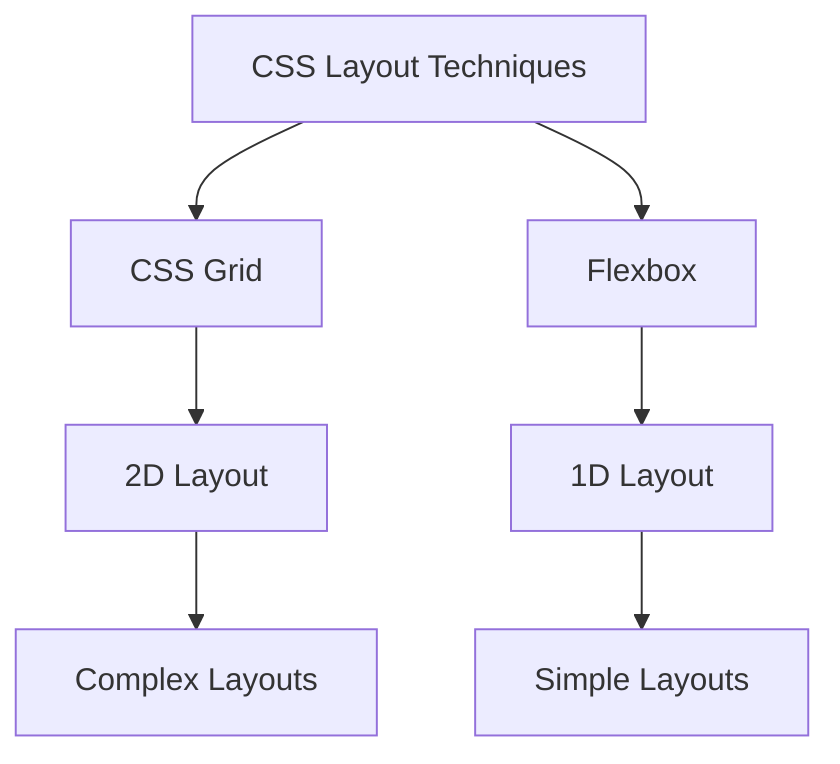

# CSS Grid + Flexbox：モダンレイアウト技法の極意とレスポンシブデザインの実現

## はじめに

ウェブデザインの世界は急速に進化しており、特にレイアウト技術においては、CSS GridとFlexboxがその中心的な役割を果たしています。これらの技術は、開発者がレスポンシブデザインを実現するための強力なツールを提供し、複雑なレイアウトを簡単に構築できるようにします。本記事では、CSS GridとFlexboxの基本概念、使用方法、そしてそれらを組み合わせてモダンなウェブレイアウトを作成する方法について詳しく解説します。

### CSS GridとFlexboxの関係

CSS GridとFlexboxは、どちらもCSSのレイアウトモジュールですが、それぞれ異なる特性を持っています。Gridは2次元のレイアウトに優れ、Flexboxは1次元のレイアウトに適しています。以下のダイアグラムは、これらの技術の関係性を示しています。



このダイアグラムは、CSSのレイアウト技術がどのように分かれているかを示しています。Gridは複雑な2次元レイアウトに適しており、Flexboxはシンプルな1次元レイアウトに最適です。

## CSS Gridの基本

### CSS Gridとは？

CSS Gridは、2次元のレイアウトシステムであり、行と列を使って要素を配置することができます。これにより、複雑なレイアウトを簡単に作成できるようになります。Gridは、特に大規模なレイアウトや、異なるサイズの要素を持つ場合に非常に効果的です。Gridを使用することで、開発者は要素の配置を直感的に制御でき、デザインの自由度が大幅に向上します。

### 基本的な使い方

CSS Gridを使用するには、まず親要素に`display: grid;`を設定します。次に、子要素に対して行や列のサイズを指定します。以下は、基本的なGridの例です。

```css
.container {
  display: grid;
  grid-template-columns: repeat(3, 1fr);
  grid-gap: 10px;
}

.item {
  background-color: lightblue;
  padding: 20px;
  text-align: center;
}
```

この例では、3つの等幅の列を持つグリッドを作成しています。`grid-gap`プロパティは、各アイテムの間にスペースを追加します。`repeat(3, 1fr)`は、3つの列を均等に分配することを意味します。

### グリッドのプロパティ

CSS Gridには多くのプロパティがありますが、以下のプロパティが特に重要です。

- `grid-template-columns`：列のサイズを定義します。例えば、`grid-template-columns: 100px 200px auto;`のように指定することで、1列目は100px、2列目は200px、3列目は残りのスペースを占めるように設定できます。
- `grid-template-rows`：行のサイズを定義します。`grid-template-rows: 50px auto;`のように指定することで、1行目は50px、2行目は自動的にサイズが決まります。
- `grid-area`：特定のアイテムが占める領域を指定します。例えば、`grid-area: 1 / 1 / 3 / 3;`は、1行目から2行目、1列目から2列目までの領域を占めることを意味します。
- `grid-gap`：アイテム間のスペースを設定します。`grid-gap: 10px;`は、各アイテムの間に10pxのスペースを追加します。

### 実践的な例

以下は、CSS Gridを使用して簡単なレイアウトを作成する例です。

```html
<div class="container">
  <div class="item">1</div>
  <div class="item">2</div>
  <div class="item">3</div>
  <div class="item">4</div>
  <div class="item">5</div>
  <div class="item">6</div>
</div>
```

```css
.container {
  display: grid;
  grid-template-columns: repeat(3, 1fr);
  grid-gap: 10px;
}

.item {
  background-color: lightblue;
  padding: 20px;
  text-align: center;
}
```

このコードを使用すると、3列のグリッドが作成され、各アイテムが均等に配置されます。Gridを使用することで、要素の配置が非常に簡単になり、デザインの調整も容易になります。

### グリッドの応用

CSS Gridは、複雑なレイアウトを作成するための強力なツールです。例えば、以下のように異なるサイズの要素を持つレイアウトを作成することができます。

```css
.container {
  display: grid;
  grid-template-columns: 1fr 2fr;
  grid-template-rows: auto;
  grid-template-areas: 
    "header header"
    "sidebar content"
    "footer footer";
}

.header {
  grid-area: header;
}

.sidebar {
  grid-area: sidebar;
}

.content {
  grid-area: content;
}

.footer {
  grid-area: footer;
}
```

この例では、ヘッダー、サイドバー、コンテンツ、フッターの4つの領域を持つレイアウトを作成しています。`grid-template-areas`を使用することで、視覚的にレイアウトを定義することができ、コードの可読性が向上します。

## Flexboxの基本

### Flexboxとは？

Flexbox（Flexible Box Layout）は、1次元のレイアウトシステムであり、主に行または列のいずれかに要素を配置するために使用されます。Flexboxは、要素のサイズや順序を柔軟に調整できるため、特に小規模なレイアウトやコンポーネントに適しています。Flexboxを使用することで、要素の配置やサイズを簡単に制御でき、レスポンシブデザインにおいても非常に効果的です。

### 基本的な使い方

Flexboxを使用するには、親要素に`display: flex;`を設定します。次に、子要素に対して配置やサイズを指定します。以下は、基本的なFlexboxの例です。

```css
.container {
  display: flex;
  justify-content: space-between;
}

.item {
  background-color: lightcoral;
  padding: 20px;
  flex: 1;
  margin: 10px;
}
```

この例では、要素が水平方向に配置され、`justify-content`プロパティによってスペースが均等に分配されます。`flex: 1;`は、各アイテムが均等にスペースを占めることを意味します。

### Flexboxのプロパティ

Flexboxには多くのプロパティがありますが、以下のプロパティが特に重要です。

- `flex-direction`：要素の配置方向を指定します。`row`（デフォルト）、`column`、`row-reverse`、`column-reverse`のいずれかを指定できます。
- `justify-content`：主軸に沿った要素の配置を指定します。`flex-start`、`flex-end`、`center`、`space-between`、`space-around`などの値を使用できます。
- `align-items`：交差軸に沿った要素の配置を指定します。`flex-start`、`flex-end`、`center`、`baseline`、`stretch`などの値を使用できます。
- `flex-wrap`：要素が親要素のサイズを超えた場合の折り返しを指定します。`nowrap`（デフォルト）、`wrap`、`wrap-reverse`のいずれかを指定できます。

### 実践的な例

以下は、Flexboxを使用して簡単なレイアウトを作成する例です。

```html
<div class="container">
  <div class="item">1</div>
  <div class="item">2</div>
  <div class="item">3</div>
</div>
```

```css
.container {
  display: flex;
  justify-content: space-between;
}

.item {
  background-color: lightcoral;
  padding: 20px;
  flex: 1;
  margin: 10px;
}
```

このコードを使用すると、3つのアイテムが水平方向に均等に配置されます。Flexboxを使用することで、要素の配置が非常に簡単になり、デザインの調整も容易になります。

### Flexboxの応用

Flexboxは、特にナビゲーションバーやカードレイアウトなど、1次元のレイアウトに非常に適しています。以下は、ナビゲーションバーの例です。

```html
<nav class="navbar">
  <div class="nav-item">Home</div>
  <div class="nav-item">About</div>
  <div class="nav-item">Services</div>
  <div class="nav-item">Contact</div>
</nav>
```

```css
.navbar {
  display: flex;
  justify-content: space-around;
  background-color: #333;
  padding: 10px;
}

.nav-item {
  color: white;
  text-decoration: none;
}
```

この例では、ナビゲーションバーが水平方向に配置され、各アイテムが均等にスペースを占めています。Flexboxを使用することで、ナビゲーションバーのデザインが非常に簡単になります。

## CSS GridとFlexboxの組み合わせ

### なぜ組み合わせるのか？

CSS GridとFlexboxはそれぞれ異なる特性を持っており、特定の状況で最適な選択肢となります。Gridは2次元のレイアウトに優れ、Flexboxは1次元のレイアウトに適しています。これらを組み合わせることで、より柔軟で強力なレイアウトを実現できます。例えば、Gridを使用して全体のレイアウトを構築し、その中でFlexboxを使用して個々のコンポーネントを配置することができます。

### 実践的な組み合わせ例

以下は、CSS GridとFlexboxを組み合わせたレイアウトの例です。

```html
<div class="grid-container">
  <div class="grid-item">
    <div class="flex-container">
      <div class="flex-item">A</div>
      <div class="flex-item">B</div>
      <div class="flex-item">C</div>
    </div>
  </div>
  <div class="grid-item">2</div>
  <div class="grid-item">3</div>
</div>
```

```css
.grid-container {
  display: grid;
  grid-template-columns: repeat(2, 1fr);
  grid-gap: 10px;
}

.grid-item {
  background-color: lightblue;
  padding: 20px;
}

.flex-container {
  display: flex;
  justify-content: space-between;
}

.flex-item {
  background-color: lightcoral;
  padding: 10px;
  flex: 1;
  margin: 5px;
}
```

この例では、Gridを使用して2列のレイアウトを作成し、その中にFlexboxを使用して要素を配置しています。これにより、全体のレイアウトと個々のコンポーネントの配置を柔軟に制御できます。

## レスポンシブデザインの実現

### レスポンシブデザインとは？

レスポンシブデザインは、デバイスの画面サイズに応じてウェブサイトのレイアウトを調整する手法です。これにより、ユーザーはどのデバイスでも快適にコンテンツを閲覧できるようになります。レスポンシブデザインを実現するためには、CSS GridやFlexboxを活用することが非常に効果的です。

### メディアクエリの使用

CSS GridとFlexboxを使用する際、メディアクエリを活用することで、異なる画面サイズに応じたスタイルを適用できます。以下は、メディアクエリを使用した例です。

```css
@media (max-width: 600px) {
  .grid-container {
    grid-template-columns: 1fr;
  }

  .flex-container {
    flex-direction: column;
  }
}
```

このメディアクエリは、画面幅が600px以下の場合に、Gridを1列にし、Flexboxの要素を縦に配置します。これにより、小さな画面でもコンテンツが見やすくなります。

### 実践的なレスポンシブデザインの例

以下は、レスポンシブデザインを実現するための完全な例です。

```html
<div class="grid-container">
  <div class="grid-item">
    <div class="flex-container">
      <div class="flex-item">A</div>
      <div class="flex-item">B</div>
      <div class="flex-item">C</div>
    </div>
  </div>
  <div class="grid-item">2</div>
  <div class="grid-item">3</div>
</div>
```

```css
.grid-container {
  display: grid;
  grid-template-columns: repeat(3, 1fr);
  grid-gap: 10px;
}

.grid-item {
  background-color: lightblue;
  padding: 20px;
}

.flex-container {
  display: flex;
  justify-content: space-between;
}

.flex-item {
  background-color: lightcoral;
  padding: 10px;
  flex: 1;
  margin: 5px;
}

@media (max-width: 600px) {
  .grid-container {
    grid-template-columns: 1fr;
  }

  .flex-container {
    flex-direction: column;
  }
}
```

このコードを使用すると、画面サイズに応じてレイアウトが変化し、ユーザーにとって使いやすいデザインが実現されます。特に、モバイルデバイスでの閲覧時に、コンテンツが適切に表示されることが重要です。

## CSS GridとFlexboxのベストプラクティス

### 1. レイアウトの計画

レイアウトを設計する際は、まず全体の構造を計画し、どの部分にGridを使用し、どの部分にFlexboxを使用するかを決定します。これにより、コードが整理され、メンテナンスが容易になります。特に、複雑なレイアウトを作成する場合は、事前にワイヤーフレームを作成することをお勧めします。

### 2. 一貫性を保つ

CSS GridとFlexboxを使用する際は、一貫したスタイルを保つことが重要です。色、フォント、間隔などを統一することで、視覚的に魅力的なデザインを実現できます。また、CSS変数を使用することで、スタイルの一貫性を保ちながら、変更を容易にすることができます。

### 3. アクセシビリティを考慮する

レスポンシブデザインを実現する際は、アクセシビリティにも配慮しましょう。適切なHTML構造を使用し、ARIA属性を追加することで、すべてのユーザーがコンテンツにアクセスできるようにします。特に、キーボードナビゲーションやスクリーンリーダーに対応することが重要です。

### 4. パフォーマンスを最適化する

CSS GridやFlexboxを使用する際は、パフォーマンスにも注意を払いましょう。特に、複雑なレイアウトを作成する場合は、ブラウザのレンダリング性能に影響を与える可能性があります。不要なスタイルや重複したCSSを避け、最適化されたコードを書くことが重要です。

### 5. ブラウザの互換性を確認する

CSS GridとFlexboxは、最新のブラウザで広くサポートされていますが、古いブラウザでは互換性の問題が発生することがあります。特に、IE11などの古いブラウザをサポートする必要がある場合は、フォールバックを用意することを検討してください。例えば、Flexboxの代わりにFloatを使用するなどの方法があります。

## まとめ

CSS GridとFlexboxは、モダンなウェブデザインにおいて非常に強力なツールです。これらを組み合わせることで、複雑なレイアウトを簡単に作成し、レスポンシブデザインを実現することができます。この記事で紹介した基本的な使い方や実践的な例を参考に、ぜひ自分のプロジェクトに取り入れてみてください。

さらに学習を進めるためには、以下のリソースを参考にしてください。

- [MDN Web Docs - CSS Grid Layout](https://developer.mozilla.org/en-US/docs/Web/CSS/CSS_Grid_Layout)
- [MDN Web Docs - CSS Flexible Box Layout](https://developer.mozilla.org/en-US/docs/Web/CSS/CSS_Flexible_Box_Layout)
- [CSS Tricks - A Complete Guide to Flexbox](https://css-tricks.com/snippets/css/a-guide-to-flexbox/)
- [CSS Tricks - A Complete Guide to Grid](https://css-tricks.com/snippets/css/complete-guide-grid/)

これらのリソースを活用し、CSS GridとFlexboxの理解を深めていきましょう。

-----

※本記事は生成AIを使用して作成されました。
AI言語モデル: gpt-4o-mini